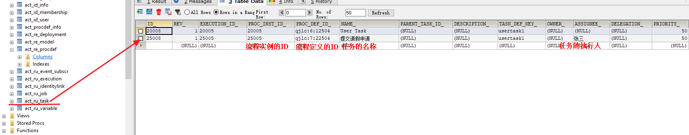

# Activiti-1


## 1. 了解

### 1.1 工作流

工作流(Workflow)，就是“业务过程的部分或整体在计算机应用环境下的自动化”，它主要解决的是“使在多个参与者之间按照某种预定义的规则传递文档、信息或任务的过程自动进行，从而实现某个预期的业务目标，或者促使此目标的实现”。

工作流管理系统(Workflow Management System, WfMS)是一个软件系统，它完成工作量的定义和管理，并按照在系统中预先定义好的工作流逻辑进行工作流实例的执行。工作流管理系统不是企业的业务系统，而是为企业的业务系统的运行提供了一个软件的支撑环境。

### 1.2 常见工作流框架

Activity5.13、JBPM4.4、OSWorkFlow、WorkFlow

## 2. 初始化表结构

###	2.1 使用activiti框架提供的建表语句

### 2.2 使用activiti框架的自动建表功能

* 不使用配置文件（不建议）
  
```java
public void test1() {
		//创建一个流程引擎配置对象
		ProcessEngineConfiguration conf = ProcessEngineConfiguration.createStandaloneProcessEngineConfiguration();
		//设置数据源信息
		conf.setJdbcDriver("com.mysql.jdbc.Driver");
		conf.setJdbcUrl("jdbc:mysql:///activiti_1110");
		conf.setJdbcUsername("root");
		conf.setJdbcPassword("0608");
		
		//设置自动建表
		conf.setDatabaseSchemaUpdate("true");
		
		//创建一个流程引擎对象
		ProcessEngine processEngine = conf.buildProcessEngine();
}
```  

* 使用配置文件

Activiti核心配置文件，配置流程引擎创建工具的基本参数和数据库连接池参数

activiti-context.xml或activiti.cfg.xml

```markdown
<?xml version="1.0" encoding="UTF-8"?>
<beans xmlns="http://www.springframework.org/schema/beans" xmlns:xsi="http://www.w3.org/2001/XMLSchema-instance"
  xmlns:context="http://www.springframework.org/schema/context" xmlns:tx="http://www.springframework.org/schema/tx"
  xmlns:jee="http://www.springframework.org/schema/jee" xmlns:aop="http://www.springframework.org/schema/aop"
  xsi:schemaLocation="http://www.springframework.org/schema/beans http://www.springframework.org/schema/beans/spring-beans-3.0.xsd
       http://www.springframework.org/schema/context http://www.springframework.org/schema/context/spring-context-3.0.xsd
       http://www.springframework.org/schema/tx http://www.springframework.org/schema/tx/spring-tx-3.0.xsd
       http://www.springframework.org/schema/jee http://www.springframework.org/schema/jee/spring-jee-3.0.xsd
       http://www.springframework.org/schema/aop http://www.springframework.org/schema/aop/spring-aop-3.0.xsd">
       <!-- 配置流程引擎配置对象 -->
      	<bean id="processEngineConfiguration" class="org.activiti.engine.impl.cfg.StandaloneProcessEngineConfiguration">
		<property name="jdbcDriver" value="com.mysql.jdbc.Driver"/>
		<property name="jdbcUrl" value="jdbc:mysql:///activiti_1110"/>
		<property name="jdbcUsername" value="****"/>
		<property name="jdbcPassword" value="****"/>
		<property name="databaseSchemaUpdate" value="true"/>
	</bean>
       
  
</beans>
```

```java
@Test
public void test2() {
    String resource="activiti-custom-context.xml";
    String beanName="processEngineConfiguration";
    ProcessEngineConfiguration conf = ProcessEngineConfiguration.createProcessEngineConfigurationFromResource(resource, beanName);
    
    ProcessEngine processEngine = conf.buildProcessEngine();
}
```
  
* 使用默认配置

要求配置文件名**必须**为activiti-context.xml 或者activiti.cfg.xml

```markdown
 <!-- 配置流程引擎配置对象 -->
<bean id="processEngineConfiguration" class="org.activiti.engine.impl.cfg.StandaloneProcessEngineConfiguration">
	<property...
</bean>

<!-- 配置一个流程引擎工厂bean， -->
<bean id="processEngine" class="org.activiti.spring.ProcessEngineFactoryBean">
    <!-- 注入流程引擎配置对象 -->
    <property name="processEngineConfiguration" ref="processEngineConfiguration" />
</bean>
```

```java
public void test3() {		
	ProcessEngine defaultProcessEngine = ProcessEngines.getDefaultProcessEngine();	
}
```

## 3. 23张表

Activiti的后台是有数据库的支持，所有的表都以ACT_开头。 第二部分是表示表的用途的两个字母标识。 用途也和服务的API对应。

1. ACT_RE_*: 'RE'表示repository。 这个前缀的表包含了流程定义和流程静态资源 （图片，规则，等等）。
2. ACT_RU_*: 'RU'表示runtime。 这些运行时的表，包含流程实例，任务，变量，异步任务，等运行中的数据。 Activiti只在流程实例执行过程中保存这些数据， 在流程结束时就会删除这些记录。 这样运行时表可以一直很小速度很快。
3. ACT_ID_*: 'ID'表示identity。 这些表包含身份信息，比如用户，组等等。
4. ACT_HI_*: 'HI'表示history。 这些表包含历史数据，比如历史流程实例， 变量，任务等等。
5. ACT_GE_*: 通用数据， 用于不同场景下。

### 3.1 资源库流程规则表
1)	act_re_deployment 	部署信息表
2)	act_re_model  	流程设计模型部署表
3)	act_re_procdef  	流程定义数据表

### 3.2 运行时数据库表
1)	act_ru_execution	运行时流程执行实例表
2)	act_ru_identitylink	运行时流程人员表，主要存储任务节点与参与者的相关信息
3)	act_ru_task		运行时任务节点表
4)	act_ru_variable	运行时流程变量数据表

### 3.3 历史数据库表
1)	act_hi_actinst 		历史节点表
2)	act_hi_attachment		历史附件表
3)	act_hi_comment		历史意见表
4)	act_hi_identitylink		历史流程人员表
5)	act_hi_detail			历史详情表，提供历史变量的查询
6)	act_hi_procinst		历史流程实例表
7)	act_hi_taskinst		历史任务实例表
8)	act_hi_varinst		历史变量表

### 3.4 组织机构表
1)	act_id_group		用户组信息表
2)	act_id_info		用户扩展信息表
3)	act_id_membership	用户与用户组对应信息表
4)	act_id_user		用户信息表

这四张表很常见，基本的组织机构管理，关于用户认证方面建议还是自己开发一套，组件自带的功能太简单，使用中有很多需求难以满足 

### 3.5 通用数据表
1)	act_ge_bytearray		二进制数据表
2)	act_ge_property	

## 4. 使用框架提供的API完成流程操作

新建流程图activiti diagram 后缀bpmn，保存后生成png图，在properties标签页中修改process的ID（不要中文），Name，task的id，name， Assignee。

### 4.1 部署流程定义

* 方式一：读取单个流程定义文件

```java
public void test4() {
    //获取一个部署构建器对象，用于加载流程定义文件，完成流程定义的部署
    DeploymentBuilder builder = processEngine.getRepositoryService().createDeployment();
    //加载流程定义文件
    builder.addClasspathResource("test1.bpmn");
    builder.addClasspathResource("test1.png");
    //部署流程定义
    Deployment deployment = builder.deploy();
    System.out.println(deployment.getId());
}
```

* 方式二：读取zip压缩文件

```java
public void test1() {
    DeploymentBuilder builder = processEngine.getRepositoryService().createDeployment();
    ZipInputStream zipInputStream = new ZipInputStream(this.getClass().getClassLoader().getResourceAsStream("test1.zip"));
    builder.addZipInputStream(zipInputStream);
    //可以在部署前设置该部署的name
    builder.name("请假流程部署")；
    Deployment deployment = builder.deploy();
}
```

### 4.2 查询部署列表

```java
DeploymentQuery query = processEngine.getRepositoryService().createDeploymentQuery();
```

### 4.3 查询流程定义列表

* 流程定义的信息存放在仓库中，所以获取RepositoryService。
* 创建流程定义查询对象，可以在ProcessDefinitionQuery上设置查询过滤参数

```java
public void test5() {
    //流程定义查询对象
    ProcessDefinitionQuery query = processEngine.getRepositoryService().createProcessDefinitionQuery();
    //添加过滤条件
    query.processDefinitionKey("qjlc");
    //添加排序条件
    query.orderByProcessDefinitionVersion().desc();
    //添加分页查询
    query.listPage(0, 10);
    
    List<ProcessDefinition> list = query.list();
    for(ProcessDefinition pd:list) {
        System.out.println(pd.getId());
}
```

查询格式 processEngine.getXXXService.createXXXQuery().list()

### 4.4 删除部署信息

```java
//删除指定的部署信息，如果有关联信息会报错
processEngine.getRepositoryService().deleteDeployment(deploymentId);
//true设置级联删除，可以在删除部署信息同时删除关联的任务信息执行信息
processEngine.getRepositoryService().deleteDeployment(deploymentId,true);
```

删除流程定义，通过删除部署信息打到删除流程定义的目的。

### 4.5 查询出流程定义文档资源

查询出流程定义文档。主要查的是图片，用于显示流程用。

```java
public void test6() throws IOException {
		String deploymentId = "27501";
		List<String> names = processEngine.getRepositoryService().getDeploymentResourceNames(deploymentId);
		for (String name :names) {
			System.out.println(name);
			InputStream in = processEngine.getRepositoryService().getResourceAsStream(deploymentId, name);
			FileUtils.copyInputStreamToFile(in, new File("C:\\UsersDocuments\\"+ name));
			in.close();
		}
	}
```

1)	deploymentId为流程部署ID
2)	resourceName为act_ge_bytearray表中NAME_列的值
3)	使用repositoryService的getDeploymentResourceNames方法可以获取指定部署下得所有文件的名称
4)	使用repositoryService的getResourceAsStream方法传入部署ID和文件名称可以获取部署下指定名称文件的输入流
5)	最后的有关IO流的操作，使用FileUtils工具的copyInputStreamToFile方法完成流程流程到文件的拷贝

```java
//从流程定义获取流程图片输入流
String processDefinitionId = "qjlc:9:27504";
InputStream in = processEngine.getRepositoryService().getProcessDiagram(processDefinitionId);
```   

### 4.6 启动流程实例

**流程实例**,根据一个流程定义具体的一次执行过程就是一个流程实例,一个流程定义对应多个流程实例(一对多关系),一个流程实例可以对应多个任务。

* 方式一：根据流程定义的id启动
  
```java
/**
    * 根据流程定义的id启动一个流程实例
    */
@Test
public void test6() {
    String processDefinitonId = "qjlc:7:22504";
    ProcessInstance processInstance = processEngine.getRuntimeService().startProcessInstanceById(processDefinitonId);
    System.out.println(processInstance.getId());
}
```



* 方式二：根据流程定义的key启动，自动选择最新版本的流程定义实现启动流程实例

```java
ProcessInstance processInstance = processEngine.getRuntimeService().startProcessInstanceByKey(processDefinitionKey);
```

### 查询流程实例列表

查询act_ru_execution表

```java
public void test9() {
		ProcessInstanceQuery query = processEngine.getRuntimeService().createProcessInstanceQuery();
		query.processDefinitionKey("qjlc");
		query.orderByProcessInstanceId().desc();
		query.listPage(0, 5);
		List<ProcessInstance> list = query.list();
		for(ProcessInstance pInstance :list) {
			System.out.println(pInstance.getId()+" "+ pInstance.getActivityId());
		}
```

### 结束流程实例

```java
processEngine.getRuntimeService().deleteProcessInstance(processInstanceId, deleteReason);
```

在结束流程实例同时也会影响到任务表act_ru_task

### 4.7 查询个人任务列表

```java
/**
* 查询任务列表
*/
@Test
public void test7() {
    TaskQuery query = processEngine.getTaskService().createTaskQuery();
    String assignee ="张三";
    query.taskAssignee(assignee);
    List<Task> list = query.list();
    for(Task task:list ) {
        System.out.println(task.getId()+"  "+task.getName());
    }
}
```
1)	因为是任务查询，所以从processEngine中应该得到TaskService
2)	使用TaskService获取到任务查询对象TaskQuery
3)	为查询对象添加查询过滤条件，使用taskAssignee指定任务的候选者（即查询指定用户的代办任务），添加分页排序等过滤条件
4)	调用list方法执行查询，返回办理者为指定用户的任务列表
5)	任务ID、名称、办理人、创建时间可以从act_ru_task表中查到。

### 4.8 办理任务

```java
/**
* 办理任务
*/
@Test
public void test8() {
    String taskId="27508";
    processEngine.getTaskService().complete(taskId);
}	
```
### 查询最新版本的流程定义列表

按版本号升序排列后，存入map，相同的key高版本会覆盖低版本。

```java
public void test14(){
    ProcessDefinitionQuery query = processEngine.getRepositoryService().createProcessDefinitionQuery();
    query.orderByProcessDefinitionVersion().asc();
    List<ProcessDefinition> list = query.list();
    Map<String, ProcessDefinition> map = new HashMap<String, ProcessDefinition>();
    for (ProcessDefinition pd : list) {
        map.put(pd.getKey(), pd);
    }
    ArrayList<ProcessDefinition> lastList = new ArrayList<>(map.values());
    for (ProcessDefinition processDefinition : lastList) {
        System.out.println(processDefinition.getName() + "  "+ processDefinition.getVersion() );
    }
}
```

### 各个Service的作用

| Service           | 作用                                     |
| ----------------- | ---------------------------------------- |
| RepositoryService | 操作静态资源，管理流程定义，bpmn，png    |
| RuntimeService    | 执行管理，包括启动推进删除流程实例等操作 |
| TaskService       | 任务管理                                 |
| HistoryService    | 历史管理（执行完的数据）                 |
| IdentityService   | 组织机构管理                             |
| FormService       | 一个可选服务，任务表单管理               |
| ManagerService    |                                          |

#### RepositoryService

是Activiti的仓库服务类。所谓的仓库指流程定义文档的两个文件：bpmn文件和流程图片。

1)	产生方式 processEngine.getRepositoryService()
 
2)	可以产生 DeploymentBuilder，createDeployment()，用来定义流程部署的相关参数
 
3)	删除流程定义 
 
#### RuntimeService

是activiti的流程执行服务类。可以从这个服务类中获取很多关于流程执行相关的信息。

#### TaskService

是activiti的任务服务类。可以从这个类中获取任务的信息

#### ProcessDefinition

流程定义类。可以从这里获得资源文件等。

### Activiti框架提供的对象(和表有对应关系)

* Deployment-----act_re_deployment
* ProcessDefinition----act_re_procdef
* ProcessInstance-----act_ru_execution
* Task-----act_ru_task


