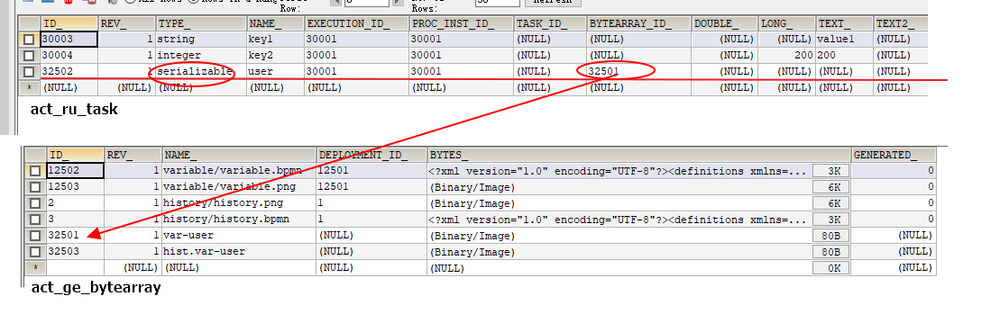
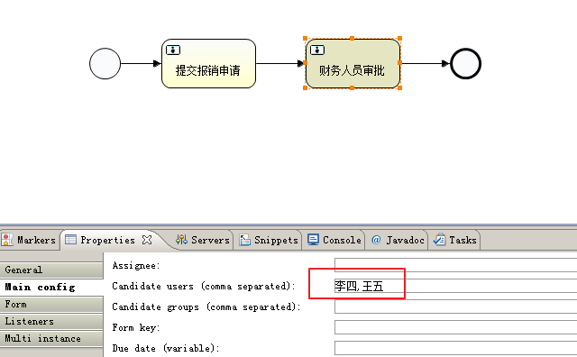
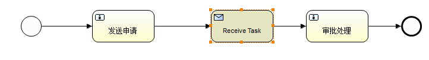
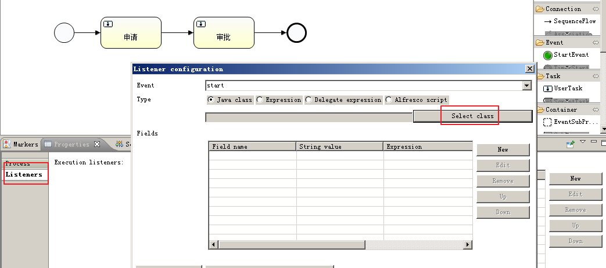
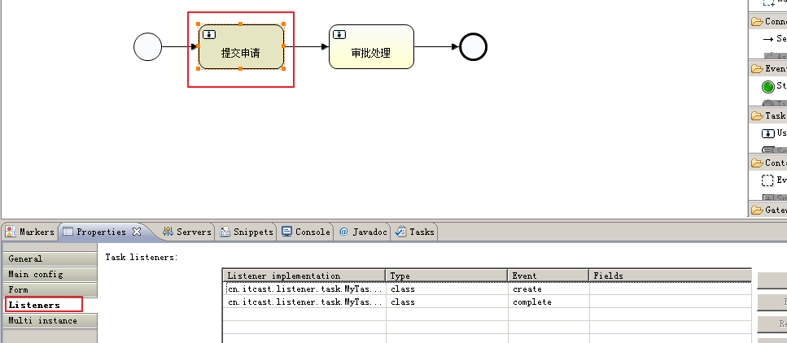
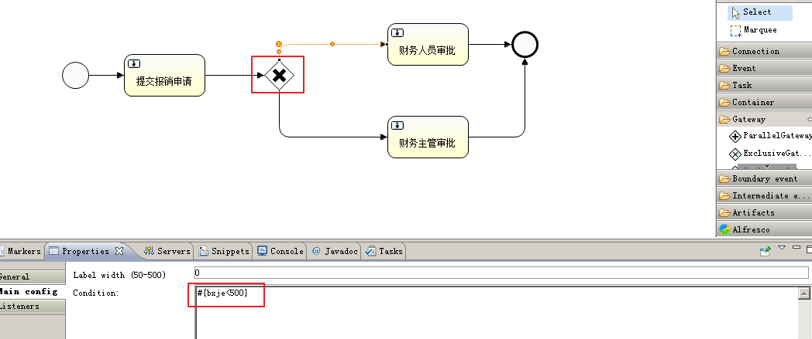
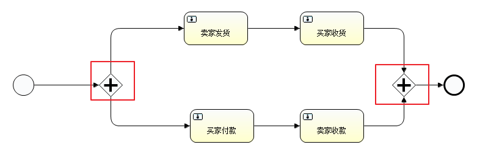

# Activiti-2

## 1. 历史数据查询

### 1.1 查询历史流程实例列表

```java
public void test5() {
    HistoricProcessInstanceQuery query = pe.getHistoryService().createHistoricProcessInstanceQuery();
    List<HistoricProcessInstance> list = query.list();
    for (HistoricProcessInstance historicProcessInstance : list) {
        System.out.println(historicProcessInstance.getId());
    }
}
```

### 1.2 查询历史活动数据

```java
public void test6() {
    HistoricActivityInstanceQuery query = pe.getHistoryService().createHistoricActivityInstanceQuery();
    query.orderByProcessInstanceId().desc();
    query.orderByHistoricActivityInstanceEndTime().asc();
    List<HistoricActivityInstance> list = query.list();
    for (HistoricActivityInstance historicActivityInstance : list) {
        System.out.println(historicActivityInstance.getActivityId()+" "+historicActivityInstance.getActivityName());
    }
}
```

### 1.3 查询历史任务数据

```java
public void test7() {
    HistoricTaskInstanceQuery query=pe.getHistoryService().createHistoricTaskInstanceQuery();
    query.orderByProcessInstanceId().asc();
    query.orderByHistoricTaskInstanceEndTime().desc();
    List<HistoricTaskInstance> list = query.list();
    for (HistoricTaskInstance historicTaskInstance : list) {
        System.out.println(historicTaskInstance.getAssignee()+" "+historicTaskInstance.getName()+" "+historicTaskInstance.getStartTime());
    }
}
```

## 2. 流程变量

通过流程变量传递业务数据，流程变量的生命周期和当前流程实例的生命周期一致，如果当前流程实例执行完毕，流程变量消失。流程变量设置不会影响任务，任务流程走到头，流程变量消失。

### 2.1 设置流程变量

#### 2.1.1 在启动流程实例时设置

```java
public void test2() {
    String processDefinitionKey="variable";
    Map<String, Object> variables = new HashMap<String, Object>();
    variables.put("key1", "value1");
    variables.put("key2", 200);
    ProcessInstance pi = pe.getRuntimeService().startProcessInstanceByKey(processDefinitionKey,variables);
    System.out.println(pi.getId());
}
```

#### 2.1.2 在办理任务时设置

```java
public void test3() {
    String taskId ="15006";
    Map<String, Object> variables = new HashMap<String, Object>();
    variables.put("qjts", 5);
    variables.put("qjyy", "i will");
    pe.getTaskService().complete(taskId, variables);
}
```

#### 2.1.3 使用 RuntimeService 的方法设置

```java
public void test4() {
    String executionId ="15001";
    String variableName = "key3";
    Object value="value3";
    pe.getRuntimeService().setVariable(executionId, variableName, value);
}
```

#### 2.1.4 使用 TaskService 的方法设置

```java
public void test5() {
    String taskId ="17504";
    Map<String, Object> variables = new HashMap<String, Object>();
    variables.put("key4", 400);
    variables.put("key5", "v5");
    pe.getTaskService().setVariables(taskId, variables);
}
```

### 2.2 流程变量支持的类型

Jdk 中提供的数据类型（String、Integer、List 、Map…）

自定义的实体类（要求实现序列化接口）implements java.io.Serializable



### 2.3 获取流程变量

#### 2.3.1 使用 RuntimeService 的方法获取

```java
public void test7() {
    String executionId ="30001";
    Map<String, Object> variables = pe.getRuntimeService().getVariables(executionId);
    //System.out.println(variables);
    Set<String> set = variables.keySet();
    for (String key : set) {
        Object value = variables.get(key);
        //System.out.println(key+" "+value);
    }

    Object value = pe.getRuntimeService().getVariable(executionId,"user");
    //System.out.println(value);

    Collection<String> variableNames = new ArrayList<String>();
    variableNames.add("key2");
    variableNames.add("user");
    Map<String, Object> map = pe.getRuntimeService().getVariables(executionId, variableNames);
    System.out.println(map);
}
```

#### 2.3.2 使用 TaskService 的方法

```java
Object vObject = pe.getTaskService().getVariable(taskId, variableName);
```

## 3. 任务的类型

### 3.1 个人任务

由某一个负责办理，在任务表中通过 assignee 字段记录

### 3.2 公共任务（组任务）

当前的任务可以由多个人办理， 可以在设计流程图时指定多个办理人

Candidate user，名字之间用英文逗号隔开



#### 3.2.1 查询公共任务列表

```java
public void test4() {
    TaskQuery query  = pe.getTaskService().createTaskQuery();
    //根据候选人过滤
    String candidateUser ="李四";
    query.taskCandidateUser(candidateUser);
    List<Task> list = query.list();
    for (Task task : list) {
        System.out.println(task.getName());
    }
}
```

#### 3.2.2 拾取公共任务

将公共任务变为个人任务。一旦有人拾取过，其他候选人不能再拾取。

```java
public void test5() {
    String taskId ="45002";
    String userId ="王五";
    pe.getTaskService().claim(taskId, userId);
}
```

#### 3.2.3 退回任务到公共任务列表

将个人任务变为公共任务，也就是将执行人恢复为 null

```java
public void test6() {
    String taskId ="45002";
    pe.getTaskService().setAssignee(taskId, null);;
}
```

### 3.3 接收任务

接收任务不是由某个人负责办理，通过 signal 方法让流程执行的



流程走到接受任务时，会在 act_ru_execution 表中更新数据，但是 task 不会出现在 act_ru_task 表中，所以也没有 taskid。根据流程实例 Id 查找。

```java
public void test4() {
    String executionId = "55001";
    pe.getRuntimeService().signal(executionId);
}
```

## 4. 监听器(listener)

### 4.1 执行监听器

监听流程实例的事件

#### 第一步：按照框架规则编写监听器类

```java
public class MyExecutionListener implements ExecutionListener{

	@Override
	//当监听的事件发生时执行此方法
	public void notify(DelegateExecution execution) throws Exception {
		System.out.println("自定义监听器执行了");

	}
}
```

#### 第二步：设计流程图，注册监听器类



分别给 start 和 end 两种流程实例事件注册监听器类

#### 第三步： 启动流程实例，Activiti 框架通过反射调用监听器类

### 4.2 任务监听器

监听任务事件

#### 第一步：按照 activiti 框架的规则编写一个任务监听器类

```java
public class MyTaskListener implements TaskListener{

	@Override
	//监听任务事件
	public void notify(DelegateTask delegateTask) {
		String assigneeString=delegateTask.getAssignee();
		String eventName=delegateTask.getEventName();
		String name=delegateTask.getName();
		String processInstanceId =delegateTask.getExecutionId();
		System.out.println("一个任务["+name+"]被创建了，由["+assigneeString+"]负责办理");
	}
}

```

#### 第二步：注册监听类



监听可选 create，assignment，complete，all 四种事件

#### 第三步：办理任务，由框架通过反射调用监听器类

## 5. 网关

### 5.1 排他网关 ExclusiveGateWay

只能根据给出的 Condition 选择一条路走



```markdown
condition 表达式格式 结果应该是布尔量
#{bxje<200>}
bxje 为对应流程变量的 key
```

```java
public void test3() {
    String taskId ="105004";
    Map<String, Object> variables = new HashMap<String, Object>();
    variables.put("bxje",200);
    pe.getTaskService().complete(taskId, variables);
}
```

### 5.2 并行网关 ParallelGateway



经过并行网关,同时产生两条执行线路，两个个任务。ExcutionId 不同，ProcessInstanceId 相同。

## 6. Spring 整合 activiti

- 第一步：提供 spring 配置文件，配置数据源、事务管理器、流程引擎配置对象、流程引擎对象

```markdown
<!-- 加载jdbc属性文件 -->

<context:property-placeholder location="classpath:spring/jdbc.properties"/>

<!-- 配置数据源 -->
<bean id="ds" class="org.springframework.jdbc.datasource.DriverManagerDataSource">
    <property name="driverClassName" value="${driverClassName}"/>
    <property name="url" value="${url}"/>
    <property name="username" value="${username}"/>
    <property name="password" value="${password}"/>
</bean>

<!-- 事务管理器 -->
<bean id="transactionManager" class="org.springframework.jdbc.datasource.DataSourceTransactionManager">
    <property name="dataSource" ref="ds"/>
</bean>

<!-- 配置一个spring提供的对象，用于创建一个流程引擎配置对象 -->
<bean id="processEngineConfiguration" class="org.activiti.spring.SpringProcessEngineConfiguration">
    <property name="transactionManager" ref="transactionManager"/>
    <property name="dataSource" ref="ds"/>
    <property name="databaseSchemaUpdate" value="true"/>
</bean>

<!-- 创建流程引擎对象 -->
<bean id="pe" class="org.activiti.spring.ProcessEngineFactoryBean">
    <property name="processEngineConfiguration" ref="processEngineConfiguration"/>
</bean>
```

- 第二步：读取 spring 配置文件，创建 spring 工厂，获取流程引擎对象

```java
public class SpringActivitiTest {
	@Test
	public void test1() {
		ApplicationContext ctx = new ClassPathXmlApplicationContext("spring/applicationContext.xml");
		ProcessEngine pe =(ProcessEngine) ctx.getBean("pe");
		DeploymentBuilder builder = pe.getRepositoryService().createDeployment();
		builder.addClasspathResource("spring/test1.bpmn");
		builder.addClasspathResource("spring/test1.png");
		builder.deploy();

	}

}
```

## 7. 搭建 web 项目环境
