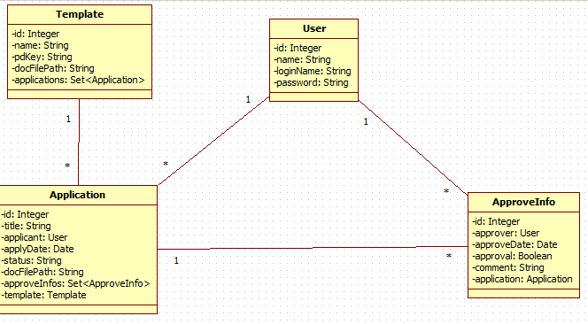
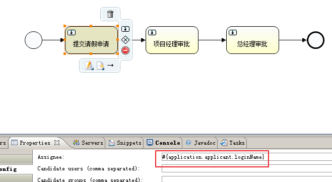

# Activiti-4

## 申请实体和审批实体



application.hbm.xml 

```markdown
<hibernate-mapping>
	<class name="activitiex.domain.Application" table="t_application">
		<id name="id">
		<generator class="native"></generator>
		</id>
		<property name="title" length="128"/>
		<many-to-one name="applicant" class="activitiex.domain.User" column="user_id"/>
		<property name="applyDate" />
		<property name="status" length="12"/>
		<property name="docFilePath"/>
		<set name="approveInfos">
			<key column="application_id"/>
			<one-to-many class="activitiex.domain.ApproveInfo"/>
		</set>
		<many-to-one name="template" class="activitiex.domain.Template" column="template_id"/>
	</class>
</hibernate-mapping>
```
approveInfo.hbm.xml

```markdown
<hibernate-mapping>
	<class name="activitiex.domain.ApproveInfo" table="t_approveInfo">
		<id name="id">
		<generator class="native"></generator>
		</id>
		<many-to-one name="approver" class="activitiex.domain.User" column="user_id"/>
		<property name="approveDate"/>
		<property name="approval"/>
		<property name="comment"/>
		<many-to-one name="application" class="activitiex.domain.Application" column="application_id"/>
	</class>
</hibernate-mapping>
```

## 设计流程图

指定第一个任务节点的办理人从流程变量中动态获取



```text
#{Application.applicant.loginName}
```

## 提交申请

在FlowAction中提供一个submit方法，处理提交申请操作，文件上传、包装申请实体、调用FlowService提交申请

根据选中的Template中携带的流程定义Key查找到流程定义，并启动流程实例，完成第一个申请任务。

```java
public String submit() {
    Template template = templateService.findById(templateId);
    
    //保存上传的文件
    String filePath = UploadFileUtils.copy(getResource());
    //保存申请实体
    Application application = new Application();
    application.setApplicant(ActContext.getLoginUser());
    application.setApplyDate(new Date());
    application.setDocFilePath(filePath);
    application.setStatus(Application.STATUS_APPROVING);
    application.setTemplate(template);
    String dateStr = new SimpleDateFormat("yyyy--MM--dd").format(application.getApplyDate());
    String title =template.getName()+ "_"+ActContext.getLoginUser().getName()+"_"+dateStr;
    application.setTitle(title);
    
    flowService.submit(application);

    return "toTemplateList";
}
```

```java
public void submit(Application application) {
    //保存申请实体
    applicationDao.save(application);
    //启动流程实例
    String keyString = application.getTemplate().getPdKey();
    Map<String, Object> variables = new HashMap<String, Object>();
    //设置流程变量
    variables.put("application", application);
    variables.put("applicationId", application.getId());
    //启动流程实例
    ProcessInstance pi = processEngine.getRuntimeService().startProcessInstanceByKey(keyString,variables);
    //完成第一个任务
    TaskQuery query =processEngine.getTaskService().createTaskQuery();
    query.taskAssignee(application.getApplicant().getLoginName());
    query.processInstanceId(pi.getId());
    Task task= query.singleResult();
    String taskId = task.getId();
    processEngine.getTaskService().complete(taskId);
}
```

## 查询我的申请列表

```java
public String myApplicationList() {
    //根据当前登录人或审核状态查询,多条件查询
    DetachedCriteria dc = DetachedCriteria.forClass(Application.class);
    dc.addOrder(Order.desc("applyDate"));
    dc.add(Restrictions.eq("applicant", ActContext.getLoginUser()));
    if(status !=null && status.trim().length()>0) {
        dc.add(Restrictions.eq("status",status));
    }
    
    List<Application> list = applicationService.findByCriteria(dc);
    ActionContext.getContext().put("list", list);
    return "myApplicationList";
}
```
申请状态下拉框回显

```markdown
<select id="status" name="status" class="SelectStyle">
    <option value="">查看全部状态</option>
    <option value="审批中">审批中</option>
    <option value="未通过">未通过</option>
    <option value="已通过">已通过</option>
</select>
<script type="text/javascript">
    $("#status").val('${status}');
</script>
```

## 查看当前流程图片

显示当前流程图片，红框选出当前任务节点

```java
public String showPng() {
    //准备数据 deploymentId imagName acs.y acs.x acs.height acs.width 

    //根据流程变量 applicationId查询
    //taskquery.processVariableValueEquals("applicationId", applicationId);
    Task task = flowService.findTaskByApplicationId(applicationId);
    //根据当前的任务查询流程定义
    //task.getProcessDefinitionId();
    ProcessDefinition pd = flowService.findPDByTask(task);
    //根据流程定义获得deploymentId和imageName
    ActionContext.getContext().put("deploymentId", pd.getDeploymentId());
    ActionContext.getContext().put("imageName", pd.getDiagramResourceName());
    //获得红框位置坐标
    Map<String, Object> map = flowService.findCoordingByTask(task);
    ActionContext.getContext().put("acs",map);
    return "showPng";
}
	
private String imageName;
private String deploymentId;
/**
    * 查询png流
    * @return
    */
public String viewImage() {
    InputStream inputStream = flowService.getPngStream(deploymentId,imageName);
    ActionContext.getContext().put("pngStream",inputStream);
    return "viewImage";
}
```
ProcessDefinitionEntity对象中有ActivityId，获取activityImpl从而获得坐标值。

```java
public Map<String, Object> findCoordingByTask(Task task) {
    //根据task获得流程定义id
    String processDefinitionId = task.getProcessDefinitionId();
    String processInstanceId = task.getProcessInstanceId();
    //返回流程定义对象中的包含的坐标信息
    ProcessDefinitionEntity pd = (ProcessDefinitionEntity) processEngine.getRepositoryService().getProcessDefinition(processDefinitionId);
    ProcessInstanceQuery query=processEngine.getRuntimeService().createProcessInstanceQuery();
    query.processInstanceId(processInstanceId);
    ProcessInstance pi =query.singleResult();
    //根据流程实例对象获取当前的活动节点
    String activityId=pi.getActivityId();
    ActivityImpl activityImpl = pd.findActivity(activityId);
    int x =activityImpl.getX();
    int y = activityImpl.getY();
    int height = activityImpl.getHeight();
    int width = activityImpl.getWidth();
    Map<String, Object> map =new HashMap<String, Object>();
    map.put("x", x);
    map.put("y", y);
    map.put("height", height);
    map.put("width", width);
    return map;
}
```

显示流程图jsp

```markdown
&imageName=<s:property value='#imageName'/>">

<!-- 2.根据当前活动的坐标，动态绘制DIV -->
<div style="position: absolute;border:1px solid red;top:<s:property value="#acs.y-1"/>px;left: <s:property value="#acs.x-1"/>px;width: <s:property value="#acs.width"/>px;height:<s:property value="#acs.height"/>px;   "></div></body>
</html>
```

## 查看流转记录

布尔类型approval值，在MySql数据库中用0和1表示。显示在jsp页面上

```<%-- <s:if test="approval"></s:if>--%>
<s:property value="approval?'是':'否'"/>
```

## 待我审批页面

为了方便列表页面中数据的展示，包装一个实体类

```java
public class TaskView {
	private Task task;
	private Application application;
}		
```

```java
/**
    * 根据当前登录人查询对应的任务列表，包装成TaskView返回
    */
public List<TaskView> findList(User loginUser) {
    TaskQuery query = processEngine.getTaskService().createTaskQuery();
    query.taskAssignee(loginUser.getLoginName());
    query.orderByTaskCreateTime().desc();
    List<Task>  taskList = query.list();
    List<TaskView> list = new ArrayList<TaskView>();
    for (Task task : taskList) {
        String taskId = task.getId();
        Application application = (Application) processEngine.getTaskService().getVariable(taskId, "application");
        list.add(new TaskView(task,application));
    }
    return list;
}
```

## 审批处理

在审批处理页面approveUI提供隐藏域，taskId ,applicationId ,approval

```markdown
<s:hidden name="taskId"></s:hidden>
<s:hidden name="applicationId"></s:hidden>
```

```java
public String approve() {
    ApproveInfo ai = new ApproveInfo();
    Application application =applicationService.findById(applicationId);
    ai.setApproval(approval);
    ai.setApproveDate(new Date());
    ai.setComment(comment);
    ai.setApplication(application);
    ai.setApprover(ActContext.getLoginUser());
    flowService.approve(ai,taskId);
    return "toMyTaskList";
	}
```

```java
public void approve(ApproveInfo ai, String taskId) {
    Task task = processEngine.getTaskService().createTaskQuery().taskId(taskId).singleResult();
    //获取流程实例的id
    String processInstanceId = task.getProcessInstanceId();
    //保存审批实体
    approveInfoDao.save(ai);
    //办理当前的任务
    processEngine.getTaskService().complete(taskId);
    //查询当年的流程实例是否存在
    ProcessInstanceQuery query = processEngine.getRuntimeService().createProcessInstanceQuery();
    query.processInstanceId(processInstanceId);
    ProcessInstance pi =query.singleResult();
    
    Application application = ai.getApplication();//持久对象
    if(ai.getApproval()) {
        //通过
        if(pi==null) {//最后一个节点，修改status为已通过
            application.setStatus(Application.STATUS_APPROVED);
        }
        
    }else {
        //将status修改为不通过
        application.setStatus(Application.STATUS_UNAPPROVED);
        //不是最后一个节点，手动结束流程
        if(pi!=null) {
            processEngine.getRuntimeService().deleteProcessInstance(processInstanceId, Application.STATUS_UNAPPROVED);
        }
    }   
}
```

## 配置过滤器，解决Hibernate的延迟加载问题

```markdown
<!-- 配置过滤器，解决Hibernate的延迟加载问题 -->
	<filter>
		<filter-name>openSession</filter-name>
		<filter-class>org.springframework.orm.hibernate3.support.OpenSessionInViewFilter</filter-class>
	</filter>
	<filter-mapping>
		<filter-name>openSession</filter-name>
		<url-pattern>/*</url-pattern>
	</filter-mapping>
```

