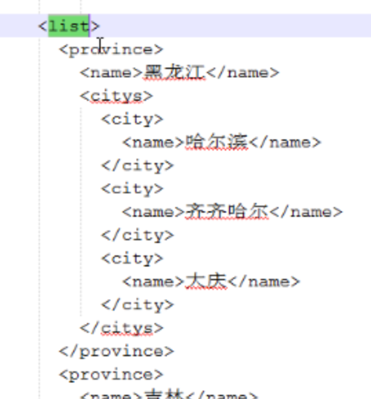

# Ajax练习

实现省市级联（xm,json）

## 通过返回xml来完成省市联动

* AjaxServlet返回xml数据

```java
response.setContentType("text/xml;charset=utf-8");//中文乱码问题
XStream xs = new XStream();
xs.autodetectAnnotations(true);//使注解生效
String xml = xs.toXML(ps);

response.getWriter().write(xml);
response.getWriter().close();
```

{:height="50%" width="50%"}

注意:如果服务器返回的是json数据，我们在浏览器端接收数据 eval()转换。
var json=eval(xmlhttp.responseText);
有些情况下，转换会出问题。
var json=eval("("+xmlhttp.responseText+")")		

## 通过返回json来完成省市联动