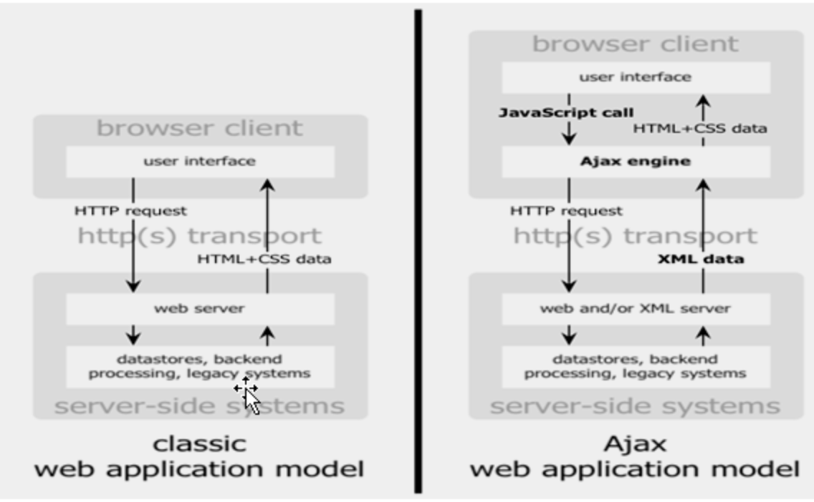
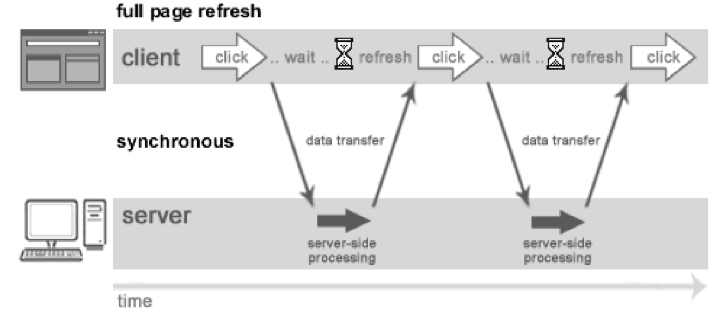
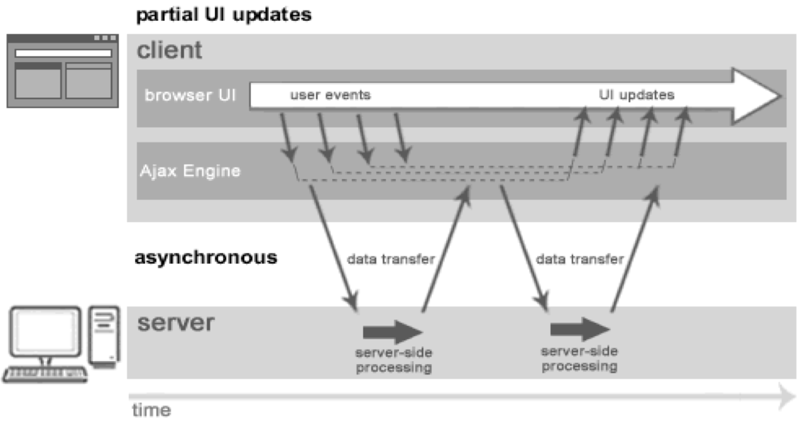
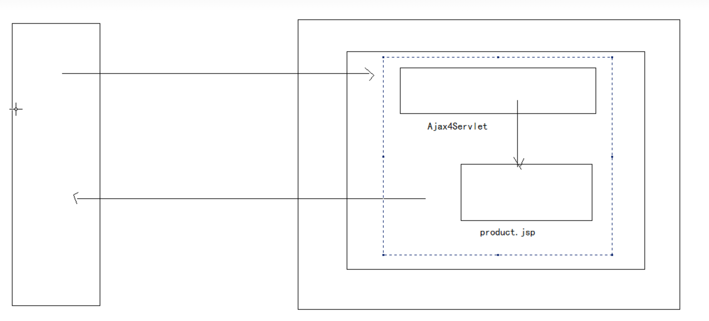

# ajax

## 概念

Asynchronous Javascript And XML”（异步JavaScript和XML）

一种创建交互式网页应用的网页开发技术

AJAX = 异步 JavaScript和XML（标准通用标记语言的子集）

是一种用于创建快速动态网页的技术，目的是为了提高用户的感受

### 异步




同步交互模式，客户端提交请求，等待，在响应回到客户端前，客户端无法进行其他操作

异步交互模型，客户端将请求提交给Ajax引擎，客户端可以继续操作，由Ajax引擎来完成与服务武器端通信

* 传统web交互模型，浏览器直接将请求发送给服务器，服务器回送响应，直接发给浏览器。

* Ajax交互模型，浏览器首先将请求发送Ajax引擎（XMLHttpRequest为核心），AJax引擎再将请求发送给服务器，服务器回送响应先发给Ajax引擎，再由引擎传给浏览器显示 。

## ajax开发步骤

ajax核心就是**XMLHttpRequest**对象.

查xmldom文档--> dom --> XMLHttpRequest对象

1. 得到XMLHttpRequest对象.(js对象)
2. 注册回调函数onreadystatechange
3. open--->只是用于设置请求方式 以及url,它不发送请求.
4. send--->它是用于发送请求的。send(null);null代表没有参数。如果有参数可以写成:"username=tom&password=123"
5. 在回调函数中处理数据

### 代码实现

```java
<script type="text/javascript">
  //1.得到XMLHttpRequest对象.
  var xmlhttp = null;

  if (window.XMLHttpRequest) {
  xmlhttp = new XMLHttpRequest(); //针对于现在的浏览器包括IE7以上版本
  } else{
  //针对于IE5,IE6版本
  xmlhttp = new ActiveXObject("Microsoft.XMLHTTP");
  }

  //2.设置回调函数
  xmlhttp.onreadystatechange=function(){
  //5.处理响应数据  当信息全部返回，并且是成功
    if(xmlhttp.readyState==4 && xmlhttp.status==200){
      alert(xmlhttp.responseText);//获取服务器返回的数据
    }
  };

  //3.open
  xmlhttp.open("GET","http://localhost/day23_3/ajax1");
  //4.发送请求 send
  xmlhttp.send(null);
</script>
```

### XMLHttpRequest对象属性

```java
if(xmlhttp.readyState==4 && xmlhttp.status==200){
  //...
}
```

#### readyState

它代表的是XMLHttpRequest对象的状态。

| 状态 | 名称| 描述 |
| :-----| :-----| :----- |
| 0 | Uninitialized | 代表XMLHttpRequest对象创建 |
| 1 | Open | open()已调用，但send()未调用。请求还没有被发送 |
| 2 | Sent | send操作，请求已发送到web服务器，为接收到响应|
| 3 | Receiving | 接收到了响应数据，但是只有响应头，正文还没有接收 |
| 4 | Loaded | 所有http响应接收完成。|

#### status

由服务器返回的 HTTP 状态代码，如 200 表示成功

### 回调函数

在回调函数中可以通过以下方式获取服务器返回的数据

1. responseText
2. responseXML

## ajax操作中请求参数的设置问题

语法
open(method,url,async(true异步可以省略),username,password)；

```java
xmlhttp.open("GET","http://localhost/day23_3/ajax1");

xmlhttp.open("GET","${paegContext.request.contentPath}/day23_3/ajax1");
//只能在jsp里这么写
```

### get请求方式参数设置

直接在url后面拼接

例如:

```java
"${pageContext.request.contextPath}/ajax2?name=tom"
```

### post请求方式参数设置

注意: 如果是post请求方式，还需要设置一个**http请求头**。xmlhttp.setRequestHeader("","");

例如:

```java
xmlhttp.open("POST","${pageContext.request.contextPath}/ajax2");
xmlhttp.setRequestHeader("content-type","application/x-www-form-urlencoded");
xmlhttp.send("name=tom");
```


注意顺序，open-serRequestHeader-send


## ajax案例

### 验证用户名是否可以使用

* 抽取创建XMLHttpRequest对象的部分到js

function getXmlHttpRequest(){}

* 引入js文件

```java
<script type="text/javascript" src="${pageContext.request.contextPath}/my.js"></script>
```

* 失去焦点onclur触发Ajax请求发送用户名，获取msg

```java
<script type="text/javascript">
function checkName(txt) {
  //获取文本框中的信息
  var value=txt.value;
  //1.得到XMLHttpRequest对象.
  var xmlhttp=getXmlHttpRequest();
  //2.设置回调函数
  xmlhttp.onreadystatechange = function() {
    if (xmlhttp.readyState == 4 && xmlhttp.status == 200) {
       var msg=xmlhttp.responseText;
       document.getElementById("span").innerHTML=msg;
    }
  };
//post请求方式，参数设置
  xmlhttp.open("POST", "${pageContext.request.contextPath}/ajax3");
  xmlhttp.setRequestHeader("content-type","application/x-www-form-urlencoded");
  xmlhttp.send("username="+value);
};
```

### 显示商品信息

#### 第一个版本

* 创建一个Product类 --> int id; String name; double price;

* 创建ajax.jsp

```java
<a href="javascript:void(0)" id="p">显示商品信息</a>
<div id="d"></div>
```

```java
//javascript
document.getElementById("p").onclick=function(){
  ...xmlhttp...
}
```

在回调函数中得到服务器返回的信息innerHTML到div中。

* 在AjaxServlet中

将List&lt;Product&gt;中的数据，手动拼接成了html代码，写回到浏览器端.

```java
StringBuilder builder = new StringBuilder();

builder.append("<table border='1'><tr><td>商品编号</td><td>商品名称</td><td>商品价格</td></tr>");

for (Product p : ps) {
  builder.append("<tr><td>" + p.getId() + "</td><td>" + p.getName()
+ "</td><td>" + p.getPrice() + "</td></tr>");
}

builder.append("</table>");

PrintWriter out = response.getWriter();
out.print(builder.toString());
out.flush();
out.close();
```

#### 第二个版本

创建一个product.jsp页面，在页面上去组装table, 其本质还是Out.write(),直接将数据返回到ajax.jsp中div位置了。



* 在AjaxServlet中

```java
request.setAttribute("ps", ps);
request.getRequestDispatcher("/product.jsp").forward(request, response);
```

* 在product.jsp页面上

不需要&lt;html&gt;&lt;body&gt;标签

```java
<%@taglib prefix="c" uri="http://java.sun.com/jsp/jstl/core"%>

<table border='1'>
  <tr>
    <td>商品编号</td>
    <td>商品名称</td>
    <td>商品价格</td>
  </tr>
  <c:forEach items="${ps}" var="p">
    <tr>
      <td>${p.id }</td>
      <td>${p.name }</td>
      <td>${p.price }</td>
    </tr>
  </c:forEach>
</table>
```

#### 第三个版本

在服务器端得到数据，只将要显示的内容返回，而不返回html代码。而html代码的拼接，在浏览器端完成。

问题:服务器返回什么样的数据格式?

**json**:它是一种轻量级的数据交换格式。

[{'id':'1','name':'洗衣机','price':'1800'},{'id':'2','name':'电视机','price':'3800'}]

在js中{name:value,name1:valu1}这就是一个js对象.

[{},{}]这代表有两个对象装入到了一个数组中。

```java
  //将服务器返回的字符串数据变成js对象
  var json = eval(xmlhttp.responseText);

  var msg="<table border='1'><tr><td>商品编号</td><td>商品名称</td><td>商品价格</td></tr>";

  //按对象操作获取数据值
  for(var i=0;i<json.length;i++){
    msg+="<tr><td>"+json[i].id+"</td><td>"+json[i].name+"</td><td>"+json[i].price+"</td></tr>";
  }
  msg+="</table>";

  document.getElementById("d").innerHTML=msg;
```

## 关于json插件使用

在java中，可以通过**jsonlib**插件，在java对象与json之间做转换。

1. 导包(6个包)
2. 将java对象转换成json

```text
  commons-beanutils-1.8.3.jar
  commons-collections-3.2.1.jar
  commons-lang-2.6.jar
  commons-logging-1.1.1.jar
  ezmorph-1.0.6.jar
  json-lib-2.4-jdk15.jar
```

* 数组，List集合转换成json

```java
JSONArray.fromObject(java对象);
//["value1","value2"]
```

* javaBean，Map转换成json

```java
JSONObject.fromObject(javaBean对象);
//{name1:value1,name2:value2}
```

对于json数据，它只有两种格式

1. [值1,值2,...]  ------> 这就是javascript中的数组
2. {name:value,....} ----> 就是javascript中的对象。

但是这两种格式可以嵌套。
如：[{},{},{}]或者{name:[],name:[]}

```java
List<Product> ps = new ArrayList<Product>();
ps.add(new Product(1, "洗衣机", 1800));
ps.add(new Product(2, "电视机", 3800));
ps.add(new Product(3, "空调", 5800));

PrintWriter out = response.getWriter();

String json = JSONArray.fromObject(ps).toString();
out.print(json);
out.flush();
out.close();
//[{'id':'1','name':'洗衣机','price':'1800'},{'id':'2','name':'电视机','price':'3800'}]
```

* 如果javaBean中有一个属性，不想生成在json中，怎样处理?

```java
JsonConfig config = new JsonConfig();
config.setExcludes(new String[] { "type" });
JSONArray.fromObject(ps, config).toString();
```

上述代码就是在生成json时，不将type属性包含.

## ajax操作中服务器端返回xml处理

**XMHttpRequest.responseXML**;----->得到的是一个Document对象.

操作：可以自己将xml文件中的内容取出来，写回到浏览器端。也可以请求转发到一个xml文件，将这个文件信息写回到浏览器端.

问题: 如果没有xml文件，我们的数据是从数据库中查找到了，想要将其以xml格式返回怎样处理?

可以使用xml插件处理 xstream，它可以在java对象与xml之间做转换.

### xstream使用

* 导包

如果实现 对象 --- xml  只需要 xstream-1.3.1.jar

如果实现 xml ---- 对象 需要 xstream-1.3.1.jar 、xpp3_min-1.1.4c.jar

* 核心方法

```java
xSteam.alias(name,Class); 将类型解析或者序列化 定义一个别名

toXML(obj) 将对象序列化XML

fromXML(inputStream/xml片段)  将xml信息解析对象
```

将java对象转换成xml

```java
XStream xs=new XStream();
String xml=xs.toXML(java对象);
````

问题: 生成的xml中的名称是类的全名.

两种方式:

* 编码实现

xs.alias("person", Person.class);

* 使用注解(Annotation)

```java
@XStreamAlias(别名) 对类和变量设置别名
@XStreamAsAttribute  设置变量生成属性
@XStreamOmitField  设置变量 不生成到XML
@XStreamImplicit(itemFieldName = “hobbies”) 设置集合类型变量 别名
```

使注解生效

```java
xs.autodetectAnnotations(true);
```


response.setContentType("text/xml;charset=utf-8");

