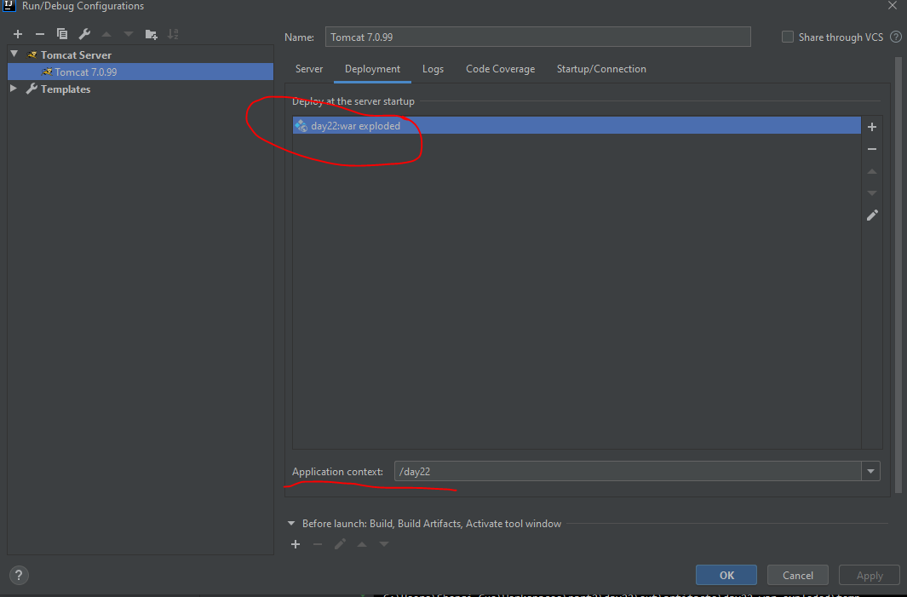
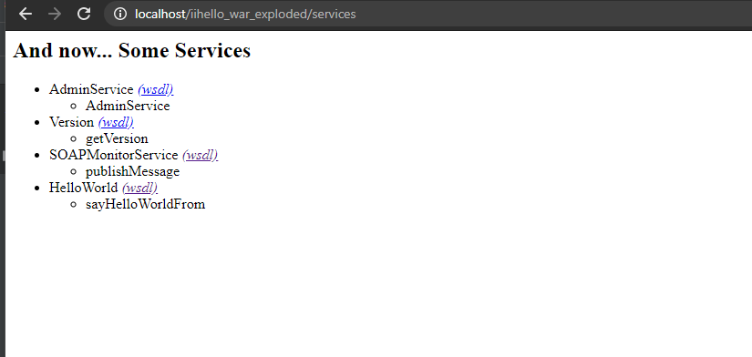

# IDEA 踩坑记录

## 添加依赖


## Tomcat 配置


Edit Configuration -- 添加(+) Tomcat(local)-- 选择 Tomcat 所在的路径


Deployment(部署) -- 添加(+)Artifact-- 指定访问路径

## Tomcat 部署时 war exploded 的问题

war exploded 模式是直接把文件夹、jsp 页面 、classes 等等移到 Tomcat 部署文件夹里面，进行加载部署。

````
 

用于获取上下文环境绝对路径的代码：

```text
String contextPath = request.getSession().getServletContext().getRealPath();
```

war exploded模式最终没有部署在Tomcat的位置，而是项目本身所在位置的指定目录下。

## Struts2 struts.xml extends="struts-default"报错

```text
<struts>
    <package name="default" namespace="/" extends="struts-default">
        <action name="hello" class="test.HelloAction" method="say">
            <result name="good">/hello.jsp</result>
        </action>
    </package>
</struts>
```

错误原因：新建项目后手动新建lib目录导致struts-default引用错误

解决方法：

File --&gt; Project Structure --&gt; Facets --&gt; Struts2


## Hibernate框架使用相关

### 新建项目

Java项目或者web项目视情况选择。Idea默认下载的是Hibernate5，也可以自己之后导入包。


### 建立实体类与数据库表的映射

方式一：已有实体java类，数据库中已经建表，新建实体类名.hbm.xml文件，并在hibernate.cgf.xml中增加映射文件配置


```text
<mapping resource="hibernate3/demo1/User.hbm.xml"/>
```

方式二：无实体类，用hibernate生成


选择实体类生成后所在位置，选择是类名后加的后缀。

Generate Column Properties选项勾选后，会在生成的实体类.hbm.xml中生成对应字段属性，但是需要检查一下not-null属性是否正确。

每次自动生成实体类后，hibernate.cgf.xml中关于数据库连接那一块会被替换重置，需要重新修改。

方式三： 已有实体类，无表。

建类，写映射配置文件，在核心配置中写好mapping，跑Main.class的主方法。

## 网页页面日期项输入

```text
<input type="date" value=""/>
```


## 用idea模板建立webservice服务器端和客户端

环境选择 jdk1.7 tomcat7 Axis

### 建立webservice服务器端


Tools-->WebServices-->generate wsdl from java code


在java类同目录下生成了wsdl文件。


这里要注意在Artifacts中点fix，解决Axis的路径问题


启动Tomcat服务器，在浏览器访问，路径为Tomcat配置的URL+services



点击对应的链接，显示wsdl页面，将网址copy就可以给客户端使用了。

### 从wsdl生成服务器端

新建一个空白java项目，建包，选择Tools-->WebServices-->generate java code from wsdl


第一行是wsdl对应的网址或路径
第三行是目标package，先建包，再到这里使用，不然会报红
第四行选择对应的WS Platform，根据实际情况选择

之后就可以编写测试类调用服务了。


````
