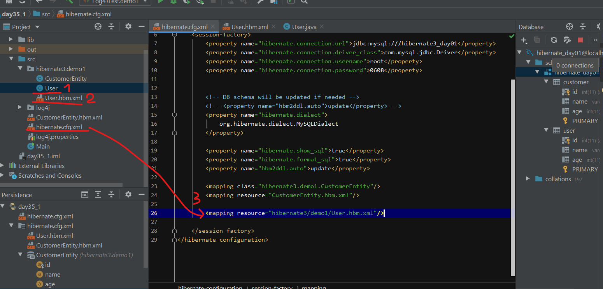

# IDEA踩坑记录

## Tomcat 部署时 war exploded的问题

war exploded模式是直接把文件夹、jsp页面 、classes等等移到Tomcat 部署文件夹里面，进行加载部署。

 

用于获取上下文环境绝对路径的代码：

```text
String contextPath = request.getSession().getServletContext().getRealPath();
```

war exploded模式最终没有部署在Tomcat的位置，而是项目本身所在位置的指定目录下。

## Struts2 struts.xml extends="struts-default"报错

```text
<struts>
    <package name="default" namespace="/" extends="struts-default">
        <action name="hello" class="test.HelloAction" method="say">
            <result name="good">/hello.jsp</result>
        </action>
    </package>
</struts>
```

错误原因：新建项目后手动新建lib目录导致struts-default引用错误

解决方法：

File --&gt; Project Structure --&gt; Facets --&gt; Struts2


## Hibernate框架使用相关

### 新建项目

Java项目或者web项目视情况选择。Idea默认下载的是Hibernate5，也可以自己之后导入包。


### 建立实体类与数据库表的映射

方式一：已经实体java类，数据库中已经建表，新建实体类名.hbm.xml文件，并在hibernate.cgf.xml中增加映射文件配置



```markdown
<mapping resource="hibernate3/demo1/User.hbm.xml"/>
```

方式二：无实体类，用hibernate生成


选择实体类生成后所在位置，选择是类名后加的后缀。

Generate Column Properties选项勾选后，会在生成的实体类.hbm.xml中生成对应字段属性，但是需要检查一下not-null属性是否正确。


每次自动生成实体类后，hibernate.cgf.xml中关于数据库连接那一块会被替换重置，需要重新修改。
