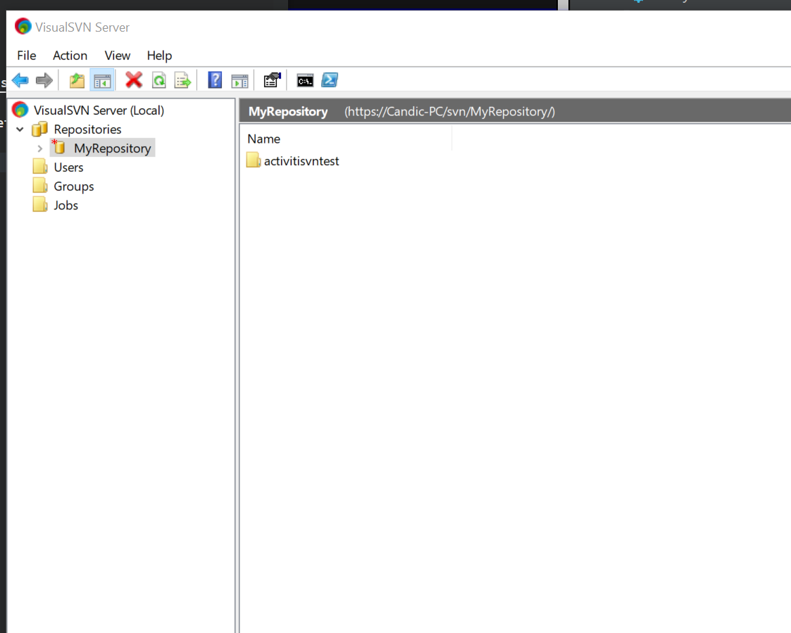
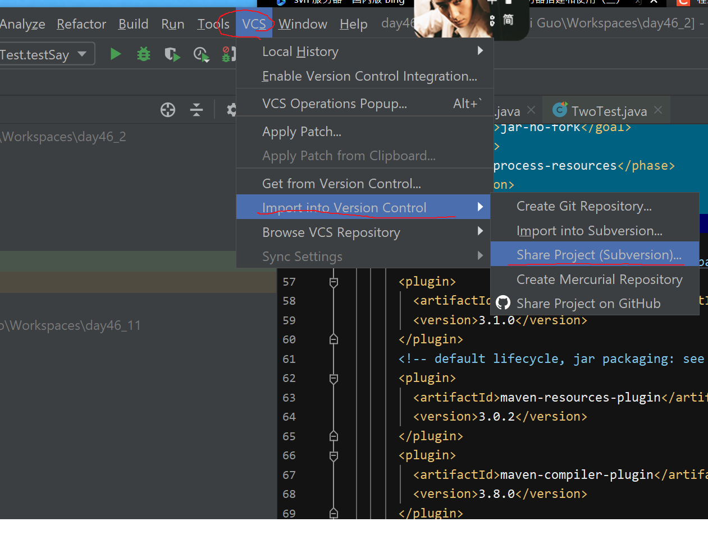

# 版本控制

## SVN

VisualSVN server 服务端和 TortoiseSVN 客户端搭配使用

下载和搭建 SVN 服务器http://subversion.apache.org/packages.html

下载 TortoiseSVN 客户端,官网下载地址:http://tortoisesvn.net/downloads.html

- 在右边新建 Repository,右键复制 URL

- 上传已有项目至版本控制库

- 下载 检出 checkout 选择存放目标文件夹 再导入(new module from existing Sources)

## git
