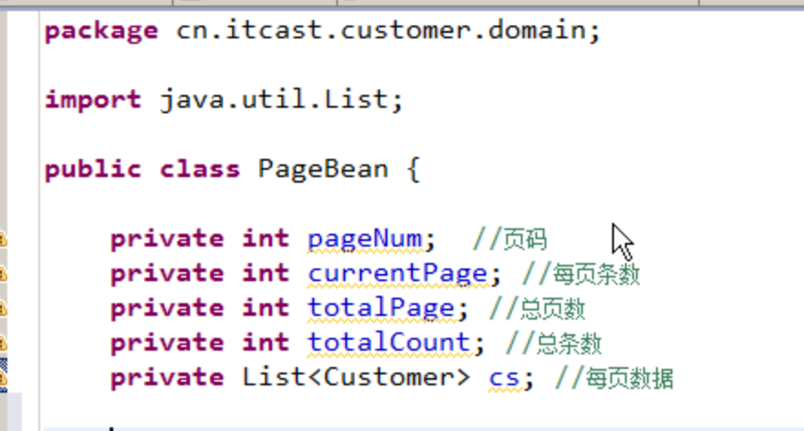

# Customer练习

## 添加客户

完成添加操作:

1. 在showCustomer.jsp页面上添加一个连接，可以直接访问到添加页面 add.jsp
2. 创建add.jsp

   问题:id是varchar类型，它的获取问题?

   UUID工具类来获取.

关于生日的日历组件


My97DatePickerBeta


1. 将组件导入js

```markup
 <script language="javascript" type="text/javascript" src="${pageContext.request.contextPath}/My97DatePicker/WdatePicker.js">
 </script>
```

   2. ****在input type=text组件上添加 class, onclick.

```markup
客户生日:<input type="text" name="birthday" class="Wdate" onclick="WdatePicker()" readonly="readonly">
```


关于id问题

           使用UUID获取 生成随机不重复字符串类型ID

```java
import java.util.UUID;
public class IdUtils {
    public static String getUUID(){
        return UUID.randomUUID().toString().replaceAll("-","");
    }

    public static void main(String[] args) {
        System.out.println(getUUID());
    }
}
```


3.创建CustomerAddServlet完成添加操作

               1.得到所有请求参数封装到Customer对象

                                          注意:1.编码问题

                                                  2.我们使用BeanUtils，注意Date类型转换问题

                                                  3.要手动封装id.

                  2.调用service完成添加操作成批量删除

### 批量删除

1. 完成页面上全选与全不选操作

```javascript
function change(){
       //1.得到id为main的这个checkbox
       var main=document t.getElementById("main");
       var flag=main.checked;
       //2.得到所有name=ck的checkbox
       var cks=document.getElementsByName("ck");
       //3.将cks中所有的checkbox的checked值设置为flag
       for(var i=0;i<cks.length;i++){
            cks[i].checked=flag;
       }
  }
```

    2. 完成批量删除

             页面上怎样将数据提交到服务器端.

* 可以创建一个表单，将表单数据提交就可以。


* 直接使用js操作

需要手动拼出url路径


在服务器端怎样批量删除.

1. 得到所有要删除的id值

request.getParameterValues\("ck"\);

     2.在dao中使用QueryRunner的batch方法

batch\(sql,Object\[\]\[\]\);

注意:参数二维数据，它代表的是每一条sql的参数。


=========================================

## 简单条件查询

1. 页面完成

   在showCustomer.jsp页面上完成

```markup
    <div align="center">
        <form>
            <select name="s">
                <option>请选择条件</option>
                <option value="name">按姓名查询</option>
                <option value="cellphone">按手机号查询</option>
                <option value="description">按描述查询</option>
            </select>
            <input type="text" name="msg">
            <input type="submit" value="查询">
        </form>
</div>
```

```text
问题: select的名称叫什么?每一个option的值是什么?

    select可以任意起名.

    option的value名称需要与customer表中的字段名称对应.
```

1. 创建CustomerSimpleSelectServlet完成条件查询


注意sql语句问题


```java
 String sql="select \* from customer where "+field+" like ?";
```


## 分页查询

### 分页概念介绍

问题:什么是分页，为什么使用分页?

```text
分页就是将数据以多页去展示，使用分页可以提高客户的感受。
```

分页分类:

1. 物理分页\(在java开发领域，我们使用的比较多的是物理分页\)

   只从数据库中查询出当前页的数据。

   优点:不占用很多内存

   缺点:效率比较低

2. 逻辑分页

   从数据库中将所有记录查询出业，存储到内存中，要想展示当前页数据，直接从内存中获取。

   优点:效率高

   缺点:占用内存比较高

**物理分页的实现:**

1. 直接使用jdbc完成

   使用滚动结果集. 优点:跨数据库。 缺点:性能低。

2. 使用数据库本身提供的分页操作.

   会使用每一个数据库特定的分页函数. 优点:性能高 缺点:不能跨数据库。

mysql:limit, sqlservlet:top, oracle:rownum

### 介绍limit\(jdbc\)

select \* from 表 limit m, n;

m：代表的是从第几条开始 注意:它是从0开始记录.

n:代表查询几条记录.

示例:分页显示，每页显示6条，要查询第2页的数据. \(2-1\)\*6,6

select \* from 表 limit \(页码-1\)\*每页条数,每页条数;

### 分页分析

1. 页码 默认第一页
2. 每页条数 人为定义
3. 总条数 select count\(\*\) from 表
4. 总页数 总页数=总条数%每页条数==0?总条数/每页条数:总条数/每页条数+1

   总页数=Math.ceil\(总条数\*1.0/每页条数\);

5. 当前页的数据 List&lt;?&gt;-----&gt;select \* from 表 limit \(页码-1\)\*每页条数,每页条数;

### 分页代码实现

* 在success.jsp页面上

```markup
<a href="${pageContext.request.contextPath}/findAllByPage">查看所有客户信息(分页展示)</a>
```

* 创建CustomerFindAllByPageServlet完成分页

```text
问题:要向页面携带的数据有很多，不仅是要展示的数据，例如:页码，总页数等，都需要携带到页面上，怎样处理?

解决方案:可以创建一个分页Bean,在这个Bean中封装所有关于分页相关的数据.
```




* 在showCustomerByPage.jsp页面上添加

```markup
<a href="/day20_1/findAllByPage?pageNum=1">首页</a>&nbsp;&nbsp;&nbsp;
<a href="/day20_1/findAllByPage?pageNum=${pb.pageNum-1}">上一页</a>&nbsp;&nbsp;&nbsp;
<a href="/day20_1/findAllByPage?pageNum=${pb.pageNum+1 }">下一页</a>&nbsp;&nbsp;&nbsp;
<a href="/day20_1/findAllByPage?pageNum=${pb.totalPage }">尾页</a>&nbsp;&nbsp;&nbsp;zai4. 在CustomerFindAllByPageServlet中处理请求参数 pageNum
```

* 在CustomerFindAllByPageServlet中处理请求参数 pageNum

```java
int pageNum = 1;
String _pageNum = request.getParameter("pageNum");
if (_pageNum != null) {
    pageNum = Integer.parseInt(_pageNum);
}
```

问题:怎样控制上一页，下一页。

条件判断就可以解决.

```markup
 <c:if test="${pb.pageNum==1}">

上一页   

</c:if>

<c:if test="${pb.pageNum!=1}">

<a href="/day20_1/findAllByPage?pageNum=${pb.pageNum-1}">上一页</a>   

</c:if>

<c:if test="${pb.pageNum==pb.totalPage}">

下一页   

</c:if>

<c:if test="${pb.pageNum!=pb.totalPage}">

<a href="/day20_1/findAllByPage?pageNum=${pb.pageNum+1 }">下一页</a>   

</c:if>
```

### 分页扩展

* 设定每页显示条数

在showCustomerByPage.jsp页面上添加一个&lt;select&gt;

```markup
<c:if test="${pb.pageNum==1}">
       上一页&nbsp;&nbsp;&nbsp;
</c:if>
<c:if test="${pb.pageNum!=1}">
       <a href="/day20_1/findAllByPage?pageNum=${pb.pageNum-1}">上一页</a>&nbsp;&nbsp;&nbsp;
</c:if>
       
<c:if test="${pb.pageNum==pb.totalPage}">
       下一页&nbsp;&nbsp;&nbsp;
</c:if>
<c:if test="${pb.pageNum!=pb.totalPage}">
       <a href="/day20_1/findAllByPage?pageNum=${pb.pageNum+1 }">下一页</a>&nbsp;&nbsp;&nbsp;
 </c:if>
```

```javascript
function changeCurrentPage(value){

     location.href="/day20_1/findAllByPage?currentPage="+value;
}
```

在首页，上一页，下一页，尾页的连接上也要添加每页显示条数。

例如:

```markup
<a href="/day20_1/findAllByPage?pageNum=1&currentPage=${pb.currentPage}">首页</a>
```

* 关于页码显示

```markup
<c:forEach begin="1" end="${pb.totalPage}" var="n" step="1">
				<a href="/day20_1/findAllByPage?pageNum=${n}&currentPage=${pb.currentPage}">第${n}页</a>&nbsp;&nbsp;
</c:forEach>

```

问题:如果页码比较多怎样处理?

可以限定页码数，例如:前5后4。页面的判断条件比较多，可以使用自定义标签。

可以在自定义标签中通过java代码来解决判断操作。如果直接在页面上，使用&lt;c:if&gt;代码太乱。


用java编写页码判断


