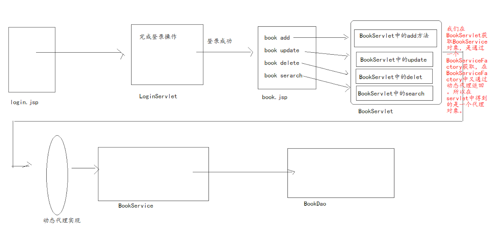

# 动态代理

## 1. 代理模式

### 1.1 代理模式作用

* 屏蔽真实行为的访问，让程序更加安全。
* 可以对真实行为的调用进行控制。

### 1.2 代理模式实现

1. 代理类与被代理类要实现同一个接口.
2. 在代理类中持有被代理对象.
3. 在代理类中调用被代理的行为。

和装饰类似，但是作用完全不同。

**AOP**：面向方面的编程。 AOP的底层实现就是通过动态代理来做到的。

## 2. 动态代理

它就是在代理模式基础上发展的，它不在是对单一的类型进行代理， 而是可以对任意的一个实现了接口的类的对象做代理。

## 3. 动态代理实现

有两种方式:

1. 通过jdk中提供的Proxy类来实现

   这种方式要求，被代理类必须实现接口。

   简单说，只能为接口做代理.

2. 通过cglib来实现。

   它不要求实现接口。

Proxy类中有一个方法

```java
newProxyInstance(ClassLoader loader,Class[] interfaces,InvocationHandler h);
`
```

* loader  

要求: 传递的是被代理类的[类加载器](classloader.md).

类加载器怎样获取: 得到其Class对象。在Class类中提供一个方法 getClassLoader\(\);

* interfaces

要求: 得到被代理对象所实现的接口的所有Class对象。

怎样获取所有实现接口的Class对象? 得到其Class对象，在Class类中提供一个方法 getInterfaces\(\); 它返回的是Class\[\],就代表所实现接口的所有Class对象。

* h  它的类型是InvocationHandler，这是一个接口。

InvocationHandler 是代理实例的调用处理程序 实现的接口。

InvocationHandler接口中有一个方法invoke,return被代理对象的真实行为。

```java
public class StudentProxyTest {
    public static void main(String[] args) {
    // 做Person接口实现类Student的动态代理。

    // 1.创建一个Student 被代理
    final Person s = new Student();

    // 2.得到s的代理对象.
    Person sproxy = (Person) Proxy.newProxyInstance(s.getClass().getClassLoader(), s.getClass().getInterfaces(),new InvocationHandler() {
    // 参数 proxy就是代理对象
    // 参数method就是调用方法
    // 参数args就是调用的方法的参数
    // 返回值,就是真实行为执行后返回的结果，会传递给代理对象调用的方法.
        public Object invoke(Object proxy, Method method,Object[] args) throws Throwable {
            return method.invoke(s, args); // s.say("james");
        }
    });
    String message = sproxy.say("james"); // 这个是代理对象调用say方法.
    System.out.println(message);
    }
}
```


## 3. 案例1---实现编码过滤

* EncodingFilter中

```java
final HttpServletRequest req = (HttpServletRequest) request;
HttpServletResponse resp = (HttpServletResponse) response;

// 2.操作
// 创建一个req对象的代理对象reqProxy
HttpServletRequest reqProxy = (HttpServletRequest) Proxy
.newProxyInstance(req.getClass().getClassLoader(), req
.getClass().getInterfaces(), new InvocationHandler() {

    public Object invoke(Object proxy, Method method,Object[] args) throws Throwable {

        // 1.得到方法名称
        String methodName = method.getName();
        if ("getParameter".equals(methodName)) {
            String param = req.getParameter((String) (args[0]));
        //编码操作
        return new String(param.getBytes("iso8859-1")，"utf-8");

        } else {
        // 不是getParameter方法，就执行其原来操作.
            return method.invoke(req, args);
        }
}
});
// 3.放行
chain.doFilter(reqProxy, resp);
```

## 4. 案例--动态代理+注解实现的细粒度的权限控制

### 4.1 数据库准备

```text
create table users(
id int primary key auto_increment,
username varchar(40),
password varchar(40)
);

insert into users values(null,'aaa','111');
insert into users values(null,'bbb','111');
insert into users values(null,'ccc','111');


create table privileges(
id int primary key auto_increment,
name varchar(40)
);

insert into privileges values(null,'添加图书');
insert into privileges values(null,'修改图书');
insert into privileges values(null,'查看图书');
insert into privileges values(null,'删除图书');

// 多对多表关系
create table userprivilege(
user_id  int ,
privilege_id int,
foreign key(user_id) references users(id),
foreign key(privilege_id) references privileges(id),
primary key(user_id,privilege_id)
);

insert into userprivilege values(1,1);
```

### 4.2 代码实现

#### 1.  完成登录操作，将user存储到session中

login.jsp --&gt; LoginServlet --&gt; UserService --&gt; UserDao.

#### 2. 登录成功，跳转到book.jsp页面

在这个页面上有四个超链接，访问的是同一个servlet（BookServlet）

问题:怎样让一个servlet处理多个请求？ 可以通过在请求，携带参数来判断要做什么操作.

```java
<a href="${pageContext.request.contextPath}/book?method=add">book add</a>
<br>
<a href="${pageContext.request.contextPath}/book?method=update">book update</a>
<br>
<a href="${pageContext.request.contextPath}/book?method=delete">book delete</a>
<br>
<a href="${pageContext.request.contextPath}/book?method=search">book search</a>
```

在servlet中判断method值是什么，调用不同的请求处理方法.

这种方式下，在做权限控制时，如果使用[url级别权限控制](filter-listener/filter-examples.md)，就不能通过判断请求的资源路径来处理。

可以使用**细粒度权限控制**。

### 4.3 细粒度实现权限控制

实现原理: 使用注解+动态代理来完成。

```java
注解用于定义当前行为的访问需要什么权限.
动态代理帮助我们完成控制拦截。简单说，就是在代理中，会判断当前用户是否具有访问该行为的权限.
如果有，会调用被代理的行为，如果没有，不调用行为，直接抛出权限不足。
```



#### 1. 创建一个BookInfo注解，它是用于描述行为访问时，需要什么权限的

```java
@Retention(RetentionPolicy.RUNTIME)
@Target(ElementType.METHOD)
@Inherited
public @interface BookInfo {

  String value(); //这就是权限名称
}
```

在被代理类所实现的接口上使用注释

```java
public interface BookService {

    @BookInfo("添加图书")
    public void addBook(User user) throws Exception;
    ...
}
```

#### 2. 在BookServiceFactory中进行权限控制

在这个类中生成的是代理类的实例对象。

```java
public class BookServiceFactory {

    private static BookService service = new BookServiceImpl();

    public static BookService getInstance() {

        BookService proxy =...
        return proxy;
    }
}
```

* 得到当前行为访问需要的权限名称

```java
BookInfo bif = method.getAnnotation(BookInfo.class);
String pname = bif.value();
```

* 得到当前登录的用户

我们在所有的service的方法上添加了一个User参数。 那么我们获取时，就可以直接通过invoke方法的args参数获取.

```java
User user = (User) args[0];
```

首先判断用户是否存在，也就是判断它是否登录了。if\(user == null\){}

如果登录了，根据用户查询数据库，得到这个用户所具有的所有权限名称

```java
//sql语句
SELECT 
privileges.name
FROM
users,PRIVILEGES,userprivilege
WHERE 
users.id=userprivilege.user_id
AND
privileges.id=userprivilege.privilege_id
AND
users.id=?";
```

#### 3. 判断用户是否有相应权限

```java
//查数据库得到用户拥有的权限集合
List<Object> pnames = runner.query(sql,new ColumnListHandler(), user.getId());

if (pnames.contains(method.getAnnotation(BookInfo.class).value())) {//判断权限
    //真实行为
    Object obj = method.invoke(service, args);
    return obj;
} else {
    throw new RuntimeException("权限不足");
}
```

