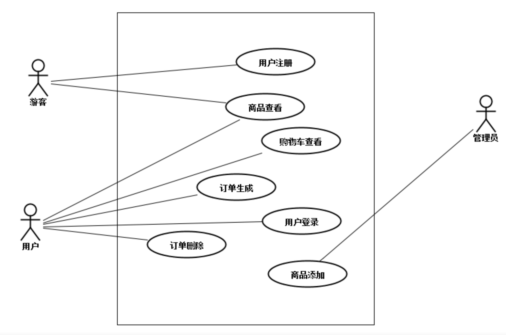
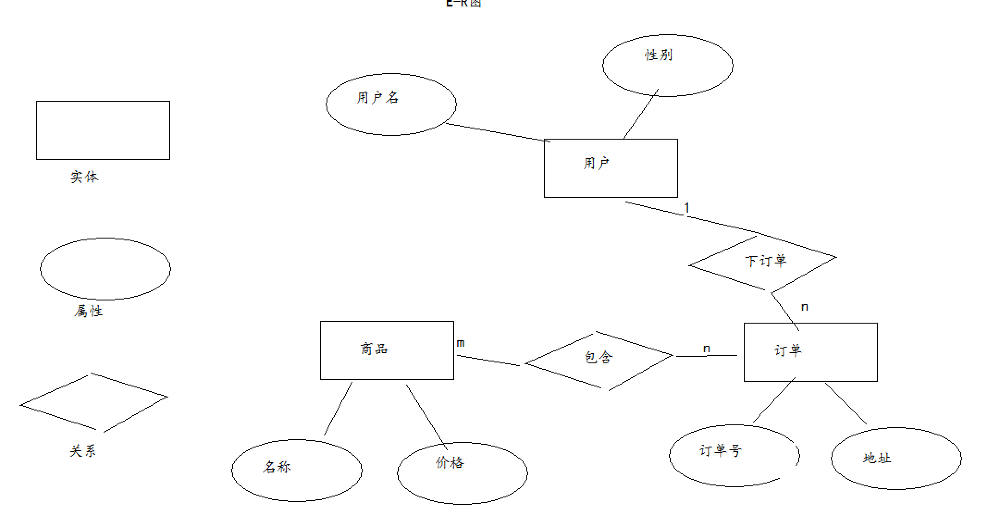

# 商城项目练习笔记

## UML用例图（系统需求分析）



## E-R图（数据库设计）



## 时序图


## 记录

### InputStreamReader读取本地中文字符文件乱码

```java
public void init() throws ServletException {
    // 初始化阶段，读取WEB-INF目录下待选验证码文件new_words.txt
    // web工程中读取 文件，必须使用绝对磁盘路径
    String path = getServletContext().getRealPath("/WEB-INF/new_words.txt");
    try {
        //BufferedReader reader = new BufferedReader(new FileReader(path));
        //使用FileReader的父类InputStreamReader，指定charset
        BufferedReader reader = new BufferedReader(new InputStreamReader(new FileInputStream(path),"utf-8"));
        String line;
        while ((line = reader.readLine()) != null) {
            words.add(line);
        }
        reader.close();
    } catch (IOException e) {
        e.printStackTrace();
    }
}
```

### refresh倒计时刷新将用户并重定向到另外一个地址

* 在servlet中实现

```java
response.setHeader("refresh","3;url=http://www.estore.com");
```

* 在jsp页面上实现

```java
<head>
<meta http-equiv="refresh" content="3;url=http://www.estore.com"/>
</head>
```
写法一：

```java
<script type="text/javascript">
    var x =3;
    function run() {
        var span = document.getElementById("timeid");
    span.innerHTML = x;
    x--;
    window.setTimeout("run()",1000);
}


</script>
<body onload="run()">
注册成功！您将在 <span id="timeid">3</span> 秒内跳转到首页
```

写法二：

```java
<script type="text/javascript">
    var interval;
    window.onload=function () {
        interval= window.setInterval("run()",1000);
    }
    function run() {
    var time =document.getElementById("timeid").innerHTML;
    if(time == 0){
        window.clearInterval(interval);
    return;
    }
    document.getElementById("timeid").innerHTML=(time-1);
}
</script> 
```

### 全局编码过滤

* [Filter案例](filter-examples.md)

