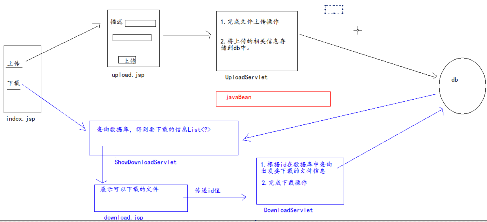

# 文件的上传下载练习

网盘系统



## 准备数据库

```text
    create database day22

    create table resources(
      id int primary key auto_increment,
      uuidname varchar(100) unique not null,
      realname varchar(40) not null,
      savepath varchar(100) not null,
      uploadtime timestamp ,
      description varchar(255)
    );
```

## 导入jar包

c3p0 c3p0-config.xml

dbutils  mysql驱动

commons-fileupload-1.2.1.jar 文件上传

commons-io-1.4.jar 它是提供的io工具

jstl standard

beanutils collections logging

## 编码实现上传

* 在index.jsp页面添加上传链接

```java
<a href='${pageContext.request.contextPath}/upload.jsp'>上传</a>
```

* 创建upload.jsp页面

上传操作浏览器端三个注意事项:

1. method = post
2. encType = "multipart/form-data"
3. 要使用 &lt;input type="file" name='f'&gt;

```java
<form action="${pageContext.request.contextPath}/upload" method="post" enctype="multipart/form-data">
      <input type="file" name="f"><br>
  描述:<input type="text" name="description"><br>
      <input type="submit" value="提交">
</form>
```

* 创建UploadServlet

1. 完成上传操作
2. 将数据封装，存储到数据库。

```text
  1.上传操作
    commons-fileupload.jar
      DiskFileItemFactory ---确定缓存大小，临时文件位置
      ServletFileUpload  ---parseRequest方法
      FileItem ---isFormField 判断是否为上传组件
    中文乱码
      upload.setHeaderEncoding("utf-8");---文件名
      FileItem.getString("utf-8")--非上传组件中文内容

  2.生成UUID文件名和多级存储目录结构 mkdirs

  3.IOUtils.copy(item.getInputStream(), new FileOutputStream(new File(目录，uuid文件名)));
  
  4.将数据封装，存储到数据库.
    问题:怎样将数据封装到javaBean？
        手动创建一个Map<String,String[]>将数据封装到map集合，通过BeanUtils完成数据封装.
        map.put(jBea属性名,new String[]{对应数据});
        BeanUtils.populate(r,map);
```

## 编码实现下载

* index.jsp页面代码

```java
<a href="${pageContext.request.contextPath}/showDownload">下载</a>
```

* 创建ShowDownloadServlet

  在这个servlet中，查看db,得到所有可以下载的信息.

  List&lt;Resource&gt; rs = service.findAll();
					
* 创建一个download.jsp页面，展示所有可以下载的信息.
				
			2.在download.jsp，点击下载时，传递的是要下载文件的id。
				<a href='${pageContext.request.contextPath}/download?id=${r.id}'>下载</a>
				
				1.创建一个DownloadServlet
					1.查询数据库，得到要下载的文件的相关信息
					2.下载操作

