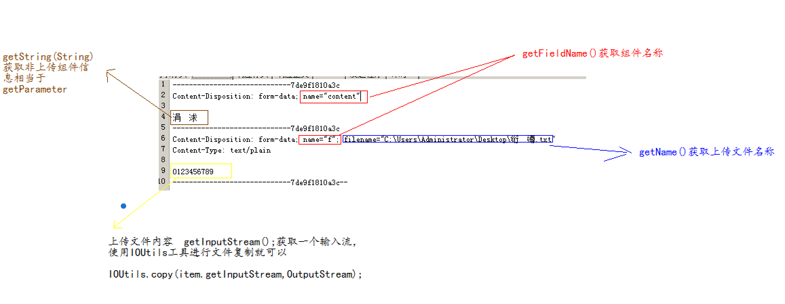

# 文件的上传

## 概念

什么是文件上传？为什么使用文件上传? 就是将客户端资源，通过网络传递到服务器端。因为数据比较大，我们必须通过文件上传才可以完成将数据保存到服务器端操作。 

文件上传的本质: 就是IO流的操作。

## 演示分析: 文件上传操作

### 浏览器端

1. method=post 只有post才可以携带大数据
2. 必须使用&lt;input type='file' name='f'&gt; 要有name属性
3. encType = "multipart/form-data"

```markup
<form action="${ pageContext.request.contextPath}/upload" method="post" encType = "multipart/form-data">
```

* [enctype详解](enctype.md)

### **服务器端**

request对象是用于获取请求信息。它有一个方法 getInputStream\(\); 可以获取一个字节输入流，通过这个流，可以读取到所有的请求正文信息.

```java
public void doGet(HttpServletRequest request,HttpServletResponse response)
throws ServletException, IOException {
//通过request获取一个字节输入流，将所有的请求正文信息读取到，打印到控制台。
    InputStream is=request.getInputStream();
    byte[] b=new byte[1024];
    int len=-1;
    while((len=is.read(b))!=-1){
        System.out.print(new String(b,0,len));
    }
    is.close();
}
```

### **文件上传原理**

浏览器端注意上述三件事，在服务器端通过流将数据读取到，再对数据进行解析。将上传文件内容得到，保存在服务器端，就完成了文件上传。


而在实际开发中，不需要我们进行数据解析，完成文件上传。因为我们会使用文件上传的工具，它们已经封装好的，提供API,只要调用它们的API就可以完成文件上传操作.


我们使用的**commons-fileupload**,它是apache提供的一套开源免费的文件上传工具。

## 使用commons-fileupload

### 导入jar包

commons-fileupload-1.2.1.jar 文件上传

commons-io-1.4.jar 它是提供的io工具.

commons-fileupload有三个核心:

1. DiskFileItemFactory类
2. ServletFileUpload类
3. FileItem

### 快速入门

#### 创建upload2.jsp页面

```text
<form action="${pageContext.request.contextPath}/upload2" method="post" encType="multipart/form-data">
    <input type="file" name="f"><br>
    <input type="submit" value="上传">
</form>
`
```

#### 创建Upload2Servlet

* 创建一个DiskFileItemFactory

```java
DiskFileItemFactory factory=new DiskFileItemFactory();
```

* 创建ServletFileUpload类

```java
ServletFileUpload upload=new ServletFileUpload(factory);
```

* 解析所有上传数据 parseRequest 方法

```java
List<FileItem> items = upload.parseRequest(request);
```

* 遍历items集合，集合中的每一项，就是一个上传数据



1. isFormField\(\);
2. getFieldName\(\);
3. getName\(\);
4. getString\(\);
5. item.getInputStream\(\);
6. IOUtils.copy\(item.getInputStream\(\), fos\);

### 核心API详解 

* DiskFileItemFactory

  作用:可以设置缓存大小以及临时文件保存位置.

  * 默认缓存大小是  10240\(10k\)。
  * 临时文件默认存储在系统的临时文件目录下.（可以在环境变量中查看）

```java
    1.new DiskFileItemFactory();
        缓存大小与临时文件存储位置使用默认的.

    2.DiskFileItemFactory(int sizeThreshold, File repository)
        sizeThreshold :缓存大小
        repository:临时文件存储位置
```

如果临时文件存储位置希望是部署在服务器后工程目录下 .getServletContext\(\).getRealPath\(\)

```java
File file = new File(this.getServletContext().getRealPath("/temp"));// 获取temp目录部署到tomcat后的绝对磁盘路径
DiskFileItemFactory factory = new DiskFileItemFactory(1024 * 100, file);
```

对于无参数构造，也可以设置缓存大小以及临时文件存储位置.

```java
    setSizeThreshold(int sizeThreshold)
    setRepository(File repository)
```

* ServletFileUpload

```java
    1.ServletFileUpload upload=new ServletFileUpload(factory);
        创建一个上传工具，指定使用缓存区与临时文件存储位置.

    2.List<FileItem> items=upload.parseRequest(request);
        它是用于解析request对象，得到所有上传项.每一个FileItem就相当于一个上传项.

    3.boolean flag = upload.isMultipartContent(request);
        用于判断是否是上传.
        可以简单理解，就是判断encType="multipart/form-data";

    4.设置上传文件大小(批量上传)
        void setFileSizeMax(long fileSizeMax) 设置单个文件上传大小
        void setSizeMax(long sizeMax) 设置总文件上传大小

    5.解决上传文件中文名称乱码
        setHeaderEncoding("utf-8");
```


注意: 如果使用reqeust.setCharacterEncoding\("utf-8"\)也可以，但不建议使用。


* FileItem

```text
    1.isFormField();
        返回值是布尔类型，判断是否是上传组件，如果是<input type="file">返回的就是false,否则返回true.

    2.getFieldName();
        返回值String,得到组件名称  <input name="">。

    3.getName();
        返回值是String,得到的是【上传文件】的名称.
        注意:浏览器不同，它们得到的效果不一样。
            1.包含全路径名称  例如:
                C :\Users\Administrator\Desktop\a.txt
            2.只包含上传文件名称 例如:a.txt

    4.getString();
        这个方法可以获取非上传组件的内容,相当于getParameter方法作用。
        问题: 如果信息是中文，会出现乱码，解决方案 getString("utf-8");

        如果是上传组件，上传的文件是文本文件，可以获取到文件文件的内容。
        但是如果不是文件文件，例如：是一张图片，就不能这么用。

    5.获取上传文件的内容,保存到服务器端.
        item.getInputStream(); 它是用于读取上传文件内容的输入流.

        使用文件复制操作就可以完成文件上传。
        IOUtils.copy(item.getInputStream(), fos);

    6.删除临时文件
        item.delete();
```

### 总结: 关于文件上传时的乱码问题

* 上传文件名称乱码

```java
ServletFileUpload.setHeaderEncoding("utf-8"）;
```

* 非上传组件内容乱码

```java
 FileItem.getString("utf-8");
```


上传文件信息是否会乱码，需要解决吗? 不需要解决，因为我们在上传时，使用的字节流来进行复制。


### 服务器端代码实现

```java
//1.设置缓存大小以及临时文件保存位置
File file = new File(this.getServletContext().getRealPath("/temp"));
DiskFileItemFactory factory = new DiskFileItemFactory(1024 * 100, file);

//2.创建ServletFileUpload
ServletFileUpload upload = new ServletFileUpload(factory);

//3.用于判断是否是上传操作
boolean flag = upload.isMultipartContent(request);
if (flag) {

    // 解决上传文件名称中文乱码
    upload.setHeaderEncoding("utf-8");

    // 设置上传文件大小
    //upload.setSizeMax(1024 * 1024 * 10);// 总大小为10m

    //4.解决request,得到所有的上传项FileItem
    List<FileItem> items = upload.parseRequest(request);
    for (FileItem item : items) {
        if (item.isFormField()) {
        // 非上传组件
        System.out.println("组件名称:" + item.getFieldName());
        System.out.println("内容:" + item.getString("utf-8")); \
        } else {
        // 上传组件
        String name = item.getName(); // 上传文件名称
        name = name.substring(name.lastIndexOf("\\") + 1);//纯文件名

        IOUtils.copy(item.getInputStream(),new FileOutputStream("d:/upload/" + name));
        // 删除临时文件
        item.delete();
    }
}
    ...
```

## 多文件上传


```markup
	<input type="button" value="add File" onclick="addFile();">
	<br>
	<br>
	<form action="${pageContext.request.contextPath}/upload4" method="post" encType="multipart/form-data">
		<input type="file" name="f"><br>
		<div id="content">
		
		</div>
		<input type="submit" value="上传">
	</form>
```

```javascript
function addFile(){  
    var div=document.getElementById("content");  
    //用子div将上传组件和button成组，方便操作
    div.innerHTML+="<div><input type='file' name='f'><input type='button' value='remove file' onclick='removeFile(this)></div>";  
}  

function removeFile(btn){  

    document.getElementById("content").removeChild(btn.parentNode); 

}
```

服务器端代码不需要改变.

## 关于文件上传的注意事项

### 上传文件在服务器端保存位置问题

* 保存在可以被浏览器直接访问的位置

  例如:商城的商品图片保存在工程的WebRoot下的路径\(不包含META-INF以及WEB-INF目录及其子目录\)

* 保存在不能被浏览器直接访问的位置

  例如:付费的视频。

  1.工程中 META-INF WEB-INF目录及其子目录

  2.不在工程中的服务器的磁盘目录下.

### 上传文件在同一个目录重名问题

在开发中解决这个问题，可以给上传文件起随机名称。

1. 使用毫秒值
2. 使用uuid

### 同一目录下文件过多

只需要分目录就可以

1. 按照上传时间进行目录分离 （周、月 ）
2. 按照上传用户进行目录分离 ----- 为每个用户建立单独目录 
3. 按照固定数量进行目录分离 ------ 假设每个目录只能存放3000个文件 ，每当一个目录存满3000个文件后，创建一个新的目录
4. 按照文件名的hashcode进行目录分离.

```java
public static String generateRandomDir(String uuidFileName) {
    // 获得唯一文件名的hashcode
    int hashcode = uuidFileName.hashCode();
    // 获得一级目录
    int d1 = hashcode & 0xf;
    // 获得二级目录
    int d2 = (hashcode >>> 4) & 0xf;

return "/" + d2 + "/" + d1;// 共有256目录l
}
```

