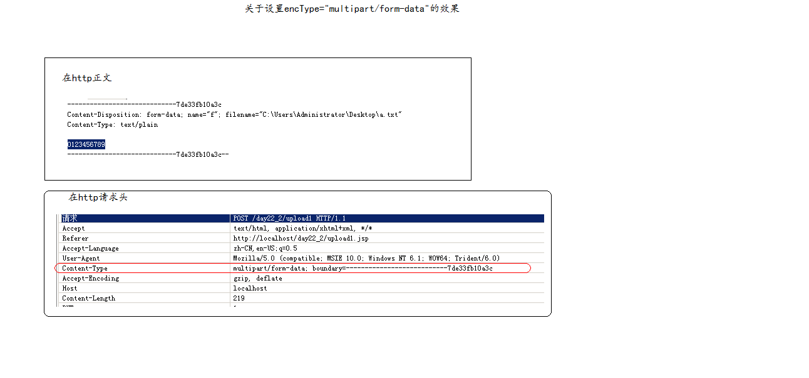

# enctype详解

## 关于设置encType = "multipart/form-data" 的效果

```text
<form action="${ pageContext.request.contextPath}/upload" method="post" encType = "multipart/form-data">
```

## 不设置enctype属性的情况

```text
<form action="${ pageContext.request.contextPath}/upload" method="post">
    <input type="text" name="content"><br>
    <input type="file"name="f"><br>
    <input type="submit" value="上传">
</form>
```

请求头中Content-Type：application/x-www-form-urlencoded（默认）

## 设置enctype属性的情况

```text
<form action="${ pageContext.request.contextPath}/upload" method="post" encType = "multipart/form-data">
    <input type="text" name="content"><br>
    <input type="file"name="f"><br>
    <input type="submit" value="上传">
</form>
```



