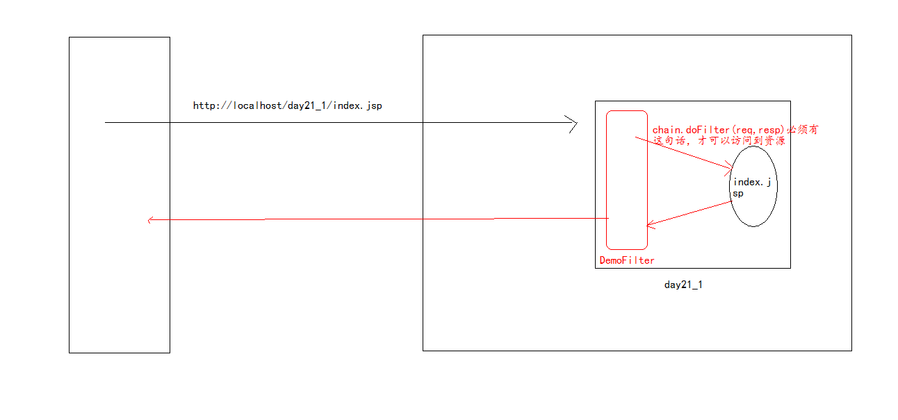

# Filter 过滤器

## Filter 过滤器

### 概念



Web开发人员通过Servlet技术中的Filter对web服务器管理的所有web资源，例如Jsp，Servlet，静态图片文件或静态html文件等进行拦截，从而实现一些特殊的功能，如实现URL级别的权限访问控制、过滤敏感词汇、压缩响应信息等一系列高级功能。

java.servlet.Filter接口

* 这个接口中有一个doFilter方法，它是真正用于进行过滤的方法。
* Filter也需要在web.xml文件中配置。

### Filter入门

1. 创建一个类，实现javax.servlet.Filter接口
2. 重写接口中的方法
3. 在web.xml文件中配置

```markup
<!-- Filter入门 --!>
<filter> 
    <filter-name>demoFilter</filter-name>
    <filter-class>cn.itcast.web.filter.Demo1Filter</filter-class> 
</filter>
<filter-mapping> 
    <filter-name>demo2Filter</filter-name>
    <url-pattern>/index.jsp</url-pattern>
    <!-- 访问index.jsp页面会被DemoFilter过滤 -->
```

#### Filter怎样实现过滤操作

1. 在&lt;url-Pattern&gt;它是用于设置过滤的路径
2. 在doFilter方法中的第三个参数FilterChain，它是用于控制是否可以访问资源的。

### Filter的生命周期（了解）

* 初始化方法，只执行一次

  ```java
  public void init(FilterConfig filterConfig) throws ServletException
  ```

* 真正进行拦截操作的方法

  ```java
  public viod doFilter(ServletRequest request, ServletResponse response, FilterChain chain)
  //通过chain.doFilter(request,response)向下执行
  ```

* 销毁操作

  ```java
  public void destroy()
  ```

### Filter详细配置信息

#### 配置Filter

```markup
<filter> 
    <filter-name></filter-name> 
    <filter-class></filter-class> 
</filter> 

<init-param> 
    <param-name></param-name> 
    <param-value></param-value> 
</init-param> 
<filter-mapping>
    <filter-name></filter-name>
    <url-pattern></url-pattern>
</filter-mapping>
```

#### FilterConfig

在Filter的init方法中有一个参数是FilterConfig，它的作用也是获取Filter的相关配置信息

```java
    1. 初始化参数的获取
        String getInitParamter(String name);
        Enumeration getInitP aramterNames();
       //在web.xml中配置的<init-param>
    2. Filter的名称获取
        getFilterName();
        //在web.xml中配置的<filter-name>
    3. ServletContext对象的获取
        getServletContext();
```

#### FilterChain

* 在一个web应用中，可以开发编写多个Filter，这些Filter组合起来称之为一个Filter链。
* web服务器根据Filter在web.xml文件中的**注册顺序**&lt;filter-mapping&gt; ，决定先调用哪个Filter。当第一个Filter的doFilter方法被调用时，web服务器会创建一个代表Filter链的FilterChain对象传递给该方法。
* 在doFilter方法中，开发人员如果调用了FilterChain对象的doFilter方法，则web服务器会检查FilterChain对象中是否还有filter，如果有，则调用第2个filter，如果没有，则调用目标资源。

```java
public void doFilter(ServletRequest request, ServletResponse response,FilterChain chain) throws IOException, ServletException {

    chain.doFilter(request, response); //向下放行
```


访问-调用第一个Filter-调用第二个Filter-...-调用目标资源-...-结束第二个-结束第一个


```markup
<filter-mapping>
    <filter-name>testFilter</filter-name>
    <url-pattern>/index.jsp</url-pattern>
    <dispatcher>REQUEST</dispatcher>
    <dispatcher>FORWARD</dispatcher>
</filter-mapping>

`
```

#### &lt;url-Pattern&gt;

对于Filter来说，它是用于确定拦截资源的路径

写法：

* 完全匹配 必须以“/”开始
* 可以使用\*通配符

```markup
    1. 目录匹配 /a/*  /* 要求必须“/”开始
    2. 扩展名匹配
        *.do *.action 要求，不能以“/”开始，以“.xxx”结束。
```


在Servlet配置中常用的完全匹配，而在Filter配置中较常使用\*通配符，用来作用于一类的资源。


### &lt;servlet-name&gt;

它的作用是针对某一个sevlet进行拦截，它需要的是servlet的名称

* 如果在一个&lt;filter-mapping&gt;中配置了servlet-name，那么它的顺序与url-pattern不一样。
* 对于tomcat7，如果在一个filter-mapping中配置了servlet-name，还配置了url-pattern，这个filter只执行一次，但是tomcat6会执行两次

### &lt;dispatcher&gt;

&lt;dispatcher&gt;指定过滤器所拦截的资源被 Servlet 容器调用的方式，可以是REQUEST,INCLUDE,FORWARD和ERROR之一，默认REQUEST。用户可以设置多个 子元素用来指定 Filter 对资源的多种调用方式进行拦截。

* REQUEST：默认值 代表直接访问资源
* INCLUDE：include包含的访问
* FORWARD：请求转发
* ERROR：用于声明异常拦截 例如\

## Filter案例

### 全站统一字符编码过滤器（post）

编写jsp 输入用户名，在Servlet中获取用户名，将用户名输出到浏览器上。

* 在Servlet中处理编码问题：

```java
//处理请求post乱码代码
request.setCharacterEncoding("utf-8");
//设置响应编码集代码
response.setContentType("text/html;charset=utf-8");
```

而过滤器可以在目标资源之前执行，将很多程序中处理乱码公共代码，提取到过滤器中，以后程序中不需要处理编码问题了

* 配置filter参数

```text
<!-- post编码过滤器 -->
<filter>
    <filter-name>encodingFilter</filter-name>
    <filter-class>cn.itcast.filter.demo1.EncodingFilter</filter-class>

    <init-param>
        <param-name>encode</param-name>
        <param-value>utf-8</param-value>
    </init-param>
</filter>
<filter-mapping>
    <filter-name>encodingFilter</filter-name>
    <url-pattern>/*</url-pattern><!-- 全站用 -->
</filter-mapping>
```

* EncodingFilter代码

```java
public class EncodingFilter implements Filter {
    private String encode;
    public void destroy() {}

    public void doFilter(ServletRequest arg0, ServletResponse arg1,
            FilterChain chain) throws IOException, ServletException {
        // 1.强制转换
        HttpServletRequest request = (HttpServletRequest) arg0;
        HttpServletResponse response = (HttpServletResponse) arg1;

        // 2.操作
        request.setCharacterEncoding(encode);
        // 3.放行
        chain.doFilter(request, response);
    }

    public void init(FilterConfig config) throws ServletException {
        this.encode = config.getInitParameter("encode");//初始化获得encode参数
    }

}
```

### 禁用所有JSP页面缓存（3个响应头）

问题：为什么禁用jsp页面缓存 为了得到实时信息

* 在jsp页面上设置

```markup
<meta http-equiv="pragma" content="no-cache">
<meta http-equiv="cache-control" content="no-cache">
<meta http-equiv="expires" content="0">
```

* 可以通过Filter来控制

```java
public void doFilter(ServletRequest req, ServletResponse resp,
            FilterChain chain) throws IOException, ServletException {

    // 1.强制转换
    HttpServletRequest request = (HttpServletRequest) req;
    HttpServletResponse response = (HttpServletResponse) resp;

    // 2.操作
    response.setHeader("pragma", "no-cache");
    response.setHeader("cache-control", "no-cache");
    response.setDateHeader("expires", 0);

    // 3.放行
    chain.doFilter(request, response);
}
```

Filter的url-pattern配置

```text
<url-pattern>*.jsp</url-pattern>
```

### 设置图片缓存时间

让图片缓存：缓存的目的是为了提高访问效率

```java
response.setDateHeader("expires", System.currentTimeMillis()
        +60*60*24*10*1000);//缓存10天
```

```text
<filter>
    <filter-name>imageFilter</filter-name>
    <filter-class>cn.itcast.filter.demo3.ImageCacheFilter</filter-class>
</filter>

<filter-mapping>
    <filter-name>imageFilter</filter-name>
    <url-pattern>*.bmp</url-pattern>
</filter-mapping>
```

### 自动登录案例

### URL级别的权限控制

### 通过get和post乱码过滤器

