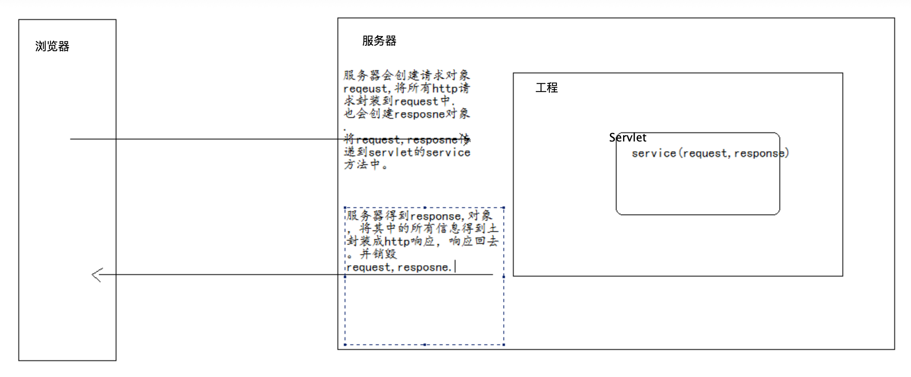

# Filter案例

## 全站统一字符编码过滤器（post）

编写jsp 输入用户名，在Servlet中获取用户名，将用户名输出到浏览器上。

* 在Servlet中处理编码问题：

```java
//处理请求post乱码代码
request.setCharacterEncoding("utf-8");
//设置响应编码集代码
response.setContentType("text/html;charset=utf-8");
```

而过滤器可以在目标资源之前执行，将很多程序中处理乱码公共代码，提取到过滤器中，以后程序中不需要处理编码问题了

### 配置filter参数

```markup
<!-- post编码过滤器 -->
<filter>
    <filter-name>encodingFilter</filter-name>
    <filter-class>cn.itcast.filter.demo1.EncodingFilter</filter-class>

    <init-param>
        <param-name>encode</param-name>
        <param-value>utf-8</param-value>
    </init-param>
</filter>
<filter-mapping>
    <filter-name>encodingFilter</filter-name>
    <url-pattern>/*</url-pattern><!-- 全站用 -->
</filter-mapping>
```

### EncodingFilter代码

```java
public class EncodingFilter implements Filter {
    private String encode;
    public void destroy() {}

    public void doFilter(ServletRequest arg0, ServletResponse arg1,
            FilterChain chain) throws IOException, ServletException {
        // 1.强制转换
        HttpServletRequest request = (HttpServletRequest) arg0;
        HttpServletResponse response = (HttpServletResponse) arg1;

        // 2.操作
        request.setCharacterEncoding(encode);
        // 3.放行
        chain.doFilter(request, response);
    }

    public void init(FilterConfig config) throws ServletException {
        this.encode = config.getInitParameter("encode");//初始化获得encode参数
    }

}
```

## 禁用所有JSP页面缓存（3个响应头）

问题：为什么禁用jsp页面缓存 为了得到实时信息

* 在jsp页面上设置

```markup
<meta http-equiv="pragma" content="no-cache">
<meta http-equiv="cache-control" content="no-cache">
<meta http-equiv="expires" content="0">
```

* 可以通过Filter来控制

```java
public void doFilter(ServletRequest req, ServletResponse resp,
            FilterChain chain) throws IOException, ServletException {

    // 1.强制转换
    HttpServletRequest request = (HttpServletRequest) req;
    HttpServletResponse response = (HttpServletResponse) resp;

    // 2.操作
    response.setHeader("pragma", "no-cache");
    response.setHeader("cache-control", "no-cache");
    response.setDateHeader("expires", 0);

    // 3.放行
    chain.doFilter(request, response);
}
```

Filter的url-pattern配置

```text
<url-pattern>*.jsp</url-pattern>
```

## 设置图片缓存时间

让图片缓存：缓存的目的是为了提高访问效率

```java
response.setDateHeader("expires", System.currentTimeMillis()
        +60*60*24*10*1000);//缓存10天
```

```text
<filter>
    <filter-name>imageFilter</filter-name>
    <filter-class>cn.itcast.filter.demo3.ImageCacheFilter</filter-class>
</filter>

<filter-mapping>
    <filter-name>imageFilter</filter-name>
    <url-pattern>*.bmp</url-pattern>
</filter-mapping>
```

## 自动登录案例

```text
    1. 登录成功后，判断是否勾选了自动登录。
    2. 如果勾选了自动登录，将用户名与密码存储到cookie中。
    3. 做一个Filter，它拦截所有请求，当访问资源时，我们从cookie中获取用户名和密码，进行登录操作。
```


* 首先要有登录功能

login.jsp----LoginServlet--UserService--UserDao

* 完成自动登录原理

在login.jsp页码上添加一个checkbox

```text
<input type="checkbox" name="autologin" value= "ok">自动登录<br>
```

**在LoginServlet中** 登录成功后，判断是否勾选了自动登录，如果勾选了自动登录，将用户名与密码存储到cookie中。

```java
if (user != null) {
 // 登录成功
 //判断是否勾选了自动登录
    String autologin=request.getParameter("autologin");
    if("ok".equals(autologin)){
        //勾选了.
        Cookie cookie=new Cookie("autologin",URLEncoder.encode(username,"utf-8")+"::"+password);
        cookie.setMaxAge(60*60*24*10);//存储10天
        cookie.setPath("/");
        response.addCookie(cookie);
    }
}
```


Cookie没有无参构造函数，新建cookie对象需要两个String参数，将用户名和密码用特定方式连接传入。


**创建一个AutoLoginFilter进行自动登录操作**

```java
public void doFilter(ServletRequest req, ServletResponse resp,FilterChain chain) throws IOException, ServletException {

    // 1.强制转换 request,response
    // 2.操作
    // 2.1 得到cookie中的username,password
    Cookie cookie = CookieUtils.findCookieByName(request.getCookies(), "autologin");

    if (cookie != null) {
    //2.2 得到username和password,进行自动登录
        String username = cookie.getValue().split("::")[0];
        String password = cookie.getValue().split("::")[1];

        UserService service = new UserService();
        User user;
        try  {
            user = service.login(username,password);
            if (user != null) {
    //2.3 查找到了用户，进行自动登录
                request.getSession().setAttribute("user", user);
             }

    ...
    //无论是否找到用户是否有cookie
    // 3.放行
    chain.doFilter(request, response);
```

### **补充问题**

* 如果用户已经登录了，就不需要自动登陆了

```java
//在Filter中先判断session中是否已经存有用户信息
User u = (User)request.getSession().getAttribute("user");
if(u == null){
    ...//进行自动登录的操作
}
```

* 如果用户不想登录而是要注册,则不需要自动登录

```java
//得到请求资源路径，判断是否是登录，注册操作
//判断如果用户访问的是登录操作，不进行自动登录
    String uri = request.getRequestURI();
    //-->/day21/login .jsp
    String contextPath = request.getContextPath();
    //-->/day21
    String path = uri.substring(contextPath.length());
    //从contextPath结束取至end
    //-->login.jsp
if (!(path.equals("/demo4/login.jsp") || path.equals("/login"))) {
    ...//进行自动登录的操作
}
```

* 如果用户信息是中文

```java
//Servlet里存，编码
Cookie cookie =new Cookie("autologin",URLEncoder.encode(username,"utf-8")+"::"+password)
//Filter里取，解码
String username = URLDecoder.decode(cookie.getValue().split("::")[0],"utf-8");
String password = cookie.getValue().split("::")[1];
```


Cookie中不能存中文


### 对密码进行加密 md5

md5加密算法是一个单向加密算法 ，支持明文---密文 不支持密文解密

```java
1. mysql:md5字段
update user set password=MD5(password);123

2. java

//Md5
import java.math.BigInteger;
import java.security.MessageDigest;
import java.security.NoSuchAlgorithmException;

public class Md5Utils {

    public static String md5(String plainText) { //明文
        byte[] secretBytes = null;
        try {
            secretBytes = MessageDigest.getInstance("md5").digest(plainText.getBytes());
        } catch (NoSuchAlgorithmException e) {
            throw new RuntimeException("没有md5这个算法");
        }
        String md5code = new BigInteger(1, secretBytes).toString(16);
        for (int i = 0; i < 32 - md5code.length(); i++) {
            md5code = "0" + md5code;
        }
        return md5code;
    }
}
//在UserDao中使用
runner.query(sql,new BeanHandler<Usesr>(User.class),username,Md6Utils.md5(password))
```

## URL级别的权限控制

权限控制的原理： 可以做一个权限的Filter，在Filter中判断用户是否登陆了，如果登录了，可以访问资源，如果没有登录就不能访问资源。

```java
// 判断用户是否登录了.
User user = (User) request.getSession().getAttribute("user");

if (user == null) {
    throw new PrivilegeException();
}
```

* 判断那些资源访问需要权限，哪些不用

```java
// 判断当前资源是否需要权限控制.
String uri = request.getRequestURI();
String contextPath = request.getContextPath();
String path = uri.substring(contextPath.length());

if (path.equals("/book_add") || path.equals("/book_update")|| path.equals("/book_delete") || path.equals("/book_search")) {
   ...
}
```

* 用户权限不同，能访问的资源不同

```java
// 判断用户的角色，是否可以访问当前资源路径。
if ("admin".equals(user.getRole())) {// 这是admin角色

    if (!(path.equals("/book_add") || path.equals("/book_update") || path.equals("/book_delete"))) {
        throw new PrivilegeException();
    }

} else {
    // 这是user角色
    if (!(path.equals("/book_search"))) {
        throw new PrivilegeException();
    }
}
```

* 自定义Exception和errorpage

```java
public class PrivilegeException extends RuntimeException {}
`
```

```text
<!-- 在web.xml中配置 -->
<error-page>
    <exception-type>PivilegeException全路径类名</exception-type>
    <location>/error/pivilege.jsp</location>
</error-page>
```

### 优化

将不同用户的权限对应的访问资源路径写成配置文件或数据库，方便判断权限的时候的读取。

1. 在src下创建两个配置文件 user.properties, admin.properties。在这两个文件中分别保存不同的角色具有的权限路径。 例如： url=/book\_add，/book\_delete
2. 在PrivilegeFilter中完成权限控制

```java
// 在init方法中将配置文件中的信息读取出来分别保存到两个List<String>集合中
public void init(FilterConfig filterConfig) throws ServletException {
    this.admins = new ArrayList<String>();
    this.users = new ArrayList<String>();

    fillPath("user", users);
    fillPath("admin", admins);
    }

private void fillPath(String baseName, List<String> list) {
    ResourceBundle bundle = ResourceBundle.getBundle(baseName);//baseName 配置文件文件名(不包括扩展名)

    String path = bundle.getString("url");
    String[] paths = path.split(",");
    for (String p : paths) {
    list.add(p);
    }
}
```

```java
//判断权限
if (admins.contains(path) || users.contains(path))
```

## 全局编码过滤（通过get和post乱码过滤器）



用装饰模式类对request进行增强，解决编码问题。被装饰类是由服务器实现的request。

### 装饰步骤

1. 装饰类与被装饰类要实现同一接口或继承同一父类
2. 在装饰类中持有一个被装饰类引用
3. 重写方法，进行功能增强

### 代码实现

* 直接实现HttpServletRequest需要重写的方法太多，继承HttpServletRequestWrapper

```java
class MyRequest extends HttpServletRequestWrapper {

    private HttpServletRequest request;
//HttpServletRequestWrapper 没有无参构造 子类实现需要指定构造方法
    public MyRequest(HttpServletRequest request) {
        super(request);
        this.request = request;
    }
    ...//重写方法
}
```

* 重写关于获取请求参数的方法.

```java
String getParameter(String name)
String[] getParameterValues(String name)
Map<String, String[][]> getParameterMap()
```

* getParamter 与 getParamterValues方法可以调用getParameterMap\(\)方法实现。重点重写getParameterMap\(\)

```java
//request中获得的参数只需要进行一次转码就可以，添加开关量作为判断，避免二次转码 
private boolean flag = true;
@Override
public Map getParameterMap() {
    // 1.得到所有请求参数的Map集合
    Map<String, String[]> map = request.getParameterMap();
    // 2.解决编码问题.
    if (flag) {
        //遍历map集合
        for (String key : map.keySet()) {
            String[] values = map.get(key);
            for (int i = 0; i < values.length; i++) {
                try {
                    values[i] = new String(values[i].getBytes("iso8859-1"),"utf-8");
                } catch (UnsupportedEncodingException e) {
                    e.printStackTrace();
            }
        }
        flag = false;
    }
    return map;
}
```

