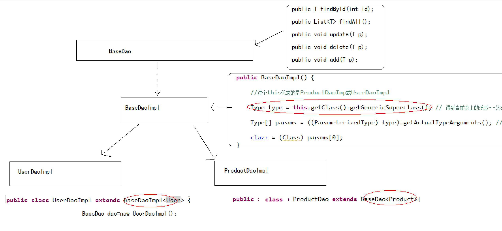

# 泛型反射

问题: BaseDaoImpl中，需要得到当前这个类上的泛型的Class对象，直接通过T.class这是不对的.

```java
public class BaseDaoImpl<T> implements BaseDao<T> {

    public T findById(int id) {

        // Session session=HibernateUtils.getSession();
        // session.get(T.class,id);

        return null;
    }
...
```

怎样得到当前这个类上的泛型的Class?



```java
private Class clazz;
public BaseDaoImpl(){}
    Type type = this.getClass().getGenericSuperclass();
    // 得到当前类上的泛型--父类型

    Type[] params = ((ParameterizedType) type).getActualTypeArguments(); // 得到当前类上所有的泛型类型Class

    clazz = (Class) params[0];
}
```

