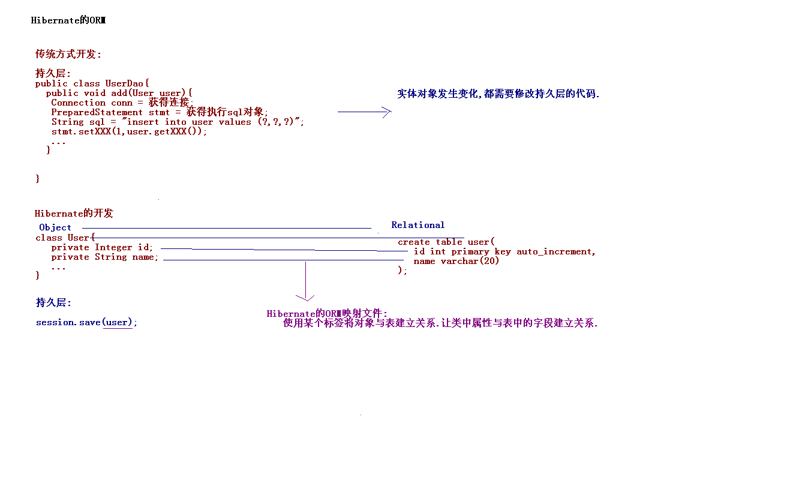
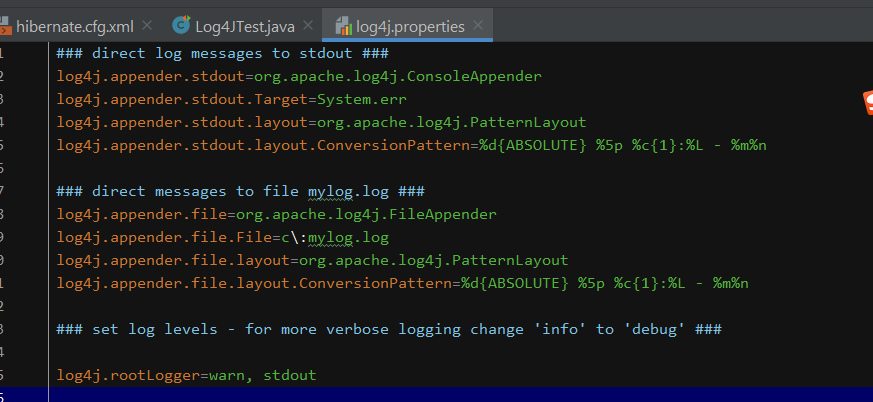
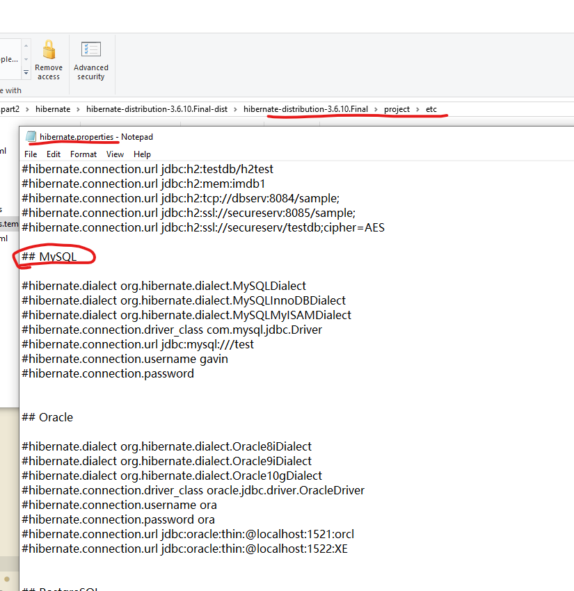
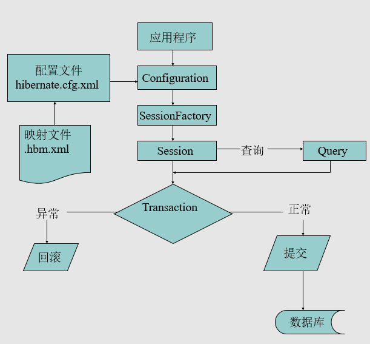
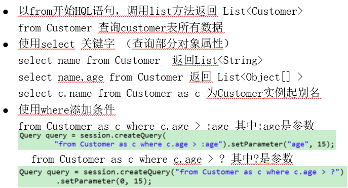

# Hibernate框架-1

[TOC]

## 1. Hibernate框架的概述

### 1.1 什么是Hibernate

Hibernate是一个开放源代码的**对象关系映射框架**，它对JDBC进行了非常轻量级的对象封装，可以随心所欲的使用对象编程思维来操纵数据库。 Hibernate可以应用在任何使用JDBC的场合，既可以在Java的客户端程序使用，也可以在Servlet/JSP的Web应用中使用

Hibernate是轻量级JavaEE应用的**持久层**解决方案，是一**个关系数据库ORM框架**.

* ORM: Object Relational Mapping.



常见的持久层框架:

* Hibernate
* JPA:JPA Java Persistence API.JPA通过JDK 5.0注解或XML描述对象－关系表的映射关系（只有接口规范）
* MyBatis:前身Ibatis.
* 企业开发两套架构:
* SSH:Struts2 + Spring + Hibernate
* SSI:SpringMVC + Spring + Ibatis
* DbUtils:

### 1.2 为什么要学习Hibernate

Hibernate对JDBC访问数据库的代码做了封装，大大简化了数据访问层繁琐的重复性代码 Hibernate是一个基于jdbc的主流持久化框架，是一个优秀的orm实现，它很大程度的简化了dao层编码工作 Hibernate使用java的反射机制，而不是字节码增强程序类实现透明性 Hibernate的性能非常好，因为它是一个轻量级框架。映射的灵活性很出色。它支持很多关系型数据库，从一对一到多对多的各种复杂关系.

### 1.3 Hibernate版本

Hibernate3.x版本 和 Hibernate4.x

* 企业中常用的还是Hibernate3.x.

## 2. Hibernate的日志记录

日志: 程序开发中的一些信息.

常用信息输出:System.out.println\(“”\);

这种方式不好: 如果输出内容比较多,项目已经开发完毕,不想使用输出.需要打开每个类,将输出的代码注释.

### Hibernate中使用slf4j技术

**SLF4J**， 即简单日志门面（Simple Logging Facade for Java），不是具体的日志解决方案，它只服务于各种各样的日志系统。

* 用于整合其他日志系统,\(在企业中常用的日志记录:log4j\)
* 是具体的日志记录方案.

### Log4J的日志级别

* fatal\(致命的\)
* error\(普通错误\)
* warn\(警告\)
* info\(信息\)
* debug\(调试\)
* trace\(堆栈信息\)

例：

Logger.error\(“错误信息”\); 将通过配置文件的形式,显示错误信息，如果配置的级别是info，那么比info级别高的错误都会报出来。



Log4J的三个组件:

记录器（Loggers）

* 格式:记录器 = 级别, 输出源1 , 输出源2
* log4j.rootLogger=info, stdout

输出源（Appenders）

* log4j.appender.stdout=org.apache.log4j.ConsoleAppender:控制台进行输出.
* log4j.appender.file=org.apache.log4j.FileAppender:向文件进行输出.

布局（Layouts）

* log4j.appender.stdout.layout=org.apache.log4j.PatternLayout
* log4j.appender.stdout.layout.ConversionPattern=%d{ABSOLUTE} %5p %c{1}:%L - %m%n

## 3. Hibernate的入门

### 3.1 Hibernate的入门

#### 第一步:下载Hibernate的开发包

[http://sourceforge.net/projects/hibernate/files/hibernate3](http://sourceforge.net/projects/hibernate/files/hibernate3)

#### 第二步:Hibernate框架目录结构

documentation:Hibernate文档 lib:Hibernate开发jar包

* bytecode:操作字节码jar包.
* jpa:Hibernate的实现jpa规范.
* optional:Hibernate的可选jar包.
* required:Hibernate的必须的jar包.

project:Hibernate提供的工程

#### 第三步:创建一个工程:\(Java工程\)

导入相应jar包:

* hibernate3.jar
* HIBERNATE\_HOME/lib/required/\*.jar
* HIBERNATE\_HOME/lib/jpa/hibernate-jpa-2.0-api-1.0.1.Final.jar
* 导入日志记录的包: log4j-1.2.16.jar，slf4j-log4j12-1.7.2.jar
* 导入数据库驱动

#### 第四步:创建表\(关系型数据库\)

```text
create table customer(
    id int primary key auto_increment,
    name varchar(20),
    age int
);
```

#### 第五步:创建一个实体类\(面向对象\)

```java
public class Customer {
    private int id;
    private String name;
    private int age;
    //get/set方法
    ...
}
```

#### 第六步:创建ORM的映射

映射文件只要是一个XML格式文件就可以,名字任意. 最好和实体类放在一个包下。

* 通常情况下**名称规范**: 实体类名称.hbm.xml

引入约束:

在核心jar包中 ：hibernate3.jar/org.hibernate.hibernate-mapping-3.0.dtd

```text
<!DOCTYPE hibernate-mapping PUBLIC
    "-//Hibernate/Hibernate Mapping DTD 3.0//EN"
    "http://www.hibernate.org/dtd/hibernate-mapping-3.0.dtd">
```

建立类与表的映射

```text
<hibernate-mapping>
<!-- 建立类与表的映射 -->
    <!-- class标签:用于映射类与表的关系 name :类的全路径(严格区分大小写)  table:表名称（不区分大小写） -->
    <class name="hibernate3.demo1.Customer" table="customer">
        <!-- 建立类中属性与表中的字段映射 -->

        <!-- 唯一标识 -->
        <!-- 使用id的标签 配置唯一属性 -->
        <!-- 在<id>标签中配置一个主键的生成策略. -->
        <id name="id" column="id">
            <generator class="native"/>
        </id>

        <!-- 普通属性 -->
        <!-- property标签:映射类中的普通属性 name:类中的属性名称, column:表中字段名称 -->
        <!-- 
        type:三种写法
        * Java类型        :java.lang.String
        * Hibernate类型    :string
        * SQL类型        :不能直接使用type属性,需要子标签<column>
        * <column name="name" sql-type="varchar(20)"/>
        -->
        <property name="name" column="name" type="string"/>
        <property name="age" column="age"/>
    </class>
</hibernate-mapping>
```

#### 第七步:创建一个Hibernate的核心配置文件

通知Hibernate连接是哪个数据库, 在src下创建一个hibernate.cfg.xml



```text
<hibernate-configuration>
    <session-factory>
    <!-- 必须去配置的属性 -->

        <!-- 配置数据库连接的基本信息: -->
        <property name="hibernate.connection.driver_class">com.mysql.jdbc.Driver</property>
        <property name="hibernate.connection.url">jdbc:mysql:///hibernate3_day01</property>
        <property name="hibernate.connection.username">root</property>
        <property name="hibernate.connection.password">123</property>

        <!-- Hibernate的方言 -->
        <!-- 生成底层SQL不同的 -->
        <property name="hibernate.dialect">
            org.hibernate.dialect.MySQLDialect
        </property>

    <!-- 可选的属性 -->

        <!-- 显示SQL -->
        <property name="hibernate.show_sql">true</property>
        <!-- 格式化SQL -->
        <property name="hibernate.format_sql">true</property>
        <!-- hbm:映射 to DDL: create drop alter -->
        <property name="hibernate.hbm2ddl.auto">update</property>

    <!-- 通知Hibernate加载那些映射文件 -->
        <mapping resource="hibernate3/demo1/User.hbm.xml"/>

    </session-factory>
</hibernate-configuration>
```

#### 第八步: 编写测试

1. 加载核心配置文件
2. 构建session工厂
3. 通过工厂创建Session
4. 开启事务
5. 操作
6. 提交事务
7. 释放资源

向数据库中插入一条记录

```java
import org.hibernate.Session;
import org.hibernate.SessionFactory;
import org.hibernate.Transaction;
import org.hibernate.cfg.Configuration;

@Test
// 向数据库中插入一条记录
public void demo1(){
    // 1.Hiberante框架加载核心配置文件(有数据库连接信息)
    Configuration configuration = new Configuration().configure();
    // 2.创建一个SessionFactory.(获得Session--相当连接对象)
    SessionFactory sessionFactory = configuration.buildSessionFactory();
    // 3.获得Session对象.
    Session session = sessionFactory.openSession();
    // 4.默认的情况下,事务是不自动提交.
    Transaction tx = session.beginTransaction();
    // 5.业务逻辑操作

    // 向数据库中插入一条记录:
    Customer customer = new Customer();
    customer.setName("任童");
    customer.setAge(28);

    session.save(customer);

    // 6.事务提交
    tx.commit();
    // 7.释放资源
    session.close();
    sessionFactory.close();
}
```

### 3.2 Hibernate的CRUD的操作



#### 保存记录

```java
session.save(customer);
```

#### 根据主键进行查询

```java
//-get方式
Customer customer = (Customer)session.get(Customer.class ,1);

//-load方式
Customer customer = (Customer)session.load(Customer.class,1);
```

**get 和load的区别:**

* 1.发送SQL的时机

```text
- load这个方法采用了一个技术.lazy延迟加载(懒加载).真正使用这个对象的数据的
   时候才会发送SQL.(这里对象的数据不包括使用主键).
- get这个方法是立即检索.当执行session.get()方法的时候,马上发送SQL语句查询.
```

* 2.返回的对象

```text
- load方法返回的是代理对象.
- get方法返回的是真实的对象.
```

* 3.查询一个不存在的数据

```text
- load方法抛异常:ObjectNotFoundException.
- get方法抛异常:NullPointException.
```

#### 修改记录

```java
session.update(customer);
```

修改有两种方式 :

1.手动创建对象的方式

```java
Customer customer = new Customer();
customer.setId(2);
customer.setName("张三");

session.update(customer);
```

这种方式，如果没有设置的属性, 就会将这个属性的默认值存入\(不好.\)


如int数据类型的age属性，默认值会是0，引起误解，所以在设计表格字段类型时，尽量选择包装类，不使用基本数据类型。


2.先查询在修改的方式\(推荐方式\)

```java
Customer customer = (Customer) session.get(Customer.class, 1);
customer.setName("李四");

session.update(customer);
```

#### 删除记录

```java
session.delete(customer);
```

删除记录有两种方式:

1.手动创建对象的方式

```java
Customer customer = new Customer();
customer.setId(2);

session.delete(customer);
```

2.先查询在删除的方式

```java
Customer customer = (Customer)session.get(Customer.class, 1);

session.delete(customer);
```

如果两个表格有相关联，想要将关联条目一并删除就需要使用先查询在删除的方式。

#### 查询所有

**1.HQL:Hibernate Query Language**

面向对象的写法

```java
Query query = session.createQuery("from Customer where name = ?");//这里的Customer是类名
query.setParameter(0, "张张");//(问号的位置，具体的值)
Query.list();
```

**2.QBC: Query By Criteria.\(条件查询\)**

```java
Criteria criteria = session.createCriteria(Customer.class);
criteria.add(Restrictions.eq("name", "晓明"));
List<Customer> list = criteria.list();
```

**3.SQL语句**

```java
SQLQuery query = session.createSQLQuery("select * from customer");//这里的customer是表名
List<Object[]> list = query.list(); //查询到的每条记录对应一个对象数组

SQLQuery query = session.createSQLQuery("select * from customer");
query.addEntity(Customer.class);
List<Customer> list = query.list(); //查询到的每条记录对应的是一个Customer对象
```

## 4. Hibernate的常用的配置

### 4.1 Hibernate的核心配置 - hibernate.cfg.xml

#### 核心配置有两种方式进行配置

**1\) 属性文件的配置**

* hibernate.properties
* 格式: key = value
* hibernate.connection.driver\_class = com.mysql.jdbc.Driver

  注意:这种方式没有办法在核心配置文件中加载映射文件.\(必须手动编码的方式进行加载.\)

**2\) XML格式文件配置**

* hibernate.cfg.xml
* 格式:&lt;property name="hibernate.connection.username"&gt;root&lt;/property&gt;

#### 核心配置内容

**1. 必须的配置**

连接数据库4个基本参数:

* hibernate.connection.driver\_class  连接数据库驱动程序
* hibernate.connection.url   连接数据库URL
* hibernate.connection.username  数据库用户名
* hibernate.connection.password   数据库密码

Hibernate的方言:

* hibernate.dialect   操作数据库方言

**2. 可选的配置**

* hibernate.show\_sql  true 在控制台上输出SQL语句
* hibernate.format\_sql  true  格式化控制台输出的SQL语句
* hibernate.connection.autocommit  true 事务是否自动提交
* hibernate.hbm2ddl.auto     create/create-drop/update/validate

```text
    create:每次执行的时候,创建一个新的表.(如果以前有该表,将该表删除重新创建.) 一般测试的时候的使用.
    create-drop:每次执行的时候,创建一个新的表,程序执行结束后将这个表,删除掉了.一般测试的时候使用.
    update:如果数据库中没有表,创建一个新的表,如果有了,直接使用这个表.可以更新表的结构.
    validate:会使用原有的表.完成校验.校验映射文件与表中配置的字段是否一致.不一致报错.
```

**3. 映射的配置**

* 在核心配置文件中加载映射文件: &lt;mapping resource="cn/itcast/hibernate3/demo1/Customer.hbm.xml" /&gt;
* 使用手动编码的方式进行加载

### 4.2 映射文件的配置 - 实体类名.hbm.xml

ORM: 对象和关系映射.

#### 配置Java对象与表映射

**1. 配置类与表的映射**

&lt;class name="hibernate3.demo1.Order" table=”orders"&gt;

* name:类的全路径
* table:表的名称:\(可以省略的.使用类的名称作为表名.\)

**2. 配置普通属性与字段映射**

&lt;property name="name" column="name" type="string" length=”20”/&gt;

* name 属性名
* column 字段名

type三种写法

* Java类型:java.lang.String
* Hibernate类型:string
* SQL类型:不能直接使用type属性,需要子标签&lt;column&gt;

```text
<property name="name">
    <column name="name" sql-type="varchar(20)" length="20"/>
</property>
```

**3. 配置唯一标识与主键映射**

* 一个表中只有一个主键的形式:

&lt;id name=”id” column=”id”&gt;

[生成策略](hibernate-1.md#主键的生成策略)

```text
 <id name="id" column="id">
    <generator class="native"/>
</id>
```

* 一个表对应多个主键形式:\(复合主键:\) ---了解.

由多个字段组合确定一条记录的唯一性

```text
<composite-id>
    <key-property>...
    <key-property>...
</composite-id>
```

实体类必须实现序列化接口 implements java.io.Serializable

**4. 关联关系**

**5. 命名SQL**

写在&lt;class&gt;&lt;/class&gt;标签外

```text
<query name="findAll">
    from Customer
</query>

<sql-query name="sqlFindAll">
    select * from customer
</sql-query>
```

## 5. Hibernate的核心API

### 5.1 Configuration:负责管理 Hibernate 的配置信息

#### 1. 加载核心配置文件

hibernate.properties

* 加载: Configuration configuration = new Configuration\(\);

hibernate.cfg.xml

* 加载: Configuration configuration = new Configuration\(\).configure\(\);

#### 2. 加载映射文件

第一种写法:

* configuration.addResource\("hibernate3/demo1/Customer.hbm.xml"\);

第二种写法: \(要求:映射文件名称要规范,类与映射在同一个包下\)

* configuration.addClass\(Customer.class\);

### 5.2 SessionFactory

* Configuration 对象根据当前的配置信息生成 SessionFactory对象
* SessionFactory 对象中保存了当前的数据库配置信息和所有映射关系以及预定义的SQL语句
* SessionFactory 对象是线程安全的
* SessionFactory 还负责维护Hibernate的二级缓存

SessionFactory对象根据数据库信息,**维护连接池**, 创建Session\(相当于Connection\)对象。

#### 抽取工具类

```java
public class HibernateUtils {

    private static Configuration configuration;
    private static SessionFactory sessionFactory;

    static{
        configuration = new Configuration().configure();
        sessionFactory = configuration.buildSessionFactory();
    }

    public static Session openSession(){
        return sessionFactory.openSession();
    }

    public static void main(String[] args) {
        openSession();
    }
}
```

#### 在Hibernate中使用c3p0连接池

* 引入c3p0的jar包
* 在核心配置hibernate.cfg.xml中添加一段配置

```java
<!-- C3P0连接池设定-->
<!-- 使用c3po连接池  配置连接池提供的供应商-->
<property name="connection.provider_class">
    org.hibernateconnectionC3P0ConnectionProvider
</property>

<!--在连接池中可用的数据库连接的最少数目 -->
<property name="c3p0.min_size">5</property>

<!--在连接池中所有数据库连接的最大数目  -->
<property name="c3p0.max_size">20</property>

<!--设定数据库连接的过期时间,以秒为单位,
如果连接池中的某个数据库连接处于空闲状态的时间超过了timeout时间,就会从连接池中清除 -->

<property name="c3p0.timeout">120</property>
 <!--每3000秒检查所有连接池中的空闲连接 以秒为单位-->

<property name="c3p0.idle_test_period">3000</property>
```

### 5.3 Session

相当于 JDBC的 Connection

Session 是应用程序与数据库之间交互操作的一个单线程对象，是 Hibernate 运作的中心 Session是线程不安全的 所有持久化对象必须在 session 的管理下才可以进行持久化操作 Session 对象有一个一级缓存，显式执行 flush 之前，所有的持久化操作的数据都缓存在 session 对象处 持久化类与 Session 关联起来后就具有了持久化的能力 Session维护了Hiberante一级缓存.

Session的方法：

* save\(\)/persist\(\) : 添加.
* update\(\) : 修改
* saveOrUpdate\(\) : 增加和修改对象
* delete\(\) : 删除对象
* get\(\)/load\(\) : [根据主键查询](hibernate-1.md#根据主键进行查询)
* createQuery\(\) : 创建一个Query接口, 编写HQL语句
* createSQLQuery\(\) : 创建一个SQLQuery接口, 编写SQL语句数据库操作对象
* createCriteria\(\) : 返回一个Criteria接口. 条件查询

### 5.4 Transaction 事务

开启事务

```java
Transaction tx = session.beginTransaction();
```

常用方法:

* commit\(\) : 提交相关联的session实例
* rollback\(\) : 撤销事务操作
* wasCommitted\(\) : 检查事务是否提交


如果没有开启事务，那么Session的每次操作，都相当于一个独立的事务。如果没有提交，session关闭的时候，默认回滚。 事务是否自动提交在核心配置里设置，设置了自动提交，在这种情况下，session的操作会生效。


### 5.5 Query

[查询操作另见](hibernate-1.md#查询所有)

Query代表面向对象的一个Hibernate查询操作，session.createQuery 接受一个HQL语句。

HQL是Hibernate Query Language缩写， 语法很像SQL语法，但是完全面向对象的。

```java
// 1.简单查询
List<Customer> list = session.createQuery("from Customer").list();

// 2.条件查询:
List<Customer> list = session.createQuery("from Customer where name = ?")
    .setParameter(0, "lisi").list();

// 3.分页查询:select * from customer limit a,b; a:从哪开始  b:每页显示记录数.
Query query = session.createQuery("from Customer");
query.setFirstResult(3);
query.setMaxResults(3);`
```



### 5.6 Criteria

```java
// 1.简单查询
List<Customer> list = session.createCriteria(Customer.class).list();

// 2.条件查询:
Criteria criteria = session.createCriteria(Customer.class);
criteria.add(Restrictions.eq("name","wangwu"));
List<Customer> list = criteria.list();

// 3.分页查询:
Criteria criteria = session.createCriteria(Customer.class);
criteria.setFirstResult(3);
criteria.setMaxResults(3);
List<Customer> list = criteria.list();
```

## 6. Hibernate中的持久化类

持久化类: 实体类 + 映射文件

### 6.1 持久化类编写规范

* 提供一个无参数 public访问控制符的构造器: 用到反射.
* 提供一个标识属性，映射数据表主键字段

```text
    * java区分两个对象是否是同一个使用 地址.
    * 数据库区分两条记录是否一致:使用  主键.
    * Hibernate中区分持久化对象是否是同一个, 根据唯一标识:
```

* 所有属性提供public访问控制符的 set/get 方法 : 框架中存值和取值的时候使用.
* 标识属性应尽量使用基本数据类型的**包装类型**

```text
    * 使用基本数据类型:
    * 成绩表:
        学号    姓名    成绩
        1       张三    null
    成绩位置，如果显示0会出现误解，用Integer类型，没成绩会显示null。
```

* 持久化类尽量不要使用final进行修饰, 用final修饰的类是不能被继承.无法生成代理对象. \(延迟加载的时候返回代理对象.延迟加载就失效.\)

### 6.2 建表的时候自然主键和代理主键

自然主键:

* 创建一个人员表.人员表中某条记录唯一确定.人都有身份证号.我们可以使用身份证号作为主键.\(身份证号本身就是人员的一个属性.作为主键.\)

代理主键:

* 创建一个人员表.人员表中某条记录唯一确定.但是没有使用身份证号作为主键,新建字段\(用新建的字段作为主键.只是一个标识作用.\)

在关系数据库中，用主键来识别记录并保证每条记录的唯一性。所以作为主键的字段必须非空，不能重复且不应该被改变。自然主键，作为记录的属性之一，如果参与业务逻辑，就需要被改变，所以应该使用代理主键。


尽量要Hibernate自己去维护主键


#### 主键的生成策略

设置映射文件配置中generator标签的class属性：

```text
<id name="id" column="id">
    <generator class="native"/>
</id>
```

increment: 自动增长. 适合 short int long... 不是使用数据库的自动增长机制.使用Hibernate框架提供的自动增长方式.

* 在增加记录时，会先查询最大的id值 select max\(id\) from 表; 在最大值的基础上+1.\(多线程的问题.主键重复\) 在集群下不要使用

identity: 自动增长. 适合 short int long... 采用数据库的自动增长机制. 不适合于Oracle数据库.

sequence: 序列. 适用于 short int long ... 应用在Oracle上 .

uuid: 适用于**字符串类型**的主键. 采用随机的字符串作为主键.

native: 本地策略. 底层数据库不同. 自动选择适用identity 还是 sequence.

assigned: Hibernate框架不维护主键, 主键由程序自动生成.

foreign: 主键的外来的. \(应用在多表一对一的关系.\)

#### 扩展：复合主键

[另见](hibernate-1.md#配置唯一标识与主键映射)

