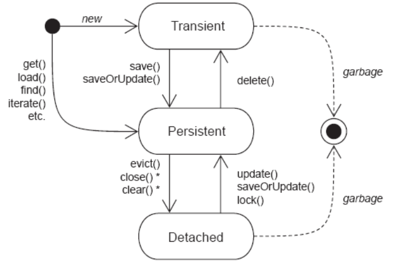
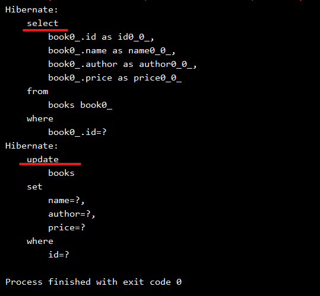
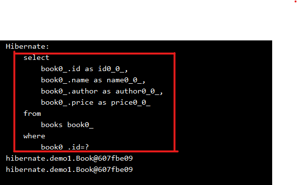
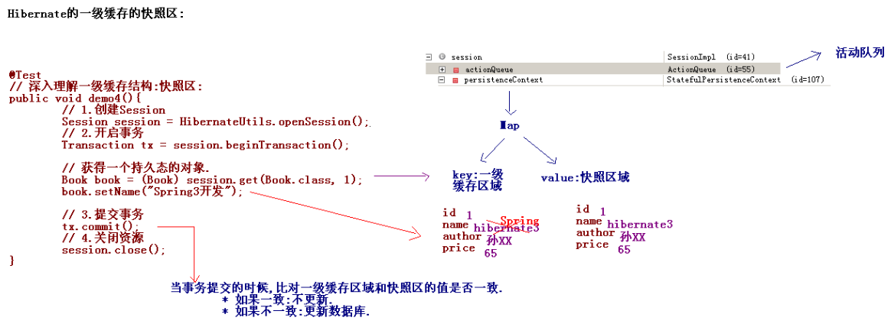
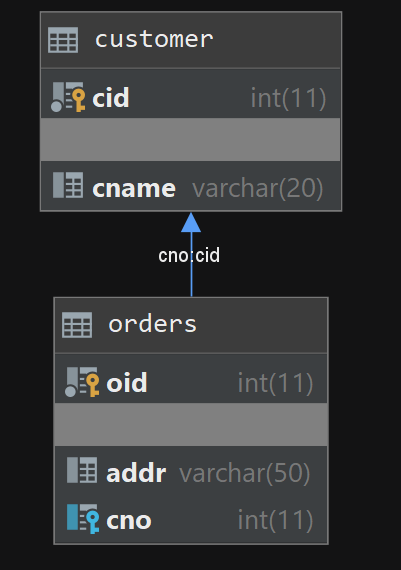

# Hibernate框架-2

[TOC]

## 1. Hibernate的持久化类状态

### 1.1 Hibernate的持久化类状态

持久化类:就是一个实体类 与 数据库表建立了映射.

Hibernate为了方便管理持久化类,将持久化类分成了三种状态:

* 瞬时态 transient (临时态)
* 持久态 persistent
* 脱管态 detached (离线态)

### 1.2 三种持久化对象的状态

Transient瞬时态:
特点:持久化对象没有唯一标识OID. 没有纳入Session的管理.

Persistent持久态:
特点:持久化对象有唯一标识OID. 已经纳入到Session的管理.

* 持久化持久态对象有自动更新数据库的能力.

Detached脱管态:
特点:持久化对象有唯一标识OID, 没有纳入到Session管理.

### 1.3 区分三种持久化对象的状态

```java

@Test
// 区分持久化对象的三种状态:
public void demo1(){
    // 1.创建Session
    Session session = HibernateUtils.openSession();
    // 2.开启事务
    Transaction tx = session.beginTransaction();

    // 向数据库中保存一本图书:
    Book book = new Book();// 瞬时态:没有唯一标识OID,没有与session关联.
    book.setName("Hiernate开发");
    book.setAuthor("孙XX");
    book.setPrice(65d);

    session.save(book); // 持久态:有唯一标识OID,与session关联.

    // 3.事务提交
    tx.commit();
    // 4.释放资源
    session.close();

    book.setName("Struts2开发"); // 脱管态:有唯一的标识,没有与session关联.修改不了
}
```

### 1.4 三种状态对象转换



瞬时态:

* 获得: Book book = new Book();

瞬时--->持久

* save(book);
* save()/saveOrUpdate();

瞬时--->脱管：

* book.setId(1);

持久态:

* 获得: Book book = (Book)session.get(Book.class,1);
* get()/load()/find()/iterate();

持久--->瞬时:

* delete(book);
* 特殊状态: 删除态. (被删除的对象,不建议去使用.)

持久--->脱管:

* session.close();
* close()/clear()/evict();  

脱管态:

* 获得: Book book = new Book(); book.setId(1);（不建议直接获得）

脱管--->持久:

* session.update();
* update()/saveOrUpdate()/lock()

脱管--->瞬时:

* book.setId(null);

### 1.5 持久态对象有自动更新数据库的能力

```java
@Test
// 测试持久态的对象自动更新数据库
public void demo2(){
    // 1.创建Session
    Session session = HibernateUtils.openSession();
    // 2.开启事务
    Transaction tx = session.beginTransaction();

    // 获得一个持久态的对象.
    Book book = (Book) session.get(Book.class, 1);
    book.setName("Struts2开发");

    //session.update(book);//不用写这句，自动完成数据库的更新

    // 3.提交事务
    tx.commit();
    // 4.关闭资源
    session.close();
}
```



自动更新数据库的能力依赖了Hibernate的一级缓存.

## 2. Hibernate的一级缓存(重要)

### 2.1 Hibernate的一级缓存

缓存技术是Hibernate的一个优化的手段.

Hibernate分成两个基本的缓存:

* 一级缓存: Session级别的缓存.一级缓存与session的生命周期一致.自带的.不可卸载.
* 二级缓存: SessionFactory级别的缓存.不是自带的.

在 Session 接口的实现中包含一系列的 Java 集合, 这些 Java 集合构成了 Session 缓存. 只要 Session 实例没有结束生命周期, 存放在它缓存中的对象也不会结束生命周期.

### 2.2 证明Hibernate的一级缓存的存在

```java
@Test
// 证明一级缓存的存在
public void demo3(){
    // 1.创建Session
    Session session = HibernateUtils.openSession();
    // 2.开启事务
    Transaction tx = session.beginTransaction();

    // save方法可以向一级缓存中存放数据的.
    /*Book book = new Book();
    book.setName("JQuery开发");
    book.setAuthor("张XX");
    book.setPrice(45d);

    Integer id = (Integer) session.save(book);

    Book book2 = (Book) session.get(Book.class, id);//不会发送SQL查询，记录在缓存中

    System.out.println(book2);*/

    // 分别用get执行两次查询.
    Book book1 = (Book) session.get(Book.class, 1);// 马上发生SQL去查询
    System.out.println(book1);

    Book book2 = (Book) session.get(Book.class, 1);// 不发生SQL,因为使用一级缓存的数据
    System.out.println(book2);

    // 3.提交事务
    tx.commit();
    // 4.关闭资源
    session.close();
}
```



### 2.3 深入理解一级缓存中快照区

```java
@Test
// 深入理解一级缓存结构:快照区:
public void demo4(){
    // 1.创建Session
    Session session = HibernateUtils.openSession();
    // 2.开启事务
    Transaction tx = session.beginTransaction();

    // 获得一个持久态的对象.
    Book book = (Book) session.get(Book.class, 1);
    book.setName("Spring3开发");

    // 3.提交事务
    tx.commit();
    // 4.关闭资源
    session.close();
}
```

这段程序运行两次，第二次运行时数据是一样的，于是就不会执行第二遍sql



**结论**: 向一级缓存存入数据的时候,放入一级缓存区和一级缓存快照区,当更新了一级缓存的数据的时候,事务一旦提交,比对一级缓存和快照区,如果数据一致,不更新,如果数据不一致,自动更新数据库。

### 2.4 Hibernate管理一级缓存

一级缓存是与session的生命周期相关的. session生命周期结束,一级缓存销毁了.

* clear(): 清空一级缓存中所有的对象.
* evict(Object obj): 清空一级缓存中某个对象.
* flush(): 刷出缓存. 可以控制set新的数据之后，update语句发出的时间
* refresh(Object obj): 将快照区的数据重新覆盖了一级缓存的数据. set新的数据后，在事务提交前，refresh会用快照区数据重新覆盖一级缓存区的数据，结果就是没改。

### 2.5 Hibernate一级缓存的刷出时机:(了解.)

FlushMode 常量:

```java
Session session = HibernateUtils.openSession();
session.setFlushMode(FlushMode.COMMIT);
Transaction tx = session.beginTransaction();
```

* ALWAYS : 每次查询的时候都会刷出.手动调用flush.事务提交的时候.
* AUTO : 默认值.有些查询会刷出.手动调用flush.事务提交的时候.
* COMMIT : 在事务提交的时候,手动调用flush的时候.
* MANUAL : 只有在手动调用flush才会刷出.

严格程度: MANUAL > COMMIT > AUTO > ALWAYS

## 3. 操作持久化对象的方法

### save()

保存一条记录:将瞬时态对象转成持久态对象. 主键根据主键生成策略生成

### update()

更新一条记录: 将脱管态对象转成持久态对象。
通过setId变成脱管态，再通过update转为持久态。

在&lt;class&gt;标签上设置select-before-update="true" 在更新之前先去查询

### saveOrUpdate()

根据对象状态的不同执行不同的save获得update方法.

* 如果对象是一个瞬时态对象: 执行save操作.
* 如果对象是一个脱管态对象: 执行update操作.
* 设置id数据库中不存在, 就会报错, 可以在&lt;id&gt;上设置一个unsaved-value=”-1”, 这个数为刚才找不到的id，就会将这条数据作为没有存过的数据执行save的操作加一条.

### delete()

将持久态对象转成瞬时态.

### get()/load()

获得一个持久态对象.

## 4. Hibernate关联关系的映射

### 4.1 实体之间的关系

实体之间有三种关系:

**一对多**: 一个用户,生成多个订单,每一个订单只能属于一个用户.

* 建表原则: 在多的一方创建一个字段, 作为外键, 指向一的一方的主键.

**多对多**: 一个学生可以选择多门课程, 一个课程可以被多个学生选择.

* 建表原则: 创建第三张表,中间表至少有两个字段, 分别作为外键指向多对多双方主键.

**一对一**: (特殊.最少.) 一个公司只能有一个注册地址,一个注册地址,只能被一个公司使用.(否则将两个表建到一个表.)

* 建表原则:

1. 唯一外键: 一对一的双方,假设一方是多的关系.需要在多的一方创建一个字段,作为外键.指向一的一方的主键.但是在外键添加一个unique，不能出现重复值.
2. 主键对应: 一对一的双方,通过主键进行关联.

### 4.2 Hibernate中一对多的配置

#### 第一步: 创建两个实体

* 客户实体:

```java
public class Customer {
    private Integer cid;
    private String cname;
    // 一个客户有多个订单.
    private Set<Order> orders = new HashSet<Order>();
    ...
    //get/set方法
}
```

在Hibernate实体类中一般用set集合，set集合不重复。

* 订单实体:

```java
public class Order {
    private Integer oid;
    private String addr;
    // 订单属于某一个客户.放置一个客户的对象.
    private Customer customer;
    ...
    //get/set方法
}
```

#### 第二步: 建立映射

* Customer.hbm.xml

```markdown
<hibernate-mapping>
    <class name="cn.itcast.hibernate3.demo2.Customer" table="customer">
        <!-- 配置唯一标识 -->
        <id name="cid" column="cid">
            <generator class="native"/>
        </id>
        <!-- 配置普通属性 -->
        <property name="cname" column="cname" length="20"/>

        <!-- 建立映射 -->
        <!-- 配置一个集合 <set>的name Customer对象中的关联对象的属性名称. -->
        <set name="orders">
            <!-- <key>标签中column:用来描述一对多多的一方的外键的名称. -->
            <key column="cno"></key>
            <!-- 配置一个<one-to-many>标签中class属性:订单的类的全路径 -->
            <one-to-many class="cn.itcast.hibernate3.demo2.Order"/>
        </set>
    </class>
</hibernate-mapping>
```

* Order.hbm.xml

```markdown
<hibernate-mapping>
    <class name="cn.itcast.hibernate3.demo2.Order" table="orders">//这里表名是Orders
    <!-- 配置唯一标识  -->
        <id name="oid" column="oid">
            <generator class="native"/>
        </id>
        <!-- 配置普通属性 -->
        <property name="addr" column="addr" length="50"/>
        <!-- 配置映射 -->
        <!-- 
        <many-to-one>标签
        name 	:关联对象的属性的名称.
        column	:表中的外键名称.
        class	:关联对象类的全路径
        -->
        <many-to-one name="customer" column="cno" class="cn.itcast.hibernate3.demo2.Customer"/>
    </class>
</hibernate-mapping>
```

在多的一方配置many-to-one标签

* name: Order对象中关联对象的属性的名称.
* column: 表中的外键名称.
* class: 关联对象类的全路径.

在一的一方配置一个集合 &lt;set&gt;

* name：Customer对象中的关联对象的属性名称orders
* &lt;key&gt;标签中column: 用来描述一对多多的一方的外键的名称.要和另外一个表配置的外键名称一致。

再配置一个one-to-many标签

* class属性: 多的一方实体类的类的全路径

#### 第三步: 将映射放到核心配置文件中



### 4.3 Hibernate中级联保存的效果

级联:操作当前对象的时候, 关联的对象如何处理.

cascade=”save-update”

级联方向性:

* 保存客户的时候,选择级联订单.
* 保存订单的时候,选择级联客户.

### 4.4 Hibernate中级联删除的效果

cascade=”delete”

### 4.5 Hibernate中的级联取值

none:不使用级联
dave-update:保存或更新的时候级联
delete:删除的时候级联
all:除了孤儿删除以外的所有级联.
delete-orphan:孤儿删除(孤子删除).

* 仅限于一对多.只有一对多时候,才有父子存在.认为一的一方是父亲,多的一方是子方.
* 当一个客户与某个订单解除了关系.将外键置为null.订单没有了所属客户,相当于一个孩子没有了父亲.将这种记录就删除了.

all-delete-orphan:包含了孤儿删除的所有的级联.

### 4.6 双向维护产生多余的SQL

配置inverse=”true”:在那一端配置.那么那一端放弃了外键的维护权.

* 一般情况下,一的一方去放弃.

cascade:操作关联对象.
inverse:控制外键的维护.

### 4.7 Hibernate的多对多的配置

#### 第一步: 创建实体类

学生的实体

```java
public class Student {
    private Integer sid;
    private String sname;
    // 一个学生选择多门课程:
    private Set<Course> courses = new HashSet<Course>();
   ...
    //get/set方法
}
```

课程的实体:

```java
public class Course {
    private Integer cid;
    private String cname;
    // 一个课程被多个学生选择:
    private Set<Student> students = new HashSet<Student>();
    ...
    //get/set方法
}
```

#### 第二步： 建立映射

* Student.hbm.xml

```markdown
<hibernate-mapping>
    <class name="cn.itcast.hibernate3.demo3.Student" table="student">
        <!-- 配置唯一标识 -->
        <id name="sid" column="sid">
        <   generator class="native"/>
        </id>
        <!-- 配置普通属性 -->
        <property name="sname" column="sname" length="20"/>

        <!-- 配置关联映射 -->
        <!-- <set>标签 name:对应学生中的课程集合的名称   table:中间表名称. -->
        <set name="courses" table="stu_cour">
        <!-- <key>中column写 当前类在中间表的外键.-->
            <key column="sno"></key>
        <!-- <many-to-many>中class:另一方类的全路径. column:另一方在中间表中外键名称-->
            <many-to-many class="cn.itcast.hibernate3.demo3.Course" column="cno"/>
        </set>
    </class>
</hibernate-mapping>
```

* Course.hbm.xml

```markdown
<hibernate-mapping>
    <class name="cn.itcast.hibernate3.demo3.Course" table="course">
        <!-- 配置唯一标识 -->
        <id name="cid" column="cid">
            <generator class="native"/>
        </id>
        <!-- 配置普通属性 -->
        <property name="cname" column="cname" length="20"/>
        <!-- 配置与学生关联映射 -->
        <!-- <set>中name:对应当前类中的学生的集合的名称  table:中间表的名称-->
        <set name="students" table="stu_cour">
        <!-- <key>中column:当前类在中间表中外键 -->
            <key column="cno"></key>
        <!-- <many-to-many>中class:另一方的类全路径. column:另一方在中间表中外键名称 -->
            <many-to-many class="cn.itcast.hibernate3.demo3.Student" column="sno"/>
        </set>
    </class>
</hibernate-mapping>
```

#### 第三步: 将映射文件加入到核心配置文件中
