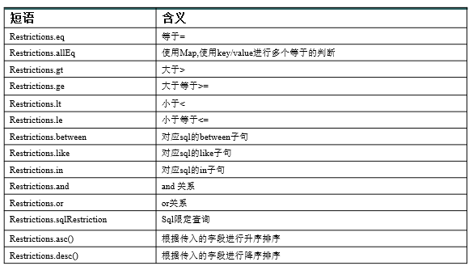
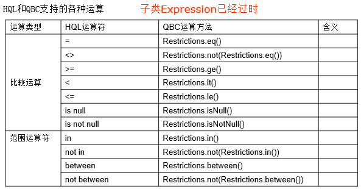
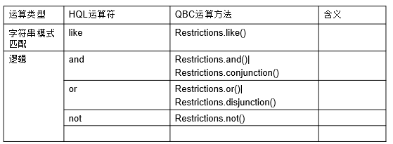
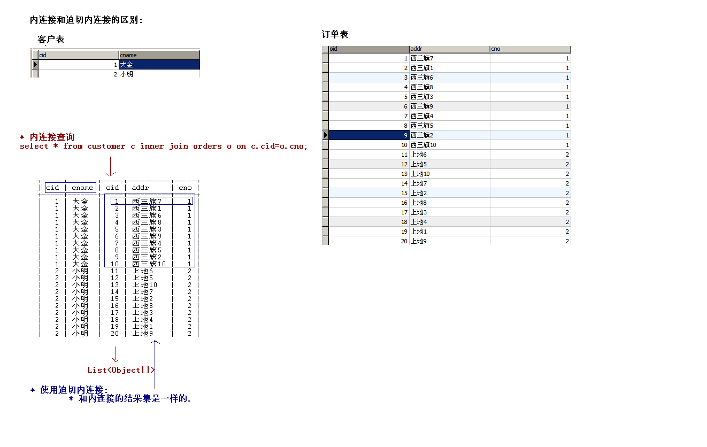
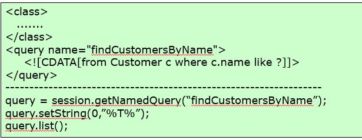
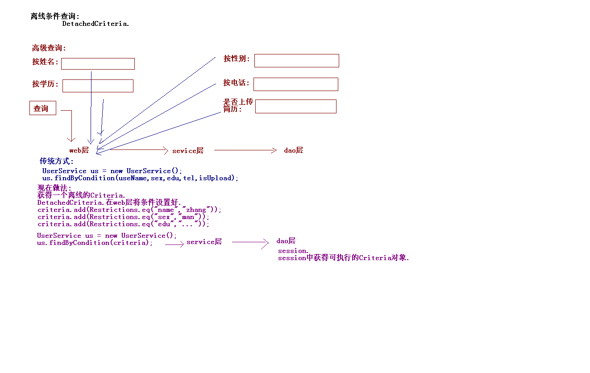
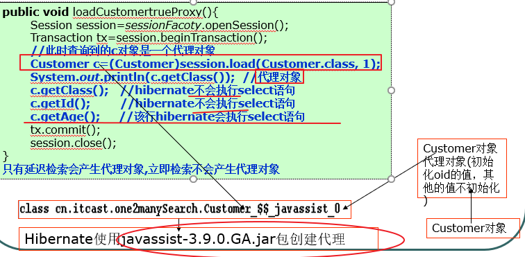
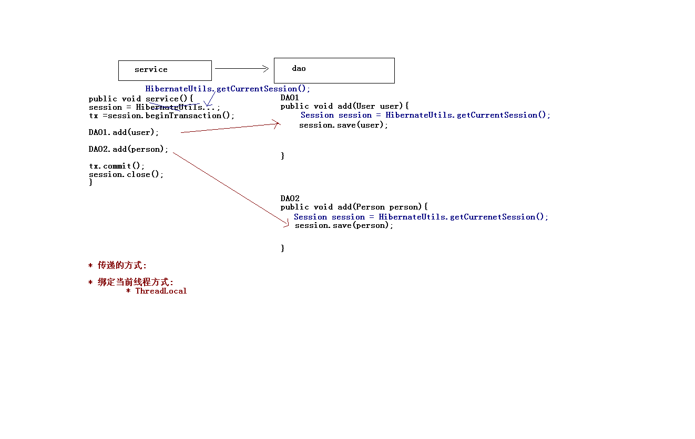

# Hibernate框架-3

\[TOC\]

## 1. Hibernate的检索方式

### 1.1 检索方式,查询的方式

#### A. 导航对象图检索方式

根据已经加载的对象导航到其他对象

* Customer customer = \(Customer\)session.get\(Customer.class,1\);
* customer.getOrders\(\); // 获得到客户的订单

#### B. OID 检索方式

按照对象的 OID 来检索对象

* get\(\)/load\(\); 方法进行检索.

#### C. HQL 检索方式

使用面向对象的 HQL 查询语言

* Query query = session.createQuery\(“HQL”\);

#### D. QBC 检索方式

使用 QBC\(Query By Criteria\) API 来检索对象. 这种 API 封装了基于字符串形式的查询语句, 提供了更加面向对象的查询接口.

* Criteria criteria = session.createCriteria\(Customer.class\);

#### E. 本地 SQL 检索方式: 使用本地数据库的 SQL 查询语句

* SQLQuery query = session.createSQLQuery\(“SQL”\);

### 1.2 HQL

HQL: Hibernate Query Language:

特点:

* 面向对象的查询
* 支持**方法链编程**

使用:

通过 Session 的 createQuery\(\) 方法创建一个 Query 对象, 它包括一个 HQL 查询语句. HQL 查询语句中可以包含命名参数.

调用 Query 的 list\(\) 方法执行查询语句. 在 List 集合中存放了符合查询条件的持久化对象

#### 1. HQL查询所有记录

```java
List<Customer> list = session.createQuery("from Customer").list();//Customer是类名
for (Customer customer : list) {
    System.out.println(customer);
}
```

#### 2. 查询使用别名

使用别名，不带参数，可以省略as

```java
List<Customer> list =
session.createQuery("from Customer  c").list();
```

使用别名:带参数

```java
List<Customer> list =
session.createQuery("from Customer as c where c.cname = ?")
.setString(0, "小沈").list();
```

```java
// HQL不支持 select * from Customer写法.
//可以写成 select 别名 from Customer as 别名;
List<Customer> list = session.createQuery("select c from Customer c").list();
```

#### 3. 排序

采用 ORDER BY 关键字对查询结果排序

```java
List<Customer> list = session.createQuery(
"from Customer c order by c.id desc").list();
```

#### 4. 分页查询

```java
Query query = session.createQuery("from Order");
query.setFirstResult(20);
query.setMaxResults(10);//21-30
List<Order> list = query.list();
```

#### 5. 单个对象查询

```java
Customer customer = (Customer) session
.createQuery("from Customer where cname = ?")
.setString(0, "小明").uniqueResult();
```

#### 6. 参数绑定

setParameter\(\): 绑定任意类型的参数.该方法的第三个参数显式指定 Hibernate 映射类型

* 使用?号方式绑定

```java
Query query = session.createQuery("from Customer where cname = ? and cid =?");
query.setString(0, "小沈");
query.setInteger(1,3);
List<Customer> list = query.list();
```

* 使用名称的方式绑定

```java
Query query = session.createQuery("from Customer where cname=:name and cid=:id");
query.setString("name", "小沈");
query.setInteger("id", 3);
List<Customer> list = query.list();
```

* 绑定实体setEntity\(\)

得到某一客户的所有订单

```java
List<Order> list = session
.createQuery("from Order o where o.customer = ?")
.setEntity(0, customer).list();
```

#### 7. 投影操作

查询结果仅包含实体的部分属性. 通过 SELECT 关键字实现

查询客户的名称 需要用select关键字，使用别名

```java
List<Object> list = session.createQuery(
"select c.cname from Customer c").list();

List<Object[]> list = session.createQuery(
"select c.cid,c.cname from Customer c").list();
```

把查询到的客户名称封装成客户对象，需要在Customer类中提供构造方法，无参构造也必须要写。

```java
List<Customer> list = session.createQuery(
"select new Customer(cname) from Customer").list();
```

#### 8. 模糊查询

```java
Query query = session.createQuery("from Customer where cname like ?");
query.setParameter(0, "小%");
List<Customer> list = query.list();
```

#### 9. 聚集函数，HAVING，GROUPBY

与 SQL 一样, HQL 利用 GROUP BY 关键字对数据分组, 用 HAVING 关键字对分组数据设定约束条件. 在 HQL 查询语句中可以调用以下聚集函数

* count\(\)
* min\(\)
* max\(\)
* sum\(\)
* avg\(\)

### 1.3 QBC

#### 1. QBC查询所有记录

```java
List<Customer> list =
session.createCriteria(Customer.class).list();
for (Customer customer : list) {
    System.out.println(customer);
}
```

#### 2. 排序

```java
List<Customer> list =
session.createCriteria(Customer.class)
.addOrder(org.hibernate.criterion.Order.asc("id")).list();
```

#### 3. 分页

```java
Criteria criteria =
session.createCriteria(Order.class);
criteria.setFirstResult(10);
criteria.setMaxResults(10);
List<Order> list = criteria.list();
```

#### 4. 获取单个对象

```java
Customer customer =
(Customer) session.createCriteria(Customer.class)
.add(Restrictions.eq("cname", "小明")).uniqueResult();
```

#### 5. 带参数的查询

```java
List<Customer> list =
session.createCriteria(Customer.class)
.add(Restrictions.eq("cname", "小明"))
.add(Restrictions.eq("cid", 2)).list();
```

#### 6. 投影查询

```java
List list = session.createCriteria(Customer.class).setProjection(Projections.projectionList()
.add(Property.forName("name"))
.add(Property.forName("city"))).list();
```

#### 7. 模糊查询

```java
Criteria criteria =
session.createCriteria(Customer.class);
criteria.add(Restrictions.like("cname", "大%"));
List<Customer> list = criteria.list();
```







### 1.4 SQL

#### 1. SQL查询所有记录

```java
List<Object[]> list = session.createSQLQuery("select * from customer").list();
for (Object[] objects : list) {
    System.out.println(Arrays.toString(objects));
}
```

封装到实体对象中

```java
List<Customer> list = session.createSQLQuery("select * from customer").addEntity(Customer.class).list();
for (Customer customer : list) {
    System.out.println(customer);
}
```

### 1.5 多表查询

#### SQL多表查询

连接:

* 交叉连接: select \* from A,B;
* 内连接: 查询的是两个表的交集 select \* from A inner join B on A.字段 = B.字段;
* 隐式内连接: select \* from A,B where A.字段 = B.字段;

外连接:

* 左外连接: select \* from A left outer join B on  A.字段 = B.字段;
* 右外连接: select \* from A right outer join B on A.字段 = B.字段;

#### HQL多表的查询

连接

* 交叉连接
* 内连接

Query query = session.createQuery\("from Customer c inner join c.orders"\);

* 隐式内连接
* 迫切内连接

Query query = session.createQuery\("from Customer c inner join fetch c.orders"\);

* 左外连接
* 迫切左外连接
* 右外连接

HQL的内连接和迫切内连接区别:



* 内连接查询 : 将数据封装一个List&lt;Object\[\]&gt;中,是对象数组\[Customer对象，Order对象\].
* 迫切内连接 : 将数据封装一个List&lt;Customer&gt;中，Order对象被封装在Customer对象中的订单集合中，每查询一次就会有一个Customer对象，所以会有重复记录, 需要使用distinct排重.

Query query = session.createQuery\("select distinct c from Customer c inner join fetch c.orders"\);

这样的查询结果就会是三个不重复的Customer对象。

### 1.6 命名查询



&lt;sql-query&gt;标签内写sql语句，&lt;query&gt;标签内写HQL语句

### 1.7  离线条件查询



在web层获取一个离线的Criteria对象，设置查询对象，再传入service层和dao层

```java
//获取一个离线的Criteria对象
DetachedCriteria criteria = DetachedCriteria.forClass(Customer.class);
//设置查询条件
criteria.add(Restrictions.eq("city", "beijing"));

//session获得criteria对象
List<Customer> customers =
         criteria.getExecutableCriteria(session).list();
System.out.println(customers);
```

## 2. Hibernate的抓取策略Fetching Strategies

Query 的 list 方法会忽略映射文件配置的迫切左外连接检索策略, 而采用延迟检索或立即检索策略，根据customer类级别的lazy属性

## 2.1 延迟和立即检索

立即检索:

* 当执行某行代码的时候,马上发出SQL语句进行查询.
* get\(\)

延迟检索:

* 当执行某行代码的时候,不会马上发出SQL语句进行查询.当真正使用这个对象的时候才会发送SQL语句.
* load\(\);

什么情况下延迟检索会失效？

* 持久化类如果设置为final，不能生成代理对象。延迟检索就失效了。
* 在Customer.hbm.xml中配置lazy=false

```java
Customer c=(Customer)session.load(Customer.class, 1);//代理对象
Hibernate.initialize(c);//初始化代理对象发送sql语句
```



## 2.2 类级别检索和关联级别检索

* 查询某个对象的时候, 是否需要查询关联对象?
* 查询关联对象的时候是否采用延迟检索?

### 类级别的检索

Customer c=\(Customer\)session.load\(Customer.class, 1\); session的方法直接检索Customer对象, 对Customer对象到底采用立即检索还是延迟检索方式

类级别可选的检索策略包括立即检索和延迟检索, 默认为延迟检索

* &lt;class&gt;标签上配置lazy

### 关联级别的检索

Customer c=\(Customer\)session.load\(Customer.class, 1\); session.load\(Customer.class, 1\);查询的主体表 c.getOrders\(\).size\(\);查询客体表的集合大小

查询客体表是否发生, 以何种方式发生\(立即检索、延迟检索和迫切左外连接检索\)，就是关联级别检索

* 通过&lt;set&gt;/&lt;many-to-one&gt;上面的lazy进行设置.

### 关联级别的检索策略

#### 从一的一方关联多的一方

在映射文件中, 用&lt;set&gt;元素来配置一对多关联及多对多关联关系. &lt;set&gt;元素有 lazy 和 fetch 属性

**fetch**: 控制sql语句的类型

* join: 发送迫切左外连接的SQL查询关联对象. **如果fetch是join的情况, lazy属性将会忽略.**
* select : 默认值, 发送多条SQL查询关联对象.
* subselect: 发送子查询查询关联对象.\(需要使用Query接口测试\) 体现在查询多个一的对象的时候

**lazy**: 控制关联对象的检索是否采用延迟.

* true: 默认值, 查询关联对象的时候使用延迟检索
* false: 查询关联对象的时候不使用延迟检索.
* extra: 及其懒惰.

```text
c.getOrders().size()  执行 select count(id) from orders where customer_id =?

for(Order o:set){ o.getOrderNumber();} 将执行:
select customer_id , id,order_number ,price from orders  where customer_id=?
```

#### 在多的一方关联一的一方

&lt;many-to-one&gt;

fetch:控制SQL语句发送格式

* join:发送一个迫切左外连接查询关联对象.fetch=”join”,lazy属性会被忽略.
* select:发送多条SQL检索关联对象.

lazy:关联对象检索的时候,是否采用延迟

* false :不延迟
* proxy :使用代理.检索订单额时候,是否马上检索客户 由Customer对象的映射文件中&lt;class&gt;上lazy属性来决定.
* no-proxy :不使用代理

## 2.3 批量抓取

都在一的一端配置

### 从一的一端查询

查询所有的客户，再查询每个客户的订单。

&lt;set&gt;元素有一个 batch-size 属性, 用来为延迟检索策略或立即检索策略设定批量检索的数量. 批量检索能减少 SELECT 语句的数目, 提高延迟检索或立即检索的运行性能. 默认值是1

### 从多的一端查询

查询所有的订单，再查询每一个订单客户的姓名

在Customer.hbm.xml文件中&lt;class&gt;增加batch-size属性

## 3. Hibernate的事务处理

事务:

* 事务就是逻辑上的一组操作, 要么全都成功,要么全都失败

### 3.1 事务特性

* 原子性:事务一组操作不可分割.
* 一致性:事务的执行前后,数据完整性要保持一致.
* 隔离性:一个事务在执行的过程中不应该受到其他事务的干扰.
* 持久性:一旦事务结束,数据就永久保存数据库.

### 3.2 事务安全性问题

如果不考虑事务的隔离性引发一些安全性问题:

5大类问题: 3类读问题 2类写问题.

#### 读问题

* 脏读 :一个事务读到另一个事务未提交数据.
* 不可重复读 :一个事务读到另一个事务已经提交数据\(update\),导致查询结果不一致.
* 虚读 :一个事务读到另一个事务已经提交的数据\(insert\),导致查询结果不一致

避免三种读的问题的方法：设置事务的隔离级别

* read\_uncommitted 未提交读:以上三种读问题 都有可能发生.
* read\_committed 已提交读:避免脏读,但是不可重复读和虚读有可能发生.
* repeatable\_read重复读:避免脏读和不可重复读,但是虚读是有可能发生.
* serializable 串行的: 可以避免以上三种读问题.

在Hibernate中设置事务的隔离级别:

* 在核心配置文件hibernate.cfg.xml中:

```text
<property name="hibernate.connection.isolation">4</property>
```

* 1—Read uncommitted isolation
* 2—Read committed isolation
* 4—Repeatable read isolation
* 8—Serializable isolation

#### 写问题: 丢失更新

解决：

* 悲观锁 A事务不结束，B就不能查看操作

```java
session.get(Customer.class,3,LockOptions.UPGRADE);
//排它锁
```

* 乐观锁 加一个版本号作为搜索条件比对

在映射配置文件中配置&lt;version name="表示版本号的属性名"&gt;

### 3.3 线程绑定的session

Session 对象的生命周期与本地线程绑定

* 在Hibernate.cfg.xml中配置一个:

```text
<property name="hibernate.current_session_context_class">
thread
</property>
```

* 使用SessionFactory中的getCurrentSession\(\);方法.同一个线程里获取的session就是同一个，这样开启的事务也就是同一个
* 底层就是ThreadLocal.



注意： 当前线程中的session不需要进行关闭, 线程结束后自动关闭

