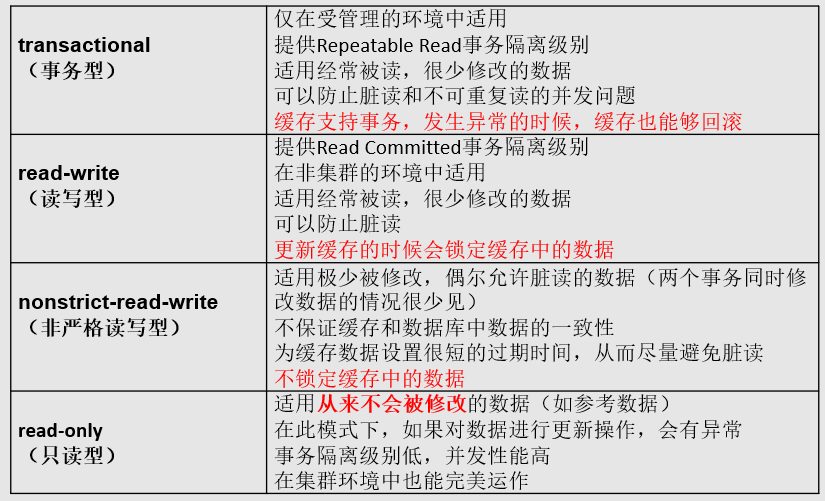
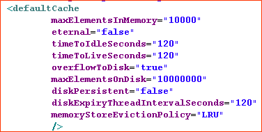
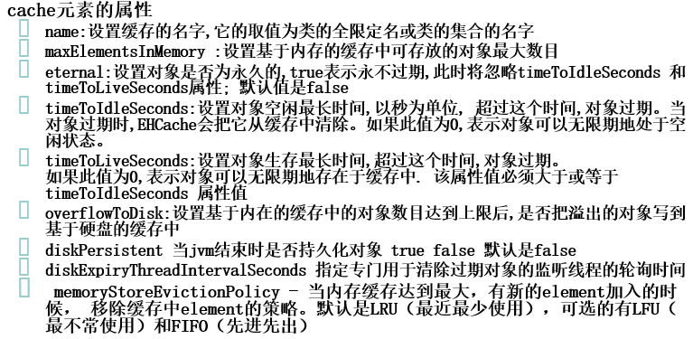
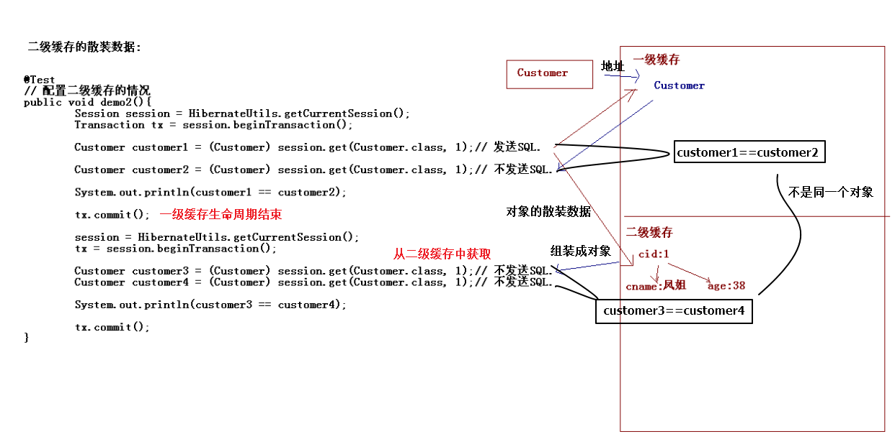
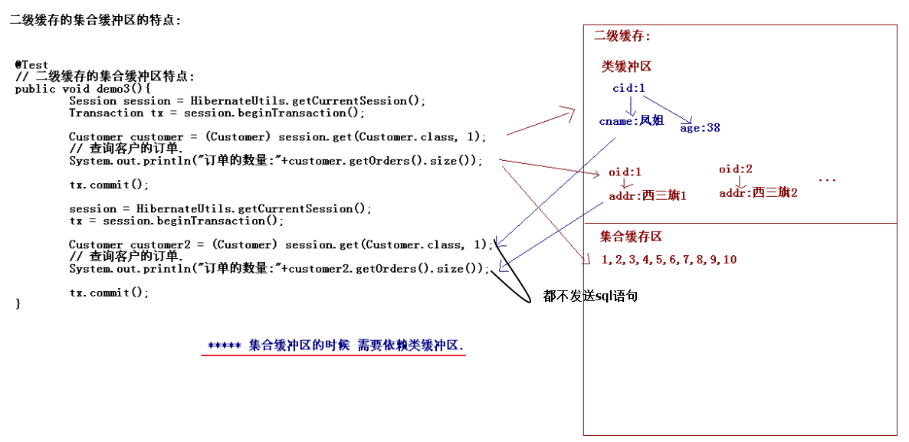
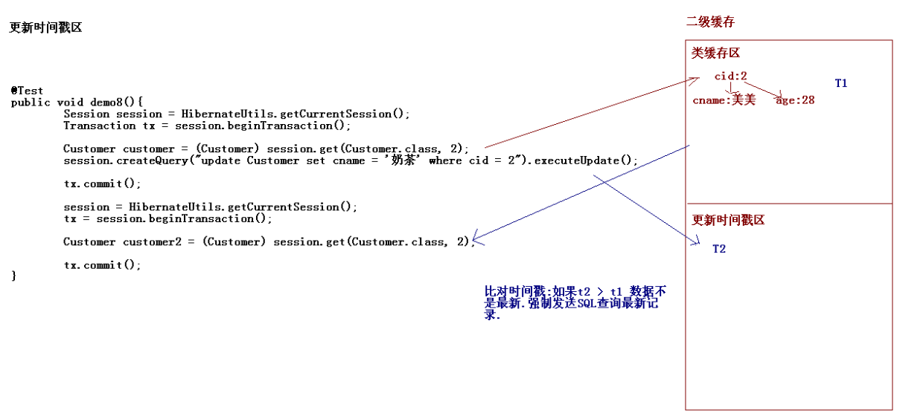

# Hibernate框架-4

[TOC]

## 1. Hibernate的二级缓存 The Second Level Cache

Hibernate中提供了两个级别的缓存。第一级别的缓存是 Session 级别的缓存，它是属于事务范围的缓存。这一级别的缓存由 hibernate 管理的，一般情况下无需进行干预
第二级别的缓存是 SessionFactory 级别的缓存，它是属于进程范围的缓存

* 二级缓存:SessionFactory级别缓存. 可以在多个session之间共享数据的.

### 1.1 二级缓存结构

* 类缓存区
* 集合缓存区
* 更新时间戳
* 查询缓冲区



适合放入的数据: 不经常修改的,允许偶尔出现并发问题

### 1.2 二级缓存的配置

* 在Hibernate中开启二级缓存.
* 配置二级缓存的提供商: EHCache

1.拷贝ehcache-1.5.0.jar到当前工程的lib目录下
依赖 backport-util-concurrent 和 commons-logging

2.开启二级缓存

```markdown
<property name="hibernate.cache.use_second_level_cache">
true
</property>
```

3.要指定缓存的供应商

```markdown
<property name="hibernate.cache.provider_class">
org.hibernate.cache.EhCacheProvider
</property>
```

4.指定使用二级缓存的类

* 方法一 在使用类的*.hbm.xml映射文件中配置

选择需要使用二级缓存的持久化类, 设置它的二级缓存的并发访问策略, &lt;class&gt; 元素的 cache 子元素表明 Hibernate 会缓存对象的简单属性, 但不会缓存集合属性, 若希望缓存集合属性中的元素, 必须在 &lt;set&gt; 元素中加入 &lt;cache&gt; 子元素

```markdown
<hibernate-mapping>
    <class name="hibernate.demo2.Customer" table="customer" lazy="false">
        <!--配置类级别的二级缓存-->
        <cache usage="read-write"/>
        ...
        <set name="orders" cascade="save-update">
            <!--配置集合级别的二级缓存-->
            <cache usage="read-write"/>
            ...
        </set>
    </class>
</hibernate-mapping>
```

* 方法二：在核心配置文件中配置(推荐)

指定使用二级缓存的类 放在maping标签下面

```markdown
<!-- 指定使用二级缓存的类 放在maping下面 -->

<!-- 配置类级别的二级缓存 -->
<class-cache class="hibernate.demo2.Customer" usage="read-write"/>
<class-cache class="hibernate.demo2.Order" usage="read-write"/>

<!-- 配置集合级别的二级缓存 -->
<collection-cache  collection="hibernate.demo2.Customer.orders" usage="read-write"/>
```

5.配置ehcache默认的配置文件ehcache.xml(名字固定)（放在类路径下）

* &lt;diskStore&gt;:指定一个目录, 当 EHCache 把数据写到硬盘上时, 将把数据写到这个文件目录下.  默认是C:\WINDOWS\Temp
* &lt;defaultCache&gt;: 设置缓存的默认数据过期策略
&lt;Cache&gt; 设定具体的命名缓存的数据过期策略



可以使用defaultCache也可以设定一个具体的命名Cache，代表一个缓存区域。命名缓存机制使得用户能够在每个类以及类的每个集合的粒度上设置数据过期策略。



#### 二级缓存数据到硬盘

```markdown
<diskStore path="D:\cache" />
<cache name=""
           maxElementsInMemory="10"
           eternal="true"
           overflowToDisk="true"
           maxElementsOnDisk="10000000"
           diskPersistent="false"
           diskExpriyThreadIntervalSeconds="120" />
</ehcache>
```

设置diskStore，path为硬盘上存储路径，设定一个具体的命名Cache，maxElementsInMemory设定最大存放数量，overflowToDisk设置为true。设置基于内在的缓存中的对象数目达到上限后,是否把溢出的对象写到基于硬盘的缓存中。

### 1.3 类缓存区特点

缓存的是对象的散装的数据.把对象的属性分别存入，这条记录的id持有对别的属性数据的引用。在读取二级缓存区时，会重新组装成所需要的对象。



### 1.4 集合缓存区的特点

缓存的是对象的id. 需要依赖类缓冲区的配置.



* 如果类缓冲区只配置了Customer没有配置Order，集合缓冲区配置了Customer中的Orders，name在第二次事务中，对订单的查询会根据订单的id发送若干条sql语句来查询。

* 如果Customer和Order都配置了类缓冲区，那么订单的散列数据也会进入二级缓存。在根据订单id查询时，会找到二级缓存区中订单id对其他数据的引用。

### list和iterate方法比较

* query接口可以将数据放置到类级别的二级缓存中，但是不能使用query接口的list方法从缓存中获取数据；

```java
//获取session，创建事务
List<Customer> list = session.createQuery("from Customer").list();
//提交事务，再次获取session，开启事务

//第一种情况，没有发生SQL，从二级缓存中获取数据
Customer customer =(Customer) session.get(Customer.class,1);
//第二种情况，发生SQL
List<Customer> list = session.createQuery("from Customer").list();
//提交事务
```

* Iterate() 方法执行的SQL 语句中仅包含实体类对应的数据表的 ID 字段

所以使用iterate方法会发送N+1条sql，第一条用来查询id，然后根据id查询所有订单，可以使用二级缓存。

```java
//获取session，创建事务
Iterator<Customer> iterator = session.createQuery("from Customer").iterate();
while(iterator.hasNext()){
    Customer customer = iterator.next();
}
//提交事务，再次获取session，开启事务
Iterator<Customer> iterator = session.createQuery("from Customer").iterate();
while(iterator.hasNext()){
    Customer customer = iterator.next();
}
//在第二次事务中，依然会查询id，但是不用再发sql查询Customer信息。
//提交事务
```

* iterate方法方法正常情况下比list方法效率低，但是在使用二级缓存的情况下，可以使用iterate方法方法。

### 1.5 一级缓存更新数据同步到二级缓存

```java
//获取session，创建事务
Cuastomer customer=(Customer)session.load(Customer.class, 4);
customer.setAge(45);
//提交事务，再次获取session，开启事务
customer=(Customer)session.load(Customer.class, 4);
System.out.println(customer.getAge());   //45
//在第二次事务中，二级缓存中是已经更新的数据
//提交事务
```

### 1.6 更新时间戳区域 UpdateTimestampCache

时间戳缓存区域存放了对于查询结果相关的表进行**插入, 更新或删除操作**的时间戳.  Hibernate 通过时间戳缓存区域来判断被缓存的查询结果是否过期



查询时会记录一个时间戳T1，手动更新之后会在更新时间戳区存一个时间戳T2，对比时间戳，T3 时刻执行查询结果前, 先比较，如果T2 > T1则说明数据不是最新的，强制发送SQL查询最新记录。若 T2 < T1, 直接从二级缓存中获得查询结果

### 1.7 查询缓存 Query Cache

比二级缓存功能更加强大, 而且查询缓存必须依赖二级缓存.

* 二级缓存: 对类/对象的缓存.
* 查询缓存: 可以缓存属性！！

查询缓存的配置:

* 前提是二级缓存已经配置完毕.
* 在核心配置文件中:

```markdown
<!-- 配置查询缓存 -->
<property name="hibernate.cache.use_query_cache">
true
</property>
```

* 编写代码的时候:

```java
//获取session，创建事务
Query query=session.createQuery("select c.cname from Customer c");
/*
* 设置查询缓存
*    * 如果查询缓存存在 直接返回
*    * 如果查询缓存不存在 查询数据库 将查询结果放置到查询缓存中
*/
query.setCacheable(true);
query.list();

//提交事务，再次获取session，开启事务
query=session.createQuery("select c from Customer c");
query.setCacheable(true);
query.list();
//提交事务
```

对于希望启用查询缓存的查询语句, 调用 Query 的 setCacheable(true) 方法。

## 2. Struts2和Hibernate的整合

### 1.3 SH的整合

第一步: 创建一个web项目
第二步: 导入jar包: Struts2开发包，Hibernate开发包

第三步：引入配置文件

* struts.xml
* hibernate.cfg.xml
* log4j.properties

第四步:创建包结构

第五步:创建实体类与映射

第六步: Action类和配置

Hibernate的检索查询操作写在dao层。根据需要获得和返回的数据类型，设计Action类中的成员。

使用Ajax，json实现异步查询订单详情，用OrderAction。
