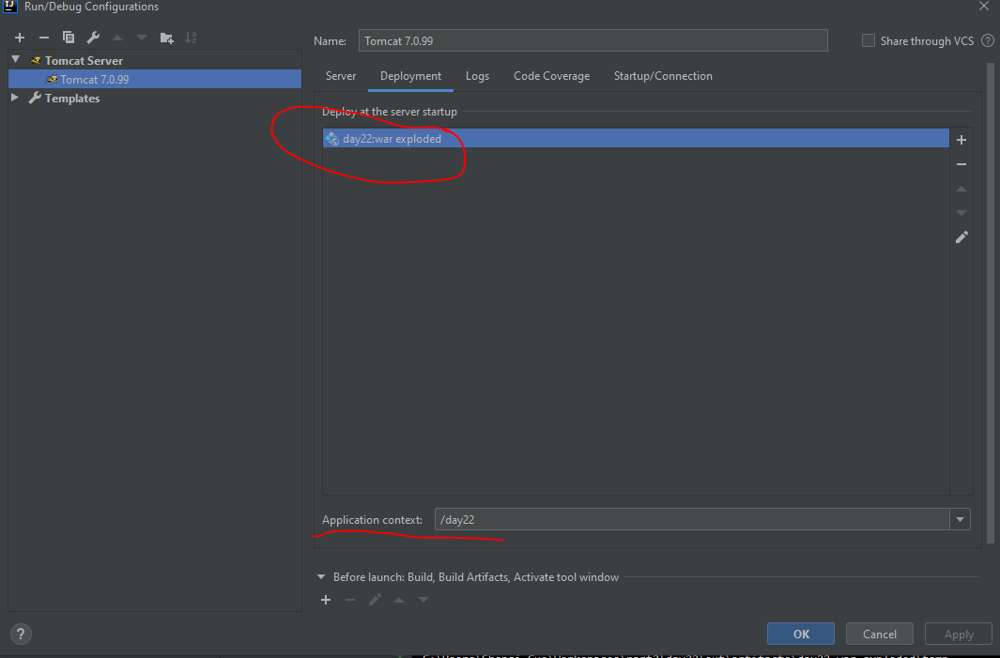
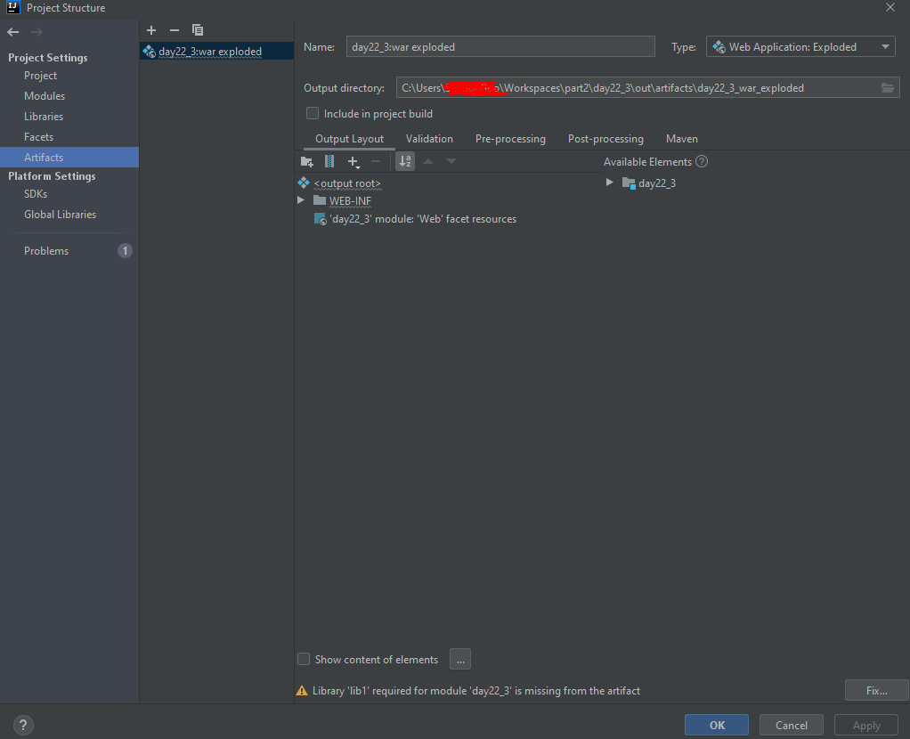

# IDEA踩坑记录

## Tomcat 部署时 war exploded的问题

war exploded模式是直接把文件夹、jsp页面 、classes等等移到Tomcat 部署文件夹里面，进行加载部署。




用于获取上下文环境绝对路径的代码：

```text

String contextPath = request.getSession().getServletContext().getRealPath();
```

war exploded模式最终没有部署在Tomcat的位置，而是项目本身所在位置的指定目录下。
