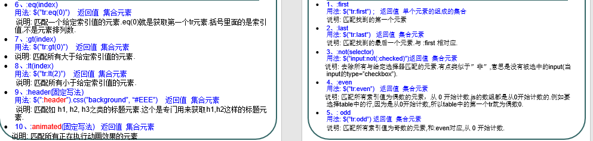
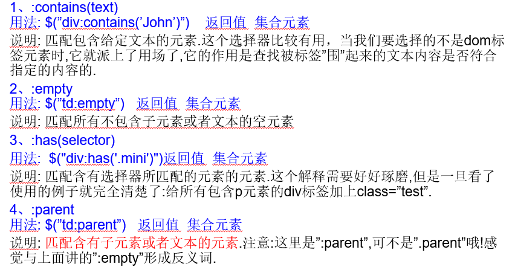
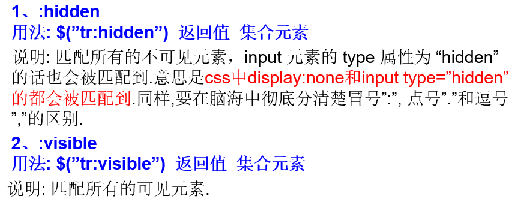
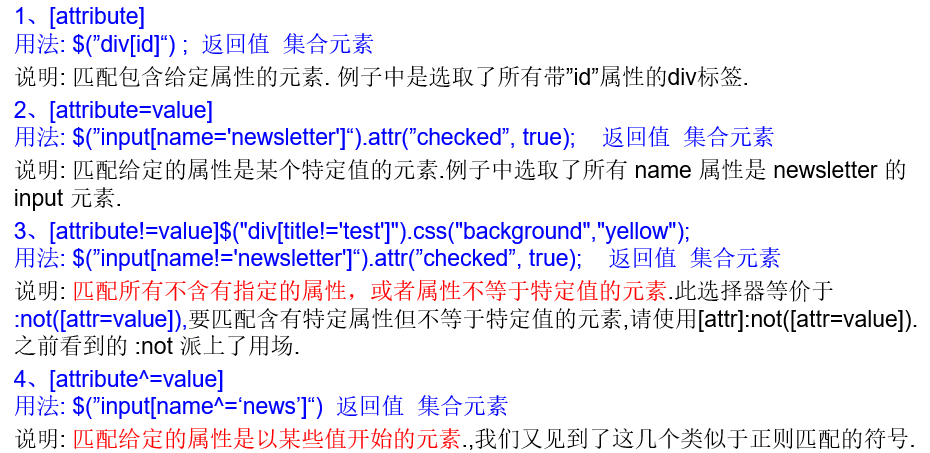
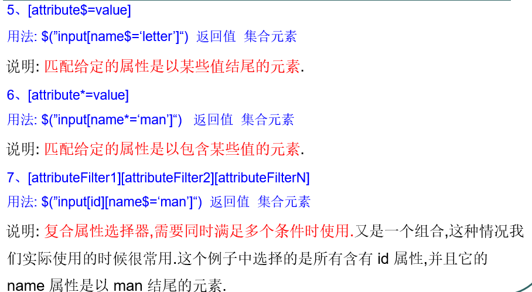
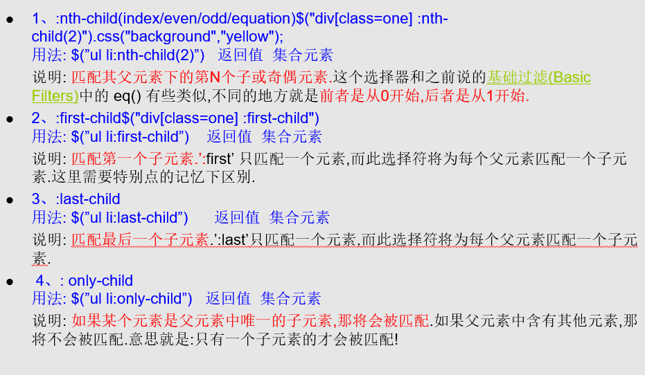
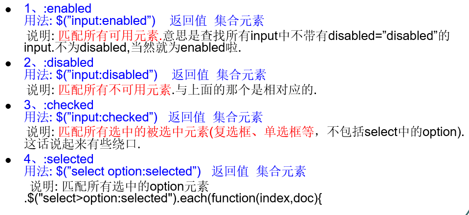
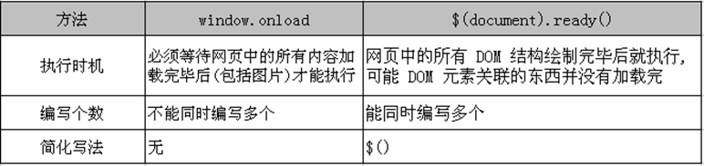

# jQuery-1

jQuery凭借着简洁的语法和跨平台的兼容性，极大地简化了javascript开发人员查找元素、操作DOM、处理事件、执行动画和开发Ajax的操作

导入js文件

```markdown
<script src="https://code.jquery.com/jquery-3.3.1.min.js"></script>
```

## 1. jQuery核心

1. 轻量级
2. 强大的选择器
3. DOM操作的封装
4. 可靠的事件处理机制
5. 完善的Ajax（底层封装xmlhttprequest）
6. 不污染顶级变量 （在jquery里面只有一个对象 jQuery == $）
7. 出色的浏览器兼容性
8. 链式操作方式
9. 隐式迭代
10. 行为层与结构层分离
11. 插件支持
12. 文档


### 1.1 jQuery对象和DOM对象的相互转换

**约定**：如果获取的是 jQuery 对象, 那么要在变量前面加上 \$


* jQuery对象是包装DOM对象后产生的，但是jQuery无法使用DOM对象的任何方法，同理DOM对象也不能使用jQuery里的方法
* 对于已经是一个DOM对象，只需要用\$()把DOM对象包装起来，就可以获得一个jQuery对象了。\$(DOM对象) 转换后就可以使用 jQuery 中的方法了
* 两种转换方式将一个jQuery对象转换成DOM对象：[index]和.get(index); 
* jQuery对象是一个数组对象，可以通过[index]的方法，来得到相应的DOM对象

 ```java
<script type="text/javascript">
//页面加载完毕执行
window.onload=function(){}
//等价于
$(document).ready(function(){})

//id为dombuttom的按钮绑定事件
$(function(){
	$("#dombutton").click(function(){
							
	    //dom 对象
        var username=document.getElementById("username");
		//dom 对象可以调用dom 里面的属性和方法...
        alert(username.value);

		//jQuery 对象...
		var $username=$("#username");
		alert($username.val());

		
        //dom 对象要是用jQuery 里面的方法..  我们可以讲dom 对象转换成jQuery 对象..
		var username=document.getElementById("username");
		var $username=$(username);
		alert($username.val());

		//jQuery 对象想要是用dom 对象里面的属性和方法，也可以转换...
		var $username=$("#username");
		alert($username.length);
								
		//转换有两种方式...
		//第一种方式...
		var username=$username[0];
		alert(username.value);
					
		//第二种转换方式..
		var username=$username.get(0);
		alert(username.value);
								
		//结论：jQuery 对象是一个数组..
    })
})
</script>	
 ```

### 1.2 选择器

要操作DOM首先得到DOM，jQuery提供九种类型的选择器

1. 基本选择器
2. 层次选择器
3. 过滤选择器

#### 1.2.1 基本选择器

基本选择器是 jQuery 中最常用的选择器, 也是最简单的选择器, 它通过元素 id, class 和标签名来查找 DOM 元素.

1. #id  用法: \$(”#myDiv”);    返回值:单个元素的组成的集合. 说明: 这个就是直接选择html中的id=”myDiv”
2. Element  用法: \$(”div”)    返回值:集合元素. 说明: element就是html已经定义的标签元素,例如 div, input, a等等.
3. class  用法: \$(”.myClass”)   返回值:集合元素. 说明: 这个标签是直接选择html代码中class=”myClass”的元素或元素组(因为在同一html页面中class是可以存在多个同样值的).
4. \*  用法: \$("*")   返回值:集合元素 说明: 匹配所有元素,多用于结合上下文来搜索
5. 组合选择器 selector1, selector2, selectorN    用法: \$(”div,span,p.myClass”)   返回值：集合元素。 说明: 将每一个选择器匹配到的元素合并后一起返回.你可以指定任意多个选择器, 并将匹配到的元素合并到一个结果内.其中p.myClass是表示匹配元素p class="myClass"


```java
 <script type="text/javascript">
  //== window.onload = function(){}
  $(document).ready(function(){

  	  //<input type="button" value="选择 id为 one 的元素." id="btn1"/>
	  $("#btn1").click(function(){

			$("#one").css("background","red");

	  });

	  //<input type="button" value="选择 class 为 mini 的所有元素." id="btn2"/>
	  $("#btn2").click(function(){
	  	
	  		$(".mini").css("background","yellow");
	  });
	  
	  //<input type="button" value="选择 元素名是 div 的所有元素." id="btn3"/>
	  $("#btn3").click(function(){
	  	
	  		$("div").css("background","green");
	  });
	  
	  //<input type="button" value="选择 所有的元素." id="btn4"/>
	  $("#btn4").click(function(){
	  		$("*").css("background","blue");
		
	  });
	  
	  //<input type="button" value="选择 所有的span元素和id为two的元素." id="btn5"/>
	  $("#btn5").click(function(){
	  		//组合选择器..
			$("span,#two").css("background","blue");
			
	  });
	  
  });
  </script>
```

#### 1.2.2 层次选择器

如果想通过 DOM 元素之间的层次关系来获取特定元素, 例如后代元素, 子元素, 相邻元素, 兄弟元素等, 则需要使用层次选择器.

1. ancestor descendant 用法: $(”form input”) ;   返回值:集合元素. 说明: 在给定的祖先元素下匹配所有后代元素.
2. parent > child用法: $(”form > input”) ;    返回值:集合元素. 说明: 在给定的父元素下匹配所有子元素.注意:要区分好后代元素与子元素
3. prev + next 用法: $(”label + input”) ;   返回值:集合元素.说明: 匹配所有紧接在 prev 元素后的 next 元素
4. prev ~ siblings 用法: $(”form ~ input”) ;    返回值:集合元素. 说明: 匹配 prev 元素之后的所有 siblings 元素. 注意:是匹配之后的元素,不包含该元素在内,并且siblings匹配的是和prev同辈的元素,其后辈元素不被匹配.

注意:  (“prev ~ div”) 选择器只能选择 “# prev ” 元素后面的同辈元素; 而 jQuery 中的方法 siblings() 与前后位置无关, 只要是同辈节点就可以选取


```java
<script type="text/javascript">

$(document).ready(function(){
        //<input type="button" value="选择 body内的所有div元素." id="btn1"/>
        $("#btn1").click(function(){
            $("body div").css("background","blue");
                
        });
        
        //<input type="button" value="在body内,选择子元素是div的。" id="btn2"/>
        $("#btn2").click(function(){
            $("body>div").css("background","blue");
        });
        
        /</input type="button" value="选择 id为one 的下一个div元素." id="btn3"/>
        $("#btn3").click(function(){
            $("#one+div").css("background","blue");
        });
        
        //《input type="button" value="选择 id为two的元素后面的所有div兄弟元素." id="btn4"/>
        $("#btn4").click(function(){
            $("#two~div").css("background","blue");
        });
        
        //《input type="button" value="选择 id为two的元素的所有div兄弟元素." id="btn5"/>
        $("#btn5").click(function(){
            //只有当前的这个方法返回的是jQuery 对象才能进行链式操作...
            $("#two").siblings("div").css("background","blue");
            
        });
});
</script>
```

只有当前的这个方法返回的是jQuery 对象才能进行链式操作.

#### 1.2.3 过滤选择器

过滤选择器主要是通过特定的过滤规则来筛选出所需的 DOM 元素, 该选择器都以 “:” 开头

##### 基础过滤器



```markdown
  <script type="text/javascript">
  	$(document).ready(function(){
		  //input type="button" value="选择第一个div元素." id="btn1"/>
		  $("#btn1").click(function(){
		  	
		  		$("div:first").css("background","red");
		  });
		  
		  //input type="button" value="选择最后一个div元素." id="btn2"/>
		  $("#btn2").click(function(){
		  	
				$("div:last").css("background","green");
		  });
		  
		  //input type="button" value="选择class不为one的 所有div元素." id="btn3"/>
		  $("#btn3").click(function(){
		  	
				$("div:not('.one')").css("background","green");
		  });
		  
		  //input type="button" value="选择索引值为偶数 的div元素." id="btn4"/>
		  $("#btn4").click(function(){
		  		$("div:even").css("background","green");
		  });
		  
		  //input type="button" value="选择索引值为奇数 的div元素." id="btn5"/>
		  $("#btn5").click(function(){
		  		$("div:odd").css("background","green");
		  });
		  
		  //input type="button" value="选择索引值等于3的元素." id="btn6"/>
		  $("#btn6").click(function(){
		  		$("div:eq(3)").css("background","green");
		  	
		  });
		  
		  //input type="button" value="选择索引值大于3的元素." id="btn7"/>
		  $("#btn7").click(function(){
		  		$("div:gt(3)").css("background","green");
		  });
		  
		  //input type="button" value="选择索引值小于3的元素." id="btn8"/>
		  $("#btn8").click(function(){
		  		$("div:lt(3)").css("background","red");
		  });
		  
		  //input type="button" value="选择所有的标题元素." id="btn9"/>
		  $("#btn9").click(function(){
		  		$(":header").css("background","red");
		  });
		  
		  //input type="button" value="选择当前正在执行动画的所有元素." id="btn10"/>
		  function move(){
				$("#mover").slideToggle("slow",move);
		  }
		  move();
		  
		  $("#btn10").click(function(){
				
			  $(":animated").css("background","red");
		  });
		  
	});
  </script>
```

##### 内容过滤器

内容过滤选择器的过滤规则主要体现在它所包含的子元素和文本内容上



```java
<script type="text/javascript">
  	$(document).ready(function(){
		  //<input type="button" value="选取含有文本“di”的div元素." id="btn1"/>
		  $("#btn1").click(function(){
		  	
				$("div:contains('di')").css("background","red");
				
		  });
		  
		  //<input type="button" value="选取不包含子元素(或者文本元素)的div空元素." id="btn2"/>
		  $("#btn2").click(function(){
		  			$("div:empty").css("background","red");
		  });
		  
		  //<input type="button" value="选取含有class为mini元素 的div元素." id="btn3"/>
		  $("#btn3").click(function(){
		  		$("div:has('.mini')").css("background","red");
		  	
		  });
		  
		  //<input type="button" value="选取含有子元素(或者文本元素)的div元素." id="btn4"/>
		  $("#btn4").click(function(){
		  		$("div:parent").css("background","red");
		  		
		  });
		  
	});
  </script>
```

#### 可见度过滤器

style="display:none;"

可见度过滤选择器是根据元素的可见和不可见状态来选择相应的元素




```java
<script type="text/javascript">
    $(document).ready(function(){
    //<input type="button" value=" 选取所有可见的div元素"  id="b1"/>
        $("#b1").click(function(){
            $("div:visible").css("background","red");
        });

        //<input type="button" value=" 选取所有不可见的元素, 利用 jQuery 中的 show() 方法将它们显示出来"  id="b2"/>
        $("#b2").click(function(){
            $("div:hidden").css("background","red").show(2000);
        });

        //<input type="button" value=" 选取所有的文本隐藏域, 并打印它们的值"  id="b3"/>
        $("#b3").click(function(){
        //  <!--文本隐藏域-->
        //				 <input type="hidden" value="hidden_1">
        //				 <input type="hidden" value="hidden_2">
        //				 <input type="hidden" value="hidden_3">
        //				 <input type="hidden" value="hidden_4">

        //var $input=$("input:hidden");

        //首先我们通过dom 来遍历...
        //显示迭代来便利..
    //				for(var i=0;i<$input.length;i++){
    //					alert($input[i].value);
    //				}
        //隐式迭代
            $("input:hidden").each(function(index,dom){
            //alert(index);
            //alert(dom.value);

            })
        });

        //<input type="button" value=" 选取onediv所有的div的, 并打印它们的值"  id="b4"/>
        $("#b4").click(function(){
            $("#onediv>div").each(function(index,dom){

                alert($(dom).text());
            })

        });
    });
</script>
```

##### 属性过滤选择器

属性过滤选择器的过滤规则是通过元素的属性来获取相应的元素





```JAVA
<script type="text/javascript">
  	$(document).ready(function(){
		  //<input type="button" value="选取含有 属性title 的div元素." id="btn1"/>
		  $("#btn1").click(function(){
				$("div[title]").css("background","red");
		  		
		  });
		  
		  //<input type="button" value="选取 属性title值等于“test”的div元素." id="btn2"/>
		  $("#btn2").click(function(){
			   $("div[title=test]").css("background","red");
		  });
		  
		  //<input type="button" value="选取 属性title值不等于“test”的div元素(没有属性title的也将被选中)." id="btn3"/>
		  $("#btn3").click(function(){
		  		 $("div[title!=test]").css("background","red");
		  });
		  
		  //<input type="button" value="选取 属性title值 以“te”开始 的div元素." id="btn4"/>
		  $("#btn4").click(function(){
		  		 $("div[title^=te]").css("background","red");
		  });
		  
		  //<input type="button" value="选取 属性title值 以“est”结束 的div元素." id="btn5"/>
		  $("#btn5").click(function(){
		  		 $("div[title$=est]").css("background","red");
		  });
		  
		  //<input type="button" value="选取 属性title值 含有“es”的div元素." id="btn6"/>
		  $("#btn6").click(function(){
		  		$("div[title*=es]").css("background","red");
		  });
		  
		  //<input type="button" value="组合属性选择器,首先选取有属性id的div元素，然后在结果中 选取属性title值 含有“es”的元素." id="btn7"/>
		  $("#btn7").click(function(){
			 $("div[id][title*=es]").css("background","red");
		  });
		  
	});
  </script>
```

##### 子元素过滤选择器



```java
<script type="text/javascript">
  	$(document).ready(function(){
        //<input type="button" value="选取每个class为one的div,父元素下的第2个子元素." id="btn1"/>
        $("#btn1").click(function(){
            //子元素过滤选择器特殊写法，: 前面加空格...  从1开始计算...
            $("div[class=one] :nth-child(2)").css("background","red");
        });

        //<input type="button" value="选取每个class为one的div, 父元素下的第一个子元素." id="btn2"/>
        $("#btn2").click(function(){
            //第一种写法
            //$("div[class=one] :nth-child(1)").css("background","red");
            //第二种写法..
            $("div[class=one] :first-child").css("background","red");
        });

        //<input type="button" value="选取每个class为one的div父元素下的最后一个子元素." id="btn3"/>
        $("#btn3").click(function(){

            $("div[class=one] :last-child").css("background","red");
        });

        //<input type="button" value="如果class为one的div父元素下的仅仅只有一个子元素，那么选中这个子元素." id="btn4"/>
        $("#btn4").click(function(){
            $("div[class=one] :only-child").css("background","red");
        });
		  
	});
</script>
```

##### 表单对象属性过滤选择器



```java
<script type="text/javascript">
  	$(document).ready(function(){
		  //<button id="btn1">对表单内 可用input 赋值操作.</button>
		  $("#btn1").click(function(){
				$("input:enabled").val("卢雨");
		  });
		  
		  //<button id="btn2">对表单内 不可用input 赋值操作.</button>
		  $("#btn2").click(function(){
		  		$("input:disabled").val("卢雨");
		  });
		  
		  //<button id="btn3">获取多选框选中的个数.</button>
		  $("#btn3").click(function(){
		    	alert($("input:checked").size());
		  });
		  
		  //<button id="btn4">获取下拉框选中的内容.</button>
		  $("#btn4").click(function(){
		  		//alert($("select>option:selected").length);
				
				$("select>option:selected").each(function(index,dom){
						//alert($(dom).text());
						var title=$(dom).attr("title");
						alert(title);
						
				})
			
		  });
		  
	});
</script>
```

##### 表单选择器

```java
<script type="text/javascript">
  
  $(document).ready(function(){

		var $alltext = $("#form1 :text");
		var $allpassword= $("#form1 :password");
		var $allradio= $("#form1 :radio");
		var $allcheckbox= $("#form1 :checkbox");

		var $allsubmit= $("#form1 :submit");
		var $allimage= $("#form1 :image");
		var $allreset= $("#form1 :reset");
		var $allbutton= $("#form1 :button"); // <input type=button />  和 <button ></button>都可以匹配
		var $allfile= $("#form1 :file");
		var $allhidden= $("#form1 :hidden"); // <input type="hidden" />和<div style="display:none">test</div>都可以匹配.
		var $allselect = $("#form1 select");
		var $alltextarea = $("#form1 textarea");
		var $AllInputs = $("#form1 :input");
		var $inputs = $("#form1 input");

    $("div").append(" 有" + $alltext.length + " 个（ :text 元素）<br/>")
	        .append(" 有" + $allpassword.length + " 个（ :password 元素）<br/>")
			.css("color", "red")

    $("form").submit(function () { return false; }); // return false;不能提交.

  }); 
</script>
```

#### 动画

<script type="text/javascript">
    jQuery().ready(function(){
        $("#showbutton").click(function(){
            //显示隐藏..
            // $("#message").show(3000);
            //淡入淡出...
            // $("#message").fadeIn(3000);
            //滑动
        // $("#message").slideDown(3000);
        })
        
        
        $("#hidebutton").click(function(){
            // $("#message").hide(3000);
            //淡入淡出...
            // $("#message").fadeOut(3000);
        //  $("#message").slideUp(3000);
        })
        
        
        $("#animatebutton").click(function(){
            //{"":""}  json 格式在javascript  里面它就是一个对象..
            //执行动画的动作...	 ,"opacity":"hide"  2:执行动画的时间..
            $("#message").animate({"margin-left":300},3000);
            
            
            $("#message").animate({"padding":30},1000);
            
            
        })
    })
</script>

### 1.3 DOM 操作

#### 查找节点

* 元素节点 var $usernameElement = $("#username");
* 属性节点 Query查找到需要的元素节点后，使用attr()方法来获取它的各种属性的值。 $usernameElement.attr("value");
* 文本节点 jQuery查找到需要的元素节点后，使用text()方法来获取它的文本内容。 $usernameElement.text();

#### 创建节点

```java
$(function(){
	$("#createNode").click(function(){
		var div=$("<div  title='zhaoyanqiang'>赵彦强</div>");
	
		$("body").append(div);
	})
})
```

#### 插入节点
```java
$(function(){
	
	//append(content) :向每个匹配的元素的内部的结尾处追加内容
	$("#zhoukou").append($("#ezhou"))//在zhoukou后加ezhou
	//appendTo(content) :将每个匹配的元素追加到指定的元素中的内部结尾处
	$("#zhoukou").appendTo($("#ezhou"))//在鄂州后加周口
	//prepend(content):向每个匹配的元素的内部的开始处插入内容
	$("#zhoukou").prepend($("#ezhou"))
	//prependTo(content) :将每个匹配的元素插入到指定的元素内部的开始处
	$("#zhoukou").prependTo($("#ezhou"))
	
	//外部插入节点
	//after(content) :在每个匹配的元素之后插入内容
	$("#zhoukou").after($("#ezhou"));
	//before(content):在每个匹配的元素之前插入内容
	$("#zhoukou").before($("#ezhou"));
	//insertAfter(content):把所有匹配的元素插入到另一个、指定的元素元素集合的后面
	$("#zhoukou").insertAfter($("#ezhou"));
	//insertBefore(content) :把所有匹配的元素插入到另一个、指定的元素元素集合的前面
	$("#zhoukou").insertBefore($("#ezhou"));	
})
```

#### 删除节点

* remove(): 从 DOM 中删除所有匹配的元素, 传入的参数用于根据 jQuery 表达式来筛选元素. 当某个节点用 remove() 方法删除后, 该节点所包含的所有后代节点将被同时删除. 这个方法的返回值是一个指向已被删除的节点的引用。
* empty(): 清空节点 – 清空元素中的所有后代节点(不包含属性节点)。

#### 复制节点

clone(): 克隆匹配的 DOM 元素, 返回值为克隆后的副本. 但此时复制的新节点不具有任何行为.
clone(true): 复制元素的同时也复制元素中的的事件 

#### 替换节点

replaceWith(): 将所有匹配的元素都替换为指定的 HTML 或 DOM 元素
replaceAll(): 颠倒了的 replaceWith() 方法.

注意: 若在替换之前, 已经在元素上绑定了事件, 替换后原先绑定的事件会与原先的元素一起消失

#### 属性操作

attr(): 获取属性和设置属性。

* 当为该方法传递一个参数时, 即为某元素的获取指定属性。
* 当为该方法传递两个参数时, 即为某元素设置指定属性的值。
* jQuery 中有很多方法都是一个函数实现获取和设置. 如: attr(), html(), text(), val(), height(), width(), css() 等。
* removeAttr(“属性名”): 删除指定元素的指定属性

```java
$(function(){
	$("#attrbutton").click(function(){
			
		//获取当前节点的文本节点以及子节点的文本节点...
//			alert($("div").text());

		//获取当前节点里面的html 内容..
		//alert($("div").html());
		//alert( $("div").height());
		
		//alert($("div").attr("title"));
		//两个参数的，追加一个属性...
		//现在用的版本是1.4  ，jQuery1.7.2 的版本这个方法不兼容...
		$("div").attr("class","gaopengfei")
	})
})
```

#### 样式操作

* 获取 class 和设置 class ：class 是元素的一个属性, 所以获取 class 和设置 class 都可以使用 attr() 方法来完成。
* 追加样式：addClass()
* 移除样式：removeClass() --- 从匹配的元素中删除全部或指定的 class
* 切换样式：toggleClass()  --- 控制样式上的重复切换.如果类名存在则删除它, 如果类名不存在则添加它。
* 判断是否含有某个样式：hasClass() --- 判断元素中是否含有某个 class, 如果有, 则返回 true; 否则返回 false。

```java
$(function(){
	$("#cssoperation").click(function(){
		//addClass 往当前元素上面追加一个样式.. 
		//操作样式的第一种方式.. 优先取第一种...
		$("div").addClass("cssbaidu");
			
		//操作样式的第二种方式..
		$("div").attr("class","cssbaidu")
			
		//第三种方式：
		$("div").css("font-size","28");
		
		//一个元素的class 属性可以对应有多个值...
			
		//如果不加参数，删除当前元素上面的所有的class 值
		$("div").removeClass();
		//如果加参数，根据参数名称删除指定 class
		$("div").removeClass("csshaosou");
			
		//判断当前元素是否具备某个样式...
		var flag=$("div").hasClass("cssbaidu");
		alert(flag);
			
		//切换样式：控制样式上的重复切换.如果类名存在则删除它, 如果类名不存在则添加它。
		$("div").toggleClass("cssbaidu");	


		//toggle  切换...对比toggleClass
		/**
		* 调用toggle 首先会先判断当前元素  是否是隐藏状态..
		* 
		* 如果是隐藏状态，则调用jQuery 的show 方法  显示...
		* 
		* 如果是显示状态，则调用jQuery 的hide 方法隐藏...
		* 
		*/
		$("div").toggle(3000);		
	})
})
```

#### 遍历节点

* 取得匹配元素的所有子元素组成的集合: children(). 该方法只考虑子元素而不考虑任何后代元素.
* 取得匹配元素后面紧邻的同辈元素下一个元素:next();
*取得匹配元素前面紧邻的同辈元素上一个元素:prev()；
* 取得匹配元素前后所有的同辈元素: siblings()；

#### 包裹节点


```java
$(function(){
	$("#wrapbutton").click(function(){

		//将匹配到的元素使用指定标签进行逐个包裹...	
		/$("p").wrap("<font color='red'></font>");
		
		//将匹配到的元素使用指定标签进行整体包裹...	
		$("p").wrapAll("<font color='red'></font>")

		//将匹配到的元素使用指定标签进行进行内部逐个包裹...	
		$("p").wrapInner("<font color='red'></font>")
	})
})
```

### 1.4 jQuery中的事件

在页面加载完毕后, 浏览器会通过 JavaScript 为 DOM 元素添加事件. 在常规的 JavaScript 代码中, 通常使用 window.onload 方法, 在 jQuery 中使用$(document).ready() 方法.



#### 动态绑定事件与解绑

```java
 $(function(){
	$("#bindbutton").click(function(){
	
		$("div").bind("mouseover",function(){
		
			// $(this).css("background","blue");
			alert("a");
		})
	
	})
	
	
	$("#unbindbutton").click(function(){
		//解绑所有的事件..
		//$("div").unbind();
	
		$("div").unbind("mouseover");
	
	})


})

```

```java
			$(function(){
				//鼠标悬停事件 
				  $("ul>li").mouseover(function(){
				  		$(this).css("background","red");
					
					
				  });
				   $("ul>li").mouseout(function(){
				  		$(this).css("background","white");
				  })

				 $("ul>li").hover(function(){
				 	$(this).css("background","red");
				 },function(){
					$(this).css("background","white");
				 })				
			})


```