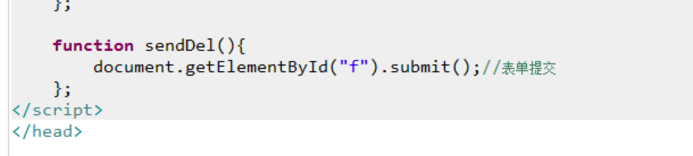

# Listener 监听器


 1.Customer练习

 1.添加

 2.批量删除

 3.简单条件查询

 4.分页显示

 2.Listener 监听器

===============================================================

customer练习

 1.添加\(作业\)

 问题:id是varchar类型，它的获取问题?

 UUID工具类来获取.

 完成添加操作:

 1.在showCustomer.jsp页面上添加一个连接，可以直接访问到添加页面 add.jsp

 2.创建add.jsp

 1.关于生日的日历组件 My97DatePickerBeta

 1.导入js

 &lt;script language="javascript" type="text/javascript" src="${pageContext.request.contextPath}/My97DatePicker/WdatePicker.js"&gt;&lt;/script&gt;

 2.在input type=text组件上添加 class,onclick.

 客户生日:&lt;input type="text" name="birthday" class="Wdate" onclick="WdatePicker\(\)" readonly="readonly"&gt;&lt;br&gt;

 2.关于id问题

 使用UUID获取 生成随机不重复字符串类型ID


 3.创建CustomerAddServlet完成添加操作

 1.得到所有请求参数封装到Customer对象

 注意:1.编码问题

 2.我们使用BeanUtils，注意Date类型转换问题

 3.要手动封装id.

 2.调用service完成添加操作

 ------------------------------------------------------------------------

 **2.批量删除**

 1.完成页面上全选 与全不选操作

 function change\(\){

 //1.得到id为main的这个checkbox

 var main=document t.getElementById\("main"\);

 var flag=main.checked;

 //2.得到所有name=ck的checkbox

 var cks=document.getElementsByName\("ck"\);

 //3.将cks中所有的checkbox的checked值设置为flag

 for\(var i=0;i&lt;cks.length;i++\){

 cks\[i\].checked=flag;

 }

 }

 2.完成批量删除

 1.页面上怎样将数据提交到服务器端.

 1.可以创建一个表单，将表单数据提交就可以。




 2.直接使用js操作

 需要手动拼接出url路径


 2.在服务器端怎样批量删除.

 1.得到所有要删除的id值

 request.getParameterValues\("ck"\);

 2.在dao中使用QueryRunner的batch方法

 batch\(sql,Object\[\]\[\]\);

 注意:参数二维数据，它代表的是每一条sql的参数。

 ----------------------------------------------------------------------------------------------

 3.简单条件查询

 1.页面完成

 在showCustomer.jsp页面上完成

 &lt;div align="center"&gt;

 &lt;form&gt;

 &lt;select name="s"&gt;

 &lt;option&gt;请选择条件&lt;/option&gt;

 &lt;option value="name"&gt;按姓名查询&lt;/option&gt;

 &lt;option value="cellphone"&gt;按手机号查询&lt;/option&gt;

 &lt;option value="description"&gt;按描述查询&lt;/option&gt;

 &lt;/select&gt;

 &lt;input type="text" name="msg"&gt;

 &lt;input type="submit" value="查询"&gt;

 &lt;/form&gt;

 &lt;/div&gt;

 问题: select的名称叫什么?每一个option的值是什么?

 select可以任意起名.

 option的value名称需要与customer表中的字段名称对应.

 2.创建CustomerSimpleSelectServlet完成条件查询

 注意sql语句问题:

 String sql="select \* from customer where "+field+" like ?";


=====================================================================================

分页查询

 问题:什么是分页，为什么使用分页?

 分页就是将数据以多页去展示，使用分页可以提高客户的感受。

 分页分类:

 **1.物理分页**

 只从数据库中查询出当前页的数据。

 优点:不占用很多内存

 缺点:效率比较低

 **2.逻辑分页**

 从数据库中将所有记录查询出业，存储到内存中，要想展示当前页

 数据，直接从内存中获取。

 优点:效率高

 缺点:占用内存比较高

 在java开发领域，我们使用的比较多的是物理分页。

**物理分页的实现:**

 1.直接使用jdbc完成

 使用滚动结果集. 优点:跨数据库。缺点:性能低。

 2.使用数据库本身提供的分页操作.

 会使用每一个数据库特定的分页函数，优点:性能高 缺点:不能跨数据库。

 mysql:limit

 sqlservlet:top

 oracle:rownum

 介绍limit使用.

 select \* from 表 limit m,n;

 m：代表的是从第几条开始 注意:它是从0开始记录.

 n:代表查询几条记录.

 示例:分页显示，每页显示6条，要查询第2页的数据. \(2-1\)\*6,6

 select \* from 表 limit \(页码-1\)\*每页条数,每页条数;

 ------------------------------------------------------------------------------

 分页分析:

 1.页码 默认第一页

 2.每页条数 人为定义

 3.总条数 select count\(\*\) from 表

 4.总页数 总页数=总条数%每页条数==0?总条数/每页条数:总条数/每页条数+1

 总页数=Math.ceil\(总条数\*1.0/每页条数\);

 5.当前页的数据 List&lt;?&gt;-----&gt;select \* from 表 limit \(页码-1\)\*每页条数,每页条数;

 ----------------------------------------------------------------------------------

 分页代码实现:

 1.在success.jsp页面上

 &lt;a href="${pageContext.request.contextPath}/findAllByPage"&gt;查看所有客户信息\(分页展示\)&lt;/a&gt;&lt;br&gt;

 2.创建CustomerFindAllByPageServlet完成分页

问题:要向页面携带的数据有很多，不仅是要展示的数据，例如:页码，总页数等，都需要携带到页面上，怎样处理?

解决方案:可以创建一个分页Bean,在这个Bean中封装所有关于分页相关的数据.


 3.在showCustomerByPage.jsp页面上添加

&lt;a href="/day20\_1/findAllByPage?pageNum=1"&gt;首页&lt;/a&gt;&nbsp;&nbsp;&nbsp;

&lt;a href="/day20\_1/findAllByPage?pageNum=${pb.pageNum-1}"&gt;上一页&lt;/a&gt;&nbsp;&nbsp;&nbsp;

 &lt;a href="/day20\_1/findAllByPage?pageNum=${pb.pageNum+1 }"&gt;下一页&lt;/a&gt;&nbsp;&nbsp;&nbsp;

 &lt;a href="/day20\_1/findAllByPage?pageNum=${pb.totalPage }"&gt;尾页&lt;/a&gt;&nbsp;&nbsp;&nbsp;


 在CustomerFindAllByPageServlet中处理请求参数 pageNum

 int pageNum = 1;

 String \_pageNum = request.getParameter\("pageNum"\);

 if \(\_pageNum != null\) {

 pageNum = Integer.parseInt\(\_pageNum\);

 }

 问题:怎样控制上一页，下一页。

 条件判断就可以解决.

 &lt;c:if test="${pb.pageNum==1}"&gt;

 上一页&nbsp;&nbsp;&nbsp;

 &lt;/c:if&gt;

 &lt;c:if test="${pb.pageNum!=1}"&gt;

 &lt;a href="/day20\_1/findAllByPage?pageNum=${pb.pageNum-1}"&gt;上一页&lt;/a&gt;&nbsp;&nbsp;&nbsp;

 &lt;/c:if&gt;

 &lt;c:if test="${pb.pageNum==pb.totalPage}"&gt;

 下一页&nbsp;&nbsp;&nbsp;

 &lt;/c:if&gt;

 &lt;c:if test="${pb.pageNum!=pb.totalPage}"&gt;

 &lt;a href="/day20\_1/findAllByPage?pageNum=${pb.pageNum+1 }"&gt;下一页&lt;/a&gt;&nbsp;&nbsp;&nbsp;

 &lt;/c:if&gt;


 --------------------------------------------------------------------

 分页扩展:

 1.设定每页显示条数

 1.在showCustomerByPage.jsp页面上添加一个&lt;select&gt;

 &lt;select name="currentPage" onchange="changeCurrentPage\(this.value\);"&gt;

 &lt;option&gt;--请选择每页条数--&lt;/option&gt;

 &lt;option value="5"&gt;5&lt;/option&gt;

 &lt;option value="10"&gt;10&lt;/option&gt;

 &lt;option value="20"&gt;20&lt;/option&gt;

 &lt;/select&gt;

 function changeCurrentPage\(value\){

 location.href="/day20\_1/findAllByPage?currentPage="+value;

 };

 2.在首页，上一页，下一页，尾页的连接上也要添加每页显示条数。

 例如:

 &lt;a href="/day20\_1/findAllByPage?pageNum=1&currentPage=${pb.currentPage}"&gt;首页&lt;/a&gt;

 ------------------------------------

 2.关于页码显示

 &lt;c:forEach begin="1" end="${pb.totalPage}" var="n" step="1"&gt;

 &lt;a href="/day20\_1/findAllByPage?pageNum=${n}&currentPage=${pb.currentPage}"&gt;第${n}页&lt;/a&gt;&nbsp;&nbsp;

 &lt;/c:forEach&gt;

 问题:如果页码比较多怎样处理?

 可以限定页码数，例如:前5后4。

 这样做，页面的判断条件比较多，可以使用自定义标签。

 可以在自定义标签中通过java代码来解决判断操作。如果直接在页面上，使用&lt;c:if&gt;代码太乱。


用java编写页码判断


=============================================================================================================

## **Listener**

###  **概念**

1. 事件ActionEvent
2. 事件源 Jbutton
3. 监听器ActionListener
4. 注册监听addActionListener

 监听器就是可以监听某一个事件在执行一个特定操作时，我们可以让其触发一个操作。 可以在满足特定条件的情况下执行一段操作。

 javaweb中的监听器，主要用于监听javaweb中常用对\(**request\(HttpServletRequest\), session\(HttpSession\), application\(ServletContext**\)的三种类型操作：

1. 对象的创建与销毁
2. 对象的属性变化
3. session绑定javaBean

 在javaweb中servlet规范中定义了三种技术 servlet Listener Filter


### 对应的监听器接口

####  1.监听创建与销毁

 HttpServletRequest

        监听器:**ServletRequestListener**可以监听request对象的创建与销毁.

 HttpSession

         监听器:**HttpSessionListener**可以监听session对象的创建与销毁.

 ServletContext

          监听器:**ServletContextListener**可以监听application对象的创建与销毁。

####  2.监听web对象的属性变化

 HttpServletRequest属性变化

          监听器:**ServletRequestAttributeListener**监听request对象的属性变化

 HttpSession属性变化

          监听器:**HttpSessionAttributeListener** 监听session对象的属性变化

 ServletContext属性变化

           监听器:**ServletContextAttributeListener**监听application对象的属性变化。

 ------------------------------------------------------------------------------------

###  web中监听器怎样使用？

 创建监听器步骤:

1. 创建一个类，去实现指定的监听器接口
2. .重写接口中方法。
3. 在web.xml文件中配置注册监听

```java
public class MyServletContextListener implements ServletContextListener {

	public void contextDestroyed(ServletContextEvent sce) {

	}

	public void contextInitialized(ServletContextEvent sce) {
		// 这个方法执行了，就说明项目启动了.}
}
```

 演示:

```markup
<?xml version="1.0" encoding="UTF-8"?>
<web-app version="2.5" xmlns="http://java.sun.com/xml/ns/javaee"
	xmlns:xsi="http://www.w3.org/2001/XMLSchema-instance"
	xsi:schemaLocation="http://java.sun.com/xml/ns/javaee 
	http://java.sun.com/xml/ns/javaee/web-app_2_5.xsd">


	<!-- 注册监听ServletContext对象创建与销毁 -->
	<listener> 
		<listener-class>cn.itcast.web.listener.application.MyServletContextListener</listener-class> 
	</listener> -->

	<welcome-file-list>
		<welcome-file>index.jsp</welcome-file>
	</welcome-file-list>

</web-app>
```

 1.监听application对象的创建与销毁.

 问题:application对象什么时候创建，什么时候销毁的?

 application对象是服务器启动时创建，

 服务器关闭时销毁。

 2.监听session对象创建与销毁

 问题:session对象什么时候创建，什么时候销毁？

 session对象创建:

 reqeust.getSession\(\);它是用于获取session.

 是否创建，分以下几种情况:

 1.请求中如果没有jsessionid,那么就是创建session对象。

 2.如果请求头中有jsessionid值：

 1.如果在服务器端，有一个session的id值与其一样，不创建，直接使用。

 2.如果在服务器端，没有这个session的id值，那么会创建。

 session销毁:

 1.默认超时 30分钟

 2.设置session超时时间

 setMaxInactiveInterval\(int interval\)

 3.invalidate\(\)手动销毁.

 4.关闭服务器

 3.监听request对象创建与销毁

 问题:request对象什么时候创建，什么时候销毁？

 请求发生，request对象创建，响应产生request对象销毁。

 ----------------------------------------------------------------------

 演示监听属性变化

 演示监听session的属性变化

 问题:在监听器中是否可以得到属性值?

 常识:在java的监听机制中，是可以在监听器中获取事件源的。

 我们在开发中，如果有到了事件触发机制，那么一般情况下，都可以使用

 方法的参数\(事件对象\)来获取想要的信息.

 ----------------------------------------------------------

 思考一个问题:这些监听器在开发中有什么用?

 在主流中应用比较少，但是可以完成一些性能监试操作。

 -----------------------------------------------------------------------------

 监听器案例:

 功能：扫描session对象在指定时间内没有使用，人为销毁。

 分析:

 1.怎样知识session多长时间没有使用？

 当前时间-最后使用时间（public long getLastAccessedTime\(\)）

 2.什么时候开始扫描，扫描多长时间?

 可以使用Timer完成

 完成定时扫描session，如果超时没有使用，销毁案例：

 1.要将所有的session对象得到，保存到集合中。

 1.创建一个监听器 ServletContextListener,它服务器启动时，创建一个集合保存到ServletContext域。

 2.创建一个监听器 HttpSessionListener,当创建一个session时，就从ServletContext域中获取集合，将session对象储存到集合中。

 2.定时扫描

 问题:

 1.session超时，不能只销毁session，还要从集合中移除。

 2.我们的操作，它是多线程的，要考虑集合的同步问题。

 1.集合需要是线程安全的。

 2.需要使用迭代器进行遍历。

 ---------------------------------------------------------------------------------------

 session绑定javaBean

 1.HttpSessionBindingListener

 这个监听器，可以让javaBean对象，感知它被绑定到session中或从session中移除。

 2.HttpSessionActivationListener

 这个监听器，可以让javaBean感知，被钝化或活化。

 钝化---&gt;将session中的javaBean保存到文件中.

 活化---&gt;从文件中将javaBean直接获取。

 需要创建一个配置文件context.xml

 这个文件保存到META-INF目录下.

 &lt;Context&gt;

 &lt;Manager className="org.apache.catalina.session.PersistentManager" maxIdleSwap="1"&gt;

 &lt;Store className="org.apache.catalina.session.FileStore" directory="it315"/&gt;

 &lt;/Manager&gt;

 &lt;/Context&gt;

 这两个监听器特点;

 1.它们是由javaBean实现.

 2.它们不需要在web.xml文件中配置.

