# mybatis

mybatis 是一个 java 持久层框架，java 中操作关系型 数据库用的是 jdbc，mybatis 是对 jdbc 的一个封装。
开发者只需要关注 SQL 本身，而不需要花费精力去处理例如注册驱动、创建 connection、创建 statement、手动设置参数、结果集检索等 jdbc 繁杂的过程代码。

Mybatis 通过 xml 或注解的方式将要执行的各种 statement（statement、preparedStatemnt、CallableStatement）配置起来，并通过 java 对象和 statement 中的 sql 进行映射生成最终执行的 sql 语句，最后由 mybatis 框架执行 sql 并将结果映射成 java 对象并返回。

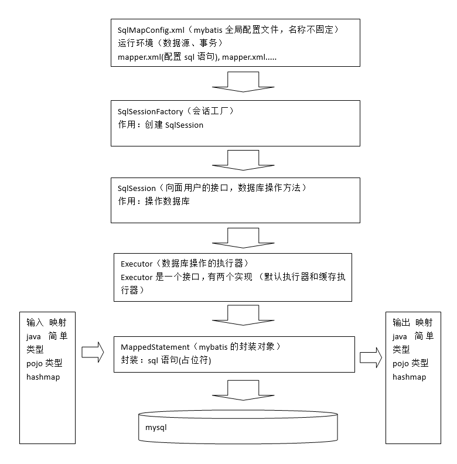

## 入门程序

### 需求

实现用户查询：

根据用户 id（主键）查询用户信息（单条记录）
根据用户名称模糊查询用户信息（多条记录）

用户添加
用户删除
用户修改

### 导入 jar 包

mybatis-3.2.7 及其依赖

### log4j.properties（公用文件）

```markdown
# Global logging configuration 建议开发环境中用 debug 模式

log4j.rootLogger=DEBUG, stdout

# Console output...

log4j.appender.stdout=org.apache.log4j.ConsoleAppender
log4j.appender.stdout.layout=org.apache.log4j.PatternLayout
log4j.appender.stdout.layout.ConversionPattern=%5p [%t] - %m%n
```

### SqlMapConfig.xml(公用文件)

通过 SqlMapConfig.xml 加载 mybatis 运行环境。是 mybatis 全局配置文件，只有一个，名称不固定的

```markdown
<!DOCTYPE configuration PUBLIC "-//mybatis.org//DTD Config 3.0//EN"
 "http://mybatis.org/dtd/mybatis-3-config.dtd">
<configuration>
	<!-- 和spring整合后enviroments配置将会废除 -->
	<environments default="development">
		<environment id="development">
			<!-- 事务管理器-->
			<transactionManager type="JDBC"/>
			<!-- 数据库连接池 -->
			<dataSource type="POOLED">
				<property name="driver" value="com.mysql.jdbc.Driver"/>
				<property name="url" value="jdbc:mysql://localhost:3306/mybatis"/>
				<property name="username" value="root"/>
				<property name="password" value="password"/>
			</dataSource>
		</environment>
	</environments>
	<!-- 加载mapper.xml -->
	<mappers>
		<mapper resource="sqlmap/User.xml"/>
	</mappers>
</configuration>
```

### pojo（User.java）

根据表中数据及类型建 User 类，带 set/get 方法

### User.xml（重点）

mapper.xml 是以 statement 为单位进行配置。（把一个 sql 称为一个 statement），satatement 中配置 sql 语句、parameterType 输入参数类型（完成输入映射）、resultType 输出结果类型（完成输出映射）。(不要写分号)

建议命名规则：表名+mapper.xml
早期 ibatis 命名规则：表名.xml

\#{}
表示一个占位符，向占位符输入参数，mybatis 自动进行 java 类型和 jdbc 类型的转换。
程序员不需要考虑参数的类型，比如：传入字符串，mybatis 最终拼接好的 sql 就是参数两边加单引号。
\#{}接收 pojo 数据，可以使用 OGNL 解析出 pojo 的属性值

\${}
表示 sql 的拼接，通过${}接收参数，将参数的内容不加任何修饰拼接在sql中。
\${}也可以接收 pojo 数据，可以使用 OGNL 解析出 pojo 的属性值
缺点：不能防止 sql 注入。

```markdown
<?xml version="1.0" encoding="UTF-8"?>
<!DOCTYPE mapper PUBLIC "-//mybatis.org//DTD Mapper 3.0//EN"
 "http://mybatis.org/dtd/mybatis-3-mapper.dtd">
<!-- namespace命名空间，为了对sql语句进行隔离，方便管理 ，mapper开发dao方式，使用namespace有特殊作用
mapper代理开发时将namespace指定为mapper接口的全限定名
 -->
<mapper namespace="test">
<!-- 在mapper.xml文件中配置很多的sql语句，执行每个sql语句时，封装为MappedStatement对象
mapper.xml以statement为单位管理sql语句
 -->
	<!-- 根据id查询用户信息 -->
	<!-- 
		id：唯一标识 一个statement
		#{}：表示 一个占位符，如果#{}中传入简单类型的参数，#{}中的名称随意
		parameterType：输入 参数的类型，通过#{}接收parameterType输入 的参数
		resultType：输出结果 类型，不管返回是多条还是单条，指定单条记录映射的pojo类型
	 -->
	<select id="findUserById" parameterType="int" resultType="cn.itcast.mybatis.po.User">
		SELECT * FROM USER WHERE id= #{id}	
	</select>
 </mapper>
```

### 根据 id 查用户(返回一条数据)

```java
public class MybatisFirst {
	//会话工厂
	private SqlSessionFactory SqlSessionFactory;

	//创建工厂
	@Before
	public void init() throws IOException {
		//配置文件
		String resource ="SqlMapConfig.xml";
		//加载配置文件到输入流
		InputStream inputStream = Resources.getResourceAsStream(resource);
		//创建会话工厂
		SqlSessionFactory =new SqlSessionFactoryBuilder().build(inputStream);
	}
	//测试根据id查询用户（得到单条记录）
	@Test
	public void testFindUserById() {

		//通过sqlSessionFactory创建sqlSession
		SqlSession sqlSession = SqlSessionFactory.openSession();
		//通过sqlSession操作数据库
		//第一个参数：statement的位置，等于namespace+statementid
		//第二个参数：传入的参数
		User user= null;
		try {
			user = sqlSession.selectOne("test.findUserById", 1);
		}catch (Exception e) {
			e.printStackTrace();
		}finally {
			//关闭sqlSession
			sqlSession.close();
		}
		System.out.println(user);
	}
}
```

### 根据用户名称模糊查询用户信息（可能返回多条）

配置 sql 语句

resultType：输出结果 类型，不管返回是多条还是单条，指定单条记录映射的 pojo 类型

```markdown
<!--写法一 传入参数"%小明%"-->
<select id="findUserByName" parameterType="java.lang.String" resultType="cn.itcast.mybatis.po.User">
	select * from user where username like #{username}
</select>

<!--写法二
	${}：表示sql的拼接，通过${}接收参数，将参数的内容不加任何修饰拼接在sql中。
	传入参数"小明"
	 -->
<select id="findUserByName" parameterType="java.lang.String" resultType="cn.itcast.mybatis.po.User">
	select * from user where username like '%${value}%'
</select>
```

```java
...
    List<User> list= null;
    try {
        list = sqlSession.selectList("test.findUserByName", "小明");
    }catch (Exception e) {
        e.printStackTrace();
...
```

### 用户添加

向用户表插入一条记录

```markdown
<!-- 添加用户
	parameterType：输入 参数的类型，User对象 包括 username,birthday,sex,address
	#{}接收pojo数据，可以使用OGNL解析出pojo的属性值
	#{username}表示从parameterType中获取pojo的属性
-->
<insert id="insertUser" parameterType="cn.itcast.mybatis.po.User">    
    INSERT INTO USER(username,birthday,sex,address) VALUES(#{username},#{birthday},#{sex},#{address})
</insert>
```

```java
...
    User user=new User();
    user.setUsername("test用户");
    user.setBirthday(new Date());
    user.setSex("1");
    user.setAddress("北京");
    try {
        sqlSession.insert("test.insertUser",user);
        //提交事务
        sqlSession.commit();
    }catch (Exception e) {
        e.printStackTrace();
...
```

### 主键返回

需求：user 对象插入到数据库后，新记录的主键要通过 user 对象返回，通过 user 获取主键值。

解决思路：
通过 LAST_INSERT_ID()获取刚插入记录的自增主键值，在 insert 语句执行后，执行 select LAST_INSERT_ID()就可以获取自增主键。

```markdown
<!--
selectKey：用于进行主键返回，定义了获取主键值的sql
order：设置selectKey中sql执行的顺序，相对于insert语句来说
keyProperty：将主键值设置到哪个属性
resultType：select LAST_INSERT_ID()的结果 类型
 -->
<insert id="insertUser" parameterType="cn.itcast.mybatis.po.User">
    <selectKey keyProperty="id" order="AFTER" resultType="int">
        select LAST_INSERT_ID()
    </selectKey>    
    INSERT INTO USER(username,birthday,sex,address) VALUES(#{username},#{birthday},#{sex},#{address})
</insert>
```

User.xml 如上修改后就可以获得 user 插入表中之后的 ID

```java
System.out.println(user.getId());
```

#### 实现 oracle 数据库主键返回

oracle 没有自增主键机制，使用序列完成主键生成。

先查询序列得到主键，将主键设置到 user 对象中，将 user 对象插入数据库。

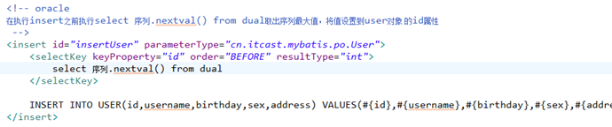

#### 使用 mysql 的 uuid 机制生成主键

使用 uuid 生成主键的好处是不考虑数据库移植后主键冲突问题。

实现思路：
先查询 uuid 得到主键，将主键设置到 user 对象中，将 user 对象插入数据库。

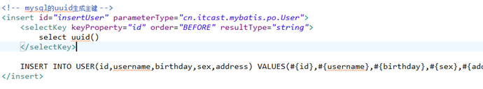

### 用户删除和更新

```markdown
<!-- 用户删除  -->
<delete id="deleteUser" parameterType="int">
    delete from user where id=#{id}
</delete>
<!-- 用户更新 
要求：传入的user对象中包括 id属性值
-->
<update id="updateUser" parameterType="cn.itcast.mybatis.po.User">
    update user set username=#{username},birthday=#{birthday},sex=#{sex},address=#{address} where id=#{id}
</update>
```

```java
//删除用户
sqlSession.delete("test.deleteUser",28);
sqlSession.commit();

//跟新用户必须给id
User user = new User();
user.setId(28);
user.setUsername("test用户2 ");
user.setBirthday(new Date());
user.setSex("1");
user.setAddress("北京");
try {
    sqlSession.update("test.updateUser",user);
    sqlSession.commit();
...
//如果某一个值没有set那么更新完后的用户该字段会为空
```

### 开发过程

1. 编写 SqlMapConfig.xml
2. 编写 mapper.xml
   定义了 statement (sql 语句可以在数据库先测试,验证找错)
3. 编程通过配置文件创建 SqlSessionFactory
4. 通过 SqlSessionFactory 获取 SqlSession
5. 通过 SqlSession 操作数据库
   如果执行添加、更新、删除需要调用 SqlSession.commit()
6. SqlSesion 使用完成要关闭

## 原生态的 jdbc 开发程序

```java
import java.sql.Connection;
import java.sql.DriverManager;
import java.sql.PreparedStatement;
import java.sql.ResultSet;
import java.sql.SQLException;

/*
 * jdbc的测试程序
 */
public class JdbcTest {
	public static void main(String[] args) {
		Connection connection = null;
		//PreparedStatement是预编译的Statement，通过Statement发起数据库的操作
		//PreparedStatement防止sql注入，执行数据库效率高
		PreparedStatement preparedStatement = null;
		ResultSet resultSet = null;

		try {
			//加载数据库驱动
			Class.forName("com.mysql.jdbc.Driver");

			//通过驱动管理类获取数据库链接
			connection =  DriverManager.getConnection("jdbc:mysql://localhost:3306/mybatis?characterEncoding=utf-8", "root", "mysql");
			//定义sql语句 ?表示占位符
		String sql = "select * from user where username = ?" ;
			//获取预处理statement
			preparedStatement = connection.prepareStatement(sql);
			//设置参数，第一个参数为sql语句中参数的序号（从1开始），第二个参数为设置的参数值
			preparedStatement.setString(1, "王五");
			//向数据库发出sql执行查询，查询出结果集
			resultSet =  preparedStatement.executeQuery();
			//遍历查询结果集
			while(resultSet.next()){
				System.out.println(resultSet.getString("id")+"  "+resultSet.getString("username"));
			}
		} catch (Exception e) {
			e.printStackTrace();
		}finally{
			//释放资源
			if(resultSet!=null){
				try {
					resultSet.close();
				} catch (SQLException e) {
					// TODO Auto-generated catch block
					e.printStackTrace();
				}
			}
			if(preparedStatement!=null){
				try {
					preparedStatement.close();
				} catch (SQLException e) {
					// TODO Auto-generated catch block
					e.printStackTrace();
				}
			}
			if(connection!=null){
				try {
					connection.close();
				} catch (SQLException e) {
					// TODO Auto-generated catch block
					e.printStackTrace();
				}
			}

		}

	}

}

```

1. 数据库连接频繁的创建和关闭，缺点浪费数据库的资源，影响操作效率(使用数据库连接池)
2. sql 语句是硬编码，如果需求变更需要修改 sql，就需要修改 java 代码，需要重新编译，系统不易维护。(将 Sql 语句配置在 XXXXmapper.xml 文件中与 java 代码分离。)
3. 通过 preparedStatement 向占位符设置参数，存在硬编码（ 参数位置，参数）问题。系统不易维护。(Mybatis 自动将 java 对象映射至 sql 语句，通过 statement 中的 parameterType 定义输入参数的类型。)
4. 遍历查询结果集存在硬编码（列名）。(Mybatis 自动将 sql 执行结果映射至 java 对象，通过 statement 中的 resultType 定义输出结果的类型。)

## mybatis 开发 dao 的方法

### SqlSession 作用范围

**SqlSessionFactoryBuilder**
SqlSessionFactoryBuilder 是以工具类方式来使用，需要创建 sqlSessionFactory 就 new 一个 SqlSessionFactoryBuilder。

**sqlSessionFactory**
正常开发时，以单例方式管理 sqlSessionFactory，整个系统运行过程中 sqlSessionFactory 只有一个实例，将来和 spring 整合后由 spring 以单例方式管理 sqlSessionFactory。

**SqlSession**
sqlSession 是一个面向用户（程序员）的接口，程序员调用 sqlSession 的接口方法进行操作数据库。

sqlSession 能否以单例 方式使用？？
由于 sqlSession 是线程不安全，所以 sqlSession 最佳应用范围在方法体内，**在方法体内定义局部变量使用 sqlSession**。

### 原始 dao 开发方式

程序员需要写 dao 接口和 dao 的实现类

```java
//dao 接口
public interface UserDao {
	public User findUserById(int id) throws Exception;
}

//dao 的实现类
public class UserDaoImpl implements UserDao {
	private SqlSessionFactory sqlSessionFactory;

	//将SqlSessionFactory注入
	public UserDaoImpl(SqlSessionFactory sqlSessionFactory) {
		this.sqlSessionFactory= sqlSessionFactory;
	}

	@Override
	public User findUserById(int id) throws Exception {
		//根据id查询用户信息
		//通过sqlSessionFactory创建sqlSession
		SqlSession sqlSession = sqlSessionFactory.openSession();
		//通过sqlSession操作数据库
		User user = sqlSession.selectOne("test.findUserById", id);
		sqlSession.close();
		return user;
	}
}
//测试代码
public class UserDaoImoplTest {
	//会话工厂
	private SqlSessionFactory sqlSessionFactory;

	@Before
	public void init() throws Exception {
		//配置文件
		String resource ="SqlMapConfig.xml";

		//加载配置文件到输入流
		InputStream inputStream = Resources.getResourceAsStream(resource);

		//创建会话工厂
		sqlSessionFactory = new SqlSessionFactoryBuilder().build(inputStream);
	}

	@Test
	public void testFindUserById() throws Exception {
		UserDao userDao = new UserDaoImpl(sqlSessionFactory);

		User user = userDao.findUserById(24);
		System.out.println(user);
	}

}
```

上边原始 dao 开发方式的问题

1. dao 的实现类中存在重复代码，整个 mybatis 操作的过程代码模板重复（先创建 sqlsession、调用 sqlsession 的方法、关闭 sqlsession）
2. dao 的实现类中存在硬编码，调用 sqlsession 方法时将 statement 的 id 硬编码。

### mapper 代理的方式

程序员只需要写 dao 接口，dao 接口实现对象由 mybatis 自动生成代理对象。
本身 dao 在三层架构中就是一个通用的接口。

要想让 mybatis 自动创建 dao 接口实现类的代理对象，必须遵循一些规则:

- mapper 开发 dao 方式，使用 namespace 有特殊作用. mapper 代理开发时将 namespace 指定为 mapper 接口的全限定名 mapper.xml 中 namespace 指定为 mapper 接口的全限定名. 此步骤目的：通过 mapper.xml 和 mapper.java 进行关联。
- mapper.xml 中 statement 的 id 就是 mapper.java 中方法名
- mapper.xml 中 statement 的 parameterType 和 mapper.java 中方法输入参数类型一致
- mapper.xml 中 statement 的 resultType 和 mapper.java 中方法返回值类型一致.

#### mapper.xml（映射文件）

mapper 映射文件的命名方式建议：表名 Mapper.xml

```markdown
<?xml version="1.0" encoding="UTF-8"?>
<!DOCTYPE mapper PUBLIC "-//mybatis.org//DTD Mapper 3.0//EN"
 "http://mybatis.org/dtd/mybatis-3-mapper.dtd">

<mapper namespace="cn.itcast.mybatis.mapper.UserMapper">
	<!-- 根据id查询用户信息 -->
	<select id="findUserById" parameterType="int" resultType="cn.itcast.mybatis.po.User">
		SELECT * FROM USER WHERE id= #{id}	
	</select>
    ...
```

#### mapper 接口

mybatis 提出了 mapper 接口，相当 于 dao 接口。

mapper 接口的命名方式建议：表名 Mapper

```java
//UserMapper.java
public interface UserMapper {
	public User findUserById(int id) throws Exception;
    public List<User> findUserByUsername(String username) throws Exception;
    public void insert(User user) throws Exception;
}
```

#### 将 mapper.xml 在 SqlMapConfig.xml 中加载

```markdown
<mappers>
    <mapper resource="mapper/UserMapper.xml"/>
</mappers>
```

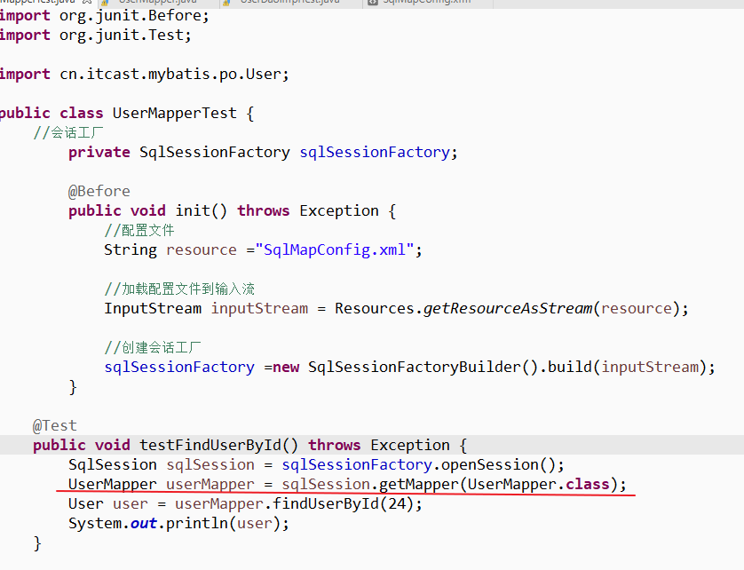

#### mapper 接口返回单个对象和集合对象

不管查询记录是单条还是多条，在 statement 中 resultType 定义一致，都是单条记录映射的 pojo 类型。

mapper 接口方法返回值

- 如果是返回的单个对象，返回值类型是 pojo 类型，生成的代理对象内部通过 selectOne 获取记录.

- 如果返回值类型是集合对象，生成的代理对象内部通过 selectList 获取记录。

#### 输入参数的问题

使用 mapper 代理的方式开发，mapper 接口方法输入 参数只有一个，可扩展性是否很差？？

可扩展性没有问题，因为 dao 层就是通用的，可以通过扩展 pojo（定义 pojo 包装类型）将不同的参数（可以是 pojo 也可以简单类型）传入进去。

## 属性配置和全局参数

### SqlMapConfig.xml

SqlMapConfig.xml 中配置的内容和顺序如下(在 dtd 中定义了)：

properties（属性）
settings（全局配置参数）
typeAliases（类型别名）
typeHandlers（类型处理器）
objectFactory（对象工厂）
plugins（插件）

environments（环境集合属性对象）
environment（环境子属性对象）
transactionManager（事务管理）
dataSource（数据源）
mappers（映射器）

#### properties 属性定义

可以把一些通用的属性值配置在属性文件中，加载到 mybatis 运行环境内。
比如：创建 db.properties 配置数据库连接参数。

注意： MyBatis 将按照下面的顺序来加载属性：

- 在 properties 元素体内定义的属性首先被读取。
- 然后会读取 properties 元素中 resource 或 url 加载的属性，它会覆盖已读取的同名属性。
- 最后读取 parameterType 传递的属性，它会覆盖已读取的同名属性。

建议使用 properties，不要在 properties 中定义属性，只引用定义的 properties 文件中属性，并且 properties 文件中定义的 key 要有一些特殊的规则。

#### settings 全局参数配置

mybatis 运行时可以调整一些全局参数（相当于软件的运行参数），参考：mybatis-settings.xlsx
根据使用需求进行参数配置。
注意：小心配置，配置参数会影响 mybatis 的执行。

ibatis 的全局配置参数中包括很多的性能参数（最大线程数，最大待时间。。。），通过调整这些性能参数使 ibatis 达到高性能的运行，mybatis 没有这些性能参数，由 mybatis 自动调节。

#### typeAliases 类型别名(常用)

可以将 parameterType、resultType 中指定的类型 通过别名引用。

mybaits 提供了很多别名

| 别名      | 映射的类型 | 别名       | 映射的类型 |
| --------- | ---------- | ---------- | ---------- |
| \_byte    | byte       | long       | Long       |
| \_long    | long       | short      | Short      |
| \_short   | short      | int        | Integer    |
| \_int     | int        | integer    | Integer    |
| \_integer | int        | double     | Double     |
| \_double  | double     | float      | Float      |
| \_float   | float      | boolean    | Boolean    |
| \_boolean | boolean    | date       | Date       |
| string    | String     | decimal    | BigDecimal |
| byte      | Byte       | bigdecimal | BigDecimal |

**自定义别名**

```markdown
<!--  定义别名-->
<typeAliases>
	<!--单个别名的定义
	alias:别名 type:别名映射的类型
	-->
	<typeAlias type="cn.itcast.mybatis.po.User" alias="user"/>
	<!-- 批量别名定义
	指定包路径,自动扫描宝下边的pojo,定义别名,别名默认为类名(首字母小写或大写)
	-->
	<package name="cn.itcast.mybatis.po"/>
</typeAliases>
```

使用别名

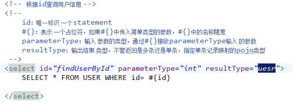

#### typeHandlers 类型处理器

类型处理器将 java 类型和 jdbc 类型进行映射。mybatis 默认提供很多类型处理器，一般情况下够用了。

#### mappers 映射器

- resource 根据文件位置加载
- class 引用 mapper 接口
- package 自动扫描包下接口

```markdown
<!-- 加载mapper.xml -->
<mappers>
	<!-- 通过resource进行mapper的映射 -->
	<mapper resource="sqlmap/User.xml"/>
	<mapper resource="mapper/UserMapper.xml"/>
	<!-- 通过class引用mapper接口
	class:配置mapper.xml和mapper.java同名且在一个目录中
		-->
	<mapper class="cn.itcast.mybatis.mapper.UserMapper"/>
	<!-- 批量mapper配置 
	通过package进行自动扫描包下的mapper接口
	要求:需要mapper.xml和mapper.java同名并且在一个目录中
	-->
	<package name="cn.itcast.mybatis.mapper"/>
</mappers>
```

如果将 spring 整合时,可以使用整合包中提供的 mapper 扫描器,此处的 mappers 不用配置了.

## 输入和输出映射

通过 parameterType 完成输入映射，通过 resultType 和 resultMap 完成输出映射。

- 传递简单类型
- 传递 pojo 类型
- 传递 pojo 包装对象

### parameterType 传递 pojo 包装对象

可以定义 pojo 包装类型扩展 mapper 接口输入参数的内容。

需求：自定义查询条件查询用户信息，需要向 statement 输入查询条件，查询条件可以有 user 信息、商品信息...

```java
//包装对象,使用时在页面获取数据,传给controller,service,mapper
public class UserQueryPo {
	private User user;

	//自定义user的扩展对象(继承User对象)
	private UserCustom userCustom;
    //get/set方法
}
```

userCustom 是 userQueryVo 的属性,通过 OGNL 获取属性的值

```markdown
<!-- 自定义查询条件查询用户的信息
parameterType 指定包装类型
-->
<select id="findUserList" parameterType="userQueryVo" resultType="user">
	select * from user where username like '%${userCustom.username}%'
</select>
```

```java
//UsesrMapper.java接口中
    //自定义查询条件查询用户信息
    public List<User> findUserList(UserQueryVo userQueryVo) throws Exception;
```

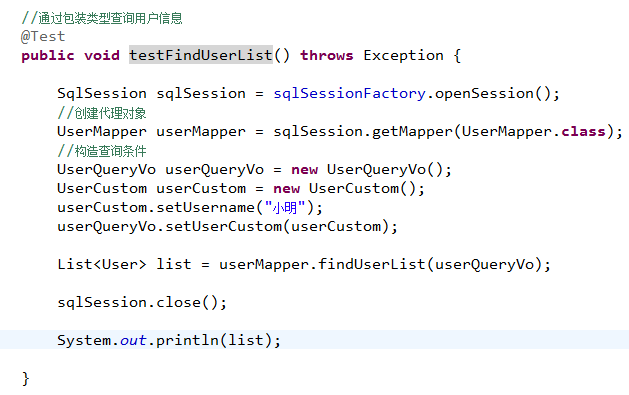

### resultType

指定输出结果的类型（pojo、简单类型、hashmap..），将 sql 查询结果映射为 java 对象 。

- 简单类型
- pojo 对象 结果集单条,内部使用 session.selectone
- pojo 对象列表 结果集可能为多条,内部使用 session.selectList
- HashMap

使用 resultType 注意：sql 查询的列名要和 resultType 指定 pojo 的属性名相同，指定相同 属性方可映射成功，如果 sql 查询的列名要和 resultType 指定 pojo 的属性名全部不相同，list 中无法创建 pojo 对象的。

#### 输出简单类型

功能:自定义查询条件,返回查询记录个数,通常用于实现 查询分页

```markdown
<!--mapper.xml-->
<select id="findUserCount" parameterType="userQueryVo" resultType="int">
	select count(*) from user where username like '%${userCustom.username}%' 
</select>
```

```java
//mapper.java
 	//查询用户返回记录个数
    public int findUserCount(UserQueryVo userQueryVo) throws Exception;
```

查询记录结果集为一条记录且一列使用返回简单类型。

### resultMap

将 sql 查询结果映射为 java 对象。

如果 sql 查询列名和最终要映射的 pojo 的属性名不一致，使用 resultMap 将列名和 pojo 的属性名做一个对应关系 （列名和属性名映射配置)

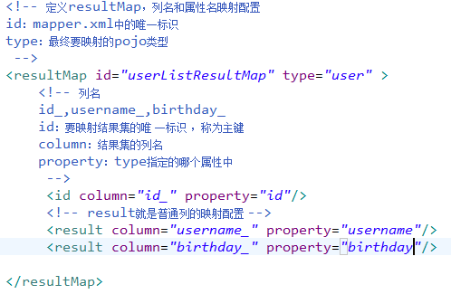

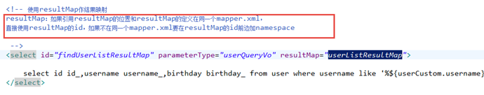

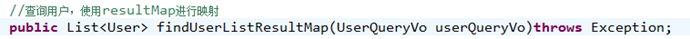

## 动态 sql

mybatis 重点是对 sql 的灵活解析和处理。

需求: 将自定义查询条件查询用户列表和查询用户列表总记录数改为动态 sql

### if 和 where

```markdown
<select id="findUserList" parameterType="userQueryVo" resultType="user">
	select id,username,birthday from user
	<!-- where标签相当 于where关键字，可以自动去除第一个and -->
	<where>
		<!-- 如果 userQueryVo中传入查询条件，再进行sql拼接-->
		<!-- test中userCustom.username表示从userQueryVo读取属性值-->
		<if test="userCustom!=null">
			<if test="userCustom.username!=null and userCustom.username!=''">
				and username like '%${userCustom.username}%'
			</if>
			<if test="userCustom.sex!=null and userCustom.sex!=''">
				and sex = #{userCustom.sex}
			</if>
		</if>
	</where>
</select>
```

### sql 片段

通过 sql 片段可以将通用的 sql 语句抽取出来，单独定义，在其它的 statement 中可以引用 sql 片段。
通用的 sql 语句，常用：where 条件、查询列

将用户查询条件定义为 sql 片段,建议对单表的查询条件单独抽取 sql 片段，提高公用性
注意：不要将 where 标签放在 sql 片段

```markdown
<sql id="query_user_where">
	<if test="userCustom!=null">
		<if test="userCustom.username!=null and userCustom.username!=''">
			and username like '%${userCustom.username}%'
		</if>
		<if test="userCustom.sex!=null and userCustom.sex!=''">
			and sex = #{userCustom.sex}
		</if>
	</if>
 </sql>
```

```markdown
<select id="findUserList" parameterType="userQueryVo" resultType="user">
	select id,username,birthday from user
	<!-- where标签相当 于where关键字，可以自动去除第一个and -->
	<where>
		<!-- 引用sql片段，如果sql片段和引用处不在同一个mapper必须前边加namespace -->
		<include refid="query_user_where"></include>
		<!-- 下边还有很其它的条件 -->
		<!-- <include refid="其它的sql片段"></include> -->
	</where>	
</select>
```

### foreach

在 statement 通过 foreach 遍历 parameterType 中的集合类型。

需求：根据多个用户 id 查询用户信息。

在 userQueryvo 中定义 list&lt;Integer&gt; ids 存储多个 id, 提供 get/set 方法

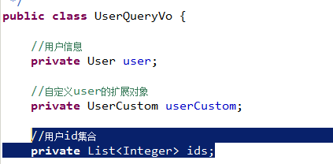

```markdown
<!-- 最终拼接的效果：
SELECT id ,username ,birthday  FROM USER WHERE username LIKE '%小明%' AND id IN (16,22,25)
collection：集合的属性
open：开始循环拼接的串
close：结束循环拼接的串
item：每次循环取到的对象
separator：每两次循环中间拼接的串
-->
<foreach collection="ids" open=" AND id IN ( " close=")" item="id" separator=",">
	#{id}
</foreach>
<!-- 最终拼接的效果：
SELECT id ,username ,birthday  FROM USER WHERE username LIKE '%小明%' AND (id = 16 OR id = 22 OR id = 25) -->
<foreach collection="ids" open=" AND ( " close=")" item="id" separator="OR">
id = #{id}
</foreach>
```

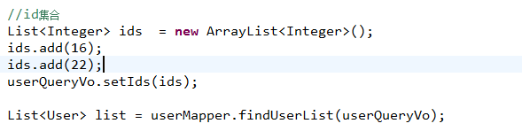
