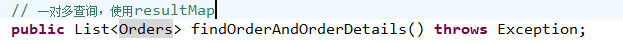
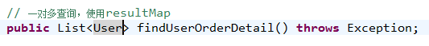

# mybatis-2

高级映射 查询缓存 和 spring 整合

## 商品订单数据模型


用户 user 和订单 orders：
user---->orders：一个用户可以创建多个订单 一对多
orders-->user：一个订单只能由一个用户创建 一对一

订单 orders 和订单明细 orderdetail：
orders-->orderdetail：一个订单可以包括多个订单明细 一对多
orderdetail-->orders：一个订单明细只属于一个订单 一对一

订单明细 orderdetail 和商品信息 items：
orderdetail-->items：一个订单明细对应一个商品信息 一对一
items--> orderdetail：一个商品对应多个订单明细 一对多

## 一对一查询

需求:查询订单信息关联查询用户信息

先确定主查询表：订单信息表
再确定关联查询表：用户信息
通过 orders 关联查询用户使用 user_id 一个外键，只能关联查询出一条用户记录就可以使用内连接

### 使用 resultType 实现

- 创建基础的单表的 po 类
- 一对一查询映射的 pojo 包括 订单信息和用户信息，resultType 才可以完成映射,创建 OrderCustom 作为自定义 pojo，继承 sql 查询列多的 po 类。
- 定义 mapper.xml 文件
- 接口 mapper.java(与 xml 文件,namespace 同名)


### 使用 resultMap 实现一对一

resultMap 提供一对一关联查询的映射和一对多关联查询映射

- 一对一映射：将关联查询的信息映射到 pojo 中(在 Orders 类中创建一个 User 属性，将关联查询的信息映射到 User 属性中)
- 定义 mapper.xml 文件
- resultMap 定义
- 接口 mapper.java


**resultMap 定义(一对一映射)**

```markdown
<resultMap type="orders" id="ordersUserResultMap">
<!-- 完成订单信息的映射配置 -->
<!-- id:订单关联用户查询的唯一标识 -->
	<id column="id" property="id"/>
	<result column="user_id" property="userId"/>
	<result column="number" property="number"/>
	<result column="createtime" property="createtime"/>
	<result column="note" property="note"/>	
	<!-- 关联信息的映射配置
	associaton:用于关联信息映射到单个pojo
	property:要将关联信息映射到orders的哪个属性中
	javatype: 关联嘻嘻映射到orders的水性的类型,是user的类型
	-->
	<association property="user" javaType="user">
		<!-- id:关联信息的唯一标识 -->
		<!--  property:要映射到user的哪个属性中-->
		<id column="user_id" property="id"/>
		<!-- result 就是普通列的映射 -->
		<result column="username" property="username"/>
		<result column="sex" property="sex"/>
	</association>
	
</resultMap>
```


### 小结

- resultType：要自定义 pojo 保证 sql 查询列和 pojo 的属性对应，这种方法相对较简单，所以应用广泛。

- resultMap：使用 association 完成一对一映射需要配置一个 resultMap，过程有点复杂，如果要实现延迟加载就只能用 resultMap 实现 ，如果为了方便对关联信息进行解析，也可以用 association 将关联信息映射到 pojo 中方便解析。

## 一对多查询

需求:查询所有订单信息及订单下的订单明细信息。

主查询表：订单表
关联查询表：订单明细

### resultMap 进行一对多映射

resultMap 提供 collection 完成关联信息映射到集合对象中。


```markdown
<!-- 一对多查询resultMap -->
<resultMap type="orders" id="ordersAndOrderDetails" extends="ordersUserResultMap">
	<!-- 映射订单信息和用户信息,这里使用继承ordersUserResultMap -->
	<!-- 映射订单明细
	property:要将关联信息映射到orders的哪个属性中
	ofType:集合中pojo的类型
	-->
	<collection property="orderdetails" ofType="cn.itcast.mybatis.po.Orderdetail">
		<!-- id:关联信息的唯一标识-->
		<!--  property:要映射到Orderdetail的哪个属性中-->
		<id column="orderdetail_id" property="id"/>
		<result column="items_num" property="itemsNum"/>
		<result column="items_id" property="itemsId"/>	
	</collection>
	
</resultMap>
```



## 一对多查询(复杂)

需求:查询所有用户信息，关联查询订单及订单明细信息及商品信息，订单明细信息中关联查询商品信息

主查询表：用户信息
关联查询：订单、订单明细，商品信息

- 在 user.java 中创建映射的属性：集合 List&lt;Orders&gt; orderlist
- 在 Orders 中创建映射的属性：集合 List&lt;Orderdetail&gt; orderdetails
- 在 Orderdetail 中创建商品属性：pojo Items items


```MARKDOWN
<resultMap type="user" id="userOrderDetailResultMap">
	<!-- 用户信息映射 -->
	<id column="user_id" property="id"/>
	<result column="username" property="username"/>
	<result column="sex" property="sex"/>
	<!-- 订单信息 -->
	<collection property="orderList" ofType="cn.itcast.mybatis.po.Orders">
		<id column="id" property="id"/>
		<result column="user_id" property="userId"/>
		<result column="number" property="number"/>
		<result column="createtime" property="createtime"/>
		<result column="note" property="note"/>
		<!-- 订单明细 -->
		<collection property="orderdetails" ofType="cn.itcast.mybatis.po.Orderdetail">
			<id column="orderdetail_id" property="id"/>
			<result column="items_num" property="itemsNum"/>
			<result column="items_id" property="itemsId"/>
			<!-- 商品信息 -->
			<association property="items" javaType="cn.itcast.mybatis.po.Items">
				<id column="items_id" property="id"/>
				<result column="items_name" property="itemsNum"/>
				<result column="items_detail" property="itemsId"/>
			</association>
		</collection>
	</collection>
</resultMap>
```



## 多对多查询

一对多是多对多的特例。

需求 1：
查询显示字段：用户账号、用户名称、用户性别、商品名称、商品价格(最常见)
企业开发中常见明细列表，用户购买商品明细列表，
使用 resultType 将上边查询列映射到 pojo 输出。

需求 2：
查询显示字段：用户账号、用户名称、购买商品数量、商品明细（鼠标移上显示明细）
使用 resultMap 将用户购买的商品明细列表映射到 user 对象中。

## 延迟加载

### 使用延迟加载意义

在进行数据查询时，为了提高数据库查询性能，尽量使用单表查询，因为单表查询比多表关联查询速度要快。

如果查询单表就可以满足需求，一开始先查询单表，当需要关联信息时，再关联查询，当需要关联信息再查询这个叫延迟加载。

mybatis 中 resultMap 提供延迟加载功能，通过 resultMap 配置延迟加载。

### 配置 mybatis 支持延迟加载

| 设置项                | 描述                                                                                   | 允许值      | 默认值 |
| --------------------- | -------------------------------------------------------------------------------------- | ----------- | ------ |
| lazyLoadingEnabled    | 全局性设置懒加载。如果设为‘false’，则所有相关联的都会被初始化加载。                    | true \false | false  |
| aggressiveLazyLoading | 当设置为‘true’的时候，懒加载的对象可能被任何懒属性全部加载。否则，每个属性都按需加载。 | true \false | true   |

SqlMapConfig.xml 中开启延迟加载开关.

```markdown
<!-- 全局配置参数 -->
<settings>
	<!-- 延迟加载总开关 -->
	<setting name="lazyLoadingEnabled" value="true" />
	<!-- 设置按需加载 -->
	<setting name="aggressiveLazyLoading" value="false" />
</settings>
```

### 延迟加载实现

需求：查询订单及用户的信息，一对一查询。

刚开始只查询订单信息,当需要用户时调用 Orders 类中的 getUser()方法执行延迟加载 ，向数据库发出 sql。


```markdown
<!-- 一对一查询延迟加载resultMap -->
<resultMap type="orders" id="userOrderDetailResultMap">
<!-- 完成订单信息的映射配置 -->
<!-- id:订单关联用户查询的唯一标识 -->
	<id column="id" property="id"/>
	<result column="user_id" property="userId"/>
	<result column="number" property="number"/>
	<result column="createtime" property="createtime"/>
	<result column="note" property="note"/>
	<!-- 配置用户信息的延迟加载 select：延迟加载执行的sql所在的statement的id，如果不在同一个namespace需要加namespace 
		sql：根据用户id查询用户信息 column：关联查询的列 property:将关联查询的用户信息设置到Orders的哪个属性 -->
	<association property="user" select="cn.itcast.mybatis.mapper.UserMapper.findUserById" column="user_id"/>
</resultMap>
```


### 一对多延迟加载

一对多延迟加载的方法同一对一延迟加载，在 collection 标签中配置 select 内容。

## resultType、resultMap、延迟加载使用场景总结

延迟加载实现的方法多种多样，在只查询单表就可以满足需求，为了提高数据库查询性能使用延迟加载，再查询关联信息。

\*mybatis 提供延迟加载的功能用于 service 层。

**resultType**

- 作用：将查询结果按照 sql 列名 pojo 属性名一致性映射到 pojo 中。
- 场合：常见一些明细记录的展示，将关联查询信息全部展示在页面时，此时可直接使用 resultType 将每一条记录映射到 pojo 中，在前端页面遍历 list（list 中是 pojo）即可。

**resultMap**
使用 association 和 collection 完成一对一和一对多高级映射。

**association**

- 作用：将关联查询信息映射到一个 pojo 类中。
- 场合：为了方便获取关联信息可以使用 association 将关联订单映射为 pojo，比如：查询订单及关联用户信息。

**collection**

- 作用：将关联查询信息映射到一个 list 集合中。
- 场合：为了方便获取关联信息可以使用 collection 将关联信息映射到 list 集合中，比如：查询用户权限范围模块和功能，可使用 collection 将模块和功能列表映射到 list 中。

## 查询缓存


### mybatis 持久层缓存

mybatis 提供一级缓存和二级缓存


mybatis 一级缓存是一个 **SqlSession 级别**，sqlsession 只能访问自己的一级缓存的数据，二级缓存是跨 sqlSession，是 **mapper 级别**的缓存，对于 mapper 级别的缓存不同的 sqlsession 是可以共享的。

### 一级缓存

#### 原理


第一次发出一个查询 sql，sql 查询结果写入 sqlsession 的一级缓存中，缓存使用的数据结构是一个 map&lt;key,value&gt;

- key：hashcode + sql + sql 输入参数 + 输出参数（sql 的唯一标识）
- value：用户信息
-

同一个 sqlsession 再次发出相同的 sql，就从缓存中取, 不走数据库。如果两次中间出现 commit 操作（修改、添加、删除），本 sqlsession 中的一级缓存区域全部清空，下次再去缓存中查询不到所以要从数据库查询，从数据库查询到再写入缓存。

每次查询都先从缓存中查询：

- 如果缓存中查询到则将缓存数据直接返回。

- 如果缓存中查询不到就从数据库查询.

#### 一级缓存配置

mybatis 默认支持一级缓存不需要配置。

**注意**：mybatis 和 spring 整合后进行 mapper 代理开发，不支持一级缓存，mybatis 和 spring 整合，spring 按照 mapper 的模板去生成 mapper 代理对象，模板中在最后统一关闭 sqlsession。


### 二级缓存

#### 原理


二级缓存的范围是 mapper 级别（mapper 同一个命名空间），mapper 以命名空间为单位创建缓存数据结构，结构是 map&lt;key、value&gt;。

- 每次查询先看是否开启二级缓存，如果开启从二级缓存的数据结构中取缓存数据，如果从二级缓存没有取到，再从一级缓存中找，如果一级缓存也没有，从数据库查询。

#### mybatis 二级缓存配置

- 在核心配置文件 SqlMapConfig.xml 中加入

```markdown
<setting name="cacheEnabled" value="true"/>
```

|              | 描述                                               | 允许值     | 默认值 |
| ------------ | -------------------------------------------------- | ---------- | ------ |
| cacheEnabled | 对在此配置文件下的所有 cache 进行全局性开/关设置。 | true/false | true   |

- 要在你的 Mapper 映射文件中添加一行： &lt;cache /&gt; ，表示此 mapper 开启二级缓存。

#### 查询结果映射的 pojo 序列化

mybatis 二级缓存需要将查询结果映射的 pojo **实现 java.io.serializable 接口**，如果不实现则抛出异常：org.apache.ibatis.cache.CacheException: Error serializing object. Cause: java.io.NotSerializableException: cn.itcast.mybatis.po.User

二级缓存可以将内存的数据写到磁盘，存在对象的序列化和反序列化，所以要实现 java.io.serializable 接口。

如果结果映射的 pojo 中还包括了 pojo，都要实现 java.io.serializable 接口。

#### 二级缓存禁用

对于变化频率较高的 sql，需要禁用二级缓存：
在 statement 中设置 useCache=false 可以禁用当前 select 语句的二级缓存，即每次查询都会发出 sql 去查询，默认情况是 true，即该 sql 使用二级缓存。

```markdown
<select id="findOrderListResultMap" resultMap="ordersUserMap" useCache="false">
```

#### 刷新缓存

如果 sqlsession 操作 commit 操作，对二级缓存进行刷新（全局清空）。

设置 statement 的 flushCache 是否刷新缓存，默认值是 true。

#### mybatis 的 cache 参数(了解)

mybatis 的 cache 参数只适用于 mybatis 维护缓存。

flushInterval（刷新间隔）可以被设置为任意的正整数，而且它们代表一个合理的毫秒形式的时间段。默认情况是不设置，也就是没有刷新间隔，缓存仅仅调用语句时刷新。
size（引用数目）可以被设置为任意正整数，要记住你缓存的对象数目和你运行环境的可用内存资源数目。默认值是 1024。

readOnly（只读）属性可以被设置为 true 或 false。只读的缓存会给所有调用者返回缓存对象的相同实例。因此这些对象不能被修改。这提供了很重要的性能优势。可读写的缓存会返回缓存对象的拷贝（通过序列化）。这会慢一些，但是安全，因此默认是 false。

```markdown
<cache  eviction="FIFO"  flushInterval="60000"  size="512"  readOnly="true"/>
```

这个更高级的配置创建了一个 FIFO 缓存,并每隔 60 秒刷新,存数结果对象或列表的 512 个引用,而且返回的对象被认为是只读的,因此在不同线程中的调用者之间修改它们会导致冲突。可用的收回策略有, 默认的是 LRU:

1. LRU – 最近最少使用的:移除最长时间不被使用的对象。
2. FIFO – 先进先出:按对象进入缓存的顺序来移除它们。
3. SOFT – 软引用:移除基于垃圾回收器状态和软引用规则的对象。
4. WEAK – 弱引用:更积极地移除基于垃圾收集器状态和弱引用规则的对象。

#### mybatis 和 ehcache 缓存框架整合

mybatis 二级缓存通过 ehcache 维护缓存数据。

- 分布缓存 将缓存数据数据进行分布式管理。


- mybatis 和 ehcache 思路: 通过 mybatis 和 ehcache 框架进行整合，就可以把缓存数据的管理托管给 ehcache。在 mybatis 中提供一个 cache 接口，只要实现 cache 接口就可以把缓存数据灵活的管理起来。


mybatis 中默认实现：


- 和 ehcache 整合的 jar 包: ehcache-core-2.6.5.jar, mybatis-ehcache-1.0.2.jar

- ehcache 对 cache 接口的实现类


- 配置 ehcache.xml 全局属性

```markdown
<ehcache xmlns:xsi="http://www.w3.org/2001/XMLSchema-instance"
	xsi:noNamespaceSchemaLocation="../config/ehcache.xsd">

<!--diskStore：缓存数据持久化的目录 地址  -->
<diskStore path="F:\develop\ehcache" />
<defaultCache 
		maxElementsInMemory="1000" 
		maxElementsOnDisk="10000000"
		eternal="false" 
		overflowToDisk="false" 
		diskPersistent="true"
		timeToIdleSeconds="120"
		timeToLiveSeconds="120" 
		diskExpiryThreadIntervalSeconds="120"
		memoryStoreEvictionPolicy="LRU">
</defaultCache>
</ehcache>
```

- 整合测试 在 mapper.xml 添加 ehcache 配置(针对当前 mapper)

```markdown
<!-- 开启二级缓存 -->
<!-- 单位：毫秒 -->
<cache type="org.mybatis.caches.ehcache.EhcacheCache">
	<property name="timeToIdleSeconds" value="12000"/>
	<property name="timeToLiveSeconds" value="3600"/>
	<!-- 同ehcache参数maxElementsInMemory -->
	<property name="maxEntriesLocalHeap" value="1000"/>
	<!-- 同ehcache参数maxElementsOnDisk -->
	<property name="maxEntriesLocalDisk" value="10000000"/>
	<property name="memoryStoreEvictionPolicy" value="LRU"/>
</cache>
```

#### 二级缓存的应用场景

- 对查询频率高，变化频率低的数据建议使用二级缓存。
- 对于访问多的查询请求且用户对查询结果实时性要求不高，此时可采用 mybatis 二级缓存技术降低数据库访问量，提高访问速度，业务场景比如：耗时较高的统计分析 sql、电话账单查询 sql 等。

实现方法如下：通过设置刷新间隔时间，由 mybatis 每隔一段时间自动清空缓存，根据数据变化频率设置缓存刷新间隔 flushInterval，比如设置为 30 分钟、60 分钟、24 小时等，根据需求而定。

#### mybatis 二级缓存的局限性

mybatis 二级缓存对细粒度的数据级别的缓存实现不好，比如如下需求：对商品信息进行缓存，由于商品信息查询访问量大，但是要求用户每次都能查询最新的商品信息，此时如果使用 mybatis 的二级缓存就无法实现当一个商品变化时只刷新该商品的缓存信息而不刷新其它商品的信息，因为 mybaits 的二级缓存区域以 mapper 为单位划分，当一个商品信息变化会将所有商品信息的缓存数据全部清空。解决此类问题需要在业务层根据需求对数据有针对性缓存。

## mybatis 和 spring 整合

### mybaits 和 spring 整合的思路

1. 让 spring 管理 SqlSessionFactory
2. 让 spring 管理 mapper 对象和 dao: 使用 spring 和 mybatis 整合开发 mapper 代理及原始 dao 接口。自动开启事务，自动关闭 sqlsession.
3. 让 spring 管理数据源( 数据库连接池)

### 创建整合工程

- mybatis3.2.7 本身的 jar 包,数据库驱动包,spring3.2.0,spring 和 mybatis 整合包
- log4j.properties
- sqlMapconfig.xml mybatis 配置文件：别名、settings，数据源不在这里配置(spring)
- applicationContext.xml
  1. 数据源（dbcp 连接池）
  2. SqlSessionFactory
  3. mapper 或 dao

#### 整合开发原始 dao 接口

```markdown
<!-- SqlSessionFactory -->
<bean id="sqlSessionFactory" class="org.mybatis.spring.SqlSessionFactoryBean">
	<!-- 数据源 -->
	<property name="dataSource" ref="dataSource"/>
	<!-- mybatis配置文件 -->
	<property name="configLocation" value="classpath:mybatis/SqlMapConfig.xml"></property>
</bean>

<!-- 配置dao -->
<bean id="userDao" class="cn.itcast.mybatis.dao.UserDaoImpl">
	<property name="sqlSessionFactory" ref="sqlSessionFactory"/>
</bean>
```

```java
public class UserDaoImpl extends SqlSessionDaoSupport implements UserDao {

	@Override
	public User findUserById(int id) throws Exception {

		// 创建SqlSession
		SqlSession sqlSession = this.getSqlSession();
		// 根据id查询用户信息
		User user = sqlSession.selectOne("test.findUserById", id);

		return user;

	}
}
```

- 测试 dao 接口

```java
public class UserDaoImplTest {

	private ApplicationContext applicationContext;
	@Before
	public void setUp() throws Exception {
		//创建spring容器
		applicationContext = new ClassPathXmlApplicationContext("spring/applicationContext.xml");
	}
	@Test
	public void testFindUserById() throws Exception {

		//从spring容器中获取UserDao这个bean
		UserDao userDao = (UserDao) applicationContext.getBean("userDao");
		User user = userDao.findUserById(1);
		System.out.println(user);
	}
}
```

#### 整合开发 mapper 代理方法

- 开发 mapper.xml 和 mapper.java

- 使用 MapperFactoryBean( 用此方法对于每个 mapper 都需要配置，比较繁琐) [在 mybatisspring 的整合包下找]

```markdown
<!-- 配置mapper
MapperFactoryBean 用于生成mapper代理对象-->
<bean id="userMapper" class="org.mybatis.spring.mapper.MapperFactoryBean">
	<property name="mapperInterface" value="cn.itcast.mybatis.mapper.UserMapper"/>
	<property name="sqlSessionFactory" ref="sqlSessionFactory"/>>
</bean>
```

- 使用 MapperScannerConfigurer（扫描 mapper）使用扫描器自动扫描 mapper，生成代理对象，比较方便。

```markdown
<!--
MapperScannerConfigurer：mapper的扫描器，将包下边的mapper接口自动创建代理对象，
自动创建到spring容器中，bean的id是mapper的类名（首字母小写）
	-->
<bean class="org.mybatis.spring.mapper.MapperScannerConfigurer">
	<!-- 配置扫描包的路径,如果要扫描多个包,中间使用逗号分隔 -->
	<property name="basePackage" value="cn.itcast.mybatis.mapper"/>
	<property name="sqlSessionFactoryBeanName" value="sqlSessionFactory"/>
</bean>
```

- 测试 mapper 接口


## mybatis 逆向工程 （MyBatis Generator）


mybatis 官方为了提高开发效率，提高自动对单表生成 sql，包括 ：mapper.xml、mapper.java、表名.java(po 类)

mybatis 逆向工程的方向(使用通过 java 程序运行逆向工程)：由数据库表----》java 代码

逆向工程运行所需要的 jar 包：mybatis-generator-core-1.3.2.jar, 数据库驱动包


12.2.1 xml 配置

```markdown
<?xml version="1.0" encoding="UTF-8"?>
<!DOCTYPE generatorConfiguration
  PUBLIC "-//mybatis.org//DTD MyBatis Generator Configuration 1.0//EN"
  "http://mybatis.org/dtd/mybatis-generator-config_1_0.dtd">

<generatorConfiguration>
	<context id="testTables" targetRuntime="MyBatis3">
		<commentGenerator>
			<!-- 是否去除自动生成的注释 true：是 ： false:否 -->
			<property name="suppressAllComments" value="true" />
		</commentGenerator>
<!---------------------------------------------------------------------->		
		<!--数据库连接的信息：驱动类、连接地址、用户名、密码 -->
		<jdbcConnection driverClass="com.mysql.jdbc.Driver"
			connectionURL="jdbc:mysql://localhost:3306/mybatis" userId="root"
			password="mysql">
		</jdbcConnection>
		<!-- <jdbcConnection driverClass="oracle.jdbc.OracleDriver"
			connectionURL="jdbc:oracle:thin:@127.0.0.1:1521:yycg" 
			userId="yycg"
			password="yycg">
		</jdbcConnection> -->
<!---------------------------------------------------------------------->		
		<!-- 默认false，把JDBC DECIMAL 和 NUMERIC 类型解析为 Integer，为 true时把JDBC DECIMAL 和 
			NUMERIC 类型解析为java.math.BigDecimal -->
		<javaTypeResolver>
			<property name="forceBigDecimals" value="false" />
		</javaTypeResolver>
<!---------------------------------------------------------------------->		
		<!-- targetProject:生成PO类的位置 -->
		<javaModelGenerator targetPackage="cn.itcast.mybatis.po"
			targetProject=".\src">
			<!-- enableSubPackages:是否让schema作为包的后缀 -->
			<property name="enableSubPackages" value="false" />
			<!-- 从数据库返回的值被清理前后的空格 -->
			<property name="trimStrings" value="true" />
		</javaModelGenerator>
<!---------------------------------------------------------------------->			
        <!-- targetProject:mapper映射文件生成的位置 -->
		<sqlMapGenerator targetPackage="cn.itcast.mybatis.mapper" 
			targetProject=".\src">
			<!-- enableSubPackages:是否让schema作为包的后缀 -->
			<property name="enableSubPackages" value="false" />
		</sqlMapGenerator>
<!---------------------------------------------------------------------->			
		<!-- targetPackage：mapper接口生成的位置 -->
		<javaClientGenerator type="XMLMAPPER"
			targetPackage="cn.itcast.mybatis.mapper" 
			targetProject=".\src">
			<!-- enableSubPackages:是否让schema作为包的后缀 -->
			<property name="enableSubPackages" value="false" />
		</javaClientGenerator>
<!---------------------------------------------------------------------->			
		<!-- 指定数据库表 -->
		<table tableName="items"></table>
		<table tableName="orders"></table>
		<table tableName="orderdetail"></table>
		<!-- <table schema="" tableName="sys_user"></table>
		<table schema="" tableName="sys_role"></table>
		<table schema="" tableName="sys_permission"></table>
		<table schema="" tableName="sys_user_role"></table>
		<table schema="" tableName="sys_role_permission"></table> -->
```

通过 java 程序生成 mapper 类、po 类。


- 配置 generatorConfig.xml
- 配置执行 java 程序,执行 java 程序后，所生成的代码已经生成到 工程中。
- 将生成的代码拷贝到工程中
- 测试生成的代码
