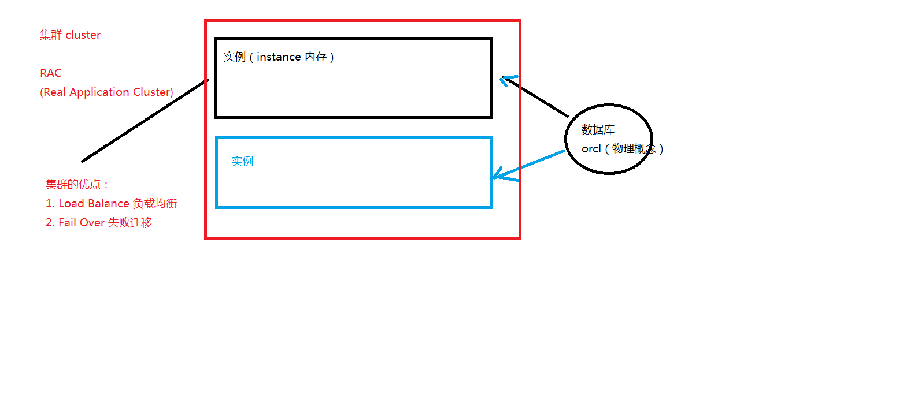
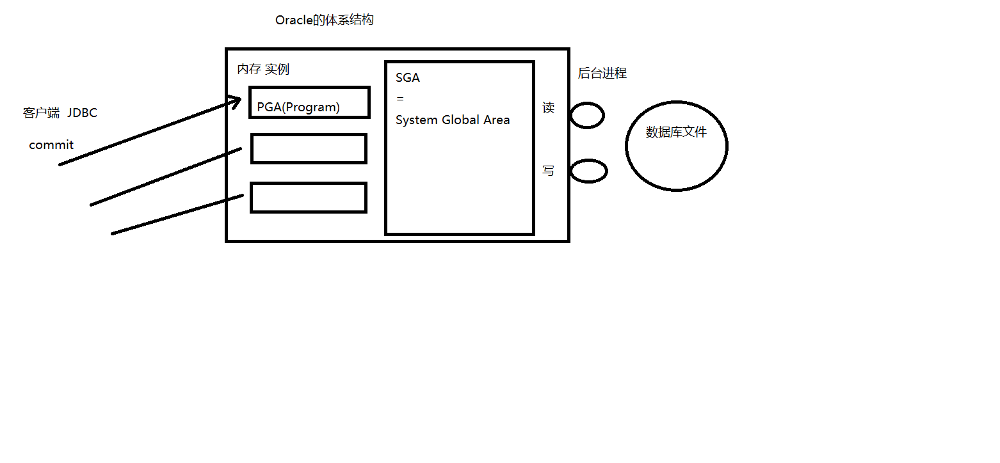
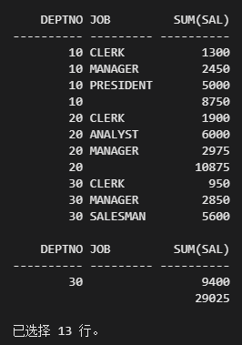
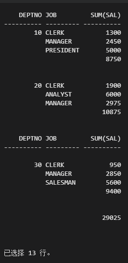

# oracle-1

## 1. 安装

安装版本 11g，注意口令设置

遇到的问题，将 win10 加入注册表，修改对环境变量 Path 长度上限的校验，将数据库语言修改为英语。

https://localhost:1158/em/ 访问 Enterprise Manager

## 2. 概念





## 3. 基本查询 select

```text
SQL> --清屏
SQL> host cls

SQL> --当前用户
SQL> show user

SQL> --当前用户下的表
SQL> select * from tab;

SQL> --emp表的结构
SQL> desc emp

SQL> --查询所有员工的所有信息
SQL> select * from emp;

SQL> --设置行宽
SQL> show linesize
linesize 80
SQL> set linesize 150
SQL> --设置列宽
SQL> col ename for a8 （8位字符）
SQL> col sal for 9999  （一个9代表一位数字）
SQL> / (执行上一条sql语句)

SQL> --查询员工信息：员工号 姓名 月薪 年薪
SQL> select empno,ename,sal,sal*12
  2  form emp; （支持算数表达式）

SQL> --查询员工信息：员工号 姓名 月薪 年薪
SQL> select empno,ename,sal,sal*12
  2  form emp;
form emp
     *
第 2 行出现错误:
ORA-00923: 未找到要求的 FROM 关键字


SQL> --c命令  change
SQL> 2 （指定要改的行）
  2* form emp
SQL> c /form/from
  2* from emp
SQL> /

SQL> /*
SQL> SQL中null值:
SQL> 1. 包含null的表达式都为null
SQL> 2. null永远!=null
SQL> */
SQL> select empno,ename,sal,sal*12,comm,sal*12+nvl(comm,0)
  2  from emp;（nvl(a,b)表示当a的值为null时返回b，不为null时返回a）

SQL> select *
  2  from emp
  3  where comm=null;
未选定行
SQL> select *
  2  from emp
  3  where comm is null;
...
已选择 10 行。

SQL> ed
已写入 file afiedt.buf(将上一条sql语句放入系统默认的编辑器中)

  1  select empno as "员工号",ename "姓名",sal "月    薪",sal*12,comm,sal*12+nvl(comm,0)
  2* from emp
SQL> /
（as可以省略，当别名中带有空格或特殊字符时必须要用双引号）

SQL> --distinct  去掉重复记录
SQL> select distinct deptno from emp;
SQL> select distinct deptno,job from emp;
SQL> --distinct作用于后面所有的列
```

```text
SQL> --连接符
SQL> --concat
SQL> select concat('Hello','  World');
select concat('Hello','  World')
                               *
第 1 行出现错误:
ORA-00923: 未找到要求的 FROM 关键字


SQL> select concat('Hello','  World') from emp;(select语句必须带from，不然会报错)

CONCAT('HELL
------------
Hello  World
Hello  World
Hello  World
Hello  World
Hello  World
Hello  World
Hello  World
Hello  World
Hello  World
Hello  World
Hello  World

CONCAT('HELL
------------
Hello  World
Hello  World
Hello  World

已选择 14 行。

SQL> select concat('Hello','  World') from dual;

CONCAT('HELL
------------
Hello  World

SQL> select 3+2 from dual;

       3+2
----------
         5


SQL> --dual表：伪表 （是为了满足select语句语法的要求）
SQL> select 'Hello'||' Word' 字符串 from dual;

字符串
----------
Hello Word

SQL> --查询员工信息：***的薪水是****
SQL> select ename||'的薪水是'||sal 信息 from emp;

信息
----------------------------------------------------------
SMITH的薪水是800
ALLEN的薪水是1600
WARD的薪水是1250
JONES的薪水是2975
MARTIN的薪水是1250
BLAKE的薪水是2850
CLARK的薪水是2450
SCOTT的薪水是3000
KING的薪水是5000
TURNER的薪水是1500
ADAMS的薪水是1100

信息
----------------------------------------------------------
JAMES的薪水是950
FORD的薪水是3000
MILLER的薪水是1300

已选择 14 行。

SQL> spool d:\基本查询.txt(打在一开始)
...
SQL> spool off（结束，录屏成文本文件）
```

- 字符串可以试 select 列表中的一个字符，数字日期
- 日期和字符只能在单引号中出现
- 双引号用来写列的别名

## 4. 过滤 where

```text
SQL> --查询10号部门的员工
SQL> select *
  2  from emp
  3  where deptno=10;
===========================
SQL> --字符串大小写敏感
SQL> --查询名叫KING的员工
SQL> select *
  2  from emp
  3  where ename='KING';
SQL> ed
已写入 file afiedt.buf

  1  select *
  2  from emp
  3* where ename='King';（字符串King和KING不同）
SQL> /

未选定行
==========================
SQL> --日期格式敏感
SQL> --查询入职日期是17-NOV-81的员工信息
SQL> select *
  2  from emp
  3  where hiredate='17-NOV-81';(11不行,必须和表中日期格式完全相同)
==========================
SQL> --改日期格式
SQL> select * from v$nls_parameters;
SQL> alter session set NLS_DATE_FORMAT='yyyy-mm-dd';
```

### 4.1 比较运算

```text
=,>,>=,<=,<>(!=)
赋值使用  ：=
BETWEEN...AND...两个值之间，包含边界
IN(set) 等于值列表中的一个
LIKE模糊查询
IS NULL 空值
```

```text
SQL> --between... and
SQL> --查询薪水1000~2000之间的员工
SQL> select *
  2  from emp
  3  where sal between 1000 and 2000;

SQL> --注意：1. 含有边界  2. 小值在前 大值在后

SQL> --in 在集合中
SQL> --查询部门号是10和20的员工
SQL> select *
  2  from emp
  3  where deptno in (10,20);
==============================
SQL> --模糊查询
SQL> --查询名字以S打头的员工
SQL> select *
  2  from emp
  3  where ename like 'S%';('%'任意个任意字符串，'_'任意的一个字符)
SQL> --查询名字是4个字的员工
SQL> ed
已写入 file afiedt.buf

  1  select *
  2  from emp
  3* where ename like '____'
SQL> /
SQL> --查询名字中含有下划线的员工
SQL> select *
  2  from emp
  3  where ename like '%_%';(错误，下划线需要使用转义字符)
SQL> --转意字符
SQL> ed
已写入 file afiedt.buf

  1  select *
  2  from emp
  3* where ename like '%\_%' escape '\'
SQL> /
==============================
SQL> rollback;(回滚，oracle中的事务是自动开启的)
```

### 4.2 逻辑运算

AND，OR，NOT
判断条件时，从右往左解析判断。

### 4.3 优先级

| 优先级 |                               |
| ------ | ----------------------------- |
| 1      | 算数运算符                    |
| 2      | 连接符                        |
| 3      | 比较符                        |
| 4      | IS [NOT] NULL, LIKE, [NOT] IN |
| 5      | [NOT] BETWEEN                 |
| 6      | NOT                           |
| 7      | AND                           |
| 8      | OR                            |

可以使用括号来改变优先级

## 5. 排序 order by

- ASC 升序
- DESC 降序
- ORDER BY 子语句在 SELECT 语句的结尾

```text
SQL> --order by 后面 + 列，表达式，别名，序号
SQL> --查询员工信息，按照月薪排序
SQL> select *
  2  from emp
  3  order by sal;
============================
SQL> select ename,sal,sal*12
  2  from emp
  3  order by sal*12 desc;
============================
SQL> ed
已写入 file afiedt.buf

  1  select ename,sal,sal*12 年薪（给表达式取别名）
  2  from emp
  3* order by 年薪 desc
SQL> /
============================
SQL> ed
已写入 file afiedt.buf

  1  select ename,sal,sal*12 年薪
  2  from emp
  3* order by 3 desc（序号，从1开始，select-list的第三列）
SQL> /
============================
SQL> --多个列排序
SQL> --order by 作用于后面所有的列，desc只作用于离他最近的一列
SQL> select *
  2  from emp
  3  order by deptno,sal;（先按照第一列升序，如第一列相同按第二列升序）
SQL> ed
已写入 file afiedt.buf

  1  select *
  2  from emp
  3* order by deptno,sal desc（先按照第一列升序，再按照第二列降序）
============================
SQL> --查询员工信息，按照奖金排序
SQL> --null 4. nul值排序
SQL> select *
  2  from emp
  3  order by comm;
（有值的升序，null值的放在后面）
SQL> --a命令  append （在上条语句后面追加）
SQL> a  desc（注意：desc前至少两个空格）
  3* order by comm desc
SQL> /
（没有comm数据的在前，有值的按降序排在后，不符合正常使用习惯）
SQL> ed
已写入 file afiedt.buf

  1  select *
  2  from emp
  3  order by comm desc
  4* nulls last
SQL> /
```

## 6. 单行函数

### 6.1 字符函数

- 大小写控制函数 lower，upper，initcap

```text
SQL> --字符函数
SQL> select lower('Hello World') 小写,upper('Hello World') 大写,initcap('hello world') 首字母大写
  2  from dual;
  小写        大写        首字母大写
----------- ----------- -----------
hello world HELLO WORLD Hello World
```

- 字符空值函数 concat, susstr, length 字符数/lengthb 字节数, instr 查找字符串,lpad 往前填充|rpad 往右填充，trim 去掉前后指定的字符，replace

```text
SQL> --substr(a,b) 从a中，第b位开始取
SQL> select substr('Hello World',3) from dual;

SUBSTR('H
---------
llo World

SQL> --substr(a,b,c) 从a中，第b位开始取,取c位
SQL> select substr('Hello World',3,4) from dual;

SUBS
----
llo                                                                        ============================
SQL> --length 字符数 lengthb 字节数
SQL> select length('Hello World') 字符,lengthb('Hello World') 字节
  2  from dual;

      字符       字节
---------- ----------
        11         11

SQL> ed
已写入 file afiedt.buf

  1  select length('北京') 字符,lengthb('北京') 字节
  2* from dual
SQL> /

      字符       字节
---------- ----------
         2          4
============================
SQL> --instr(a,b) 在a中，查询b
SQL> select instr('Hello World','ll') 位置 from dual;

      位置
----------
         3
============================
SQL> --lpad 左填充 rpad右填充
SQL> -- abcd  ---> 10位（把四位字符串变成10位，补六位）
SQL> select lpad('abcd',10,'*') 左,rpad('abcd',10,'*') 右
  2  from dual;

左         右
---------- ----------
******abcd abcd******
============================
SQL> --trim 去掉前后指定的字符
SQL> select trim('H' from 'Hello WorldH') from dual;

TRIM('H'FR
----------
ello World
============================
SQL> --replace 替换
SQL> select replace('Hello World','l','*') from dual;

REPLACE('HE
-----------
He**o Wor*d
```

### 6.2 数字函数

ROUND 四舍五入，TRUNC 截断，MOD 求余

```text
SQL> --四舍五入
SQL> select round(45.926,2) 一,round(45.926,1) 二,round(45.926,0) 三,
  2         round(45.926,-1) 四,round(45.926,-2) 五
  3  from dual;

        一         二         三         四         五
---------- ---------- ---------- ---------- ----------
     45.93       45.9         46         50          0
============================
SQL> --截断
SQL> ed
已写入 file afiedt.buf

  1  select trunc(45.926,2) 一,trunc(45.926,1) 二,trunc(45.926,0) 三,
  2         trunc(45.926,-1) 四,trunc(45.926,-2) 五
  3* from dual
SQL> /

        一         二         三         四         五
---------- ---------- ---------- ---------- ----------
     45.92       45.9         45         40          0
```

### 6.3 日期函数

Oracle 中的日期型数据实际含有两个值：日期和时间。

```text
SQL> --日期
SQL> --当前时间
SQL> select sysdate from dual;

SYSDATE
---------
21-JUN-20

SQL> select to_char(sysdate,'yyyy-mm-dd hh24:mi:ss') from dual;
(将日期数据按照格式转化为字符串)
TO_CHAR(SYSDATE,'YY
-------------------
2020-06-21 16:47:20
```

日期之间的运算

- 在日期上加上或减去一个数字结果仍为日期
- 两个日期相减返回日期之间相差的天数
- 可以用数字除以 24 来向日期中加上或减去小时

```text
SQL> --昨天 今天 明天
SQL> select (sysdate-1) yesterday,sysdate today,(sysdate+1) tomorrow from dual;

YESTERDAY TODAY     TOMORROW
--------- --------- ---------
20-JUN-20 21-JUN-20 22-JUN-20

SQL> --计算员工的工龄：天  星期 月 年
SQL> SQL> select ename, hiredate, (sysdate-hiredate) as "day", (sysdate-hiredate)/7 "week",
  2  (sysdate-hiredate)/30 as "month",(sysdate-hiredate)/365 "year"
  3  from emp;

SQL> select hiredate+sysdate from emp;
select hiredate+sysdate from emp
               *
第 1 行出现错误:
ORA-00975: 不允许日期 + 日期
```

| 函数           | 描述                   |
| -------------- | ---------------------- |
| MONTHS_BETWEEN | 两个日期相差的月数     |
| ADD_MONTHS     | 向指定日期中加上若干月 |
| NEXT_DAY       | 指定日期的下一个日期   |
| LAST_DAY       | 本月的最后一天         |
| ROUND          | 日期四舍五入           |
| TRUNC          | 日期截断               |

```text
SQL> --months_between
SQL> select ename,hiredate,(sysdate-hiredate)/30  一,months_between(sysdate,hiredate) 二
  2  from emp;

SQL> --78个月后-(-78则表示78个月以前)
SQL> --add_months
SQL> select add_months(sysdate,78) from dual;

ADD_MONTHS(SYS
--------------
10-9月 -21
=====================================
SQL> --last_day 月的最后一天
SQL> select last_day(sysdate) from dual;

LAST_DAY(SYSDA
--------------
31-3月 -15
=====================================
SQL> --next_day
SQL> --下一个星期二
SQL> select next_day(sysdate,'星期二') from dual;

NEXT_DAY(SYSDA
--------------
17-3月 -15

SQL> select next_day(sysdate,'星期三') from dual;

NEXT_DAY(SYSDA
--------------
11-3月 -15

SQL>
SQL> select next_day(sysdate,'礼拜三') from dual;
select next_day(sysdate,'礼拜三') from dual
                        *
第 1 行出现错误:
ORA-01846: 周中的日无效 （必须和系统格式相同）

=====================================
next_day的应用：每个星期一自动备份数据
1. 分布式数据库
2. 快照
=====================================
SQL> --对日期四舍五入
SQL> select round(sysdate,'month'),round(sysdate,'year') from dual;

ROUND(SYSDATE, ROUND(SYSDATE,
-------------- --------------
01-3月 -15     01-1月 -15
```

### 6.4 转化函数

数据类型转化:隐式，显式

#### 6.4.1 隐式数据类型转换

隐式转换的前提：被转换对象是可以转换的

Oracle 自动完成下列转换

| 原数据类型       | 目标数据类型 |
| ---------------- | ------------ |
| VARCHAR2 or CHAR | NUMBER       |
| VARCHAR2 or CHAR | DATE         |
| NUMBERY          | VARCHAR2     |
| DATE             | VARCHAR2     |

#### 6.4.2 显式数据类型转换

- NUMBER -- TO_CHAR -- CHAR -- TO_NUMBER --NUMBER
- CHAR -- TO_DATE -- DATE -- TO_CHAR -- CHAR

**to_char**

- 必须包含在单引号中且大小写敏感
- 可以包含任意有效格式日期
- 日期之间用逗号隔开
-

有效日期格式：YYYY，YEAR，MM，MONTH，DY，DAY，DD

TO_CHAR 函数对日期的转换，TO_DATE 是反过来

```text
SQL> --2015-03-10 15:23:12今天是星期二
SQL> select to_char(sysdate,'yyyy-mm-dd hh24:mi:ss"今天是"day') from dual;

TO_CHAR(SYSDATE,'YYYY-MM-DDHH24:MI
----------------------------------
2015-03-10 15:24:38今天是星期二
```

TO_CHAR 函数对数字的转换

| 转换数字常用格式 |              |
| ---------------- | ------------ |
| 9                | 数字         |
| 0                | 零           |
| \$               | 美元符号     |
| L                | 本地货币符号 |
| .                | 小数点       |
| ,                | 千分位       |

```text
SQL> --查询员工薪水：两位小数 千位符 货币代码
SQL> select to_char(sal,'L9,999.99') from emp;

TO_CHAR(SAL,'L9,999
-------------------
           ￥800.00
```

### 6.5 通用函数

适用于任何的数据类型，同时也适用于空值

- NVL(expr1,expr2)
- NVL2(expr1,expr2,expr3)
- NULLIF(expr1,expr2)
- COALESCE(expr1,expr2,...,exprn)

```text
SQL> --nvl2(a,b,c) 当a=null时候，返回c，否则返回b
SQL> select sal*12+nvl2(comm,comm,0) from emp;
==============================================
SQL> --nullif(a,b) 当a=b时候，返回null，否则返回a
SQL> select nullif('abc','abc') 值 from dual;
==============================================
SQL> select nullif('abc','abcd') 值 from dual;

值
---
abc
==============================================
SQL> --coalesce 从左到右找到第一个不为null的值
SQL> select comm,sal,coalesce(comm,sal) "第一个不为null的值"
  2  from emp;

      COMM        SAL 第一个不为null的值
---------- ---------- ------------------
                  800                800
       300       1600                300
       500       1250                500
                 2975               2975
      1400       1250               1400
         0       1500                  0
                 1100               1100
```

### 6.6 条件表达式

- CASE 表达式
- DECODE 函数

```text
SQL> --涨工资，总裁1000 经理800 其他400
SQL> select ename,job,sal 涨前,
  2         case job when 'PRESIDENT' then sal+1000
  3                  when 'MANAGER' then sal+800
  4                  else sal+400
  5          end 涨后
  6  from emp;
=======================================================
SQL> select ename,job,sal 涨前,
  2         decode(job,'PRESIDENT',sal+1000,
  3                    'MANAGER',sal+800,
  4                              sal+400) 涨后
  5  from emp;
```

## 7. 多行函数（分组函数）

作用于一组数据，并对一组数据返回一个值

常用组函数：AVG,COUNT,MAX,MIN,SUM

```text
SQL> --工资总额
SQL> select sum(sal) from emp;

SQL> --人数
SQL> select count(*) from emp;

SQL> --平均工资
SQL> select sum(sal)/count(*) 一,avg(sal) 二 from emp;

        一         二
---------- ----------
2073.21429 2073.21429
SQL> --平均奖金（有空值）
SQL> select sum(comm)/count(*) 一,sum(comm)/count(comm) 二,avg(comm) 三
  2  from emp;

        一         二         三
---------- ---------- ----------                                                                 57.142857        550        550
SQL> select count(*),count(comm) from emp;

  COUNT(*) COUNT(COMM)
---------- -----------
        14           4

SQL> select count(DISTINCT deptno) from emp;
返回deotno非空且不重复的记录总数
```

## 8. 分组数据 group by

- 在 SELECT 列表中所有未包含在组函数中的列都应该包含在 GROUP BY 子句中
- 包含在 GROUP BY 子句中的列不必须包含在 SELECT 列表中

```text
SQL> --求部门的平均工资
SQL> select deptno,avg(sal)
  2  from emp
  3  group by deptno;

SQL> --多个列的分组
SQL> select deptno,job,sum(sal)
  2  from emp
  3  group by deptno,job
  4  order by 1;
SQL> --多个列的分组: 先按照第一个列分组，如果相同，再按照第二列分组，以此类推
```

## 9. 过滤分组 having

where 和 having 最大的区别：where 后面不能使用组函数

```text
SQL> --求平均工资大于2000的部门
SQL> select deptno,avg(sal)
  2  from emp
  3  group by deptno
  4  having avg(sal) > 2000;

SQL> --查询10号部门的平均工资
SQL> select deptno,avg(sal)
  2  from emp
  3  group by deptno
  4  having deptno=10;

SQL> ed
已写入 file afiedt.buf

  1  select deptno,avg(sal)
  2  from emp
  3  where deptno=10
  4* group by deptno
SQL> /
```

## 10. group by 的增强

group by rollup(a,b)

```text
select deptno,job,sum(sal) from emp group by deptno,job
 +
select depton,sum(sal) from emp group by deptno
 +
select sum(sal) from emp
 =
select deptno,job,sum(sal) from emp group by rollup(deptno,job);

group by rollup(a,b)
 =
group by a,b
 +
group by a
 +
group by null
```

```text
SQL> select deptno,job,sum(sal) from emp group by rollup(deptno,job);
```



```text
SQL> break on deptno skip 2（相同deptno只显示一次，不同跳过两行）
SQL> /
```



```text
SQL> break on null（取消当前布局）
SQL> /
```

## 字符和日期

- 字符和日期要包含在单引号中
- 字符串大小写敏感，日期格式敏感
- 默认的日期格式是 DD-MON-RR

## SQL 优化的原则

1. 使用列名代替\*
2. where 解析顺序: 右--> 左
3. 尽量使用 where
4. 理论上，尽量使用多表查询
5. 尽量不要使用集合运算

## SQL 中的 null 值

1. 包含 null 的表达式都为 null（如算数表达式中其中一个为 null，那么这个表达式结果就是 null）
2. null 永远!=null
3. 如果集合中，含有 null，不能使用 not in; 但可以使用 in
4. nul 值排序，Oracle 中，null 最大，nulls last 追加在句末可以把空值放到后面
5. 组函数会自动滤空，可以嵌套滤空函数来屏蔽他的滤空功能 count(nvl(comm,0))
