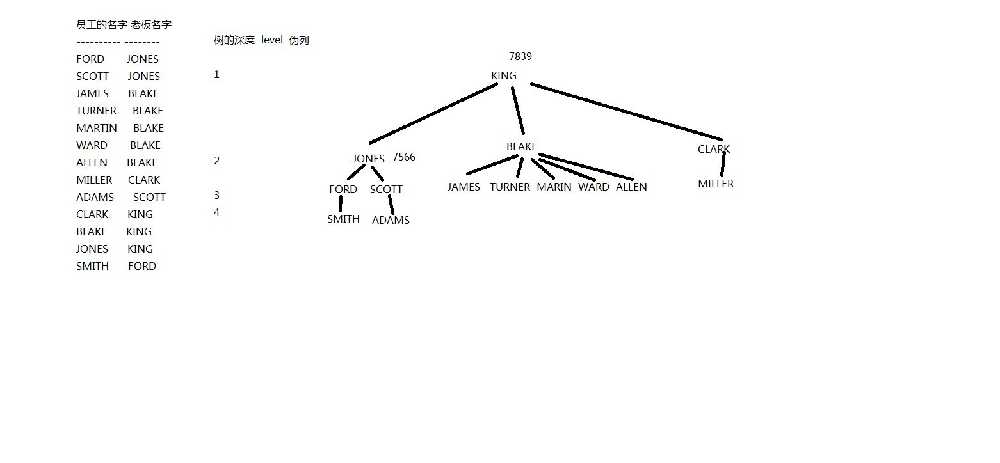
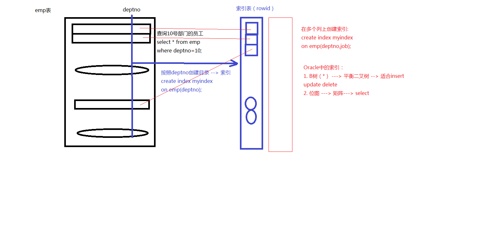

# oracle-2

[TOC]

## 1. 多表查询

笛卡尔集，列数相加，行数相乘

使用连接条件避免使用笛卡尔全集合，连接条件的个数至少有 N-1 个，N 是表的个数

Oracle 的连接：等值连接，不等值连接，外连接，自连接。

```text
SQL> --等值连接
SQL> --查询员工信息：员工号 姓名 月薪 部门名称
SQL> select e.empno,e.ename,e.sal,d.dname
  2  from emp e,dept d
  3  where e.deptno=d.deptno;
============================================
SQL> --不等值连接
SQL> --查询员工信息：员工号 姓名 月薪 工资级别
SQL> select * from salgrade;

     GRADE      LOSAL      HISAL
---------- ---------- ----------
         1        700       1200
         2       1201       1400
         3       1401       2000
         4       2001       3000
         5       3001       9999

SQL> select e.empno,e.ename,e.sal,s.grade
  2  from emp e,salgrade s
  3  where e.sal between s.losal and s.hisal;

     EMPNO ENAME             SAL      GRADE
---------- ---------- ---------- ----------
      7369 SMITH             800          1
      7900 JAMES             950          1
      7876 ADAMS            1100          1
      7521 WARD             1250          2
      7654 MARTIN           1250          2
      7934 MILLER           1300          2
      7844 TURNER           1500          3
      7499 ALLEN            1600          3
      7782 CLARK            2450          4
      7698 BLAKE            2850          4
      7566 JONES            2975          4

     EMPNO ENAME             SAL      GRADE
---------- ---------- ---------- ----------
      7788 SCOTT            3000          4
      7902 FORD             3000          4
      7839 KING             5000          5

已选择 14 行。
```

```text
SQL> --外连接
SQL> --按部门统计员工人数：部门号  部门名称  人数
SQL> select d.deptno 部门号,d.dname 部门名称,count(e.empno) 人数
  2  from emp e,dept d
  3  where e.deptno=d.deptno
  4  group by d.deptno,d.dname;

    部门号 部门名称             人数
---------- -------------- ----------
        10 ACCOUNTING              3
        20 RESEARCH                5
        30 SALES                   6

SQL> select * from dept;

    DEPTNO DNAME          LOC
---------- -------------- -------------
        10 ACCOUNTING     NEW YORK
        20 RESEARCH       DALLAS
        30 SALES          CHICAGO
        40 OPERATIONS     BOSTON

SQL> select * from emp where deptno=40;

未选定行(该部门没有人)
```

**外连接**：某些不成立的记录，通过外连接依然可以包含在最后的结果中

- 左外连接：当 where e.deptno=d.deptno 不成立的时候，等号左边的表任然包含在最后的结果中.写法：where e.deptno=d.deptno(+)
- 右外连接：当 where e.deptno=d.deptno 不成立的时候，等号右边的表任然包含在最后的结果中.写法： where e.deptno(+)=d.deptno

```text
SQL> select d.deptno 部门号,d.dname 部门名称,count(e.empno) 人数
  2  from emp e,dept d
  3  where e.deptno(+)=d.deptno
  4  group by d.deptno,d.dname;

    部门号 部门名称             人数
---------- -------------- ----------
        10 ACCOUNTING              3
        40 OPERATIONS              0
        20 RESEARCH                5
        30 SALES                   6
```

**自连接**：通过表的别名，将同一张表视为多张表

```text
SQL> --自连接
SQL> --查询员工信息： 员工的名字 老板的名字

SQL> select e.ename 员工的名字,b.ename 老板名字
  2  from emp e,emp b
  3  where e.mgr=b.empno;

SQL> --自连接：不适合操作大表,相当于数据量n倍
```

## 2. 层次查询

本质上是单表查询，不会产生笛卡尔集



```text
SQL> select level,empno,ename,mgr（level是伪列）
  2  from emp
  3  connect by prior empno=mgr(where 上一层的员工号等于老板号)
  4  start with mgr is null（从指定节点往下遍历这棵树）
  5  order by 1;（按level排序）

     LEVEL      EMPNO ENAME             MGR
  ---------- ---------- ---------- ----------
         1       7839 KING
         2       7566 JONES            7839
         2       7698 BLAKE            7839
         2       7782 CLARK            7839
         3       7902 FORD             7566
         3       7521 WARD             7698
         3       7900 JAMES            7698
         3       7934 MILLER           7782
         3       7499 ALLEN            7698
         3       7788 SCOTT            7566
         3       7654 MARTIN           7698

     LEVEL      EMPNO ENAME             MGR
---------- ---------- ---------- ----------
         3       7844 TURNER           7698
         4       7876 ADAMS            7788
         4       7369 SMITH            7902

已选择 14 行。

SQL> /*
SQL>  第一层: start with mgr is null
SQL> 第二层: where mgr= 7839---> (7566,****,***)
SQL> 第三层: where mgr in (7566,****,***)
SQL> ****
SQL> */
```

## 3. 子查询

子查询所要解决的问题：不能一步求解

```text
SQL> --查询工资比SCOTT高的员工信息
SQL> select *
  2  from emp
  3  where sal > (select sal
  4               from emp
  5               where ename='SCOTT');
===========================================
SQL> --3. 可以在主查询的where  select having from后面都可以放置子查询
SQL> select empno,ename,sal,(select job from emp where empno=7839) row4
  2  from emp;

     EMPNO ENAME             SAL ROW4
---------- ---------- ---------- ---------
      7369 SMITH             800 PRESIDENT
      7499 ALLEN            1600 PRESIDENT
      7521 WARD             1250 PRESIDENT
...
===========================================
SQL> --5. 强调from后面的子查询(子查询查到的多条数据可以做为from的来源数据集合)
SQL> --查询员工信息：员工号 姓名 月薪
SQL> select *
  2  from (select empno,ename,sal from emp);
SQL> --查询员工信息：员工号 姓名 月薪 年薪
SQL> select * from (select empno,ename,sal,sal*12 annasal from emp);
===========================================
SQL> --6. 主查询和子查询可以不是同一张表；只要子查询返回的结果主查询可以使用即可
SQL> --查询部门名称是SALES的员工信息
SQL> select *
  2  from emp
  3  where deptno=(select deptno
  4                from dept
  5                where dname='SALES');
相当于多表查询写法
SQL> select e.*
  2  from emp e,dept d
  3  where e.deptno=d.deptno and d.dname='SALES';
SQL> --SQL优化 4： 理论上，尽量使用多表查询
```

子查询类型

- 单行子查询，只返回一行使用单行比较操作符（=,>,>=,<,<=,<>）

```text
在子查询中使用组函数
select ename, job, sal from emp where sal =
                                         (select MIN(sal) from emp);
在子查询中的HAVING子句
select 的deptno, MIN(sal)
from emp
group by deptnp
HAVING MIN(sal) >
                  (SELECT MIN(SAL)
                   from emp
                   where deptno = 10);
单行子查询中的空值问题
select ename,job
from emp
where job =
            (selet job
            from emp
            where ename = 'Mike');
no row selected (空值不能相等)
```

- 多行子查询，返回多行，使用多行操作比较符（IN，ANY，ALL）

```text
SQL> --in 在集合中
SQL> --查询部门名称是SALES和ACCOUNTING的员工
SQL> select *
  2  from emp
  3  where deptno in (select depno from dept where
  4  dname='SALES' or dname ='ACCOUNTING');
SQL> select e.*
  2  from emp e,dept d
  3  where e.deptno=d.deptno and (d.dname='SALES' or d.dname='ACCOUNTING');
==================================================
SQL> --any: 和集合中任意一个值比较
SQL> --查询工资比30号部门任意一个员工高的员工信息
SQL> select *
  2  from emp
  3  where sal > any (select sal from emp where deptno=30);
改成单行子查询
  1  select *
  2  from emp
  3* where sal > (select min(sal) from emp where deptno=30)
==================================================
SQL> --all: 和集合中的所有值比较
SQL>  --查询工资比30号部门所有员工高的员工信息
SQL> select *
  2  from emp
  3  where sal > all (select sal from emp where deptno=30);
改成单行子查询
  1  select *
  2  from emp
  3* where sal > (select max(sal) from emp where deptno=30)
==================================================
SQL> --多行子查询中的null
SQL> --not in (10,20,null)
如果集合中，含有 null，不能使用 not in; 但可以使用 in

SQL> --查询不是老板的员工
SQL> select *
  2  from emp
  3  where empno not in (select mgr from emp);
未选定行

SQL> --查询是老板的员工
SQL> select *
  2  from emp
  3  where empno in (select mgr from emp);
...
已选择 6 行。

SQL> select *
  2  from emp
  3  where empno not in (select mgr from emp where mgr is not null);
...
已选择 8 行。
====================================================
SQL> --相关子查询：将主查询的值作为参数传递给子查询
SQL> select empno,ename,sal,(select avg(sal) from emp where deptno=e.deptno) avgsal
  2  from emp e (外面的表必须要取别名)
  3  where sal > (select avg(sal) from emp where deptno=e.deptno);

     EMPNO ENAME             SAL     AVGSAL
---------- ---------- ---------- ----------
      7499 ALLEN            1600 1566.66667
      7566 JONES            2975       2175
      7698 BLAKE            2850 1566.66667
      7788 SCOTT            3000       2175
      7839 KING             5000 2916.66667
      7902 FORD             3000       2175

已选择 6 行。
```

注意的问题：

1. 括号
2. 合理的书写风格
3. 可以在主查询的 where select having from 后面都可以放置子查询
4. 不可以在 group by 放置子查询
5. 强调 from 后面的子查询
6. 主查询和子查询可以不是同一张表；只要子查询返回的结果主查询可以使用即可
7. 一般不在子查询排序；但在 top-n 分析问题中，必须对子查询排序
8. 一般先执行子查询，再执行主查询；但相关子查询例外
9. 单行子查询只能使用单行操作符；多行子查询只能使用多行操作符
10. 子查询中的 null

## 4. 集合运算

- UNION/UNION ALL 并集
- INTERSECT 交集
- MINUS 差集

注意的问题

1. 参与运算的各个集合必须列数相同，且类型一致
2. 采用第一个集合作为最后的表头
3. order by 永远在最后
4. 括号

```text
查询10和20号部门的员工
select * from emp where deptno=10
 加上
select * from emp where deptno=20

SQL> select * from emp where deptno=10
  2  union
  3  select * from emp where deptno=20;
===============================================================
SQL> select deptno,job,sum(sal) from emp group by rollup(deptno,job);
使用集合运算的方法
SQL>  select deptno,job,sum(sal) from emp group by deptno,job
  2   union
  3   select deptno,sum(sal) from emp group by deptno
  4   union
  5   select sum(sal) from emp;

 select deptno,sum(sal) from emp group by deptno
 *
第 3 行出现错误:
ORA-01789: 查询块具有不正确的结果列数

SQL>  select deptno,job,sum(sal) from emp group by deptno,job
  2   union
  3   select deptno,to_char(null),sum(sal) from emp group by deptno
  4   union
  5   select to_number(null),to_char(null),sum(sal) from emp;

SQL> --打开SQL执行时间的开关
SQL> set timing on
SQL> select deptno,job,sum(sal) from emp group by rollup(deptno,job);
...
已用时间:  00: 00: 00.02

SQL>  select deptno,job,sum(sal) from emp group by deptno,job
  2   union
  3   select deptno,to_char(null),sum(sal) from emp group by deptno
  4   union
  5   select to_number(null),to_char(null),sum(sal) from emp;
...
已用时间:  00: 00: 00.08
SQL> --SQL 优化原则 5：尽量不要使用集合运算,会随着参与的集合增加效率显著降低
SQL> set timing off
```

## 5. 处理数据

SQL 的类型

1. DML(Data Manipulation Language 数据操作语言)：insert update delete select
2. DDL(Data Definition Language 数据定义语言): create/drop/alter/truncate table create/drop view,sequence,index,synonym(同义词)
3. DCL(Data Control Langauge 数据控制语言): grant(授权) revoke（撤销权限）

### 5.1 插入 insert

```text
SQL> insert into emp(empno,ename,sal,deptno)
  2  values(1001,'Tom',3000,10);（这种语法一次只能向表中插入一条数据）

已创建 1 行。
======================================================================
SQL> insert into emp(empno,ename,sal,deptno) values(&empno,&ename,&sal,&deptno);
Enter value for empno: 1002
Enter value for ename: 'Mary'（字符串要加单引号）
Enter value for sal: 3000
Enter value for deptno: 20
old   1: insert into emp(empno,ename,sal,deptno) values(&empno,&ename,&sal,&deptno)
new   1: insert into emp(empno,ename,sal,deptno) values(1002,Mary,3000,20)
insert into emp(empno,ename,sal,deptno) values(1002,Mary,3000,20)
1 row created.

SQL> /
Enter value for empno:
...（能快速重复上条insert语句，插入不同的值）

地址符也能用在select语句中不同的位置上
SQL> select empno,ename,&t
  2  from emp;
输入 t 的值:  sal
原值    1: select empno,ename,&t
新值    1: select empno,ename,sal


SQL> /
输入 t 的值:  job
原值    1: select empno,ename,&t
新值    1: select empno,ename,job


SQL> select * from &t;
输入 t 的值:  dept
原值    1: select * from &t
新值    1: select * from dept
```

### 5.2 批处理

从其他表中拷贝数据：在 INSERT 语句中加入子查询，不必书写 VALUES 子句，子查询中的值列表应与 INSERT 子句中的列名对应

```text
SQL> create table emp10 as select * from emp where 1=2;

Table created.

SQL> --一次性将emp所有10号部门的员工插入到emp10中
SQL> insert into emp10
  2  select * from emp where deptno =10;（子查询中的值列表与insert语句中的完全相同可以用*号省略）

3 rows created.
```

海量插入数据：

1. 数据泵
2. SQL\*Loader
3. 外部表

### 5.3 更新数据 update

使用 WHERE 子句指定需要更新的数据

UPDATE employees
SET department id =70
WHERE employee_id =113

如果省略 WHERE 子句，则表中所有数据都将被更新

在 update 中可以使用子查询，使更新基于另一张表中的数据，注意数据完整性

### 5.4 删除数据

使用 DELETE 语句从表中删除数据，如果省略 WHERE 子句，则表中所有数据都将被删除

delete 和 truncate 的区别：

1. delete 逐条删除，truncate 先摧毁表 再重建
2. （关键性区别）delete 是 DML（可以回滚） truncate 是 DDL（不可以回滚）
3. delete 会产生碎片 （已经被 delete 的数据产生的空行不会被再存入数据） truncate 不会
4. delete 不会释放空间 truncate 会
5. delete 可以闪回(flashback) truncate 不可以
6. delete 换个地方存： undo 表空间

```text
比较删除效率
SQL> select count(*) from testdelete;

  COUNT(*)
----------
      5000
SQL> set timing on
SQL> delete from testdelete;
已用时间:  00: 00: 00.05
SQL> set timing off
SQL> drop table testdelete purge;
SQL> select count(*) from testdelete;

  COUNT(*)
----------
      5000
SQL> set timing on
SQL> truncate table testdelete;
已用时间:  00: 00: 02.62
```

## 6. Oracle 中的事务

数据库事务由以下的部分组成：

- 一个或多个 DML 语句
- 一个 DDL 数据定义语句
- 一个 DCL 数据控制语句

Oracle 中事务的标志（默认开启）

1. 起始标志: 事务中第一条 DML 语句
2. 结束标志：提交 显式 commit
   隐式 正常退出 exit，DDL，DCL
   回滚 显式 rollback
   隐式 非正常退出，掉电，宕机

```text
保存点 savepoint
SQL> create table testsavepoint
  2  (tid number, tname varchar2(20));

表已创建。

SQL> insert into testsavepoint values(1,'Tom');
SQL> insert into testsavepoint values(2,'Mary');

SQL> --定义保存点
SQL> savepoint a;
保存点已创建。

SQL> insert into testsavepoint values(3,'Make');

SQL> rollback to savepoint a;

回退已完成。

SQL> commit;

提交完成。
```

Oracle 支持的 2 种事务隔离级别：

- READ COMMITED（默认）
- SERIALIZABLE

Mysql 支持 4 种事务级别，默认为 REPEATABLE READ

```text
SQL> set transaction read only;

Transaction set.

SQL> insert into testsavepoint values(3,'Make');
insert into testsavepoint values(3,'Make')
            *
第 1 行出现错误:
ORA-01456: 不能在 READ ONLY 事务处理中执行插入/删除/更新操作

SQL> rollback;

回退已完成。
```

## 7. 创建和管理表

命名规则：

- 必须以字母开头
- 必须在 1-30 个字符之间
- 必须只包含 A-Z，a-z，0-9，\_,\$, 和#
- 必须不能喝用互动的其他对象重名
- 必须不能是 Oracle 的保留字
- Oracle 默认存储都是存为大写
- 数据库只能是 1~8 位，datalink 可以使 128 位和其他一些特殊字符

### 7.1 CREATE TABLE

要求：

- create table 权限
- 存储空间

必须指定表名，列名，数据类型，数据类型的大小

```text
SQL> --rowid 行地址 伪列
SQL> select rowid,empno,ename,sal
  2  from emp;

ROWID                   EMPNO ENAME             SAL
------------------ ---------- ---------- ----------
AAAMfPAAEAAAAAgAAA       7369 SMITH             800
AAAMfPAAEAAAAAgAAB       7499 ALLEN            1600
...
```

使用子查询创建表，将创建表和插入数据结合起来，指定的列和子查询中的列要一一对应，通过列名和默认值定义列

```text
只拷贝表的结构，不复制数据，where给一个假的条件
SQL> create table emp10 as select * from emp where 1=2;
===============================================================
SQL> --创建表，保存20号部门的员工
SQL> create table emp20
  2  as
  3  select * from emp where deptno=20

表已创建。

SQL> --创建表：员工号  姓名 月薪 年薪 部门名称
SQL> create table empinfo
  2  as
  3  select e.empno,e.ename,e.sal,e.sal*12 annsal,d.dname
  4  from emp e,dept d
  5  where e.deptno=d.deptno;

表已创建。

SQL> select * from empinfo;

     EMPNO ENAME             SAL     ANNSAL DNAME
---------- ---------- ---------- ---------- --------------
      7369 SMITH             800       9600 RESEARCH
      7499 ALLEN            1600      19200 SALES
      7521 WARD             1250      15000 SALES
      7566 JONES            2975      35700 RESEARCH
     ...
```

### 7.2 修改表 ALTER TABLE

- 追加新列
- 修改列（数据类型，尺寸，和默认值），对默认值的修改只影响今后对表的修改
- 删除列
- 重命名列
- 重命名表
- 清空表 TRUNCATE TABLE（会释放存储空间，不能回滚）

```text
SQL> alter table test3 add photo blob;（追加新列）

SQL> alter table test3 modify tname varchar2(40);（修改列数据长度）

SQL> alter table test3 drop column photo;（删除列)

SQL> alter table test3 rename column tname to username;（重命名列）

SQL> rename test3 to test4;（重命名表）
```

### 7.3 删除表 drop table

```
SQL> drop table test4;

SQL> select * from tab
  2  ;
Table dropped.

TNAME                          TABTYPE  CLUSTERID
------------------------------ ------- ----------
BIN$8qEGffcdTNWVFVgVy9kgpw==$0 TABLE
COUNTRIES                      TABLE
DEPARTMENTS                    TABLE
EMPLOYEES                      TABLE
EMP_DETAILS_VIEW               VIEW
JOBS                           TABLE
JOB_HISTORY                    TABLE
LOCATIONS                      TABLE
REGIONS                        TABLE

9 rows selected.
```

- Oracle 的回收站 recyclebin

```text
SQL> --查看回收站
SQL> show recyclebin;
ORIGINAL NAME    RECYCLEBIN NAME                OBJECT TYPE  DROP TIME
---------------- ------------------------------ ------------ -------------------
TEST4            BIN$8qEGffcdTNWVFVgVy9kgpw==$0 TABLE        2020-06-23:15:34:37

SQL> --清空回收站
SQL> purge  recyclebin;

Recyclebin purged.

SQL> select * from TESTSAVEPOINT;

       TID TNAME
---------- --------------------
         1 Tom
         2 Mary

已选择 2 行。

SQL> drop table TESTSAVEPOINT;

表已删除。

SQL> show recyclebin;
ORIGINAL NAME    RECYCLEBIN NAME                OBJECT TYPE  DROP TIME
---------------- ------------------------------ ------------ -------------------
TESTSAVEPOINT    BIN$IC4h7QX9Sv2aRY11zR9/hg==$0 TABLE        2015-03-11:16:08:27
SQL> select * from TESTSAVEPOINT;
select * from TESTSAVEPOINT
              *
第 1 行出现错误:
ORA-00942: 表或视图不存在（表已经删除，不能查询）

SQL> select * from "BIN$IC4h7QX9Sv2aRY11zR9/hg==$0";（查询回收站中表中数据的方法）

       TID TNAME
---------- --------------------
         1 Tom
         2 Mary

已选择 2 行。

SQL> --Oracle回收站：参考——》闪回（闪回删除）
```

### 7.4 约束

约束是表一级的限制，如果存在依赖关系，约束可以防止错误的删除数据

约束的类型：

- NOT NULL
- UNIQUE
- PRIMARY KEY
- FOREIGN KEY
- CHECK

```text
SQL> create table test5
  2  (tid number,
  3   tname varchar2(20),
  4   gender varchar2(2) check (gender in ('男','女')),（检查约束）
  5   sal number check (sal > 0)
  6  );

表已创建。

SQL> insert into test5 values(1,'Tom','男',1000);

已创建 1 行。

SQL> insert into test5 values(2,'Mike','啊',1000);
insert into test5 values(2,'Mike','啊',1000)
*
第 1 行出现错误:
ORA-02290: 违反检查约束条件 (SCOTT.SYS_C005393)
=======================================================================
给约束命名
SQL> create table student
  2  (
  3     sid number constraint student_pk primary key,
  4     sname varchar2(20) constraint student_name_notnull not null,
  5     gender varchar2(2) constraint student_gender check (gender in ('男','女')),
  6     email varchar2(40) constraint student_email_unique unique
  7                        constraint student_email_notnull not null,
  8     deptno number constraint student_fk references dept(deptno) on delete set null
  9  );

表已创建。

SQL> insert into student values(1,'Tom','男','tom@126.com',10);

已创建 1 行。

SQL> insert into student values(2,'Mike','男','tom@126.com',10);
insert into student values(2,'Mike','男','tom@126.com',10)
*
第 1 行出现错误:
ORA-00001: 违反唯一约束条件 (SCOTT.STUDENT_EMAIL_UNIQUE)
```

**外键约束**

- FOREIGN KEY 在子表中，定义了一个表级的约束
- REFERENCES:指定表和父表中的列
- ON DELETE CASCADE：当删除父表时，级联删除子表记录
- ON DELETE SET NULL: 将子表的相关依赖记录的外键值置为 null

## 8. 其他数据库对象

常见的数据库对象：表，视图，序列，索引，同义词

### 8.1 视图 view

视图是一种虚表，建立在已有表的基础上。视图依赖的这些表称为基表。视图相当于对基表中数据的一种显示方式，能简化复杂查询，但是不能提高性能

```text
SQL> create view empinfoview
  2  as
  3  select e.empno,e.ename,e.sal,e.sal*12 annsal,d.dname
  4  from emp e,dept d
  5  where e.deptno=d.deptno;

视图已创建。(需要创建权限)

SQL> desc empinfoview
 名称                                      是否为空? 类型
 ----------------------------------------- -------- ----------------------------
 EMPNO                                     NOT NULL NUMBER(4)
 ENAME                                              VARCHAR2(10)
 SAL                                                NUMBER(7,2)
 ANNSAL                                             NUMBER
 DNAME                                              VARCHAR2(14)

SQL> select * from empinfoview;（视图也是表，查询方式一样）

SQL> create or replace view empinfoview
  2  as
  3  select e.empno,e.ename,e.sal,e.sal*12 annsal,d.dname
  4  from emp e,dept d
  5  where e.deptno=d.deptno
  6  with read only;

视图已创建。
=============================================================
SQL> --with check option 只能操作该视图中看得到的部分

```

- 对视图的 DML 限制复杂，建议使用 with read only 屏蔽 DML 语句，也就是不建议通过视图对表进行修改。
- 删除视图只是删除视图的定义，并不会删除基表的数据 drop view 视图名；

### 8.2 序列 sequence

可供多个用户用来产生唯一数值的数据库对象

- 自动提供唯一的数值
- 共享对象
- 主要用于提供主键值
- 将序列值装入内存可以提高访问效率

```text
SQL> create sequence dept_deptid_seq
  2 increment by 10 (后面这些不写则是默认)
  3 start with 123
  4 maxvalue 9999
  5 nocache
  6 nocycle;
```

NEXTVAL 和 CURRVAL 伪列：

- NEXTVAL 返回序列中下一个有效的值，任何用户都可以引用
- CURRVAL 中存放序列的当前值
- NEXTVAL 应在 CURRVAL 之前指定，二者应同时有效

```text
SQL> create sequence myseq;

序列已创建。

SQL> create table testseq
  2  (tid number,
  3   tname varchar2(20));

表已创建。

SQL> select myseq.currval from dual;
select myseq.currval from dual
       *
第 1 行出现错误:
ORA-08002: 序列 MYSEQ.CURRVAL 尚未在此会话中定义

SQL> select myseq.nextval from dual;

   NEXTVAL
----------
         1

已选择 1 行。

SQL> select myseq.currval from dual;

   CURRVAL
----------
         1

已选择 1 行。

SQL> -- insert into testseq(tid,tname) values(?,?);
SQL> insert into testseq(tid,tname) values(myseq.nextval,'aaa');

已创建 1 行。

SQL> /

已创建 1 行。

SQL> /

已创建 1 行。

SQL> /

已创建 1 行。

SQL> select * from testseq;

       TID TNAME
---------- --------------------
         2 aaa
         3 aaa
         4 aaa
         5 aaa

已选择 4 行。

SQL> commit;

提交完成。

SQL> insert into testseq(tid,tname) values(myseq.nextval,'aaa');

已创建 1 行。

SQL> /

已创建 1 行。

SQL> rollback;

回退已完成。

SQL> insert into testseq(tid,tname) values(myseq.nextval,'aaa');

已创建 1 行。

SQL> select * from testseq;

       TID TNAME
---------- --------------------
         2 aaa
         3 aaa
         4 aaa
         5 aaa
         8 aaa

已选择 5 行。(对序列操作时尽量避免回滚)
```

序列在下列情况下出现裂缝：回滚，系统异常多个表同时使用同一序列

### 8.3 索引 index

索引表由 oracle 数据库自己维护，相当于对原表操作的目录

```text
SQL> create index myindex
  2  on emp(deptno);（按照deptno创建索引表）

索引已创建。
```



### 8.4 同义词（别名）synonym

- 方便访问其他用户的对象
- 缩短对象名字的长度

```text
SQL> --同义词(别名)：代表：表，视图，存储过程*****

SQL> show user
USER 为 "SCOTT"
SQL> select count(*) from hr.employees;
select count(*) from hr.employees
                        *
第 1 行出现错误:
ORA-00942: 表或视图不存在

SQL> grant select on hr.employees to scott;
授权成功；

SQL> select count(*) from hr.employees;

  COUNT(*)
----------
       107

已选择 1 行。
====================================================
SQL> --为hr.employees起别名 ---> 同义词
SQL> create synonym hremp for hr.employees;
create synonym hremp for hr.employees
*
第 1 行出现错误:
ORA-01031: 权限不足

SQL> grant create synonym to scott;
授权成功；

SQL> /
同义词已创建。

SQL> select count(*) from hremp;

  COUNT(*)
----------
       107

已选择 1 行。
```
