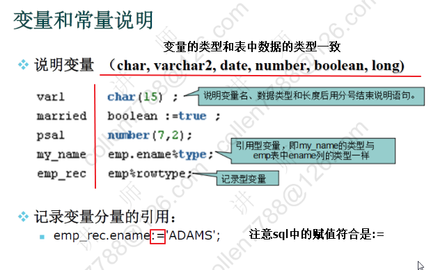
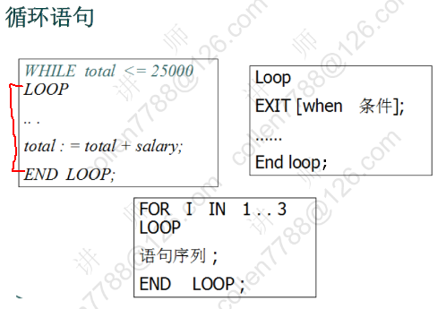

# PLSQL 程序设计

- Procedure Language /SQL 面向过程的语言
- PLSQL 是 ORACLE 对 SQL 语句的过程化扩展
- 在 SQL 命令语言中增加了过程处理语句

## 基本语法

### 程序结构

```text
SQL> declare
    (说明部分：变量说明，光标申明，例外说明）
  2  begin
    （程序部分：语句序列，DML语句）
  3     dbms_output.put_line('hello world');
    [exception]
        （例外处理语句）
  4  end;
  5  / （执行）

PL/SQL procedure successfully completed.

SQL> set serveroutput on
SQL> /
hello world

PL/SQL procedure successfully completed.
```

### 变量



- 引用型变量

```text
--查询并打印7839的姓名和薪水
set serveroutput on

declare
  --定义变量保存姓名和薪水
  --pename varchar(20);
  --psal       number;
  pename emp.ename%type;
  psal        emp.sal%type;
begin
  --得到姓名和薪水
  select ename,sal into pename,psal from emp where empno=7839;
  dbms_output.put_line(pename||'的薪水是'||psal);
end;
/
```

- 记录型变量

```text
declare
  --定义记录型变量：代表一行
  emp_rec emp%rowtype;
begin
  select * into emp_rec from emp where empno=7839;

  dbms_output.put_line(emp_rec.ename||'的薪水是'||emp_rec.sal);
end;
/
```

### IF 语句

.png>)

```text
--判断用户从键盘上输入的数字
set serveroutput on

--接收键盘输入
--num: 地址值，在地址上保存了输入的数字
accept num prompt '请输入一个数字';

declare
  --定义变量，保存输入的数字
  pnum number := &num;
begin
  if pnum = 0 then dbms_output.put_line('您输入的是0');
    elsif pnum = 1 then dbms_output.put_line('您输入的是1');
    elsif pnum = 2 then dbms_output.put_line('您输入的是2');
    else dbms_output.put_line('其他数字');
  end if;
end;
/
```

### 循环语句



```text
--打印1~10
set serveroutput on
declare
  pnum number := 1;
begin
  loop
    --退出条件
    exit when pnum > 10;

    dbms_output.put_line(pnum);

    --加一
    pnum := pnum + 1;
  end loop;
end;
/
```

## 光标 Cursor

相当于 ResultSet 用于存储一个查询返回的多行数据

语法：

```text
CURSOR 光标名 [(参数名 数据类型[,参数名 数据类型]...)]
  IS SELECT 语句;

cursor c1 is select ename from emp;
```

- 打开光标 opoen c1; (打开光标执行查询)
- 取一行光标的值 fetch c1 into pename; (取一行到变量中)
- 关闭光标 close c1; (关闭游标释放资源)

```text
--查询并打印员工的姓名和薪水
/*
1.  光标的属性
      %isopen      %rowcount (影响的行数)
      %found       %notfound

*/
set serveroutput on
declare
  -- 定义光标
  cursor cemp is select ename,sal from emp;
  pename emp.ename%type;
  psal       emp.sal%type;
begin
  --打开光标
  open cemp;

  loop
    --取一条记录
    fetch cemp into pename,psal;
    --exit when 没有取到记录;
    exit when cemp%notfound;

    dbms_output.put_line(pename||'的薪水是'||psal);

  end loop;

  --关闭光标
  close cemp;
end;
/
```

```text
--涨工资，总裁 1000 经理 800 其他 400

set serveroutput on

declare
  --员工的集合
  cursor cemp is select empno,empjob from emp;
  pempno emp.empno%type;
  pjob emp.empjob%type;
begin
open cemp;

loop
--取一个员工
  fetch cemp into pempno,pjob;
  exit when cemp%notfound;

--判断职位
  if pjob = 'PRESIDENT' then update emp set sal=sal+1000 where empno=pempno;
    elsif pjob = 'MANAGER' then update emp set sal=sal+800 where empno=pempno;
    else update emp set sal=sal+400 where empno=pempno;
  end if;
end loop;

close cemp;

--提交 ----> 事务隔离性ACID
commit;（需要提交才能生效）

dbms_output.put_line('完成');
end;
/
```

### 带参数的光标

```text
--查询某个部门的员工姓名
set serveroutput on
declare
  cursor cemp(dno number) is select ename from emp where deptno=dno;
  pename emp.ename%type;
begin
  open cemp(20);
  loop
    fetch cemp into pename;
    exit when cemp%notfound;

    dbms_output.put_line(pename);

  end loop;
  close cemp;
end;
/
```

## Oracle 的异常处理

### 系统定义例外

- No_data_found (没有找到数据)
- Too_many_rows (select..into 语句匹配多行)
- Zero_Divide (被零除)
- Value_error (算数或转换错误)
- Timeout_on_resource (在等待资源时发生超时)

```text
--被0除
set serveroutput on

declare
  pnum number;
begin
  pnum := 1/0;

exception
  when zero_divide then dbms_output.put_line('1:0不能做被除数');
                                         dbms_output.put_line('2:0不能做被除数');
  when value_error then dbms_output.put_line('算术或者转换错误');
  when others then dbms_output.put_line('其他例外');
end;
/
```

### 用户定义的例外

```text
--查询并打印50号部门的员工姓名
set serveroutput on

declare
  cursor cemp is select ename from emp where deptno=50;
  pename emp.ename%type;

  --自定义例外
  no_emp_found exception;
begin
  open cemp;

  --取一条记录
  fetch cemp into pename;

  if cemp%notfound then
    --抛出例外
    raise no_emp_found;
  end if;

  --自动启动进程：pmon(process monitor) 清理现场 作用相当于finally
  close cemp;

exception
  when no_emp_found then dbms_output.put_line('没有找到员工');
  when others then dbms_output.put_line('其他例外');
end;
/
```

## 案例

### 案例一

统计每年入职员工人数

```text
SQL语句
select to_char(hiredate,'yyyy') from emp;
-->光标  --> 循环 -->  退出条件:notfound

变量：1. 初始值  2. 最终如何得到
count80 number := 0;
count81 number := 0;
count82 number := 0;
count87 number := 0;
===================================================================
set serveroutput on
declare
  cursor cemp is select to_char(hiredate,'yyyy') from emp;
  phiredate varchar2(4);

  count80 number := 0;
  count81 number := 0;
  count82 number := 0;
  count87 number := 0;
begin
  open cemp;
  loop
    --取一个员工的入职年份
    fetch cemp into phiredate;
    exit when cemp%notfound;

    --判断年份
    if phiredate = '1980' then count80:=count80+1;
      elsif phiredate = '1981' then count81:=count81+1;
      elsif phiredate = '1982' then count82:=count82+1;
      else count87:=count87+1;
    end if;

  end loop;
  close cemp;

  dbms_output.put_line('Total:'||(count80+count81+count82+count87));
  dbms_output.put_line('1980:'||count80);
  dbms_output.put_line('1981:'||count81);
  dbms_output.put_line('1982:'||count82);
  dbms_output.put_line('1987:'||count87);
end;
/
```

### 案例二

为员工涨工资，从最低工资调起每人长 10%，但工资总额不能超过五万元，请计算涨工资的人数和涨工资后的工资总额

```text
SQL语句
select empno,sal from emp order by sal;
--> 光标 -->  循环 --> 退出：1. 总额 > 5w  2. notfound

变量：1. 初始值  2. 最终如何得到
涨工资的人数: countemp number := 0;
涨后的工资总额： salTotal number;
1. select sum(sal) into salTotal from emp;
2. 涨后= 涨前 + sal * 0.1
=========================================================
set serveroutput on
declare
  cursor cemp is select empno,sal from emp order by sal;
  pempno emp.empno%type;
  psal   emp.sal%type;

  --涨工资的人数:
  countemp number := 0;
  --涨后的工资总额：
  salTotal number;
begin
  --工资总额的初始值
  select sum(sal) into salTotal from emp;

  open cemp;
  loop
    --1.   总额> 5w
    exit when salTotal>50000;

    --取一个员工
    fetch cemp into pempno,psal;
    --2. notfound
    exit when cemp%notfound;
    （两个循环出口）
    --涨工资
    update emp set sal=sal*1.1 where empno=pempno;

    countemp := countemp + 1;

    --2. 涨后= 涨前 + sal * 0.1
    salTotal := salTotal + psal * 0.1;
    （尽量不要在过程操作中操作数据库，用算术效率更高）

  end loop;
  if saltotal>50000 then countemp:= countemp-1;
  update emp set sal=sal/1.1 where empno=pempno;
  salTotal := salTotal - psal*0.1;
  end if;

  close cemp;
  commit;
  dbms_output.put_line('人数:'||countemp||'   涨后的工资总额:'||salTotal);
end;
/
```

### 案例三

实现按部门分段（6000 以上，（6000，3000）、3000 元以下）统计各工资段的职工人数，一级各部门工资总额

```text
部门：select deptno from dept; --> 循环
部门中员工的薪水：select sal from emp where deptno=??  --> 循环

变量：1. 初始值  2. 最终如何得到
每个段的人数
count1 number; count2 number; count3 number;
部门的工资总额
saltotal number := 0;
1. select sum(sal) into salTotal from emp where deptno=??
2. 累加
=========================================================================
set serveroutput on
declare
  --部门
  cursor cdept is select deptno from dept;
  pdeptno dept.deptno%type;

  --部门中员工的薪水
  cursor cemp(dno number) is select sal from emp where deptno=dno;
  psal emp.sal%type;

  --每个段的人数
  count1 number; count2 number; count3 number;
  --部门的工资总额
  saltotal number := 0;
begin
  --打开部门
  open cdept;
  loop
    --取一个部门
    fetch cdept into pdeptno;
    exit when cdept%notfound;

    --初始化
    count1:=0;count2:=0;count3:=0;
    --部门的工资总额
    select sum(sal) into salTotal from emp where deptno=pdeptno;

    --取部门中员工的薪水
    open cemp(pdeptno);
    loop
      -- 取一个员工的薪水
      fetch cemp into psal;
      exit when cemp%notfound;

      --判断
      if psal < 3000 then count1:=count1+1;
        elsif psal>=3000 and psal<6000 then count2:=count2 + 1;
        else count3:=count3+1;
      end if;
    end loop;
    close cemp;

    --保存当前的结果
    insert into msg values(pdeptno,count1,count2,count3,nvl(salTotal,0));

  end loop;
  close cdept;

  commit;
  dbms_output.put_line('完成');
end;
/
```
