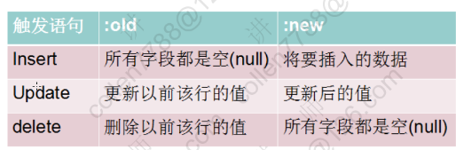

# PLSQL 程序设计

存储过程，函数和触发器

## 1. 存储过程 PROCEDURE 和存储函数 FUNCTION

指存储在数据库中供所有用户程序调用的子程序（PLSQL）叫存储过程（不能）、存储函数（能通过 return 返回值）、

### 1.1 存储过程

语法：

```text
CREATE [or replace] PROCEDURE 过程名(参数名)
AS
    PLSQL子程序;
```

```text
create or replace procedure sayhelloworld
as
   --说明部分
begin
   dbms_output.put_line('Hello World');
end;
/
```

调用存储过程:

```text
SQL> set serveroutput on;
SQL> exec sayhelloworld();
Hello World

PL/SQL procedure successfully completed.

SQL> begin
  2  sayhelloworld();
  3  sayhelloworld();
  4  end;
  5  /
Hello World
Hello World

PL/SQL procedure successfully completed.
```

### 1.2 带参数的存储过程

参数需要指明是输入参数还是输出参数

```text
--给指定的员工涨100，并且打印涨前和涨后的薪水
create or replace procedure raiseSalary(eno in number)
as
  --定义变量保存涨前的薪水
  psal emp.sal%type;
begin
  select sal into psal from emp where empno=eno;

  update emp set sal = sal+100 where empno=eno;

  --要不要commit？ 一般不要

  dbms_output.put_line('涨前:'||psal||'   涨后：'||(psal+100));

end;
/

SQL>begin
  2   raiseSalary(7839);
  3   raiseSalary(7566);
  4   commit;
  5 end;
  6 /
```

### 1.3 PLSQL 调试功能

- 用管理员用户给 PLSQL 中连接数据库的用户授予 debug 权限

```text
SQL> show user;
USER is "SYS"
SQL> grant DEBUG CONNECT SESSION, DEBUG ANY PROCEDURE to scott;

Grant succeeded.
```

- 在 Procedures 中找到存储过程对象，选择 compile for debug（编译以进行调试），出现绿色符号
- 打断点开始调试等操作

### 1.4 存储函数

函数为一命名的存储过程，可带参数，并返回一个计算值。必须有一个 RETURN 子句，用于返回函数值。函数说明要指定函数名、结果值的类型，参数类型等

```text
CREATE [or replace] FUNCTION 函数名(参数列表）
RETURN 函数值类型
AS
    PLSQL子程序;
```

```text
--查询某个员工的年收入
create or replace function queryempincome(eno in number)
return number
as
  --月薪和奖金
  psal emp.sal%type;
  pcomm emp.comm%type;
begin
  select sal,comm into psal,pcomm from emp where empno=eno;

  --返回年收入
  return psal*12+nvl(pcomm,0);
end;
/
```

### 1.5 过程和函数中的 in 和 out

过程和函数都可以通过 out 指定一个或多个输出参数。可以利用 out 参数，在过程和函数中实现返回多个值

```text
--查询某个员工的姓名 月薪和职位

create or replace procedure queryempinfo(eno in number,
                                         pename out varchar2,
                                         psal out number,
                                         pjob out varchar2)
as
begin
  select ename,sal,empjob into pename,psal,pjob from emp where empno=eno;
end;
/
```

### 1.6 Java 调用存储过程和存储函数

- 导入 ojdbc.jar 在 oracledb 安装目录下

```java
import java.sql.Connection;
import java.sql.DriverManager;
import java.sql.ResultSet;
import java.sql.SQLException;
import java.sql.Statement;

public class JDBCUtils {
		private static String driver = "oracle.jdbc.OracleDriver";
		private static String url = "jdbc:oracle:thin:@localhost:orcl";
		private static String user = "scott";
		private static String password = "tiger";

		static{
			try {
				Class.forName(driver);
				//DriverManager.registerDriver(driver)
			} catch (ClassNotFoundException e) {
				throw new ExceptionInInitializerError(e);
			}
		}

		public static Connection getConnection(){
			try {
				return DriverManager.getConnection(url,user,password);
			} catch (SQLException e) {
				e.printStackTrace();
			}
			return null;
		}

		public static void release(Connection conn,Statement st,ResultSet rs){
			if(rs!=null){
				try {
					rs.close();
				} catch (SQLException e) {
					e.printStackTrace();
				}finally{
					rs = null; //   ----> java GC
				}
			}
			if(st!=null){
				try {
					st.close();
				} catch (SQLException e) {
					e.printStackTrace();
				}finally{
					st = null;
				}
			}
			if(conn!=null){
				try {
					conn.close();
				} catch (SQLException e) {
					e.printStackTrace();
				}finally{
					conn = null;
				}
			}
		}
}
```

```java
public class TestOracle {
/*
 * create or replace procedure queryempinfo(eno in number,
                                             pename out varchar2,
                                             psal       out number,
                                          pjob      out varchar2)
 */
	@Test
	public void testProcedure(){
		//{call <procedure-name>[(<arg1>,<arg2>, ...)]}
		String sql = "{call queryempinfo(?,?,?,?)}";
		Connection conn = null;
		CallableStatement call = null;
		try {
			conn = JDBCUtils.getConnection();
			call = conn.prepareCall(sql);

			//对于in参数赋值
			call.setInt(1, 7839);
			//对于out参数申明
			call.registerOutParameter(2, OracleTypes.VARCHAR);
			call.registerOutParameter(3, OracleTypes.NUMBER);
			call.registerOutParameter(4, OracleTypes.VARCHAR);

			//调用
			call.execute();

			//取出结果
			String name = call.getString(2);
			double sal = call.getDouble(3);
			String job = call.getString(4);
			System.out.println(name+"\t"+sal+"\t"+job);
		} catch (Exception e) {
			e.printStackTrace();
		}finally{
			JDBCUtils.release(conn, call, null);
		}
	}

/*
 * create or replace function queryempincome(eno in number)
return number
 */
	@Test
	public void testFunction(){
		//{?= call <procedure-name>[(<arg1>,<arg2>, ...)]}
		String sql = "{?=call queryempincome(?)}";
		Connection conn = null;
		CallableStatement call = null;
		try {
			conn = JDBCUtils.getConnection();
			call = conn.prepareCall(sql);

			//对于out参数申明
			call.registerOutParameter(1, OracleTypes.NUMBER);

			//对于in参数赋值
			call.setInt(2, 7839);
			//调用
			call.execute();

			//取出结果
			double income = call.getDouble(1);
			System.out.println(income);
		} catch (Exception e) {
			e.printStackTrace();
		}finally{
			JDBCUtils.release(conn, call, null);
		}

	}
```

#### 1.6.1 在 out 参数中返回光标

查询某个部门中所有员工的所有信息 ---> 集合

```text
包头（申明包结构）
CREATE OR REPLACE PACKAGE MYPACKAGE AS

  type empcursor is ref cursor;（自定义类型引用光标类型）
  procedure queryEmpList(dno in number,empList out empcursor);

END MYPACKAGE;

包体
CREATE OR REPLACE PACKAGE BODY MYPACKAGE AS

  procedure queryEmpList(dno in number,empList out empcursor) AS
  BEGIN

    open empList for select * from emp where deptno=dno;

  END queryEmpList;

END MYPACKAGE;
```

```java
	@Test
	public void testCursor(){
		String sql = "{call MYPACKAGE.queryEmpList(?,?)}";
		Connection conn = null;
		CallableStatement call = null;
		ResultSet rs = null;
		try {
			conn = JDBCUtils.getConnection();
			call = conn.prepareCall(sql);

			//设置部门号
			call.setInt(1, 20);

			//申明out
			call.registerOutParameter(2, OracleTypes.CURSOR);

			call.execute();
			//取结果集
			rs = ((OracleCallableStatement)call).getCursor(2);
			while(rs.next()){
				String name = rs.getString("ename");
				double sal = rs.getDouble("sal");
				System.out.println(name+"\t"+sal);
			}
		}catch (Exception e) {
			e.printStackTrace();
		}finally{
			JDBCUtils.release(conn, call, rs);（关闭结果集，光标也被关掉了）
		}
	}
}

```

## 2. 触发器 Trigger

数据库触发器是一个与表相关联、存储的 PL/SQL 程序。每当一个特定的数据操作语句（**insert，update，delete**）在指定的表上发出时，Oracle 自动地执行触发器中定义的语句序列。

- 语句级触发器（目标对象是表）
- 行级触发器（FOR_EACH_ROW）（目标对象是行）


### 2.1 定义第一个触发器


```text
--成功插入新员工后，自动打印“成功插入新员工”
create or replace trigger saynewemp
after insert
on emp
declare
begin
  dbms_output.put_line('成功插入新员工');
end;
/
```

### 2.2 触发语句与伪记录变量的值



### 2.3 应用

触发器用于

- 数据确认
- 实施复杂的安全性检查
- 做审计，跟踪表上所做的数据操作等
- 数据的备份和同步

```text
/*
触发器应用一：实施复杂的安全性检查
禁止在非工作时间插入新员工

1. 周末：to_char(sysdate,'day') in ('星期六','星期日')
2. 上班前 下班后：to_number(to_char(sysdate,'hh24')) not between 9 and 18
*/
create or replace trigger securityemp
before insert （语句级，监测插入语句，针对全表）
on emp
begin
  if to_char(sysdate,'day') in ('星期六','星期日','星期五') or
     to_number(to_char(sysdate,'hh24')) not between 9 and 18 then
     --禁止insert
     raise_application_error(-20001,'禁止在非工作时间插入新员工');

  end if;
end;
/
```

- 不能直接向数据库抛出错误，抛应用程序错误


```text
/*
数据的确认： 涨后的工资不能少于涨前的工资
*/
create or replace trigger checksalary
before update
on emp
for each row （行级，每一条更新）
begin

  --if 涨后的薪水  < 涨前的薪水  then
  if :new.sal < :old.sal then （比较伪记录变量）
      raise_application_error(-20002,'涨后的工资不能少于涨前的工资。涨前:'||:old.sal||'  涨后:'||:new.sal);
  end if;

end;
/
```

## 3. 数据字典

```text
desc dictionary

Name       Null? Type
---------- ----- --------------
TABLE_NAME       VARCHAR2(30)
COMMENTS         VARCHAR2(4000)
```


### 3.1 给表添加注释

使用 COMMENT 语句给表或者列添加注释

```text
COMMENT ONTABLE employees
IS 'Employee Information';

Comment created.

/*
查询表的注释
*/
select * from user_tab_comments where table_name = '???';(此处表名必须大写)
```
