# oracle-4

## DBCA 管理数据库

DataBase Configuration Assistant

在 cmd 直接输入 dbca 运行，创建数据库，创建数据库模板

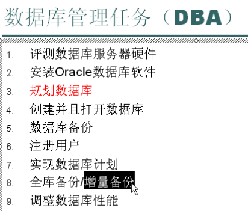

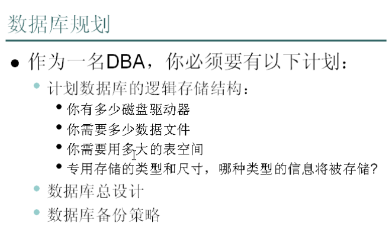

## 闪回 Flashback

应用场景

1. 错误的删除了数据，并且 commit
2. 错误地删除了表 drop table
3. 如何获取表上的历史记录
4. 如何撤销一个已经提交了的事务

闪回的类型：

1. 闪回表：将表回退到过去的一个时间上 flashback table
2. 闪回删除：操作 oracle 回收站 flashback drop
3. 闪回版本查询：获取表上的历史记录 flashbak version query
4. 闪回事务查询：通过查询获取一个 undo_sql,来撤销事务 falsh transaction query
5. 闪回数据库：将数据库回到过去的一个时间上
6. 闪回归档日志：log 文件

### 闪回表

```text
管理员登录sqlplus / as sysdba

SQL> show parameter undo

NAME                                 TYPE        VALUE
------------------------------------ ----------- ------------------------------
undo_management                      string      AUTO
undo_retention                       integer     900
undo_tablespace                      string      UNDOTBS1

修改操作在提交后被记录在撤销表空间中，保留时间为900秒，用户可以在这900秒的时间内对表进行闪回操作。

SQL> alter system set undo_retention=1200 scope=both;

System altered.

--scope的取值：memoery spfile both

SQL> grant flashback any table to scott;（闪回操作需要有flashback any table权限）

Grant succeeded.

```

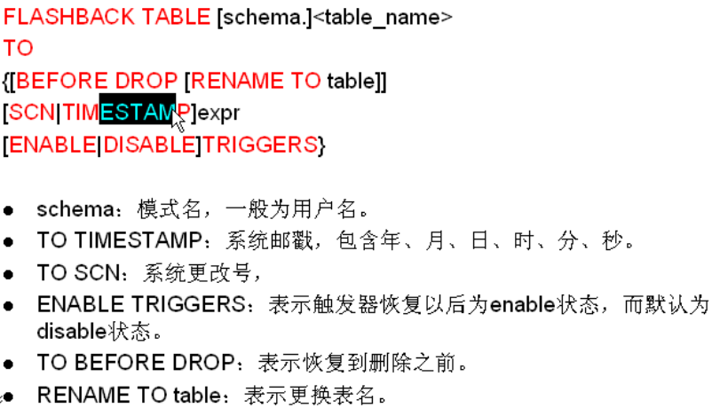

- 系统改变号 SCN 和系统时间对应

```text
SQL> select to_char(sysdate,'yyyy-mm-dd hh24:mi:ss:mm') time,
  2  timestamp_to_scn(sysdate) SCN
  3  from dual;

TIME                          SCN
---------------------- ----------
2020-06-26 15:57:36:06    1580697


SQL> alter table flashback_table enable row movement;(需要先将标的行移动功能打开)
SQL> flashback table flashback_table to SCN 1580697;
问题：如何获取离该操作最近的一个时间？
```

- 不能跨越 DDL 操作
- 系统表不能被闪回
- 会被写入警告日志
- 产生撤销和重做的数据

### 闪回删除

从系统的回收站中将已删除的对象，恢复到删除之前的状态。管理员没有回收站。

```text
SQL> drop table test1;

Table dropped.

SQL> show recyclebin
ORIGINAL NAME    RECYCLEBIN NAME                OBJECT TYPE  DROP TIME
---------------- ------------------------------ ------------ -------------------
TEST1            BIN$0+U7TvbmQFOs12IC7qOapw==$0 TABLE        2020-06-26:16:24:18
SQL> flashback table test1 to before drop;(通过表名闪回)

Flashback complete.

SQL> show recyclebin;
SQL> select * from test1;

        ID NAME                      MONEY
---------- -------------------- ----------
         1 Tom                        1000
         2 Mary                       2000
         3 Mike                       3000
         4 Jeff                       4000
===================================================================================
SQL> drop table test1;

Table dropped.

SQL> show recyclebin
ORIGINAL NAME    RECYCLEBIN NAME                OBJECT TYPE  DROP TIME
---------------- ------------------------------ ------------ -------------------
TEST1            BIN$9mdB+8/OQWyuTEampycUrg==$0 TABLE        2020-06-26:16:25:55
SQL> flashback table "BIN$9mdB+8/OQWyuTEampycUrg==$0" to before drop;（通过回收站中的名字闪回）

Flashback complete.
/*
重名表问题
回收站中ORIGINAL NAME会重复，但是RECYCLEBIN NAME唯一。使用后者闪回可以避免歧义。
当有两个重名表时，使用原名返回会先恢复后删的表。此时，再恢复另一张同名表时，需要使用RENAME TO
*/
```

### 闪回版本查询

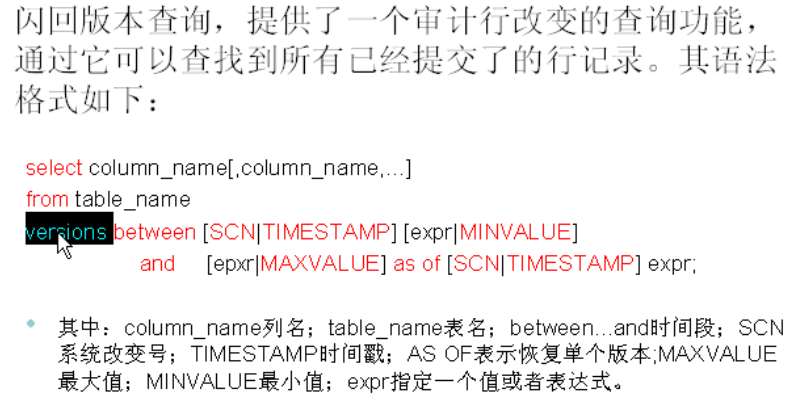

```text
...修改vid为2的vname并提交
SQL> select vid,vname from versions_table;

       VID VNAME
---------- --------------------
         1 Tom
         2 Mary123

SQL> select vid,vname from versions_table
  2  versions between timestamp minvalue and maxvalue;

       VID VNAME
---------- --------------------
         2 Mary123
         2 Mary
         1 Tom
===========================================================================
可以查询到更多历史操作信息
SQL> select vid,vname,versions_operation,versions_starttime,versions_endtime,versions_XID
  2  from versions_table
  3  versions between timestamp minvalue and maxvalue
  4  order by 1,4;
            VID VNAME    V VERSIONS_STARTTIME             VERSIONS_ENDTIME               VERSIONS_XID(事务号)
---------- -------- - ------------------------------ ------------------------------ ----------------
         1 Tom      I 26-JUN-20 17.00.31                                            07001600E6030000
         2 Mary     I 26-JUN-20 17.00.46             26-JUN-20 17.01.26             05001D0098040000
         2 Mary123  U 26-JUN-20 17.01.26                                            08000B0048050000
```

### 闪回事务查询

```text
SQL> desc flashback_transaction_query
 Name                                                                                Null?    Type
 ----------------------------------------------------------------------------------- -------- --------------------------------------------------------
 XID                                                                                          RAW(8)
 START_SCN                                                                                    NUMBER
 START_TIMESTAMP                                                                              DATE
 COMMIT_SCN                                                                                   NUMBER
 COMMIT_TIMESTAMP                                                                             DATE
 LOGON_USER                                                                                   VARCHAR2(30)
 UNDO_CHANGE#                                                                                 NUMBER
 OPERATION                                                                                    VARCHAR2(32)
 TABLE_NAME                                                                                   VARCHAR2(256)
 TABLE_OWNER                                                                                  VARCHAR2(32)
 ROW_ID                                                                                       VARCHAR2(19)
 UNDO_SQL                                                                                     VARCHAR2(4000)
```

- 查询 flashback_transaction_query 视图的信息，需要有 select any transaction 权限

```text
SQL> grant select any transaction to scott;

Grant succeeded.
```

```text
第一步要撤销事务的XID
SQL> select tid,tname,versions_operation,versions_starttime,versions_endtime,versions_XID
  2  from transaction_table
  3  versions between timestamp minvalue and maxvalue
  4  order by 1,4;

       TID TNAME      V VERSIONS_STARTTIME   VERSIONS_ENDTIME     VERSIONS_XID
---------- ---------- - -------------------- -------------------- ----------------
         1 tom        I 26-JUN-20 19.01.42                        0500120077040000
         2 Mary       I 26-JUN-20 19.01.57   26-JUN-20 19.03.30   0A000B003E040000
         2 Mary123    U 26-JUN-20 19.03.30                        0200100088040000
         3 mikkk      I 26-JUN-20 19.03.30                        0200100088040000
==================================================================================
第二步根据XID查询undo_sql
SQL> select operation,undo_sql
  2  from Flashback_transaction_query
  3  where xid='0200100088040000';

OPERATION
--------------------------------
UNDO_SQL
------------------------------------------------------------------------------------------------------------------------------------------------------
INSERT
delete from "SCOTT"."TRANSACTION_TABLE" where ROWID = 'AAASQ4AAEAAAAJtAAC';

UPDATE
update "SCOTT"."TRANSACTION_TABLE" set "TNAME" = 'Mary' where ROWID = 'AAASQ4AAEAAAAJtAAB';

BEGIN
================================================================================
第三步复制使用查到的undo_sql
SQL> delete from "SCOTT"."TRANSACTION_TABLE" where ROWID = 'AAASQ4AAEAAAAJtAAC';

1 row deleted.

SQL> update "SCOTT"."TRANSACTION_TABLE" set "TNAME" = 'Mary' where ROWID = 'AAASQ4AAEAAAAJtAAB';

1 row updated.
```

- 查到的事务 operation 是 unknown，UNDO_SQL 为空的原因：使用闪回查询前，必须先启用重做日志流的其他日志记录。重做日志流数据是对撤销表空间记录的信息的补充，闪回事务查询时既需要增强的重做信息，也需要撤销表空间的撤销信息。
  解决办法：使用 alter database 命令，启用对 DML 更改引用的列值和主键值的日志记录

```text
SQL> alter database add supplemental log data (primary key) columns;

Database altered.
```

## 导入导出 exp/imp

RMAN = Recovery Manager

### exp 命令

exp -help

Format: EXP KEYWORD=value or KEYWORD=(value1,value2,...,valueN)
Example: EXP SCOTT/TIGER GRANTS=Y TABLES=(EMP,DEPT,MGR)
or TABLES=(T1:P1,T1:P2), if T1 is partitioned table

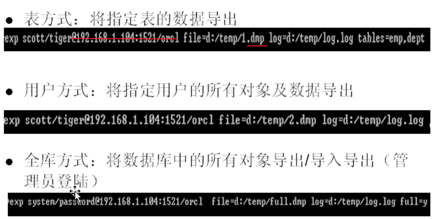

- 如果不写用户名和密码之后的内容，会进入提示模式

### imp 命令

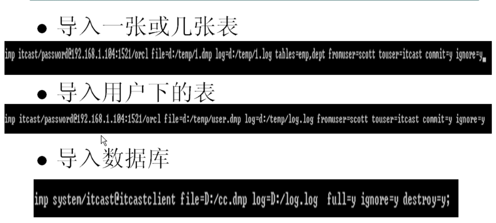

## 管理方案 Schema

https://localhost:1158/em/ 登录 EM

- 授权角色

```text
SQL> grant select_catalog_role to scott;

Grant succeeded.
```

管理员登录，查看修改 initialization Parameters

## 管理用户安全

### 创建用户

- 用命令行创建的新用户没有登录权限。用 EM 创建的用户则已经自动给予了连接数据库的权限

```text
SQL> conn / as sysdba
Connected.
SQL> create user uname identified by password;

User created.

sqlplus uname/password

SQL*Plus: Release 11.2.0.1.0 Production on Fri Jun 26 19:55:49 2020

Copyright (c) 1982, 2010, Oracle.  All rights reserved.

ERROR:
ORA-01045: user UNAME lacks CREATE SESSION privilege; logon denied
```

- 方案 Shema 是属于某一用户的所有对象的集合
- 用户名和方案名往往是通用的
- 一个用户只能关联一个方案
- 创建用户时，系统会自动创建一个同名方案


### 验证用户

- 密码验证方式 Password
- 外部验证方式 External
- 全局验证方式 Global（其他方式：生物认证方式，token 方式）

```text
sqlplus / as sysdba
这种登录方式是外部验证登录方式，前提是操作系统当前用户是数据库的拥有者，不需要密码。外部认证优先于密码认证
```

### 预定义账户 SYS 和 SYSTEM

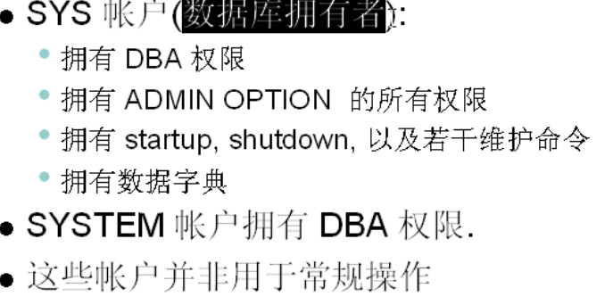

### 解锁和改密码

```TEXT
1. 管理员登录
sqlplus / as sysdba
2. 解锁
sql> ALTER USER SCOTT ACCOUNT UNLOCK;
3. 改密码
SQL> ALTER USER SCOTT IDENTIFIED BY 新密码：
```

### 用户权限 User Privileges

两类权限

- System 允许用户执行对数据库的特定行为，如创建表，创建用户
- Object 允许用户访问和操作一个特定的对象，如对其他方案下的表的查询

#### 权限的级联问题

```text
grant create session to jeff; 使能登录
grant create table to jeff with admin option;授予给jeff创建表
alter user jeff quota unlimited on users; 分配建表空间
revoke create table from jeff;撤销
```

- 使用 ADMIN OPTION 授权系统权限，撤销时不会产生级联效果

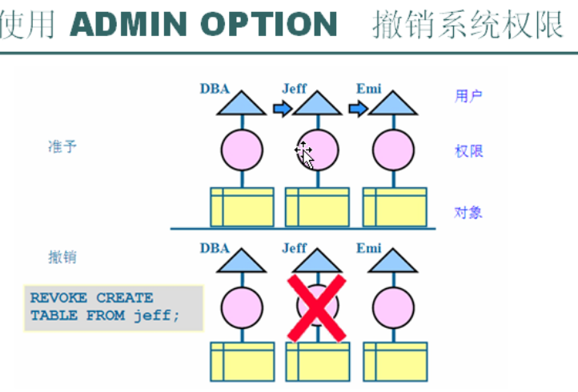

```text
grant select on emp to jeff with grant option;授予给jeff查询emp表的权限
revoke select on emp from jeff;撤销
```

- 使用 GRANT OPTION 授予对象权限，撤销时会产生级联效果

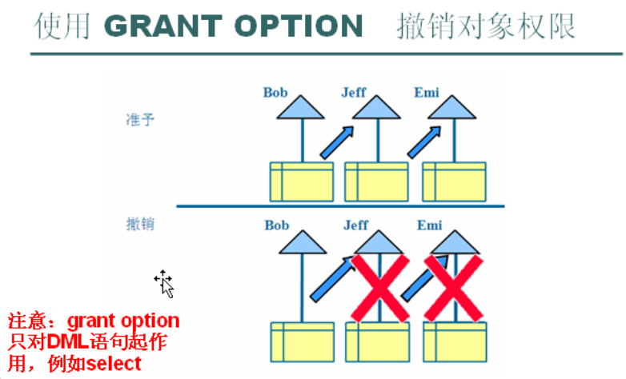

### 用户--角色--权限

```text
create role hr_mgr; 建立角色
create role hr_clerk;
grant create session to hr_clerk; 授权给角色
grant create table, hr_clerk to hr_mgr; 获得建表权限并继承另一个角色的权限
grant hr_clerk to emi;把角色给用户
```

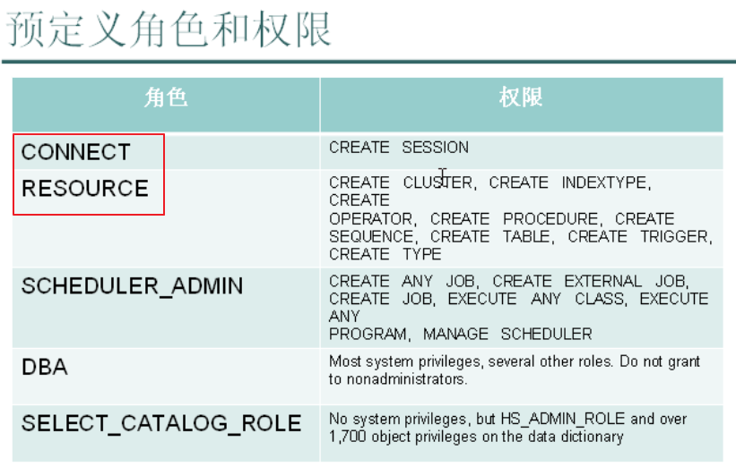

- 创建普通用户时一般同时给与 connect，resource 角色

### 概要文件 Profiles

每一个用户只能被关联到一个概要文件

概要文件： 控制消费资源，管理账户状态和密码有效期

## 分布式数据库

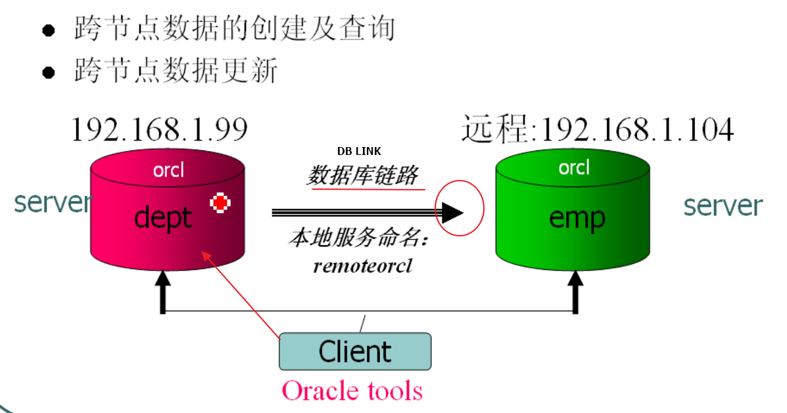

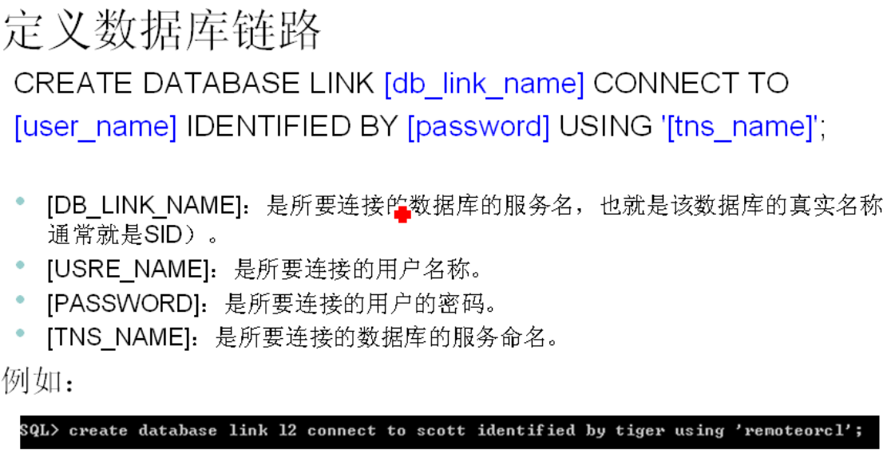

使用 Oracle Net Manager 建立本地服务命名

```TEXT
sql> create database link l2 connect to scott identified by tiger using 'remoteorcl';(需要建立链路的权限)

select ename,dname from dept,emp@L2 where emp.deptno = dept.deptnp;(emp在远端，dept在本地)
=============================================================================
create synonym emp1 for emp@l2; (透明存取--别名)

create view emp （建立远端表的本地视图）
as
  SELECT * FROM EMP1@L1
  UNION
  SELECT * FROM emp2@L2;

select * from emp;
```

### 分布式数据库的跨节点更新

#### 快照

定义快照维护关系表的异步副本，在主表修改后的指定时间内刷新副本，用于主表修改少，但是频繁查询的表

定义在备份端，由备份端发起

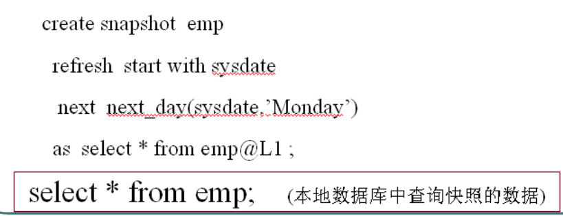

#### 触发器

实现数据的同步

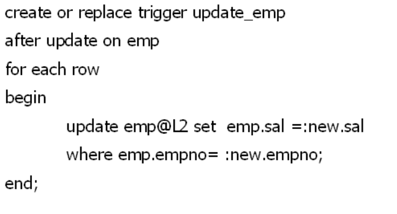
