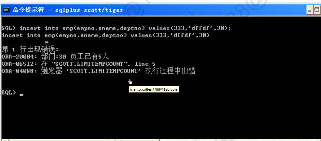
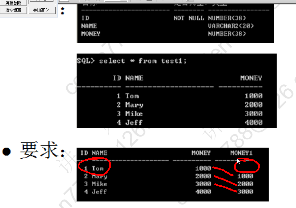
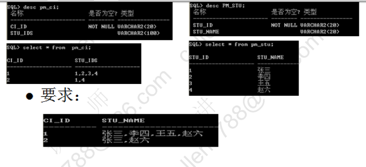

# oracle-练习

##

第一题：找出员工表中工资最高的前三名

```text
SQL> select ROWNUM, EMPNO, ENAME, SAL from (select * from emp order by sal desc)
  2  where ROWNUM <4;
```

第二题 找到员工表中薪水大于本部门平均新书的员工

```text
SQL> select e.empno, e.ename, e.sal, d.avgsal
  2  from emp e, (select AVG(sal) avgsal, deptno from emp group by deptno) d
  3  where e.deptno = d.deptno and e.sal>d.avgsal;
```

第三题 统计每年入职的员工个数(不使用子查询)

```text
SQL> select count(*) Total,
  2  sum(decode(to_char(hiredate,'yyyy'),'1980',1,0)) "1980",
  3  sum(decode(to_char(hiredate,'yyyy'),'1981',1,0)) "1981",
  4  sum(decode(to_char(hiredate,'yyyy'),'1982',1,0)) "1982",
  5  sum(decode(to_char(hiredate,'yyyy'),'1983',1,0)) "1983"
  6  from emp;
     TOTAL       1980       1981       1982       1983
---------- ---------- ---------- ---------- ----------
        14          1         10          1          0
```

第四题 限制每个部门只招聘 5 名员工，超过计划则报出错误信息


## rownum

伪列，行号，从 1 开始

1. rownum 永远按照默认的顺序生成,维持排序前的原行号
2. rownum 只能使用< <=;不能使用> >=

```text
SQL> select rownum,empno,ename,sal from emp;

    ROWNUM      EMPNO ENAME             SAL
---------- ---------- ---------- ----------
         1       7369 SMITH             800
         2       7499 ALLEN            1600
...
SQL> select rownum,empno,ename,sal
  2  from emp
  3  where rownum<=3
  4  order by sal desc;

    ROWNUM      EMPNO ENAME             SAL
---------- ---------- ---------- ----------
         2       7499 ALLEN            1600
         3       7521 WARD             1250
         1       7369 SMITH             800

SQL> select rownum,empno,ename,sal
  2  from (select * from emp order by sal desc)
  3  where rownum<=3;

    ROWNUM      EMPNO ENAME             SAL
---------- ---------- ---------- ----------
         1       7839 KING             5000
         2       7788 SCOTT            3000
         3       7902 FORD             3000
===================================================

SQL> -- 2. rownum只能使用< <=;不能使用> >=
SQL> select rownum,empno,ename,sal from emp where rownum>=5 and rownum<=8;

未选定行

SQL> select rownum,empno,ename,sal from emp where rownum>=5;

未选定行

SQL> select rownum,empno,ename,sal from emp where rownum<=3;

    ROWNUM      EMPNO ENAME             SAL
---------- ---------- ---------- ----------
         1       7369 SMITH            800
         2       7499 ALLEN            1600
         3       7521 WARD             1250
=====================================================

查5-8之间
SQL>  select *
  2   from 	(select rownum r,e1.*
  3  	 from (select * from emp order by sal) e1
  4   	 where rownum <=8
  5  	)
  6   where r >=5;

```

## 临时表

```text
SQL> --create global temporary table ******
SQL> --特点：当事务或者会话结束的时候，表中的数据自动删除
SQL> create global temporary table test1
  2  (tid number,
  3   tname varchar2(20))
  4  on commit delete rows;

表已创建。

SQL> insert into test1 values(1,'Tom');

已创建 1 行。

SQL> select * from test1;

       TID TNAME
---------- --------------------
         1 Tom

SQL> commit;

提交完成。

SQL> select * from test1;

未选定行

SQL> create global temporary table test2
  2  (tid number,
  3   tname varchar2(20))
  4  on commit reserve rows;
on commit preserve rows

表已创建。

SQL> insert into test2 values(1,'Tom');

已创建 1 行。

SQL> commit;

提交完成。

SQL> select * from test2;

       TID TNAME
---------- --------------------
         1 Tom
```

## 行转列

wm_concat(字符串) 组函数

```text
SQL> select deptno,wm_concat(ename) nameslist
  2  from emp
  3  group by deptno;

    DEPTNO    NAMESLIST
---------    ----------------------------------
        10    CLARK,KING,MILLER
        20    SMITH,FORD,ADAMS,SCOTT,JONES
        30    ALLEN,BLAKE,MARTIN,TURNER,JAMES,WARD
```

## 面试题



```text
create table test1
(id int primary key,
 name varchar(20),
 money int);

insert into test1 values(1,'Tom',1000);
insert into test1 values(2,'Mary',2000);
insert into test1 values(3,'Mike',3000);
insert into test1 values(4,'Jeff',4000);
commit;
=======================================================
SQL> select id,name,money,
  2  (select money from test1 where id=t.id-1) money1
  3  from test1 t;
```



```text
 create table pm_ci
 (ci_id varchar(20) primary key,
  stu_ids varchar(100));

insert into pm_ci values('1','1,2,3,4');
insert into pm_ci values('2','1,4');

 create table pm_stu
 (stu_id varchar(20) primary key,
  stu_name varchar(20));
insert into pm_stu values('1','张三');
insert into pm_stu values('2','李四');
insert into pm_stu values('3','王五');
insert into pm_stu values('4','赵六');
commit;
=========================================================
SQL> select c.ci_id, s.stu_name
  2  from pm_ci c,pm_stu s
  3  where instr(c.stu_ids,s.stu_id) >0;(局限于学生编号个位数)

CI_ID                STU_NAME
-------------------- --------------------
1                    zhangsan
1                    lisi
1                    wangwu
1                    zhaoliu
2                    zhangsan
2                    zhaoliu

6 rows selected.

SQL> select ci_id,wm_concat(stu_name) namelist
  2  from (select c.ci_id, s.stu_name
  3  from pm_ci c,pm_stu s
  4  where instr(c.stu_ids,s.stu_id) >0)
  5  group by ci_id;

```

## PLSQL 练习

编写一个程序，按照系名分段统计（成绩小于 60 分，60-85 分，85 分以上）
"大学物理"课程各分数段的学生人数，及各系的学生的平均成绩

```text
分析用到的查询语句
====================
系：select dno,dname from dep;
成绩：select grade from sc where cno = (select cno from cource where cname=?)
                          and sno in (select sno from student where dno=?);
平均成绩：select avg(grade) from sc where cno = (select cno from cource where cname=?)
                          and sno in (select sno from student where dno=?);

```

```text
set serveroutput on
declare
  -- 光标：系
  cursor cdep is select dno,dname from dep;
  pdno dep.dno%type;
  pdname dep.dame%type;

  -- 光标：学生成绩（指定系，指定课）
  cursor cgrade(courseName varchar, deptNo number) is select grade from sc where cno = (select cno from cource where cname=courseName)
                          and sno in (select sno from student where dno=deptNo);
  pgrade sc.grade%type;

  --计数器
  count1 number;count2 number;count3 number;

  --平均分
  avggrade number；

  --课程名称
  pcourseName varchar2(10):='大学物理';

begin
  open cdep;
  loop
    --取一个系
    fetch cdep into pdno,pdname;
    exit when cdep%notfound;
    --清零
    count1:=0;count2:=0;count3:=0;
    --系平均分
    select avg(grade) into avggrade from sc where cno = (select cno from cource where cname=pcourseName)
                          and sno in (select sno from student where dno=pdno);
    --取成绩
    open cgrade(pcourseName,pdno);
    loop
      --每个学生的成绩
      fetch cgrade into pgrade;
      exit when cgrade%notfound;
      if pgrade<60 then count1:=coun1+1;
        elsif pgrade>60 and pgrade<85 then count2:=count2+1;
        else count3:=count3+1;
      end if;
    end loop;
    close cgrade;

    --保存结果
    insert into msg values(courseName,pdname,count1,count2,count3,avggrade);
    commit;

  end loop;
  close cdep;
end;
/
```
