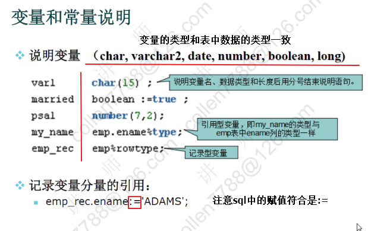
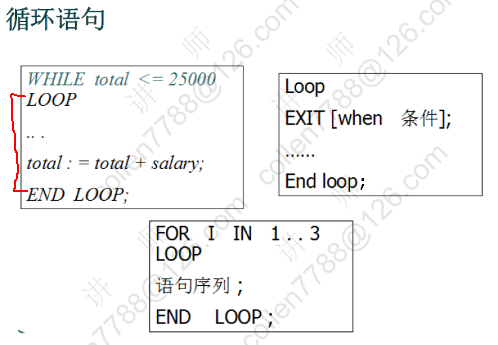

# PLSQL 程序设计

- Procedure Language /SQL 面向过程的语言
- PLSQL 是 ORACLE 对 SQL 语句的过程化扩展
- 在 SQL 命令语言中增加了过程处理语句

## 基本语法

### 程序结构

```text
SQL> declare
    (说明部分：变量说明，光标申明，例外说明）
  2  begin
    （程序部分：语句序列，DML语句）
  3     dbms_output.put_line('hello world');
    [exception]
        （例外处理语句）
  4  end;
  5  / （执行）

PL/SQL procedure successfully completed.

SQL> set serveroutput on
SQL> /
hello world

PL/SQL procedure successfully completed.
```

### 变量



- 引用型变量

```text
--查询并打印7839的姓名和薪水
set serveroutput on

declare
  --定义变量保存姓名和薪水
  --pename varchar(20);
  --psal       number;
  pename emp.ename%type;
  psal        emp.sal%type;
begin
  --得到姓名和薪水
  select ename,sal into pename,psal from emp where empno=7839;
  dbms_output.put_line(pename||'的薪水是'||psal);
end;
/
```

- 记录型变量

```text
declare
  --定义记录型变量：代表一行
  emp_rec emp%rowtype;
begin
  select * into emp_rec from emp where empno=7839;

  dbms_output.put_line(emp_rec.ename||'的薪水是'||emp_rec.sal);
end;
/
```

### IF 语句

.png>)

```text
--判断用户从键盘上输入的数字
set serveroutput on

--接收键盘输入
--num: 地址值，在地址上保存了输入的数字
accept num prompt '请输入一个数字';

declare
  --定义变量，保存输入的数字
  pnum number := &num;
begin
  if pnum = 0 then dbms_output.put_line('您输入的是0');
    elsif pnum = 1 then dbms_output.put_line('您输入的是1');
    elsif pnum = 2 then dbms_output.put_line('您输入的是2');
    else dbms_output.put_line('其他数字');
  end if;
end;
/
```

### 循环语句



```text
--打印1~10
set serveroutput on
declare
  pnum number := 1;
begin
  loop
    --退出条件
    exit when pnum > 10;

    dbms_output.put_line(pnum);

    --加一
    pnum := pnum + 1;
  end loop;
end;
/
```

## 光标 Cursor

相当于 ResultSet 用于存储一个查询返回的多行数据

语法：

```text
CURSOR 光标名 [(参数名 数据类型[,参数名 数据类型]...)]
  IS SELECT 语句;

cursor c1 is select ename from emp;
```

- 打开光标 opoen c1; (打开光标执行查询)
- 取一行光标的值 fetch c1 into pename; (取一行到变量中)
- 关闭光标 close c1; (关闭游标释放资源)

```text
--查询并打印员工的姓名和薪水
/*
1.  光标的属性
      %isopen      %rowcount (影响的行数)
      %found       %notfound

*/
set serveroutput on
declare
  -- 定义光标
  cursor cemp is select ename,sal from emp;
  pename emp.ename%type;
  psal       emp.sal%type;
begin
  --打开光标
  open cemp;

  loop
    --取一条记录
    fetch cemp into pename,psal;
    --exit when 没有取到记录;
    exit when cemp%notfound;

    dbms_output.put_line(pename||'的薪水是'||psal);

  end loop;

  --关闭光标
  close cemp;
end;
/
```

涨工资，总裁 1000 经理 800 其他 400

set serveroutput on

declare
--员工的集合
--alter table "SCOTT"."EMP" rename column "JOB" to empjob
cursor cemp is select empno,empjob from emp;
pempno emp.empno%type;
pjob emp.empjob%type;
begin
rollback;

open cemp;

loop
--取一个员工
fetch cemp into pempno,pjob;
exit when cemp%notfound;

--判断职位
if pjob = 'PRESIDENT' then update emp set sal=sal+1000 where empno=pempno;
elsif pjob = 'MANAGER' then update emp set sal=sal+800 where empno=pempno;
else update emp set sal=sal+400 where empno=pempno;
end if;
end loop;

close cemp;

--提交 ----> ACID
commit;

dbms_output.put_line('完成');
end;
/
