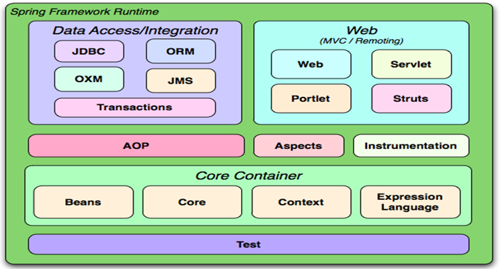
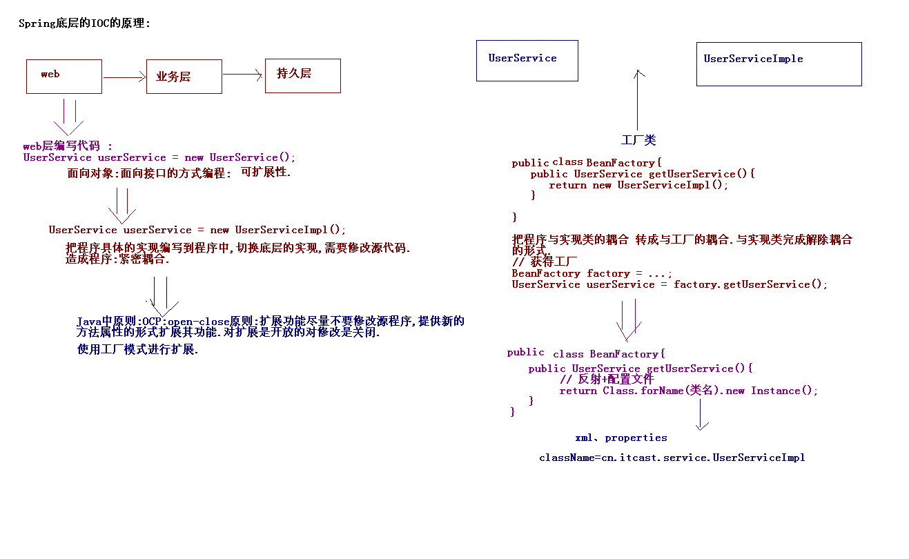
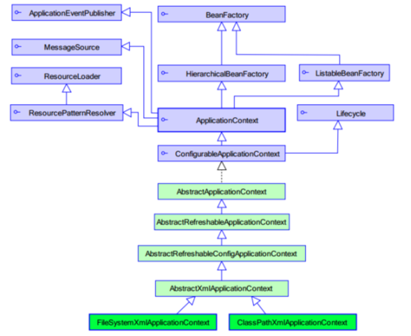
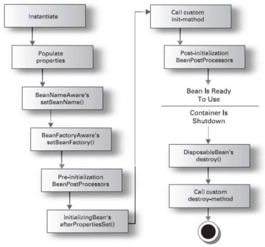
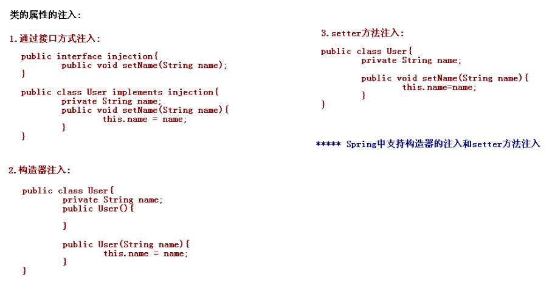
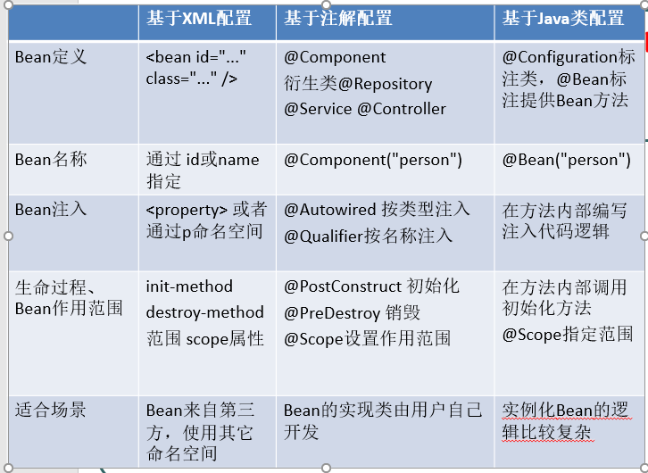

# Spring框架-1

[TOC]

## 1 Spring框架的概述

### 1.1 什么是Spring

Spring是分层的JavaSE/EE full-stack(一站式) 轻量级开源框架

分层:

* SUN提供的EE的三层结构:web层、业务层、数据访问层（持久层，集成层）
* Struts2是web层基于MVC设计模式框架.
* Hibernate是持久的一个ORM的框架.

一站式: Spring框架有对三层的每层解决方案

* web层: Spring MVC.
* 持久层: JDBC Template
* 业务层: Spring的Bean管理



### 1.2 Spring的核心



IOC:（Inverse of Control 反转控制）

* 控制反转: cc 将对象的创建权,交由Spring完成.

AOP:Aspect Oriented Programming 是 面向对象的功能延伸.不是替换面向对象,是用来解决OO中一些问题.

### 1.3 Spring的版本

Spring3.x和Spring4.x  Spring4需要整合hibernate4. 5...

### 1.4 EJB: 企业级JavaBean

EJB: SUN公司提出EE解决方案.

2002 : Expert One-to-One J2EE Design and Development
2004 : Expert One-to-One J2EE Development without EJB (EE开发真正需要使用的内容.)

### 1.5 Spring优点

方便解耦，简化开发

* Spring就是一个大工厂，可以将所有对象创建和依赖关系维护，交给Spring管理

AOP编程的支持

* Spring提供面向切面编程，可以方便的实现对程序进行权限拦截、运行监控等功能

声明式事务的支持

* 只需要通过配置就可以完成对事务的管理，而无需手动编程

方便程序的测试

* Spring对Junit4支持，可以通过注解方便的测试Spring程序

方便集成各种优秀框架

* Spring不排斥各种优秀的开源框架，其内部提供了对各种优秀框架（如：Struts、Hibernate、MyBatis、Quartz等）的直接支持

降低JavaEE API的使用难度

* Spring 对JavaEE开发中非常难用的一些API（JDBC、JavaMail、远程调用等），都提供了封装，使这些API应用难度大大降低

## 2. Spring的入门的程序

### 2.1 下载Spring的开发包

spring-framework-3.2.0.RELEASE-dist.zip---Spring开发包

* docs: spring框架api和规范
* libs: spring开发的jar包
* schema: XML的约束文档.

spring-framework-3.0.2.RELEASE-dependencies.zip---Spring开发中的依赖包

### 2.2 创建web工程引入相应jar包

spring-beans-3.2.0.RELEASE.jar
spring-context-3.2.0.RELEASE.jar
spring-core-3.2.0.RELEASE.jar
spring-expression-3.2.0.RELEASE.jar

开发的日志记录的包:
com.springsource.org.apache.commons.logging-1.1.1.jar --- 用于整合其他的日志的包(类似Hibernate中slf4j)
com.springsource.org.apache.log4j-1.2.15.jar

### 2.3 创建Spring的配置文件

在src下applicationContext.xml/spring-config.xml

引入XML的约束:

```markdown
<beans xmlns="http://www.springframework.org/schema/beans"
       xmlns:xsi="http://www.w3.org/2001/XMLSchema-instance"
       xsi:schemaLocation="http://www.springframework.org/schema/beans http://www.springframework.org/schema/beans/spring-beans.xsd">
</beans>
```

### 2.4 在配置中配置类

通过&lt;bean&gt;标签设置类的信息，通过id属性为类起一个标识

```markdown
<bean id="userService" class="demo1.HelloServiceImpl">
</bean>
```

### 2.5 创建测试类

```java
@Test
// Spring开发
public void demo2() {
    // 创建一个工厂类.
    ApplicationContext applicationContext = new ClassPathXmlApplicationContext(
        "applicationContext.xml");
    HelloService helloService = (HelloService) applicationContext.getBean("userService");
    helloService.sayHello();
}
```

控制反转，将原本在程序中手动创建HelloService对象的控制权，交由Spring框架管理

### 2.6 IOC和DI(*****)区别

* IOC Inverse of Control 控制反转: 将**对象**的创建权,由Spring管理.
* DI Dependency Injection依赖注入: 在Spring创建Bean对象的过程中,把**对象依赖的属性**注入到类中.
&lt;bean&gt;下通过&lt;bean&gt;标签设置类的属性值，需要在类中给出set方法。

```markdown
<property id="info属性名" value="属性值"></property>
```

面向对象中对象之间的关系;

* 依赖:
public class A{
private B b;
}
* 继承:
* 聚合: 聚集，组合:

### 2.7 Spring框架加载配置文件

ApplicationContext 应用上下文，加载Spring 框架配置文件

加载classpath下面配置文件：
new ClassPathXmlApplicationContext("applicationContext.xml");

加载磁盘路径下面配置文件：
new FileSystemXmlApplicationContext("applicationContext.xml");

### 2.8 BeanFactory与ApplicationContext区别



ApplicationContext类继承了BeanFactory.

BeanFactory在使用到这个类的时候, getBean()方法的时候才会加载这个类.早期开发使用BeanFactory.

* BeanFactory beanFactory = new XmlBeanFactory(new FileSystemResource("applicationContext.xml"));
* BeanFactory beanFactory = new XmlBeanFactory(new ClassPathReasource("applicationContext.xml"));

ApplicationContext类加载配置文件的时候, 创建所有的类.ApplicationContext对BeanFactory提供了扩展:

* 国际化处理
* 事件传递
* Bean自动装配
* 各种不同应用层的Context实现

## 3. IOC装配Bean

### 3.1 Spring框架Bean实例化的方式

提供了三种方式实例化Bean

* 构造方法实例化(默认无参数)
* 静态工厂实例化
* 实例工厂实例化

#### 无参数构造方法的实例化

默认情况下使用的就是无参数的构造方法

```markdown
<bean id="bean1" class="demo2.Bean1"></bean>
```

#### 静态工厂实例化

```java
public class Bean2Factory {
    public static Bean2 getBean2(){//提供一个静态方法
        return new Bean2();
    }

```

```markdown
<!-- 第二种使用静态工厂实例化 -->
<bean id="bean2" class="demo2.Bean2Factory" factory-method="getBean2"></bean>
```

#### 实例工厂实例化

```java
public class Bean3Factory {
    public Bean3 getBean3(){//提供一个静态方法
        return new Bean3();
    }
```

```markdown
<!-- 第三种使用实例工厂实例化 -->
<bean id="bean3" factory-bean="bean3Factory" factory-method="getBean3"></bean>
<bean id="bean3Factory" class="demo2.Bean3Factory"/>
```

### 3.2 Bean的其他配置

#### id和name的区别

id遵守XML约束的id的约束.
id约束保证这个属性的值是唯一的,而且必须以字母开始，可以使用字母、数字、连字符、下划线、句话、冒号
name没有这些要求

* 如果bean标签上没有配置id,那么name可以作为id.

现在的开发中都使用id属性即可.

#### 类的作用范围

&lt;bean&gt;标签内scope属性

* singleton:单例的.(默认的值.) 只实例化一次对象
* prototype:多例的.
* request:web开发中.创建了一个对象,将这个对象存入request范围,request.setAttribute();
* session:web开发中.创建了一个对象,将这个对象存入session范围,session.setAttribute();
* globalSession:一般用于Porlet应用环境.指的是分布式开发.不是porlet环境,globalSession等同于session;

实际开发中主要使用singleton,prototype

#### Bean的生命周期

配置Bean的初始化和销毁的方法:

&lt;bean&gt;标签内配置属性

* init-method="setup"
* destroy-method="teardown"

在类中给出setup和teardown方法，通常public void且无参

执行销毁的时候,必须手动关闭工厂, 而且只对scope=”singleton”有效. 使用ClassPathXmlApplicationContext对象的close方法。

Bean的生命周期的11个步骤:



1. instantiate bean对象实例化
2. populate properties 封装属性
3. 如果Bean实现BeanNameAware 执行 setBeanName
4. 如果Bean实现BeanFactoryAware 或者 ApplicationContextAware 设置工厂 setBeanFactory 或者上下文对象 setApplicationContext
5. **如果存在类实现 BeanPostProcessor（后处理Bean） ，执行postProcessBeforeInitialization**
6. 如果Bean实现InitializingBean 执行 afterPropertiesSet
7. 调用&lt;bean init-method="init"&gt; 指定初始化方法 init
8. **如果存在类实现 BeanPostProcessor（处理Bean） ，执行postProcessAfterInitialization**
9. 执行业务处理
10. 如果Bean实现 DisposableBean 执行 destroy
11. 调用&lt;bean destroy-method="customerDestroy"&gt;指定销毁方法 customerDestroy

在CustomerService类的add方法之前进行权限校验? MyBeanPostProcessor实现BeanPostProcessor，在postProcessAfterInitialization方法中进行功能增强，使用动态代理实现权限校验。

### 3.3 Bean中属性注入



Spring支持构造方法注入和setter方法注入.

#### 构造器注入

```java
public class Car {
    private String name;
    private Double price;

    public Car() {
        super();
    }

    public Car(String name, Double price) {
        super();
        this.name = name;
        this.price = price;
    }
}
```

```markdown
<bean id="car" class="demo5.Car">
    <!--方式一：通过属性名称-->
    <constructor-arg name="name" value="宝马"/>
    <constructor-arg name="price" value="1000000"/>

    <!--方式二：通过索引-->
    <constructor-arg index="0" type="java.lang.String" value="奔驰"/>
    <constructor-arg index="1" type="java.lang.Double" value="2000000"/>
</bean>
```

#### setter方法注入

```java
public class Car2 {
    private String name;
    private Double price;

    public void setName(String name) {
        this.name = name;
    }
    public void setPrice(Double price) {
        this.price = price;
    }
```

 &lt;property&gt;标签中name就是属性名称,value是普通属性的值,ref:引用其他的对象

```markdown
<bean id="car2" class="demo5.Car2">  
    <property name="name" value="保时捷"/>
    <property name="price" value="5000000"/>
</bean>
```

#### setter方法注入对象属性

ref写该对象对应类的id或name

```markdown
<property name="car2" ref="car2"/>
```

#### 名称空间p 注入属性

Spring2.5版本引入了名称空间p.
p:&lt;属性名&gt;="xxx" 引入常量值
p:&lt;属性名&gt;-ref="xxx" 引用其它Bean对象

引入名称空间:

```markdown
<beans xmlns="http://www.springframework.org/schema/beans"
       xmlns:p="http://www.springframework.org/schema/p"
       xmlns:xsi="http://www.w3.org/2001/XMLSchema-instance"
       xsi:schemaLocation="
http://www.springframework.org/schema/beans http://www.springframework.org/schema/beans/spring-beans.xsd">

<bean id="car2" class="demo5.Car2" p:name="宝马" p:price="400000"/>
<bean id="person" class="demo5.Person" p:name="童童" p:car2-ref="car2"/>
```

#### SpEL:属性的注入

spring expression language

Spring3.0提供注入属性方式:
语法：#{表达式}

```markdown
<bean id="" value="#{表达式}">

<bean id="car2" class="demo5.Car2">
    <property name="name" value="#{'大众'}"></property>
    <property name="price" value="#{'120000'}"></property>
</bean>

<!--使用别的类的属性注入-->
<bean id="person" class=demo5.Person">
    <property name="name" value="#{personInfo.showName()}"/>
    <property name="car2" value="#{car2}"/>
</bean>

<bean id="personInfo" class="demo5.PersonInfo">
    <property name="name" value="张三"/>
</bean>

```

### 3.4 集合属性的注入

```markdown
<bean id="collectionBean" class="demo6.CollectionBean">
    <!-- 注入List集合 -->
    <property name="list">
        <list>
            <value>童童</value>
            <value>小凤</value>
        </list>
    </property>

    <!-- 注入set集合 -->
    <property name="set">
        <set>
            <value>杜宏</value>
            <value>如花</value>
        </set>
    </property>

    <!-- 注入map集合 -->
    <property name="map">
        <map>
            <entry key="刚刚" value="111"/>
            <entry key="娇娇" value="333"/>
        </map>
    </property>

    <property name="properties">
        <props>
            <prop key="username">root</prop>
            <prop key="password">123</prop>
        </props>
    </property>
</bean>
```

### 3.5 加载配置文件

第一种写法：在创建ApplicationContext对象时传入多个配置文件

ApplicationContext applicationContext = new ClassPathXmlApplicationContext("bean1.xml","bean2.xml";

第二种方法:

在配置文件的根标签下引入其他配置文件

```markdown
<import resource="applicationContext2.xml"/>
```

## 4. IOC装配Bean(注解方式)

### 4.1 Spring的注解装配Bean

Spring2.5 引入使用注解去定义Bean

@Component  描述Spring框架中Bean

在配置文件中配置支持注解

```markdown
<beans xmlns="http://www.springframework.org/schema/beans"
       xmlns:xsi="http://www.w3.org/2001/XMLSchema-instance"
       xmlns:context="http://www.springframework.org/schema/context"
       xsi:schemaLocation="http://www.springframework.org/schema/beans http://www.springframework.org/schema/beans/spring-beans.xsd
       http://www.springframework.org/schema/context http://www.springframework.org/schema/context/spring-context.xsd">

    <!--当xml和注解混搭的时候需要写-->
    <context:annotation-config/>
    <!--指示要从哪个包查找被注解的类-->
    <context:component-scan base-package="demo1"/>
</beans>
```

Spring的框架中提供了与@Component注解等效的三个注解:

* @Repository 用于对DAO实现类进行标注
* @Service 用于对Service实现类进行标注
* @Controller 用于对Controller实现类进行标注

三个注解为了让标注类本身用途清晰，后续版本会对其进行增强.

### 4.2 Bean的属性注入

普通属性:

```java
@Value(value="天天向上")
private String info;
```

不需要在类中再额外提供该属性的set方法

对象属性:

* @Autowired: 自动装配，默认使用类型注入.
* @Qualifier("userDao")  --- 按名称进行注入.

```java
@Autowired
@Qualifier("userDao")
private UserDao userDao;

//等价于
@Resource(name="userDao")
private UserDao userDao;
```

### 4.3 Bean其他的属性的配置

#### 配置Bean初始化方法和销毁方法

init-method 和 destroy-method.

* @PostConstruct 初始化
* @PreDestroy  销毁

#### 配置Bean的作用范围

@Scope--默认单例
@Scope(value="prototype")

### 4.4 Spring3.0提供使用Java类定义Bean信息的方法

写一个java类来作为Bean的配置信息, 

```java
@Configuration
public class BeanConfig {

    @Bean(name="car")
    public Car showCar(){
        Car car = new Car();
        car.setName("长安");
        car.setPrice(40000d);
        return car;
    }

    @Bean(name="product")
    public Product initProduct(){
        Product product = new Product();
        product.setName("空调");
        product.setPrice(3000d);
        return product;
    }
}
```

### 4.5 实际开发中使用XML还是注解



XML:bean管理
注解：注入属性的时候比较方便.

两种方式结合; 一般使用XML注册Bean,使用注解进行属性的注入.

xml和注解方式混合使用

1、引入context命名空间

```markdown
<beans xmlns="http://www.springframework.org/schema/beans"
     xmlns:xsi="http://www.w3.org/2001/XMLSchema-instance"
     xmlns:context="http://www.springframework.org/schema/context"
     xsi:schemaLocation="http://www.springframework.org/schema/beans
         http://www.springframework.org/schema/beans/spring-beans.xsd
         http://www.springframework.org/schema/context
         http://www.springframework.org/schema/context/spring-context.xsd">
```

2、在配置文件中添加context:annotation-config标签使@Resource、@ PostConstruct、@ PreDestroy、@Autowired注解生效

```markdown
<context:annotation-config/>
```

因为只是引入属性，不需要扫描查找包名

### 4.6 Spring整合web开发

正常整合Servlet和Spring没有问题，但是每次执行Servlet的时候加载Spring配置,加载Spring环境.

解决方法：

* 将加载的信息内容放到ServletContext中. ServletContext对象时全局的对象. 服务器启动的时候创建的.在创建ServletContext的时候就加载Spring的环境.
* ServletContextListener: 用于监听ServletContext对象的创建和销毁的.

导入spring-web-3.2.0.RELEASE.jar

在web.xml中配置监听器和初始化参数

```markdown
<listener>
    <listener-class>org.springframework.web.context.ContextLoaderListener</listener-class>
</listener>

<context-param>
    <param-name>contextConfigLocation</param-name>
    <param-value>classpath:applicationContext.xml</param-value>
</context-param>
```

修改程序的代码:获取WebApplicationContext对象

```java
//第一种
WebApplicationContext applicationContext =
WebApplicationContextUtils.getWebApplicationContext(getServletContext());

//第二种
WebApplicationContext applicationContext =
(WebApplicationContext) getServletContext().getAttribute(WebApplicationContext.ROOT_WEB_APPLICATION_CONTEXT_ATTRIBUTE);
```

### 4.7 Spring集成JUnit测试

1. 程序中有Junit环境.
2. 导入一个jar包.spring与junit整合jar包. spring-test-3.2.0.RELEASE.jar
3. 测试代码

```java
@RunWith(SpringJUnit4ClassRunner.class)
@ContextConfiguration(locations="classpath:applicationContext.xml")
public class SpringTest {
    @Autowired
    private UserService userService;

    @Test
    public void demo1(){
    userService.sayHello();
    }
}
```
