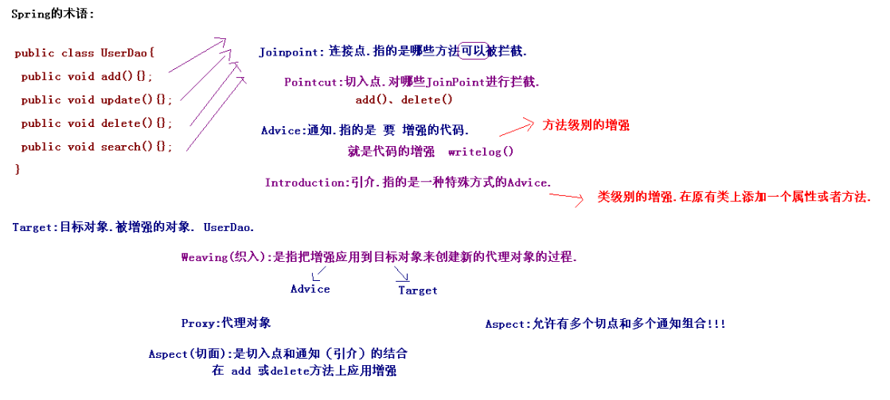

# Spring框架-2

\[TOC\]

## 1. AOP的概述

### 1.1 什么是AOP

**AOP** Aspect Oriented Programing 面向切面编程

AOP采取横向抽取机制，取代了传统纵向继承体系重复性代码（性能监视、事务管理、安全检查、缓存）

Spring AOP使用纯Java实现，不需要专门的编译过程和类加载器，在运行期通过代理方式向目标类织入增强代码

AspecJ是一个基于Java语言的AOP框架，Spring2.0开始，Spring AOP引入对Aspect的支持，AspectJ扩展了Java语言，提供了一个专门的编译器，在编译时提供横向代码的织入

### 1.2 AOP底层原理

就是代理机制:

* 动态代理:\(JDK中使用\)
* JDK的动态代理,对实现了接口的类生成代理.

### 1.3 Spring的AOP代理

JDK动态代理: 对实现了接口的类生成代理 CGLib代理机制: 对类生成代理

### 1.4 AOP的术语



* Joinpoint\(连接点\): 所谓连接点是指那些被拦截到的点。在spring中,这些点指的是方法,因为spring只支持方法类型的连接点.
* Pointcut\(切入点\): 所谓切入点是指我们要对哪些Joinpoint进行拦截的定义.
* Advice\(通知/增强\):所谓通知是指拦截到Joinpoint之后所要做的事情就是通知.通知分为前置通知,后置通知,异常通知,最终通知,环绕通知\(切面要完成的功能\)
* Introduction\(引介\):引介是一种特殊的通知在不修改类代码的前提下, Introduction可以在运行期为类动态地添加一些方法或Field.
* Target\(目标对象\):代理的目标对象
* Weaving\(织入\):是指把增强应用到目标对象来创建新的代理对象的过程.spring采用动态代理织入，而AspectJ采用编译期织入和类装在期织入
* Proxy（代理）:一个类被AOP织入增强后，就产生一个结果代理类
* Aspect\(切面\): 是切入点和通知（引介）的结合

## 2. AOP的底层实现

### 2.1 JDK动态代理

```java
public class JDKProxy implements InvocationHandler{
    private UserDao userDao;

    public JDKProxy(UserDao userDao) {
        super();
        this.userDao = userDao;
    }

    public UserDao createProxy() {
        UserDao proxy = (UserDao) Proxy.newProxyInstance(userDao.getClass()
        .getClassLoader(), userDao.getClass().getInterfaces(), this);
        return proxy;
    }

    // 调用目标对象的任何一个方法 都相当于调用invoke();
    public Object invoke(Object proxy, Method method, Object[] args)
    throws Throwable {
        if("add".equals(method.getName())){
            // 记录日志:
            System.out.println("日志记录=================");
            Object result = method.invoke(userDao, args);
            return result;
        }
        return method.invoke(userDao, args);
    }
}
```

### 2.2 CGLIB动态代理

CGLIB\(Code Generation Library\)是一个开源项目.是一个强大的，高性能，高质量的Code生成类库，它可以在运行期扩展Java类与实现Java接口。 Hibernate支持它来实现PO\(Persistent Object 持久化对象\)字节码的动态生成

Hibernate生成持久化类的javassist.

CGLIB生成代理机制: 其实生成了一个真实对象的子类.

下载cglib的jar包.现在做cglib的开发,可以不用直接引入cglib的包. 已经在spring的核心中集成cglib.

```java
public class CGLibProxy implements MethodInterceptor{
    private ProductDao productDao;

    public CGLibProxy(ProductDao productDao) {
        super();
        this.productDao = productDao;
    }

    public ProductDao createProxy(){
        // 使用CGLIB生成代理:
        // 1.创建核心类:
        Enhancer enhancer = new Enhancer();
        // 2.为其设置父类:
        enhancer.setSuperclass(productDao.getClass());
        // 3.设置回调:
        enhancer.setCallback(this);
        // 4.创建代理:
        return (ProductDao) enhancer.create();
    }


    public Object intercept(Object proxy, Method method, Object[] args,
    MethodProxy methodProxy) throws Throwable {
        if("add".equals(method.getName())){
            System.out.println("日志记录==============");
            Object obj = methodProxy.invokeSuper(proxy, args);
            return obj;
        }
            return methodProxy.invokeSuper(proxy, args);
    }
}
```

结论: Spring框架,如果类实现了接口,就使用JDK的动态代理生成代理对象,如果这个类没有实现任何接口,使用CGLIB生成代理对象.

## 3. Spring中的AOP

### 3.1 Spring的传统AOP

AOP: 不是由Spring定义. AOP联盟的组织定义.

Spring中的通知:\(增强代码\)

前置通知 org.springframework.aop.MethodBeforeAdvice

* 在目标方法执行前实施增强

后置通知 org.springframework.aop.AfterReturningAdvice

* 在目标方法执行后实施增强

环绕通知 org.aopalliance.intercept.MethodInterceptor

* 在目标方法执行前后实施增强

异常抛出通知 org.springframework.aop.ThrowsAdvice

* 在方法抛出异常后实施增强

引介通知 org.springframework.aop.IntroductionInterceptor

* 在目标类中添加一些新的方法和属性

### 3.2 Spring中的切面类型

Advisor : Spring中传统切面.

* Advisor:都是有一个切点和一个通知组合.
* Aspect:多个切点和多个通知组合.

Advisor : 代表一般切面，Advice本身就是一个切面，对目标类所有方法进行拦截\(\* 不带有切点的切面.针对所有方法进行拦截\) PointcutAdvisor : 代表具有切点的切面，可以指定拦截目标类哪些方法\(带有切点的切面,针对某个方法进行拦截\) IntroductionAdvisor : 代表引介切面，针对引介通知而使用切面（不要求掌握）

### 3.3 Spring的AOP的开发

#### 不带有切点的切面\(针对所有方法的增强\)

第一步:导入相应jar包.

* spring-aop-3.2.0.RELEASE.jar
* com.springsource.org.aopalliance-1.0.0.jar

第二步:编写被代理对象:

* CustomerDao接口
* CustoemrDaoImpl实现类

第三步:编写增强的代码:

```java
public class MyBeforwAdvice implements MethodBeforeAdvice {

    /**
     * method:执行的方法
     * args:参数
     * target:目标对象
     */
    public void before(Method method, Object[] args, Object target)
            throws Throwable {
        System.out.println("前置增强...");
    }
}
```

第四步:生成代理:\(配置生成代理\)

* 生成代理Spring基于ProxyFactoryBean类.底层自动选择使用JDK的动态代理还是CGLIB的代理.
* 属性:

**target** : 代理的目标对象 **proxyInterfaces** : 代理要实现的接口 如果多个接口可以使用以下格式赋值

```text
<list>
    <value></value>
    ....
</list>
```

**proxyTargetClass** : 是否对类代理而不是接口，设置为true时，使用CGLib代理 **interceptorNames** : 需要织入目标的Advice **singleton**: 返回代理是否为单实例，默认为单例 **optimize** : 当设置为true时，强制使用CGLib

1. 定义目标对象
2. 定义增强
3. 定义生成代理对象（配置目标，设置实现的接口，在目标上应用增强）

```java
<!-- 定义目标对象 -->
<bean id="customerDao" class="demo3.CustomerDaoImpl"></bean>

<!-- 定义增强 -->
<bean id="beforeAdvice" class="demo3.MyBeforeAdvice"></bean>

<!-- Spring支持配置生成代理: -->
<bean id="customerDaoProxy" class="org.springframework.aop.framework.ProxyFactoryBean">
  <!-- 设置目标对象 -->
  <property name="target" ref="customerDao"/>
  <!-- 设置实现的接口 ,value中写接口的全路径 -->
  <property name="proxyInterfaces" value="demo3.CustomerDao"/>
  <!-- 需要使用value:要的名称 -->
  <property name="interceptorNames" value="beforeAdvice"/>
</bean>
```

注入的时候要注入代理对象:

```java
@Autowired
// @Qualifier("customerDao")// 注入是真实的对象,必须注入代理对象.
@Qualifier("customerDaoProxy")
private CustomerDao customerDao;
```

#### 带有切点的切面:\(针对目标对象的某些方法进行增强\)

PointcutAdvisor 接口:

* DefaultPointcutAdvisor 最常用的切面类型，它可以通过任意Pointcut和Advice 组合定义切面
* RegexpMethodPointcutAdvisor 构造正则表达式切点切面

第一步:创建被代理对象.

* OrderDao

第二步:编写增强的类:

```java
public class MyAroundAdvice  implements MethodInterceptor {
    @Override
    public Object invoke(MethodInvocation methodInvocation) throws Throwable {
        System.out.println("环绕前增强...");
        Object result = methodInvocation.proceed();// 执行目标对象的方法
        System.out.println("环绕后增强...");
        return result;
    }
}
```

第三步:生成代理:

1. 定义目标对象
2. 定义增强
3. 定义切点切面（定义表达式，应用增强）
4. 定义生成代理对象（配置目标，生成代理，在目标上应用增强）

```text
<!-- 带有切点的切面 -->
<!-- 定义目标对象 -->
<bean id="orderDao" class="demo4.OrderDao"/>

<!-- 定义增强 -->
<bean id="aroundAdvice" class="demo4.MyAroundAdvice"></bean>

<!-- 定义切点切面: -->
<bean id="myPointcutAdvisor" class="org.springframework.aop.support.RegexpMethodPointcutAdvisor">
  <!-- 定义表达式,规定哪些方法执行拦截 -->
  <!-- . 任意字符  * 任意个 -->
  <!-- <property name="pattern" value=".*"/> -->
  <!-- <property name="pattern" value="demo4\.OrderDao\.add.*"/> -->
  <!-- <property name="pattern" value=".*add.*"></property> -->
  <property name="patterns" value=".*add.*,.*find.*"></property>
  <!-- 应用增强 -->
  <property name="advice" ref="aroundAdvice"/>
</bean>

<!-- 定义生成代理对象 -->
<bean id="orderDaoProxy" class="org.springframework.aop.framework.ProxyFactoryBean">
  <!-- 配置目标 -->
  <property name="target" ref="orderDao"></property>
  <!-- 针对类的代理 -->
  <property name="proxyTargetClass" value="true"></property>
  <!-- 在目标上应用增强 -->
  <property name="interceptorNames" value="myPointcutAdvisor"></property>
</bean>
```

pattern里写正则匹配规则，.代表任意，\*代表多个，“.”需要转义，多个表达式用 ，隔开。

### 3.4 自动代理

前面的案例中，每个代理都是通过ProxyFactoryBean织入切面代理，在实际开发中，非常多的Bean每个都配置ProxyFactoryBean开发维护量巨大

自动创建代理\(**基于后处理Bean.在Bean创建的过程中完成的增强.生成Bean就是代理**.\) 与3.3中配置的区别就是不用配置产生代理，而是配置自动代理相关。

* BeanNameAutoProxyCreator 根据Bean名称创建代理
* DefaultAdvisorAutoProxyCreator 根据Advisor本身包含信息创建代理

  AnnotationAwareAspectJAutoProxyCreator 基于Bean中的AspectJ 注解进行自动代理

#### BeanNameAutoProxyCreator

按名称生成代理

```java
<!-- 定义目标对象 -->
<bean id="customerDao" class="demo3.CustomerDaoImpl"></bean>
<bean id="orderDao" class="demo4.OrderDao"></bean>

<!-- 定义增强 -->
<bean id="beforeAdvice" class="demo3.MyBeforeAdvice"></bean>
<bean id="aroundAdvice" class="demo4.MyAroundAdvice"></bean>

<!-- 自动代理:按名称的代理 基于后处理Bean,后处理Bean不需要配置ID-->
<bean class="org.springframework.aop.framework.autoproxy.BeanNameAutoProxyCreator">
  <property name="beanNames" value="*Dao"/>
  <property name="interceptorNames" value="beforeAdvice"/>
</bean>
```

注入的时候直接注入Bean，已经是代理对象:

```java
@Autowired
@Qualifier("customerDao")
private CustomerDao customerDao;
```

#### DefaultAdvisorAutoProxyCreator

根据切面中定义的信息生成代理

```java
<!-- 定义目标对象 -->
<bean id="customerDao" class="demo3.CustomerDaoImpl"></bean>
<bean id="orderDao" class="demo4.OrderDao"></bean>

<!-- 定义增强 -->
<bean id="beforeAdvice" class="demo3.MyBeforeAdvice"></bean>
<bean id="aroundAdvice" class="demo4.MyAroundAdvice"></bean>

<!-- 定义一个带有切点的切面 -->
<bean id="myPointcutAdvisor" class="org.springframework.aop.support.RegexpMethodPointcutAdvisor">
  <property name="pattern" value=".*add.*"/>
  <property name="advice" ref="aroundAdvice"/>
</bean>

<!-- 自动生成代理 -->
<bean class="org.springframework.aop.framework.autoproxy.DefaultAdvisorAutoProxyCreator"></bean>
```

#### 区分基于ProxyFactoryBean的代理与自动代理区别

* ProxyFactoryBean:先有被代理对象,将被代理对象传入到代理类中生成代理.
* 自动代理基于后处理Bean.在Bean的生成过程中,就产生了代理对象,把代理对象返回.生成Bean已经是代理对象.

## 4. Spring的AspectJ的AOP\(**\***\)

AspectJ是一个面向切面的框架，它扩展了Java语言。AspectJ定义了AOP语法所以它有一个专门的编译器用来生成遵守Java字节编码规范的Class文件。

AspectJ是一个基于Java语言的AOP框架。Spring2.0以后新增了对AspectJ切点表达式支持

@AspectJ 是AspectJ1.5新增功能，通过JDK5注解技术，允许直接在Bean类中定义切面。新版本Spring框架，建议使用AspectJ方式来开发AOP

AspectJ表达式:

**语法**:execution\(表达式\)

execution\(&lt;访问修饰符&gt;?&lt;返回类型&gt;&lt;方法名&gt;\(&lt;参数&gt;\)&lt;异常&gt;\)

* execution\(" _demo1.dao._\(..\)"\) ---只检索当前包
* execution\(" _demo1.dao.._\(..\)"\) ---检索包及当前包的子包.
* execution\( _dao.GenericDAO+._\(..\)\) ---检索GenericDAO及子类

AspectJ增强:

* @Before 前置通知，相当于BeforeAdvice
* @AfterReturning 后置通知，相当于AfterReturningAdvice
* @Around 环绕通知，相当于MethodInterceptor
* @AfterThrowing抛出通知，相当于ThrowAdvice
* @After 最终final通知，不管是否异常，该通知都会执行
* @DeclareParents 引介通知，相当于IntroductionInterceptor \(不要求掌握\)

### 4.1 基于注解

第一步:引入相应jar包.

* aspectj依赖aop环境.
* spring-aspects-3.2.0.RELEASE.jar
* com.springsource.org.aspectj.weaver-1.6.8.RELEASE.jar

第二步:编写被增强的类:

* UserDao

第三步:使用AspectJ注解形式:

```java
@Aspect
public class MyAspect {
    @Before("execution(* demo1.UserDao.add(..))")
    public void before(){
        System.out.println("前置增强");
    }
}
```

第四步: 创建applicationContext.xml

* 引入aop的约束:

```text
<?xml version="1.0" encoding="UTF-8"?>
<beans xmlns="http://www.springframework.org/schema/beans"
xmlns:xsi="http://www.w3.org/2001/XMLSchema-instance"
xmlns:aop="http://www.springframework.org/schema/aop"
xsi:schemaLocation="http://www.springframework.org/schema/beans
http://www.springframework.org/schema/beans/spring-beans.xsd
http://www.springframework.org/schema/aop
http://www.springframework.org/schema/aop/spring-aop.xsd">
<!-- 开启AspectJ自动代理-->
<aop:aspectj-autoproxy />
</beans>
```

* &lt;aop:aspectj-autoproxy /&gt; --- 自动生成代理, 底层就是AnnotationAwareAspectJAutoProxyCreator

```text
<aop:aspectj-autoproxy />
<bean id="userDao" class="demo1.UserDao"></bean>
<bean id="myAspect" class="demo1.MyAspect"></bean>
```

AspectJ的通知类型:

**@Before 前置通知**，相当于BeforeAdvice

* 就在方法之前执行.没有办法阻止目标方法执行的.

**@AfterReturning 后置通知**，相当于AfterReturningAdvice

* 后置通知, 获得方法返回值. 在注解添加returning

```java
@AfterReturning(value = "execution(* demo1.UserDao.update(..))",returning = "returnVal")
    public void afterReturning(Object returnVal){
        System.out.println("后置增强");
    }
```

**@Around 环绕通知**，相当于MethodInterceptor

* 在可以方法之前和之后来执行的,而且可以阻止目标方法的执行.

```java
@Around(value = "execution(* demo1.UserDao.find(..))")
    public Object around(ProceedingJoinPoint proceedingJoin) throws Throwable {
        System.out.println("环前");
        Object object = proceedingJoin.proceed();//使方法进行，可以在这里控制
        System.out.println("环后");
        return object;
    }
```

**@AfterThrowing抛出通知**，相当于ThrowAdvice

```java
 @AfterThrowing(value = "execution(* demo1.UserDao.find(..))",throwing = "e")
    public void afterThrowing(Throwable e){

        System.out.println("出异常"+e.getMessage());
    }
```

**@After 最终final通知**，不管是否异常，该通知都会执行

**@DeclareParents 引介通知**，相当于IntroductionInterceptor \(不要求掌握\)

#### 切点的定义

在切面中定义一个切点，作用是定义通用表达式

```java
@Pointcut("execution(* demo1.UserDao.find(..))")
private void myPointcut(){}

...
@After("Ayaspect.myPointcut")
...
```

#### Advisor和Aspect的区别

* Advisor: Spring传统意义上的切面:支持一个切点和一个通知的组合.
* Aspect: 可以支持多个切点和多个通知的组合.

### 4.2 基于XML

第一步: 编写被增强的类:

* ProductDao

第二步: 定义切面

第三步: 配置applicationContext.xmll

前置通知:

```java
public void before(){
  System.out.println("前置通知...");
}
```

* 配置:

```text
<aop:config>
  <!-- 定义切点: -->
  <aop:pointcut expression="execution(* demo2.ProductDao.add(..))" id="mypointcut"/>
  <aop:aspect ref="myAspectXML">
    <!-- 前置通知 -->
    <aop:before method="before" pointcut-ref="mypointcut"/>
  </aop:aspect>
</aop:config>
```

后置通知:

```java
public void afterReturing(Object returnVal){
  System.out.println("后置通知...返回值:"+returnVal);
}
```

* 配置

```text
<aop:config>
  <!-- 定义切点: -->
  <aop:pointcut expression="execution(* demo2.ProductDao.add(..))" id="mypointcut"/>
  <aop:aspect ref="myAspectXML">
    <!-- 后置通知 -->
    <aop:after-returning method="afterReturing" pointcut-ref="mypointcut" returning="returnVal"/>
  </aop:aspect>
</aop:config>
```

环绕通知:

```java
public Object around(ProceedingJoinPoint proceedingJoinPoint) throws Throwable{
  System.out.println("环绕前增强....");
  Object result = proceedingJoinPoint.proceed();
  System.out.println("环绕后增强....");
  return result;
}
```

* 配置:

```text
<aop:config>
  <!-- 定义切点: -->
  <aop:pointcut expression="execution(* cn.itcast.spring3.demo2.ProductDao.add(..))" id="mypointcut"/>
  <aop:aspect ref="myAspectXML">
  <!-- 环绕通知 -->
  <aop:around method="around" pointcut-ref="mypointcut"/>
</aop:aspect>
</aop:config>
```

异常通知:

```java
public void afterThrowing(Throwable e){
  System.out.println("异常通知..."+e.getMessage());
}
```

* 配置:

```text
<aop:config>
  <!-- 定义切点: -->
  <aop:pointcut expression="execution(* cn.itcast.spring3.demo2.ProductDao.add(..))" id="mypointcut"/>
  <aop:aspect ref="myAspectXML">
    <!-- 异常通知 -->
    <aop:after-throwing method="afterThrowing" pointcut-ref="mypointcut" throwing="e"/>
  </aop:aspect>
</aop:config>
```

最终通知:

```java
public void after(){
  System.out.println("最终通知....");
}
```

* 配置:

```text
<aop:config>
  <!-- 定义切点: -->
  <aop:pointcut expression="execution(* cn.itcast.spring3.demo2.ProductDao.add(..))" id="mypointcut"/>
  <aop:aspect ref="myAspectXML">
  <!-- 最终通知 -->
     <aop:after method="after" pointcut-ref="mypointcut"/>
  </aop:aspect>
</aop:config>
```

## 5. Spring的JdbcTemplate

JdbcTemplate模板与DbUtils工具类比较类似.

### 5.1 Spring对持久层技术支持

JDBC:org.springframework.jdbc.core.JdbcTemplate Hibernate3.0:org.springframework.orm.hibernate3.HibernateTemplate IBatis\(MyBatis\):org.springframework.orm.ibatis.SqlMapClientTemplate JPA:org.springframework.orm.jpa.JpaTemplate

### 5.2 开发JDBCTemplate入门

第一步: 引入相应jar包:

* spring-tx-3.2.0.RELEASE.jar
* spring-jdbc-3.2.0.RELEASE.jar
* mysql驱动.

第二步: 创建applicationContext.xml

第三步: 编写一个测试类:

```java
@RunWith(SpringJUnit4ClassRunner.class)
@ContextConfiguration("classpath:applicationContext.xml")
public class SpringTest1 {

  @Autowired
  @Qualifier("jdbcTemplate")
  private JdbcTemplate jdbcTemplate;

@Test
public void demo2(){
  jdbcTemplate.execute("create table user (id int primary key auto_increment,name varchar(20))");
}


// @Test
// public void demo1(){
//   // 创建连接池:
//   DriverManagerDataSource dataSource = new DriverManagerDataSource();
//   // 设置参数:
//   dataSource.setDriverClassName("com.mysql.jdbc.Driver");
//   dataSource.setUrl("jdbc:mysql:///spring3_day02");
//   dataSource.setUsername("root");
//   dataSource.setPassword("123");

//   // 使用JDBC的模板:
//   JdbcTemplate jdbcTemplate = new JdbcTemplate(dataSource);
//   jdbcTemplate.execute("create table user (id int primary key auto_increment,name varchar(20))");
//   }
}
```

### 5.3 配置连接池

#### Spring默认的连接池

```text
<!-- 配置Spring默认的连接池 -->
<bean id="dataSource" class="org.springframework.jdbc.datasource.DriverManagerDataSource">
  <property name="driverClassName" value="com.mysql.jdbc.Driver"/>
  <property name="url" value="jdbc:mysql:///spring3_day02"/>
  <property name="username" value="root"/>
  <property name="password" value="123"/>
</bean>

<!-- 定义jdbctemplate -->
<bean id="jdbcTemplate" class="org.springframework.jdbc.core.JdbcTemplate">
  <property name="dataSource" ref="dataSource"/>
</bean>
```

#### DBCP连接池

导入jar包:

* com.springsource.org.apache.commons.dbcp-1.2.2.osgi.jar
* com.springsource.org.apache.commons.pool-1.5.3.jar

```text
<!-- 配置DBCP连接池 -->
<bean id="dataSource" class="org.apache.commons.dbcp.BasicDataSource">
  <property name="driverClassName" value="com.mysql.jdbc.Driver"/>
  <property name="url" value="jdbc:mysql:///spring3_day02"/>
  <property name="username" value="root"/>
  <property name="password" value="123"/>
</bean>
```

#### C3P0连接池

导入jar包:

* com.springsource.com.mchange.v2.c3p0-0.9.1.2.jar

```text
<!-- 配置c3p0连接池 -->
<bean id="dataSource" class="com.mchange.v2.c3p0.ComboPooledDataSource">
  <property name="driverClass" value="com.mysql.jdbc.Driver"/>
  <property name="jdbcUrl" value="jdbc:mysql:///spring3_day02"/>
  <property name="user" value="root"/>
  <property name="password" value="123"/>
</bean>
```

### 5.4 参数设置到属性文件中

在src下创建jdbc.properties

```text
jdbc.driver = com.mysql.jdbc.Driver
jdbc.url = jdbc:mysql:///spring3_day02
jdbc.user = root
jdbc.password = 123
```

需要在applicationContext.xml 中使用属性文件配置的内容.

* 第一种写法:

```text
<bean class="org.springframework.beans.factory.config.PropertyPlaceholderConfigurer">
    <property name="location" value="classpath:jdbc.properties"></property>
</bean>
```

* 第二种写法: 需要引入context约束文件

```text
<context:property-placeholder location="classpath:jdbc.properties"/>

<!-- 配置c3p0连接池 -->
<bean id="dataSource" class="com.mchange.v2.c3p0.ComboPooledDataSource">
  <property name="driverClass" value="${jdbc.driver}"/>
  <property name="jdbcUrl" value="${jdbc.url}"/>
  <property name="user" value="${jdbc.user}"/>
  <property name="password" value="${jdbc.password}"/>
</bean>

<!-- 定义jdbctemplate -->
<bean id="jdbcTemplate" class="org.springframework.jdbc.core.JdbcTemplate">
  <property name="dataSource" ref="dataSource"/>
</bean>
```

### 5.5 JdbcTemplate的CRUD的操作

Spring框架中提供了对持久层技术支持的类: JDBC:org.springframework.jdbc.core.support.JdbcDaoSupport Hibernate 3.0:org.springframework.orm.hibernate3.support.HibernateDaoSupport iBatis:org.springframework.orm.ibatis.support.SqlMapClientDaoSupport

```java
Public class UserDao extends JdbcDaoSupport{

  public void add(User user){
    String sql = "insert into user values (null,?)";
    this.getJdbcTemplate().update(sql, user.getName());
  }

}
```

编写DAO的时候继承JdbcDaoSupport，该类会用DataSource创建jdbcTemplate，就不需要在类中进行jdbcTemplate注入

```text
<bean id="userDao" class="demo2.UserDao">
  <property name="dataSource" ref="dataSource"/>
</bean>
```

进行CRUD的操作;

* 保存:update\(String sql,Object... args\)
* 修改:update\(String sql,Object... args\)
* 删除:update\(String sql,Object... args\)

简单查询:

* select count\(\*\) from user;--- queryForInt\(String sql\);
* select name from user where id = ?;--- queryForObject\(String sql,Class clazz,Object... args\);

复杂查询:\(返回对象,和对象集合\)

* select \* from user where id = ?--- queryForObjectString sql,RowMapper&lt;T&gt; rowMapper,Object... args\); 查一个对象
* select \* from user;--- query\(String sql,RowMapper&lt;T&gt; rowMapper,Object... args\); 查对象集合

```java
public User findById(int id){
  String sql = "select * from user where id = ?";
  User user = this.getJdbcTemplate().queryForObject(sql, new UserRowMapper(), id);
  return user;
}

public List<User> findAll(){
  String sql = "select * from user";
  return this.getJdbcTemplate().query(sql, new UserRowMapper());
}

class UserRowMapper implements RowMapper<User>{
  /**
   * rs:结果集.
   * rowNum:行号
    */
  public User mapRow(ResultSet rs, int rowNum) throws SQLException {
    User user = new User();
    user.setId(rs.getInt("id"));
    user.setName(rs.getString("name"));
    return user;
}
```

