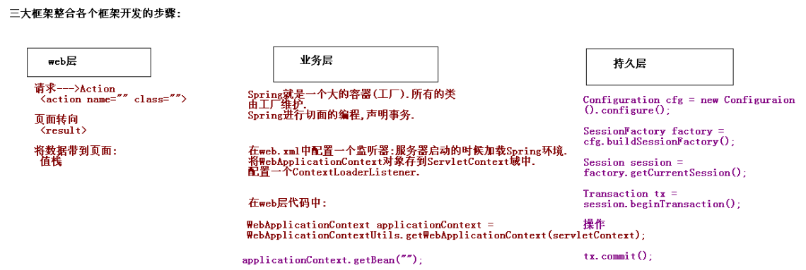
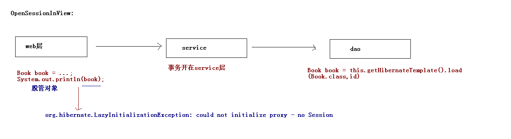

# Spring框架-3

[TOC]

## 1. Spring的事务管理

### 1.1 事务

### 1.2 Spring中事务管理API

分层开发：事务处在Service层.

Spring提供事务管理API:

**PlatformTransactionManager**:平台事务管理器.

* commit(TransactionStatus status)
* getTransaction(TransactionDefinition definition)
* rollback(TransactionStatus status)

**TransactionDefinition**:事务定义

* ISOLation\_XXX: 事务隔离级别.
* PROPAGATION\_XXX: 事务的传播行为.(不是JDBC中有的，为了解决实际开发问题.)
* 过期时间

**TransactionStatus**:事务状态

* flush
* 是否有保存点 hasSavepoint()
* isCompleted() 事务是否已经提交或回滚
* isNewTransaction() 是否一个新的事务
* isRollbackOnly()
* setRollbackOnly()

关系: PlatformTransactionManager通过TransactionDefinition设置事务相关信息管理事务，管理事务过程中，产生一些事务状态， 状态由TransactionStatus记录.

#### API详解

**PlatformTransactionManager**: 接口. Spring为不同的持久化框架提供了不同PlatformTransactionManager接口实现

| 事务 | 说明 |
| :--- | :--- |
| **org.springframework.jdbc.datasource.DataSourceTransactionManager** | 使用Spring JDBC或iBatis 进行持久化数据时使用 |
| **org.springframework.orm.hibernate3.HibernateTransactionManager** | 使用Hibernate3.0版本进行持久化数据时使用 |
| org.springframework.orm.jpa.JpaTransactionManager | 使用JPA进行持久化时使用 |
| org.springframework.jdo.JdoTransactionManager | 当持久化机制是Jdo时使用 |
| org.springframework.transaction.jta.JtaTransactionManager | 使用一个JTA实现来管理事务，在一个事务跨越多个资源时必须使用 |

**TransactionDefinition**:

ISOLation\_XXX: 事务隔离级别：

* ISOLATION\_DEFAULT: 默认级别. Mysql(repeatable\_read) oracle (read\_commited)
* ISOLATION\_READ\_UNCOMMITTED
* ISOLATION\_READ\_COMMITTED
* ISOLATION\_REPEATABLE\_READ
* ISOLATION\_SERIALIZABLE

PROPAGATION\_XXX事务的传播行为: (不是JDBC事务管理，用来解决实际开发的问题.)传播行为：

解决业务层之间的调用的事务的关系.

* PROPAGATION\_REQUIRED: 支持当前事务，如果不存在 就新建一个

```text
A,B 如果A有事务，B使用A的事务，如果A没有事务，B就开启一个新的事务.(A,B是在一个事务中。)
```

* PROPAGATION\_SUPPORTS: 支持当前事务，如果不存在，就不使用事务

```text
A,B 如果A有事务，B使用A的事务，如果A没有事务，B就不使用事务.
```

* PROPAGATION\_MANDATORY: 支持当前事务，如果不存在，抛出异常

```text
A,B 如果A有事务，B使用A的事务，如果A没有事务，抛出异常.
```

* PROPAGATION\_REQUIRES\_NEW: 如果有事务存在，挂起当前事务，创建一个新的事务

```text
A,B 如果A有事务，B将A的事务挂起，重新创建一个新的事务.(A,B不在一个事务中.事务互不影响.)
```

* PROPAGATION\_NOT\_SUPPORTED：以非事务方式运行，如果有事务存在，挂起当前事务

```text
A,B 非事务的方式运行，A有事务，就会挂起当前的事务.
```

* PROPAGATION\_NEVER: 以非事务方式运行，如果有事务存在，抛出异常
* PROPAGATION\_NESTED: 如果当前事务存在，则嵌套事务执行

```text
基于SavePoint技术.
A,B  A有事务，A执行之后，将A事务执行之后的内容保存到SavePoint. B事务有异常的话，用户需要自己设置事务提交还是回滚.
```

* 常用:(重点)

  PROPAGATION\_REQUIRED 默认

  PROPAGATION\_REQUIRES\_NEW

  PROPAGATION\_NESTED

### 1.3 Spring的事务管理

Spring的事务管理分成两类:

* 编程式事务管理:手动编写代码完成事务管理.
* 声明式事务管理:不需要手动编写代码,配置.

### 1.4 事务操作的环境搭建

```text
CREATE TABLE `account` (
  `id` int(11) NOT NULL AUTO_INCREMENT,
  `name` varchar(20) NOT NULL,
  `money` double DEFAULT NULL,
  PRIMARY KEY (`id`)
) ENGINE=InnoDB AUTO_INCREMENT=4 DEFAULT CHARSET=utf8;
INSERT INTO `account` VALUES ('1', 'aaa', '1000');
INSERT INTO `account` VALUES ('2', 'bbb', '1000');
INSERT INTO `account` VALUES ('3', 'ccc', '1000');
```

创建一个web项目:

* 导入相应jar包
* 引入配置文件: applicationContext.xml、log4j.properties、jdbc.properties

创建类:

* AccountService
* AccountDao

在Spring中注册:

```text
<!-- 业务层类 -->
<bean id="accountService" class="demo1.AccountServiceImpl">
  <!-- 在业务层注入Dao -->
  <property name="accountDao" ref="accountDao"/>
</bean>

<!-- 持久层类 -->
<bean id="accountDao" class="demo1.AccountDaoImpl">
  <!-- 注入连接池的对象,通过连接池对象创建模板. -->
  <property name="dataSource" ref="dataSource"/>
</bean>
```

编写一个测试类:

```java
@RunWith(SpringJUnit4ClassRunner.class)
@ContextConfiguration("classpath:spring-config.xml")
public class SpringTest1 {
    @Autowired
    @Qualifier("accountService")
    private AccountService accountService;
    @Test
    public void transfer(){
        accountService.transfer("aaa","bbb",100d);
    }
}
```

### 1.5 Spring的事务管理

#### 手动编码的方式完成事务管理

需要**事务管理器**: 真正管理事务对象.

* Spring提供了事务管理的模板(工具类)

第一步: 注册事务管理器:

```text
<!-- 配置事务管理器 -->
<bean id="transactionManager" class="org.springframework.jdbc.datasource.DataSourceTransactionManager">
    <!-- 需要注入连接池,通过连接池获得连接 -->
    <property name="dataSource" ref="dataSource"/>
</bean>
```

第二步: 注册事务模板类:

```text
<!-- 事务管理的模板 -->
<bean id="transactionTemplate" class="org.springframework.transaction.support.TransactionTemplate">
    <property name="transactionManager" ref="transactionManager"/>
</bean>
```

第三步: 在业务层注入模板类:(模板类管理事务)

```text
<!-- 业务层类 -->
<bean id="accountService" class="demo1.AccountServiceImpl">
    <!-- 在业务层注入Dao -->
    <property name="accountDao" ref="accountDao"/>
    <!-- 在业务层注入事务的管理模板 -->
    <property name="transactionTemplate" ref="transactionTemplate"/>
</bean>
```

第四步: 在业务层代码上使用模板

```java
public void transfer(final String from, final String to, final double money) {

    transactionTemplate.execute(new TransactionCallbackWithoutResult() {

        @Override
        protected void doInTransactionWithoutResult(TransactionStatus transactionStatus) {
            accountDao.out(from,money);
            accountDao.in(to, money);
        }
    });
}
```

手动编码方式缺点:

* 代码量增加,代码有侵入性.

#### 声明式事务管理:(原始方式)

基于TransactionProxyFactoryBean. 导入:aop相应jar包.

第一步: 注册平台事务管理器

```text
<!-- 事务管理器 -->
<bean id="transactionManager" class="org.springframework.jdbc.datasource.DataSourceTransactionManager">
  <!-- 注入连接池 -->
  <property name="dataSource" ref="dataSource"/>
</bean>
```

第二步: 创建业务层代理对象

```text
<!-- 配置生成代理对象 -->
<bean id="accountServiceProxy" class="org.springframework.transaction.interceptor.TransactionProxyFactoryBean">
    <!-- 目标对象 -->
    <property name="target" ref="accountService"/>
    <!-- 注入事务管理器 -->
    <property name="transactionManager" ref="transactionManager"/>
    <!-- 事务的属性设置 -->
    <property name="transactionAttributes">
        <props>
            <prop key="transfer">PROPAGATION_REQUIRED</prop>
        </props>
    </property>
</bean>
```

第三步: 编写测试类

注意:这里注入的是代理对象

```java
@Autowired
@Qualifier("accountServiceProxy")
private AccountService accountService;
```

prop格式：PROPAGATION,ISOLATION,readOnly,-Exception,+Exception

* 顺序: 传播行为、隔离级别、事务是否只读、发生哪些异常可以回滚事务（所有的异常都回滚）、发生了哪些异常不回滚.

**缺点**: 就是需要为每一个管理事务的类生成代理. 需要为每个类都需要进行配置.

#### 声明式事务管理:(自动代理.基于切面 **\*\***)

第一步: 导入相应jar包

* aspectj

第二步: 引入相应约束

* aop、tx约束.

```text
<beans xmlns="http://www.springframework.org/schema/beans"
xmlns:xsi="http://www.w3.org/2001/XMLSchema-instance"
xmlns:context="http://www.springframework.org/schema/context"
xmlns:aop="http://www.springframework.org/schema/aop"
xmlns:tx="http://www.springframework.org/schema/tx"
xsi:schemaLocation="http://www.springframework.org/schema/beans
http://www.springframework.org/schema/beans/spring-beans.xsd
http://www.springframework.org/schema/context
http://www.springframework.org/schema/context/spring-context.xsd
http://www.springframework.org/schema/aop
http://www.springframework.org/schema/aop/spring-aop.xsd
http://www.springframework.org/schema/tx
http://www.springframework.org/schema/tx/spring-tx.xsd">
```

第三步:注册事务管理器;

```text
<!-- 事务管理器 -->
<bean id="transactionManager" class="org.springframework.jdbc.datasource.DataSourceTransactionManager">
    <property name="dataSource" ref="dataSource"/>
</bean>
```

第四步:定义增强(事务管理)

```text
<!-- 定义一个增强 -->
<tx:advice id="txAdvice" transaction-manager="transactionManager">
<!-- 增强(事务)的属性的配置 -->
  <tx:attributes>
  <!--
  <tx:method>上的事务属性：
            isolation:DEFAULT    :事务的隔离级别.
            propagation            :事务的传播行为.
            read-only            :false.不是只读
            timeout                :-1
            no-rollback-for        :发生哪些异常不回滚
            rollback-for        :发生哪些异常回滚事务
            -->
    <tx:method name="transfer"/>
  </tx:attributes>
</tx:advice>
```

第五步:定义aop的配置(切点和通知的组合)

```text
<!-- aop配置定义切面和切点的信息 -->
<aop:config>
    <!-- 定义切点:哪些类的哪些方法应用增强 -->
    <aop:pointcut expression="execution(* demo3.AccountService+.*(..))" id="mypointcut"/>
    <!-- 定义切面: -->
    <aop:advisor advice-ref="txAdvice" pointcut-ref="mypointcut"/>
</aop:config>
```

第六步: 编写测试类

* 注入Service对象, 不需要注入代理对象(生成这个类的时候,已经是代理对象.)

#### 基于注解的事务管理

第一步:事务管理器:

```text
<!-- 事务管理器 -->
<bean id="transactionManager" class="org.springframework.jdbc.datasource.DataSourceTransactionManager">
    <property name="dataSource" ref="dataSource"/>
</bean>
```

第二步:注解事务:

```text
<!-- 开启注解的事务管理 -->
<tx:annotation-driven transaction-manager="transactionManager"/>
```

第三步:在Service上使用注解

@Transactional

注解中有属性值:

* isolation
* propagation
* readOnly

  ...

## 2. SSH框架整合

### 2.1 Struts2 + Spring + Hibernate导包

#### Struts2

* struts2/apps/struts2-blank.war/WEB-INF/lib/\*.jar

导入与spring整合的jar

* struts2/lib/struts2-spring-plugin-2.3.15.3.jar--- 整合Spring框架
* struts2/lib/struts2-json-plugin-2.3.15.3.jar--- 整合AJAX
* struts2/lib/struts2-convention-plugin-2.3.15.3.jar--- 使用Struts2注解开发.
* web.xml

```text
<filter>
  <filter-name>struts2</filter-name>
  <filter-class>org.apache.struts2.dispatcher.ng.filter.StrutsPrepareAndExecuteFilter</filter-class>
</filter>
<filter-mapping>
  <filter-name>struts2</filter-name>
  <url-pattern>/*</url-pattern>
</filter-mapping>
```

* struts.xml

```text
<struts>

    <constant name="struts.devMode" value="true" />

    <package name="default" namespace="/" extends="struts-default">

    </package>

</struts>
```

#### Spring

Spring3.2 开发最基本jar包

* spring-beans-3.2.0.RELEASE.jar
* spring-context-3.2.0.RELEASE.jar
* spring-core-3.2.0.RELEASE.jar
* spring-expression-3.2.0.RELEASE.jar
* com.springsource.org.apache.commons.logging-1.1.1.jar
* com.springsource.org.apache.log4j-1.2.15.jar

AOP开发

* spring-aop-3.2.0.RELEASE.jar
* spring-aspects-3.2.0.RELEASE.jar
* com.springsource.org.aopalliance-1.0.0.jar
* com.springsource.org.aspectj.weaver-1.6.8.RELEASE.jar

Spring Jdbc开发

* spring-jdbc-3.2.0.RELEASE.jar
* spring-tx-3.2.0.RELEASE.jar

Spring事务管理

* spring-tx-3.2.0.RELEASE.jar

Spring整合其他ORM框架

* spring-orm-3.2.0.RELEASE.jar

Spring在web中使用

* spring-web-3.2.0.RELEASE.jar

Spring整合Junit测试

* spring-test-3.2.0.RELEASE.jar

(Spring没有引入c3p0和数据库驱动)

配置: applicationContext.xml，Log4j.properties



在web.xml中配置监听器，服务器启动时加载Spring环境

```text
<!-- 配置Spring的监听器 -->
<listener>
  <!-- 监听器默认加载的是WEB-INF/applicationContext.xml -->
  <listener-class>org.springframework.web.context.ContextLoaderListener</listener-class>
</listener>

<!-- 指定Spring框架的配置文件所在的位置 -->
<context-param>
  <param-name>contextConfigLocation</param-name>
  <param-value>classpath:applicationContext.xml</param-value>
</context-param>
```

#### Hibernate

* 核心包:hibernate3.jar
* lib/required/\*.jar
* lib/jpa/\*.jar
* 引入hibernate整合日志系统的jar包 sl4j
* 数据连接池
* 数据库驱动

二级缓存:(可选的)

* backport-util-concurrent.jar
* commons-logging.jar
* ehcache-1.5.0.jar

Hibernate的配置:

* hibernate.cfg.xml

```text
<session-factory>
   <!-- 必须去配置的属性 -->
   <!-- 配置数据库连接的基本信息: -->
  <property name="hibernate.connection.driver_class">com.mysql.jdbc.Driver</property>
  <property name="hibernate.connection.url">jdbc:mysql:///ssh1</property>
  <property name="hibernate.connection.username">root</property>
  <property name="hibernate.connection.password">****</property>

  <!-- Hibernate的方言 -->
  <!-- 生成底层SQL不同的 -->
  <property name="hibernate.dialect">org.hibernate.dialect.MySQLDialect</property>

  <!-- 可选的属性 -->
  <!-- 显示SQL -->
  <property name="hibernate.show_sql">true</property>
  <!-- 格式化SQL -->
  <property name="hibernate.format_sql">true</property>

  <property name="hibernate.connection.autocommit">false</property>
  <!-- hbm:映射 to DDL: create drop alter -->
  <property name="hibernate.hbm2ddl.auto">update</property>

  <!-- C3P0连接池设定-->
  <!-- 使用c3po连接池  配置连接池提供的供应商-->
  <property name="connection.provider_class">org.hibernate.connection.C3P0ConnectionProvider</property>

  <!--在连接池中可用的数据库连接的最少数目 -->
  <property name="c3p0.min_size">5</property>
  <!--在连接池中所有数据库连接的最大数目  -->
  <property name="c3p0.max_size">20</property>
  <!--设定数据库连接的过期时间,以秒为单位,
  如果连接池中的某个数据库连接处于空闲状态的时间超过了timeout时间,就会从连接池中清除 -->
  <property name="c3p0.timeout">120</property>
  <!--每3000秒检查所有连接池中的空闲连接 以秒为单位-->
  <property name="c3p0.idle_test_period">3000</property>

</session-factory>
```

* 映射: 格式:类名.hbm.xml

### 2.2 Struts2和Spring的整合

1.新建包结构

2.创建实体类

3.新建一个jsp页面:

* addBook.jsp

```text
<s:form action="book_add" namespace="/" method="post" theme="simple">
  图书名称:<s:textfield name="name"/><br/>
  图书价格:<s:textfield name="price"/><br/>
  <s:submit value="添加图书"/>
</s:form>
```

4.编写Action

```java
public class BookAction extends ActionSupport implements ModelDriven<Book>{
    // 模型驱动类
    private Book book = new Book();
    public Book getModel() {
        return book;
     }

    // 处理请求的方法:
    public String add(){
        System.out.println("web层的添加执行了...");
        return NONE;
    }
}
```

5.配置struts.xml

```text
<action name="book_*" class="action.BookAction" method="{1}">
</action>
```

### 2.3 Struts2和Spring的整合两种方式

#### Struts2自己管理Action(方式一)

```text
<action name="book_*" class="cn.itcast.action.BookAction" method="{1}">
```

* Struts2框架自动创建Action的类.

#### Action交给Spring管理(方式二)

可以在action标签上通过一个**伪类名**方式进行配置:

```text
<action name="book_*" class="bookAction" method="{1}"></action>
```

在spring的配置文件中:

```text
<!-- 配置Action -->
<bean id="bookAction" class="action.BookAction" scope="prototype"></bean>
```

**注意**: Action交给Spring管理一定要配置scope=”prototype”默认是单例

推荐使用方式二:

* 在Spring中管理的类,可以对其进行AOP开发.统一的管理.

#### Web层获得Service

传统方式:

* 获得WebApplicationContext对象.
* 通过WebAppolicationContext中getBean(“”);

实际开发中:

* 引入了struts2-spring-plugin-2.3.15.3.jar，有一个配置文件 : struts-plugin.xml

在这里开启了常量:

```text
<constant name="struts.objectFactory" value="spring" />
```

这将引发另一个常量的执行: (**Spring的工厂类按照名称自动注入**)

struts.objectFactory.spring.autoWire = name

只需要在BookAction类中对private BookService bookservice；属性提供setBookService方法，就可以在add方法中获得service对象并使用。还要在spring的配置文件中配置BookAction类的注入属性。

### 2.4 Spring整合Hibernate

Spring整合Hibernate框架的时候有两种方式

#### 零障碍整合(方式一)

可以在Spring中引入Hibernate的配置文件.

1.通过LocalSessionFactoryBean在spring中直接引用hibernate配置文件

```text
<!-- 零障碍整合 在spring配置文件中引入hibernate的配置文件 -->
<bean id="sessionFactory" class="org.springframework.orm.hibernate3.LocalSessionFactoryBean">
    <property name="configLocation" value="classpath:hibernate.cfg.xml"/>
</bean>
```

2.Spring提供了Hibernate的模板.只需要将HibernateTemplate模板注入给DAO.

* DAO继承HibernateDaoSupport.

```text
<!-- DAO的配置 -->
<bean id="bookDao" class="dao.BookDao">
    <property name="sessionFactory" ref="sessionFactory"/>
</bean>
```

改写DAO:

继承HibernateDaoSupport类,就可以直接调用HibernateTemplate模板

```java
public class BookDao extends HibernateDaoSupport{

    public void save(Book book) {
        System.out.println("DAO层的保存图书...");
        this.getHibernateTemplate().save(book);
    }
}
```

3.创建一个映射文件 :

```text
<hibernate-mapping>
  <class name="vo.Book" table="book">
    <id name="id">
      <generator class="native"/>
    </id>
    <property name="name"/>
    <property name="price"/>
  </class>
</hibernate-mapping>
```

4.事务管理器

事务管理器注入的属性对象是sessionFactory

```text
<!-- 管理事务 -->
<bean id="transactionManager" class="org.springframework.orm.hibernate3.HibernateTransactionManager">
  <property name="sessionFactory" ref="sessionFactory"/>
</bean>
```

5.注解管理事务

```text
<!-- 注解开启事务 -->
<tx:annotation-driven transaction-manager="transactionManager"/>
```

6.在业务层类BookService上添加一个注解 @Transactional

#### 没有Hibernate配置文件的形式(方式二)

不需要Hibernate配置文件的方式, 将Hibernate配置文件的信息直接配置到Spring中.

Hibernate配置文件中的信息 :

* 连接数据库基本参数
* Hibernate常用属性
* 连接池
* 映射

把Hibernate配置文件整合Spring中:

在spring配置文件中配置连接池：

```text
<!-- 引入外部属性文件. -->
<context:property-placeholder location="classpath:jdbc.properties"/>

<!-- 配置c3p0连接池 -->
<bean id="dataSource" class="com.mchange.v2.c3p0.ComboPooledDataSource">
  <property name="driverClass" value="${jdbc.driver}"/>
  <property name="jdbcUrl" value="${jdbc.url}"/>
  <property name="user" value="${jdbc.user}"/>
  <property name="password" value="${jdbc.password}"/>
</bean>
```

在SessionFactory中配置Hibernate常用属性:

```text
<bean id="sessionFactory" class="org.springframework.orm.hibernate3.LocalSessionFactoryBean">
    <property name="dataSource" ref="dataSource"/>

    <!-- 配置Hibernate的属性 -->
    <property name="hibernateProperties">
        <props>
            <prop key="hibernate.dialect">org.hibernate.dialect.MySQLDialect</prop>
            <prop key="hibernate.show_sql">true</prop>
            <prop key="hibernate.format_sql">true</prop>
            <prop key="hibernate.hbm2ddl.auto">update</prop>
            <prop key="hibernate.connection.autocommit">false</prop>
        </props>
    </property>
</bean>
```

映射：

```text
<!--方式一 按照映射文件加载-->
<property name="mappingResources">
  <list>
    <value>vo/Book.hbm.xml</value><!--用/表示路径-->
  </list>
</property>

<!--方式二 按照映射文件所在文件夹加载-->
<property name="mappingDirectoryLocations">
  <list>
    <value>classpath:vo</value><!--用/表示路径-->
  </list>
</property>
```

### 2.5 HibernateTemplate的API

| 方法 | 描述 |
| :--- | :--- |
| Serializable save(Object entity) | 保存数据 |
| void update(Object entity) | 修改数据 |
| void delete(Object entity) | 删除数据 |
| &lt;T&gt; T get(Class&lt;T&gt; entityClass, Serializable id) | 根据ID进行检索.立即检索 |
| &lt;T&gt; T load(Class&lt;T&gt; entityClass, Serializable id) | 根据ID进行检索.延迟检索 |
| List find(String queryString, Object... values) | 支持HQL查询.直接返回List集合 |
| List findByCriteria(DetachedCriteria criteria) | 离线条件查询 |
| List findByNamedQuery(String queryName, Object... values) | 命名查询的方式 |

```java
this.getHibernateTemplate().save(book);

this.getHibernateTemplate().update(book);

this.getHibernateTemplate().delete(book);

this.getHibernateTemplate().get(Book.class, id);

this.getHibernateTemplate().find("from Book");

this.getHibernateTemplate().findByCriteria(criteria);

this.getHibernateTemplate().findByNamedQuery("findByName", name);//命名查询需要配置
```

#### 2.6 OpenSessionInView

this.getHibernateTemplate().load(Book.class,id); 在dao中获得的是延迟加载对象，在web层打印对象时，service层的事务已经关闭，web加载不到真实对象。



解决方法：过滤器OpenSessionInView在视图层管理事务操作

```text
<filter>
    <filter-name>OpenSessionInViewFilter</filter-name>
    <filter-class>org.springframework.orm.hibernate3.support.OpenSessionInViewFilter</filter-class>
</filter>

<filter-mapping>
    <filter-name>OpenSessionInViewFilter</filter-name>
    <url-pattern>/*</url-pattern>
</filter-mapping>
```

## 3. 基于注解的方式整合SSH

* 导入以上工程jar包
* 导入struts2的注解开发 struts2-convention-plugin-2.3.15.3.jar
* web.xml

```text
<!-- 配置Spring的监听器 -->
<listener>
  <!-- 监听器默认加载的是WEB-INF/applicationContext.xml -->
  <listener-class>org.springframework.web.context.ContextLoaderListener</listener-class>
</listener>

<!-- 指定Spring框架的配置文件所在的位置 -->
<context-param>
  <param-name>contextConfigLocation</param-name>
  <param-value>classpath:applicationContext.xml</param-value>
</context-param>

<!-- 配置Struts2的核心过滤器 -->
<filter>
  <filter-name>struts2</filter-name>
  <filter-class>org.apache.struts2.dispatcher.ng.filter.StrutsPrepareAndExecuteFilter</filter-class>
</filter>
<filter-mapping>
  <filter-name>struts2</filter-name>
  <url-pattern>/*</url-pattern>
</filter-mapping
```

* 创建包结构
* 引入spring的配置文件、log4j、jdbc属性文件.
* 创建页面
* 创建Action

```java
@Namespace("/")
@ParentPackage("struts-default")
public class BookAction extends ActionSupport implements ModelDriven<Book>{
  private Book book = new Book();
  public Book getModel() {
  return book;
}  

  @Action(value="book_add")
  public String add(){
    System.out.println("web层添加图书...");
    return NONE;
  }
}
```

* Action---Service----Dao

将各层类使用注解装配Spring中:

@Controller --Action 还要配@Scope("protopype") @Service --Service @Repository --Dao

完成属性注入: 在Action中注入Service，在Service中注入Dao

@Autowired  
@Qualifier("bookService")

在spring配置文件中开启注解,指定查找注解类的包

```text
<context:component-scan base-package="action,service,dao"/>
```

* 实体类

```java
@Entity
@Table(name="book")
public class Book {
    @Id
    //生成策略
    @GeneratedValue(strategy=GenerationType.IDENTITY)
    private Integer id;

    @Column(name="name")
    private String name;

    private Double price;
    public Integer getId() {
        return id;
    }
    public void setId(Integer id) {
        this.id = id;
    }
    public String getName() {
        return name;
    }
    public void setName(String name) {
        this.name = name;
    }
    public Double getPrice() {
        return price;
    }
    public void setPrice(Double price) {
        this.price = price;
    }
    @Override
    public String toString() {
        return "Book [id=" + id + ", name=" + name + ", price=" + price + "]";
    }

}
```

* 配置Hibernate的其他属性

这里用的是AnnotationSessionFactoryBean，并配置映射扫描

```text
<!-- 配置Hibernate的其他属性: -->
<bean id="sessionFactory" class="org.springframework.orm.hibernate3.annotation.AnnotationSessionFactoryBean">
    <property name="dataSource" ref="dataSource"/>
    <!-- 配置Hibernate的属性 -->
    <property name="hibernateProperties">
        <props>
            <prop key="hibernate.dialect">org.hibernate.dialect.MySQLDialect</prop>
            <prop key="hibernate.show_sql">true</prop>
            <prop key="hibernate.format_sql">true</prop>
            <prop key="hibernate.hbm2ddl.auto">update</prop>
            <prop key="hibernate.connection.autocommit">false</prop>
        </props>
    </property>

    <!-- 映射扫描 -->
    <property name="packagesToScan">
        <list>
            <value>vo</value>
        </list>
    </property>
</bean>
```

* 事务管理

```text
<bean id="transactionManager" class="org.springframework.orm.hibernate3.HibernateTransactionManager">
    <property name="sessionFactory" ref="sessionFactory"/>
</bean>

<tx:annotation-driven transaction-manager="transactionManager"/>
```

* 模板注入

这种注解方式下必须手动注入HibernateTemplate，不能继承HibernateDaoSupport类，因为原来的类不能加注解

```text
<bean id="hibernateTemplate" class="org.springframework.orm.hibernate3.HibernateTemplate">
    <property name="sessionFactory" ref="sessionFactory"/>
</bean>
```

在Dao中手动注入HibernateTemplate

```java
@Autowired
@Qualifier("hibernateTemplate")
private HibernateTemplate hibernateTemplate;
```
