# springmvc-1

## 框架

springmvc 是 spring 的一个模块，提供 web 层解决方案（基于 mvc 设计架构）

mvc 是一个设计模式，在 b/s 系统的应用

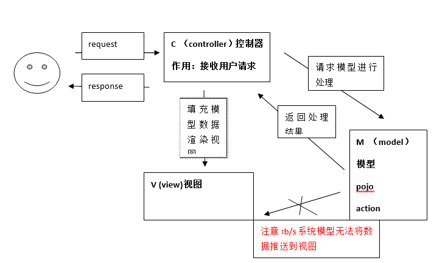

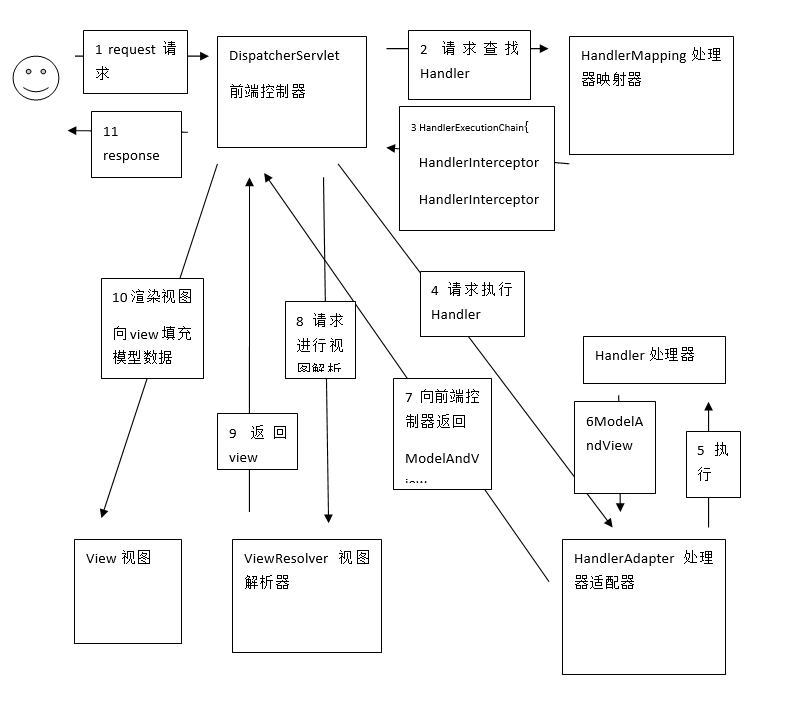

第一步：用户发起 request 请求，请求至 DispatcherServlet 前端控制器
第二步：DispatcherServlet 前端控制器请求 HandlerMapping 处理器映射器查找 Handler
DispatcherServlet：前端控制器，相当于中央调度器，各各组件都和前端控制器进行交互，降低了各各组 件之间耦合度。
第三步：HandlerMapping 处理器映射器，根据 url 及一些配置规则（xml 配置、注解配置）查找 Handler，将 Handler 返回给 DispatcherServlet 前端控制器
第四步：DispatcherServlet 前端控制器调用适配器执行 Handler，有了适配器通过适配器去扩展对不同 Handler 执行方式（比如：原始 servlet 开发，注解开发）
第五步：适配器执行 Handler
Handler 是后端控制器，当成模型。
第六步：Handler 执行完成返回 ModelAndView
ModelAndView：springmvc 的一个对象，对 Model 和 view 进行封装。
第七步：适配器将 ModelAndView 返回给 DispatcherServlet

第八步：DispatcherServlet 调用视图解析器进行视图解析，解析后生成 view
视图解析器根据逻辑视图名解析出真正的视图。
View：springmvc 视图封装对象，提供了很多 view，jsp、freemarker、pdf、excel。。。
第九步：ViewResolver 视图解析器给前端控制器返回 view
第十步：DispatcherServlet 调用 view 的渲染视图的方法，将模型数据填充到 request 域 。
第十一步：DispatcherServlet 向用户响应结果(jsp 页面、json 数据。。。。)

DispatcherServlet：前端控制器，由 springmvc 提供

HandlerMappting：处理器映射器，由 springmvc 提供

HandlerAdapter：处理器适配器，由 springmvc 提供

Handler：处理器，需要程序员开发

ViewResolver：视图解析器，由 springmvc 提供

View：真正视图页面需要由程序编写

## 入门程序

### web.xml 中配置前端控制器 DispatcherServle

```markdown
<!-- 前端控制器 -->
<servlet>
<servlet-name>springmvc</servlet-name>
<servlet-class>org.springframework.web.servlet.DispatcherServlet</servlet-class>
<!-- 加载springmvc配置 -->
<init-param>
    <param-name>contextConfigLocation</param-name>
    <!-- 配置文件的地址
        如果不配置contextConfigLocation，
        默认查找的配置文件名称classpath下的：servlet名称+"-serlvet.xml"即：springmvc-serlvet.xml
        -->
    <param-value>classpath:springmvc.xml</param-value>
</init-param>
</servlet>
<servlet-mapping>
<servlet-name>springmvc</servlet-name>
<!-- 可以配置/ ，此工程 所有请求全部由springmvc解析，此种方式可以实现 RESTful方式，需要特殊处理对静态文件的解析不能由springmvc解析
可以配置*.do或*.action，所有请求的url扩展名为.do或.action由springmvc解析，此种方法常用 
不可以/*，如果配置/*，返回jsp也由springmvc解析，这是不对的 -->
<url-pattern>*.action</url-pattern>
</servlet-mapping>
```

### springmvc.xml

在 springmvc.xml 中配置 springmvc 架构三大组件（处理器映射器、适配器、视图解析器）

- 所有处理器映射器都实现 HandlerMapping 接口
- 所有的适配器都是实现了 HandlerAdapter 接口(编写 Handler 根据适配器的要求编写,实现哪个接口)
- Handler 配置需要根据所使用的的处理器映射器指定的映射方法来配置
- 配置视图解析器 要求将 jstl 的包加到 classpath

```markdown
<beans xmlns="http://www.springframework.org/schema/beans"
	xmlns:xsi="http://www.w3.org/2001/XMLSchema-instance" xmlns:mvc="http://www.springframework.org/schema/mvc"
	xmlns:context="http://www.springframework.org/schema/context"
	xmlns:aop="http://www.springframework.org/schema/aop" xmlns:tx="http://www.springframework.org/schema/tx"
	xsi:schemaLocation="http://www.springframework.org/schema/beans 
		http://www.springframework.org/schema/beans/spring-beans-3.2.xsd 
		http://www.springframework.org/schema/mvc 
		http://www.springframework.org/schema/mvc/spring-mvc-3.2.xsd 
		http://www.springframework.org/schema/context 
		http://www.springframework.org/schema/context/spring-context-3.2.xsd 
		http://www.springframework.org/schema/aop 
		http://www.springframework.org/schema/aop/spring-aop-3.2.xsd 
		http://www.springframework.org/schema/tx 
		http://www.springframework.org/schema/tx/spring-tx-3.2.xsd ">

<!-- 配置Handler 由于使用了BeanNameUrlHandlerMapping处理映射器，name配置为url -->

<bean name="/itemList.action"
		class="cn.itcast.springmvc.first.ItemController1" />

<!-- 配置处理器映射器 springmvc框架根据HandlerMapping接口判断是否是处理器映射器 -->
<!-- 根据bean的name进行查找Handler 将action的url配置在bean的name中 -->

<bean
		class="org.springframework.web.servlet.handler.BeanNameUrlHandlerMapping" />

<!-- 配置处理器适配器 springmvc框架根据HandlerAdapter接口判断是否是处理器适配器 -->

<bean
		class="org.springframework.web.servlet.mvc.SimpleControllerHandlerAdapter" />

<!-- 配置视图解析器 要求将jstl的包加到classpath -->
<!-- ViewResolver -->
<!-- 真正视图地址==前缀+逻辑视图名+后缀 -->

<bean
		class="org.springframework.web.servlet.view.InternalResourceViewResolver">
<property name="prefix" value="/WEB-INF/jsp/" />
<property name="suffix" value=".jsp" />
</bean>
</beans>
```

### Handler 编写

```java
//SimpleControllerHandlerAdapter适配器要求实现Controller接口
public class ItemController1 implements Controller {
	@Override
	public ModelAndView handleRequest(HttpServletRequest request, HttpServletResponse response) throws Exception {
		// 使用静态数据将商品信息列表显示在jsp页面
		// 商品列表
		List<Items> itemsList = new ArrayList<Items>();

		Items items_1 = new Items();
		items_1.setName("联想笔记本");
		items_1.setPrice(6000f);
		items_1.setCreatetime(new Date());
		items_1.setDetail("ThinkPad T430 联想笔记本电脑！");

		Items items_2 = new Items();
		items_2.setName("苹果手机");
		items_2.setPrice(5000f);
		items_2.setDetail("iphone6苹果手机！");

		itemsList.add(items_1);
		itemsList.add(items_2);

		ModelAndView modelAndView = new ModelAndView();
		//将数据填充到request
        //request.setAttribute("itemsList", itemsList);
		modelAndView.addObject("itemsList", itemsList);
		//指定转发的jsp页面
		modelAndView.setViewName("itemsList");//逻辑视图名
		return modelAndView;
	}
}
```

## 其它非注解处理器映射器和适配器

### BeanNameUrlHandlerMapping(映射器)

根据请求 url（XXXX.action）匹配 spring 容器 bean 的 name, 找到对应的 bean（程序编写的 Handler）

### SimpleUrlHandlerMapping(映射器)

```markdown
<!--简单url映射 集中配置bean的id对应 的url -->
<bean class="org.springframework.web.servlet.handler.SimpleUrlHandlerMapping">
    <property name="mappings">
        <props>
            <!--这里填的是配置handler的bean时的id-->
            <prop key="/itemsTest1.action">itemController1</prop>
            <prop key="/itemsTest2.action">itemController1</prop>
        </props>
    </property>
</bean>
```

在 springmvc.xml 配置了多个处理器映射器，多个处理器映射器可以共存。

### SimpleControllerHandlerAdapter(适配器)

要求程序编写的 Handler(Controller)需要实现 Controller 接口。

### HttpRequestHandlerAdapter（适配器）

要求 Handler 实现 HttpRequestHandler 接口

在 springmvc.xml 中配置 HttpRequestHandlerAdapter

```markdown
<!-- HttpRequestHandlerAdapter适配器 -->
<bean class="org.springframework.web.servlet.mvc.HttpRequestHandlerAdapter" />
```

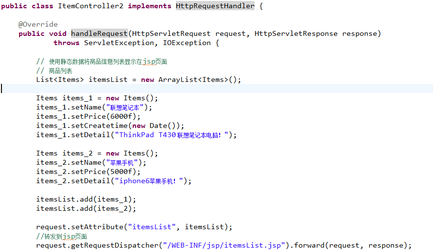

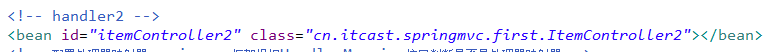

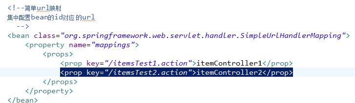

## DispatcherServlet.properoties

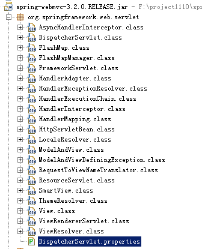

DispatcherServlet 前端控制器加载 DispatcherServlet.properoties 配置文件，从而默认加载各各组件 Default implementation classes for DispatcherServlet's strategy interfaces, 如果在 springmvc.xml 中配置了处理器映射器和适配器，以 sprintmvc.xml 中配置的为准.

## 注解映射器和适配器

### 注解映射器

spring3.1 之前默认加载映射器是 org.springframework.web.servlet.mvc.annotation.DefaultAnnotationHandlerMapping，3.1 之后要使用：
org.springframework.web.servlet.mvc.method.annotation.RequestMappingHandlerMapping

在 springmvc.xml 中配置 RequestMappingHandlerMapping：

```markdown
<!-- 注解处理器映射器 -->

<bean class="org.springframework.web.servlet.mvc.method.annotation.RequestMappingHandlerMapping"></bean>
```

使用 RequestMappingHandlerMapping 需要在 Handler 中使用@controller 标识此类是一个控制器，使用@requestMapping 指定 Handler 方法所对应的 url。

### 注解适配器

spring3.1 之前默认加载映射器是
org.springframework.web.servlet.mvc.annotation.AnnotationMethodHandlerAdapter，3.1 之后要使用：
org.springframework.web.servlet.mvc.method.annotation.RequestMappingHandlerAdapter

RequestMappingHandlerAdapter，不要求 Handler 实现任何接口，它需要和 RequestMappingHandlerMapping 注解映射器配对使用，主要解析 Handler 方法中的形参。

### 注解开发 Hanlder

```java
@Controller
public class ItemController3{
	//商品列表，@RequestMapping中url建议和方法名一致，方便开发维护
	@RequestMapping("/queryItems")
	public ModelAndView queryItems() {
		// 使用静态数据将商品信息列表显示在jsp页面
		// 商品列表
		List<Items> itemsList = new ArrayList<Items>();
        ...//添加商品信息
		ModelAndView modelAndView = new ModelAndView();
		modelAndView.addObject("itemsList", itemsList);
		modelAndView.setViewName("/WEB-INF/jsp/itemsList.jsp");
		return modelAndView;
	}
}
```

### 配置 Handler

```markdown
<!-- 注解的handler，单个配置 url已经在注解中配置-->
<!-- <bean class="cn.itcast.springmvc.first.ItemController3"/> -->

<!-- 使用spring组件扫描 -->

<context:component-scan base-package="cn.itcast.springmvc.first" />
```

建议使用组件扫描，组件扫描可以扫描@Controller、@Service、@component、@Repsitory

## springmvc 和 mybatis 整合工程搭建

### 整合思路

在 mybatis 和 spring 整合的基础上 添加 springmvc。

spring 要管理 springmvc 编写的 Handler（controller）、mybatis 的 SqlSessionFactory、mapper

第一步：整合 dao，spring 和 mybatis 整合
第二步：整合 service，spring 管理 service 接口，service 中可以调用 spring 容器中 dao(mapper)
第三步：整合 controller，spring 管理 controller 接口，在 controller 调用 service

mybatis：3.2.7,spring：3.2.0,mybatis 的 jar,mybatis 和 spring 整合包,spring 的所有 jar 包(包括 springmvc 的包),数据库驱动包,log4j 日志..

### 配置文件

- applicationContext-dao.xml--- 配置数据源、SqlSessionFactory、mapper 扫描器

```markdown
<!-- 加载配置文件 -->

<context:property-placeholder location="classpath:db.properties" />

<!-- 数据库连接池 -->

<bean id="dataSource" class="org.apache.commons.dbcp.BasicDataSource"
	destroy-method="close">
<property name="driverClassName" value="${jdbc.driver}" />
<property name="url" value="${jdbc.url}" />
<property name="username" value="${jdbc.username}" />
<property name="password" value="${jdbc.password}" />
<property name="maxActive" value="10" />
<property name="maxIdle" value="5" />
</bean>

<!-- SqlsessionFactory -->
<bean id="sqlSessionFactory" class="org.mybatis.spring.SqlSessionFactoryBean">
	<!-- 数据源 -->
	<property name="dataSource" ref="dataSource"/>
	<!-- mybatis配置文件 -->
	<property name="configLocation" value="classpath:mybatis/SqlMapConfig.xml"/>
</bean>

<!--
MapperScannerConfigurer：mapper的扫描器，将包下边的mapper接口自动创建代理对象，
自动创建到spring容器中，bean的id是mapper的类名（首字母小写）
	-->
<bean class="org.mybatis.spring.mapper.MapperScannerConfigurer">
	<!-- 配置扫描包的路径
	如果要扫描多个包，中间使用半角逗号分隔
	要求mapper.xml和mapper.java同名且在同一个目录 
		-->
	<property name="basePackage" value="cn.itcast.ssm.mapper"/>
	<!-- 使用sqlSessionFactoryBeanName -->
	<property name="sqlSessionFactoryBeanName" value="sqlSessionFactory"/>		
</bean>
```

- applicationContext-service.xml---配置 service 接口

- applicationContext-transaction.xml--事务管理

```markdown
<!-- 使用声明式事务配置，可以有效规范代码 -->
<!-- 事务管理器 -->

<bean id="transactionManager" 
	class="org.springframework.jdbc.datasource.DataSourceTransactionManager">
<property name="dataSource" ref="dataSource"/>
</bean>

<!-- 通知 -->

<tx:advice id="txAdvice" transaction-manager="transactionManager">
<tx:attributes>
<tx:method name="save*" propagation="REQUIRED"/>
<tx:method name="insert*" propagation="REQUIRED"/>
<tx:method name="update*" propagation="REQUIRED"/>
<tx:method name="delete*" propagation="REQUIRED"/>
<tx:method name="find*" propagation="SUPPORTS" read-only="true"/>
<tx:method name="select*" propagation="SUPPORTS" read-only="true"/>
<tx:method name="get\*" propagation="SUPPORTS" read-only="true"/>
</tx:attributes>
</tx:advice>

<!-- aop -->

<aop:config>
<aop:advisor advice-ref="txAdvice"
pointcut="execution(_ cn.itcast.ssm.service.impl._.\*(..))"/>
</aop:config>
```

- sprintmvc.xml---springmvc 的配置，配置处理器映射器、适配器、视图解析器

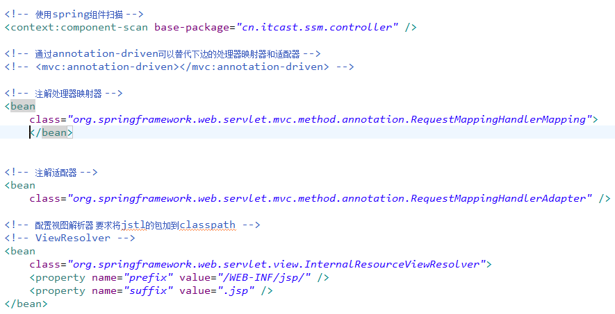

- SqlMapConfig.xml---mybatis 的配置文件，配置别名、settings、mapper

- web.xml 前端控制器配置 DispatcherServlet

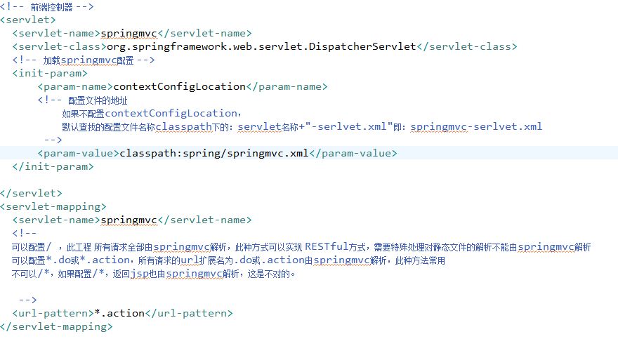

- web.xml 配置 spring 监听器

```markdown
<!-- 配置spring容器监听器 -->
<context-param>
	<param-name>contextConfigLocation</param-name>
	<param-value>/WEB-INF/classes/spring/applicationContext-*.xml</param-value>
</context-param>
<listener>
	<listener-class>org.springframework.web.context.ContextLoaderListener</listener-class>
</listener>
```

### 需求

查询商品列表

### mapper 开发

功能描述：根据条件查询商品信息，返回商品列表.一般情况下针对查询 mapper 需要自定义 mapper。
首先针对单表进行逆向工程，生成代码。

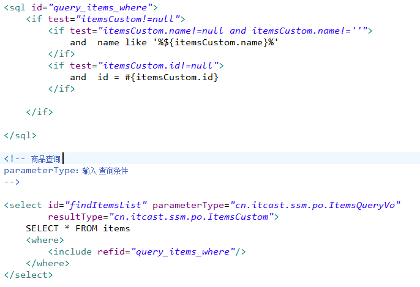

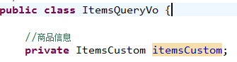

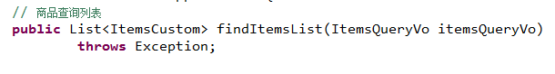

### service 开发

```java
public class ItemsServiceImpl implements ItemsService {

	//注入mapper
	@Autowired
	private ItemsMapperCustom itemsMapperCustom;

	@Override
	public List<ItemsCustom> findItemsList(ItemsQueryVo itemsQueryVo) throws Exception {
		return itemsMapperCustom.findItemsList(itemsQueryVo);
	}

}
```

### 在 applicationContext-service.xml 中配置 service

```markdown
<!-- 商品管理 的service -->
<bean id="itemsService" class="cn.itcast.ssm.service.impl.ItemsServiceImpl"/>
```

### controller 开发

```java
@Controller
public class ItemsController {

	//注入service
	@Autowired
	private ItemsService itemsService;

	@RequestMapping("/queryItems")
	public ModelAndView queryItems() throws Exception {

		//调用service查询商品列表
		List<ItemsCustom> itemsList = itemsService.findItemsList(null);

		ModelAndView modelAndView = new ModelAndView();
		modelAndView.addObject("itemsList", itemsList);
		// 指定逻辑视图名
		modelAndView.setViewName("itemsList");

		return modelAndView;
	}
}
```

## 注解开发基础

### 需求

功能描述：商品信息修改

操作流程：
1、在商品列表页面点击修改连接
2、打开商品修改页面，显示了当前商品的信息
根据商品 id 查询商品信息
3、修改商品信息，点击提交。
更新商品信息

### service 开发

```java
public interface ItemsService {

	//商品查询列表
	public List<ItemsCustom> findItemsList(ItemsQueryVo itemsQueryVo)
				throws Exception;
	//根据商品id查询商品信息
	public ItemsCustom findItemsById(int id) throws Exception;

	//更新商品信息
	/**
	* 定义service接口，遵循单一职责，将业务参数细化 （不要使用包装类型，比如map）
	* @param id 修改商品的id
	* @param itemsCustom 修改商品的信息
	* @throws Exception
	*/
	public void updateItems(Integer id,ItemsCustom itemsCustom)throws Exception;

}
```

```java
public class ItemsServiceImpl implements ItemsService {

	//注入mapper
	@Autowired
	private ItemsMapperCustom itemsMapperCustom;
	@Autowired
	private ItemsMapper itemsMapper;

	@Override
	public List<ItemsCustom> findItemsList(ItemsQueryVo itemsQueryVo) throws Exception {
		return itemsMapperCustom.findItemsList(itemsQueryVo);
	}
	@Override
	public ItemsCustom findItemsById(int id) throws Exception {
		Items items = itemsMapper.selectByPrimaryKey(id);
		//在这里随着需求的变量，需要查询商品的其它的相关信息，返回到controller
		ItemsCustom itemsCustom = new ItemsCustom();
		//将items的属性拷贝到itemsCustom
		BeanUtils.copyProperties(items, itemsCustom);
		return itemsCustom;
	}

	@Override
	public void updateItems(Integer id, ItemsCustom itemsCustom) throws Exception {
		///写业务代码

		//对于关键业务数据的非空校验
		if(id == null){
			//抛出异常，提示调用接口的用户，id不能为空
			//...
		}
		itemsMapper.updateByPrimaryKey(itemsCustom);
	}

}
```

### controller 开发

#### @RequestMapping

- 设置方法对应的 url（完成 url 映射）一个方法对应一个 url

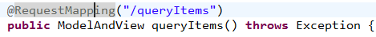

- 窄化请求映射 在 class 上定义根路径，访问时根路径+方法的 url

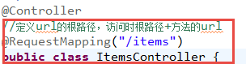

好处：更新规范系统 的 url，避免 url 冲突。

- 限制 http 请求

```java
//使用method=RequestMethod.GET限制使用get方法
@RequestMapping(value="/editItems",method={RequestMethod.GET})
public ModelAndView editItems()throws Exception{...}
```

#### controller 方法返回值

- 返回 ModelAndView

- 返回字符串.如果 controller 方法返回 jsp 页面，可以简单将方法返回值类型定义 为字符串，最终返回逻辑视图名。

```java
//方法返回 字符串，字符串就是逻辑视图名，Model作用是将数据填充到request域，在页面展示
@RequestMapping(value="/editItems",method={RequestMethod.GET})
public String editItems(Model model,Integer id)throws Exception{

	//调用 service查询商品信息
	ItemsCustom itemsCustom = itemsService.findItemsById(id);

	model.addAttribute("item", itemsCustom);
	return "editItem";

}
```

- 返回 void

```java
//方法返回void
@RequestMapping(value="/editItems",method={RequestMethod.GET})
public void editItems(HttpServletRequest request,HttpServletResponse response)throws Exception {
	//调用 service查询商品信息
	ItemsCustom itemsCustom = itemsService.findItemsById(id);
	request.setAttribute("item", itemsCustom);
	//注意如果使用request转向页面，这里指定页面的完整路径
	request.getRequestDispatcher("/WEB-INF/jsp/editItem.jsp").forward(request, response);
}
//使用此方法，容易输出json、xml格式的数据
//通过response指定响应结果，例如响应json数据如下：
//response.setCharacterEncoding("utf-8");
//response.setContentType("application/json;charset=utf-8");
//response.getWriter().write("json串");
```

- redirect 重定向, 如果方法重定向到另一个 url，方法返回值为“redirect:url 路径”, 使用 redirect 进行重定向，request 数据无法共享，url 地址栏会发生变化的。

- forward 转发, 使用 forward 进行请求转发，request 数据可以共享，url 地址栏不会。
  方法返回值为“forward:url 路径

```java
//请求重定向
return "redirect:queryItems.action";
//转发
return "forward:queryItems.action";
```

### Handler 参数绑定

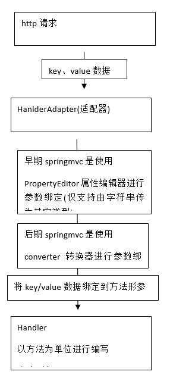

#### 默认支持的参数类型

处理器形参中添加如下类型的参数处理适配器会默认识别并进行赋值。

- HttpServletRequest,通过 request 对象获取请求信息
- HttpServletResponse,通过 response 处理响应信息
- HttpSession,通过 session 对象得到 session 中存放的对象
- Model,通过 model 向页面传递数据:

```java
//调用service查询商品信息
Items item = itemService.findItemById(id);
model.addAttribute("item", item);
//页面通过${item.XXXX}获取item对象的属性值
```

#### @RequestParam

如果 request 请求的参数名和 controller 方法的形参数名称一致，适配器自动进行参数绑定。如果不一致可以通过@RequestParam 指定 request 请求的参数名绑定到哪个方法形参上。

- 对于必须要传的参数，通过@RequestParam 中属性 required 设置为 true，如果不传此参数则报错。

- 对于有些参数如果不传入，还需要设置默认值，使用@RequestParam 中属性 defaultvalue 设置默认值。

```java
@RequestMapping(value="/editItems",method={RequestMethod.GET})
public void editItems(
			HttpServletRequest request,
			HttpServletResponse response,
			@RequestParam(value = "item_id", required = false, defaultValue = "1") Integer id
			Integer id
			)
			throws Exception {
...
```

#### 可以绑定的类型

- 可以绑定简单类型 整型、 字符串、单精/双精度、日期、布尔型。

- 可以绑定简单 pojo 类型(只包括简单类型的属性),request 请求的参数名称和 pojo 的属性名一致，就可以绑定成功。

问题：如果 controller 方法形参中有多个 pojo 且 pojo 中有重复的属性，使用简单 pojo 绑定无法有针对性的绑定，
比如：方法形参有 items 和 User，pojo 同时存在 name 属性，从 http 请求过程的 name 无法有针对性的绑定到 items 或 user。

- 可以绑定包装的 pojo(包装的 pojo 里边包括了 pojo) 页面参数定义的 name 和包装类中 pojo 属性名一致,就可以绑定成功
  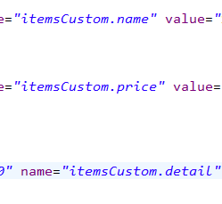
  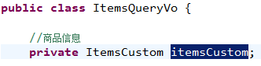

#### 自定义绑定使用属性编辑器

springmvc 没有提供默认的对日期类型的绑定，需要自定义日期类型的绑定。

- 使用 **WebDataBinder**（了解）

在 controller 类中定义：

```java
//自定义属性编辑器
@InitBinder
public void initBinder(WebDataBinder binder) throws Exception {
	// Date.class必须是与controler方法形参pojo属性一致的date类型，这里是java.util.Date
	binder.registerCustomEditor(Date.class,
		new CustomDateEditor(new SimpleDateFormat("yyyy-MM-dd HH-mm-ss"), true));
}
//使用这种方法问题是无法在多个 controller 共用。
```

- 使用 **WebBindingInitializer**（了解）,让多个 controller 共用 属性编辑器。

自定义 WebBindingInitializer，注入到处理器适配器中。如果想多个 controller 需要共同注册相同的属性编辑器，可以实现 PropertyEditorRegistrar 接口，并注入 webBindingInitializer 中。

编写 CustomPropertyEditor：

```java
public class CustomPropertyEditor implements PropertyEditorRegistrar {

	@Override
	public void registerCustomEditors(PropertyEditorRegistry binder) {
		binder.registerCustomEditor(Date.class, new CustomDateEditor(
				new SimpleDateFormat("yyyy-MM-dd HH-mm-ss"), true));

	}
}

```

配置如下：

```markdown
<!-- 注册属性编辑器 -->

<bean id="customPropertyEditor" class="cn.itcast.ssm.propertyeditor.CustomPropertyEditor"></bean>

<!-- 自定义webBinder -->

<bean id="customBinder"
	class="org.springframework.web.bind.support.ConfigurableWebBindingInitializer">
<property name="propertyEditorRegistrars">
<list>
<ref bean="customPropertyEditor"/>
</list>
</property>
</bean>

<!--注解适配器 -->

<bean
	class="org.springframework.web.servlet.mvc.method.annotation.RequestMappingHandlerAdapter">
<property name="webBindingInitializer" ref="customBinder"></property>
</bean>
```

#### 自定义参数绑定使用转换器(架构师掌握)

定义日期类型转换器和字符串去除前后空格转换器实现 Converter 接口

配置转换器

方式一:

```markdown
<!-- 注解适配器 -->

<bean
	class="org.springframework.web.servlet.mvc.method.annotation.RequestMappingHandlerAdapter">

<!-- 在webBindingInitializer中注入自定义属性编辑器、自定义转换器 -->

<property name="webBindingInitializer" ref="customBinder"></property>
</bean>

<!-- 自定义webBinder -->

<bean id="customBinder"
	class="org.springframework.web.bind.support.ConfigurableWebBindingInitializer">

<!-- 使用converter进行参数转 -->
<property name="conversionService" ref="conversionService" />
</bean>

<!-- 转换器 -->

<bean id="conversionService"
	class="org.springframework.format.support.FormattingConversionServiceFactoryBean">
<property name="converters">
<list>
<bean class="cn.itcast.ssm.controller.converter.CustomDateConverter"/>
<bean class="cn.itcast.ssm.controller.converter.StringTrimConverter"/>
</list>
</property>
</bean>
```

方式二:

```markdown
<mvc:annotation-driven conversion-service="conversionService"></mvc:annotation-driven>

<bean id="conversionService"
	class="org.springframework.format.support.FormattingConversionServiceFactoryBean">

<!-- 转换器 -->
<property name="converters">
<list>
<bean class="cn.itcast.ssm.controller.converter.CustomDateConverter"/>
<bean class="cn.itcast.ssm.controller.converter.StringTrimConverter"/>
</list>
</property>
</bean>
```

## 问题处理(post,get 中文乱码)

在 web.xml 中加入：

```markdown
<filter>
	<filter-name>CharacterEncodingFilter</filter-name>
	<filter-class>org.springframework.web.filter.CharacterEncodingFilter</filter-class>
	<init-param>
	<param-name>encoding</param-name>
	<param-value>utf-8</param-value>
	</init-param>
</filter>
	<filter-mapping>
	<filter-name>CharacterEncodingFilter</filter-name>
<url-pattern>/\*</url-pattern>
</filter-mapping>
```

以上可以解决 post 请求乱码问题。

对于 get 请求中文参数出现乱码解决方法有两个：

修改 tomcat 配置文件添加编码与工程编码一致

```markdown
<Connector URIEncoding="utf-8" connectionTimeout="20000" port="8080" protocol="HTTP/1.1" redirectPort="8443"/>
```

另外一种方法对参数进行重新编码：

```java
String userName new
String(request.getParamter("userName").getBytes("ISO8859-1"),"utf-8")
```

ISO8859-1 是 tomcat 默认编码，需要将 tomcat 编码后的内容按 utf-8 编码
