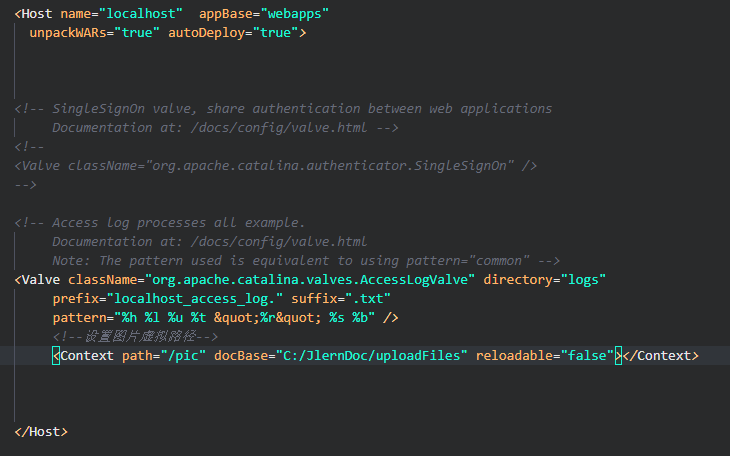

# springmvc-2

## 数据回显

表单提交出现错误，重新回到表单，用户重新填写数据，刚才提交的参数在页面上回显。

### 对简单类型的数据回显

对商品修改数据回显：注意在进入修改页面的 controller 方法中和提交修改商品信息方法 model.addAttribute 方法设置的 key 一致。


### pojo 类型数据回显

方法 1：使用 Model.addtribute 方法进行数据回显：


方法 2：使用@ModelAttribute，作用于将请求 pojo 数据放到 Model 中回显到页面


在 ModelAttribute 方法指定的名称就是要填充 Model 中的 key，在页面中就要通过 key 取数据。

### @ModelAttribute 将方法返回值传到页面


使用@ModelAttribute 将公用的取数据的方法返回值传到页面，不用在每一个 controller 方法通过 Model 将数据传到页面。

## 参数绑定集合类型

### 绑定数组


### 绑定 List&lt;Object&gt;

需求：批量修改商品信息提交。先进入批量修改商品页面，填写信息，点击提交。


```text
itemsList：controller方法的形参包装类型中list的属性名。
itemsList[0]或itemsList[1]。。，[]中是序号，从0开始。
itemsList[].name：name就是controller方法形参包装类型中list中pojo的属性名
```


绑定 map 方法相似,不再是索引序号,而是对应的 key


## 图片上传

在商品修改页面，增加图片上传的功能。
操作流程：用户进入商品修改页面,上传图片,点击提交（提交的是图片和商品信息）
再次进入修改页面，图片在商品修改页面展示

### 图片目录

不要把图片上传到工程 目录 ，不方便进行工程 维护。
实际电商项目中使用专门图片服务器(http，比如 apache、tomcat)。

本教程使用图片虚拟目录，通过虚拟目录访问硬盘上存储的图片目录。图片目录中尽量进行目录分级存储，提高访问速度（提交 i/o）。

在 myeclipse 中 tomcat 配置虚拟路径, 双击 tomcat 后只出现了 overview 窗口，没有出现 Models 窗口，eclipse 中的方法不能用。在自己的 tomcat 的安装目录下的 server.xml 文件中进行修改



其中 path 为虚拟路径，也就是浏览器访问时用的路径；docBase 为对应的物理路径，是磁盘上图片或文件存放的真实路径；reloadable 设为 true 时自动加载，设为 false 时相反。配置完需要重启服务器,访问时路径http://localhost/pic/

### 配置图片上传的解析器

jar 包:commons-fileupload-1.2.2.jar, commons-io-2.4.jar

在 springmvc.xml 中配置图片上传解析器

```text
<!-- 文件上传 -->
<bean id="multipartResolver"
class="org.springframework.web.multipart.commons.CommonsMultipartResolver">
    <!-- 设置上传文件的最大尺寸为5mb -->
    <property name="maxUploadSize">
        <value>5242880</value>
    </property>
</bean>
```

### 编写上传图片的页面

```markdown
<tr>
	<td>商品图片</td>
	<td>
		<c:if test="${item.pic !=null}">
			
		</c:if>
		<input type="file" name="pictureFile"/>
	</td>
</tr>
```

### 编写 controller 方法

```java
@RequestMapping("/editItemSubmit")
public String editItemSubmit(Model model,Integer id, @ModelAttribute(value = "item") ItemsCustom item,
	//上传图片
	MultipartFile pictureFile)throws Exception{

	//数据回显
	model.addAttribute("id", id);

	//进行图片上传
    if(pictureFile!=null) {
        //图片上传成功后,将图片的地址写到数据库
        String filePath = "C:\\JlernDoc\\uploadFiles\\temp\\";

        String originalFilename = pictureFile.getOriginalFilename();

        String newFilename = UUID.randomUUID()+originalFilename.substring(originalFilename.lastIndexOf("."));
        //新文件
        File file = new File(filePath+newFilename);

        //将内存中的文件写入磁盘
        pictureFile.transferTo(file);
        //图片上传成功后,将新图片地址写入数据库
        item.setPic(newFilename);
    }

	//调用service接口更新商品信息
	itemsService.updateItems(id, item);
	//提交后回到修改页面
	//return "editItem";
	//请求重定向
	return "redirect:queryItems.action";
	//转发
    //return "forward:queryItems.action";
	}
```

## json 数据的交互

json 数据格式是比较简单容易理解，json 数据格式常用于远程接口传输，http 传输 json 数据，非常方便页面进行提交/请求结果解析，对 json 数据的解析。

- 导入 jar 包: jackson-core-asl-1.9.11.jar,jackson-mapper-asl-1.9.11.jar

- 让处理器适配器支持 json 数据解析，需要注入 MappingJacksonHttpMessageConverter。

```markdown
<!-- 注解适配器 -->

<bean
    class="org.springframework.web.servlet.mvc.method.annotation.RequestMappingHandlerAdapter">

<!-- 加入json数据的消息转换器
    mappingjacksonHttpMessageConverter依赖Jackson的包 -->
<property name="massageConverters">
<list>
<bean class="org.springframework.http.converter.json.MappingJacksonHttpMessageConverter"></bean>
</list>
</property>  
</bean>
```

- @RequestBody：将请求的 json 数据转成 java 对象
- @ResponseBody：将 java 对象转成 json 数据输出。


### 请求 json 响应 json


```java
//请求json响应json
@RequestMapping("/requestJson")
public @ResponseBody ItemsCustom requestJson(@RequestBody ItemsCustom itemsCustom) throws Exception{
    return itemsCustom;
}
```

### 请求 key/value 响应 json


```java
//请求key/value响应json
@RequestMapping("/responseJson")
public @ResponseBody ItemsCustom responseJson(ItemsCustom itemsCustom) throws Exception{
    return itemsCustom;
}
```

如果前端处理没有特殊要求建议使用第二种，请求 key/value，响应 json，方便客户端解析请求结果 。

## validation 校验（了解）

springmvc 使用 JSR-303（javaEE6 规范的一部分）校验规范，springmvc 使用的是 Hibernate Validator（和 Hibernate 的 ORM）

jar 包:hibernate-validator-4.3.0.Final.jar,jboss-logging-3.1.0.CR2.jar,validation-api-1.0.0.GA.jar

### 配置校验器


```markdown
<!-- 注解适配器 -->

<bean
    class="org.springframework.web.servlet.mvc.method.annotation.RequestMappingHandlerAdapter">

<!-- 在webBindingInitializer中注入自定义属性编辑器、自定义转换器 -->

<property name="webBindingInitializer" ref="customBinder"></property>  
</bean>

<!-- 自定义webBinder -->

<bean id="customBinder"
    class="org.springframework.web.bind.support.ConfigurableWebBindingInitializer">

<!-- 配置validator -->

<property name="validator" ref="validator"></property>
</bean>

<!-- 校验器 -->

<bean id="validator"
    class="org.springframework.validation.beanvalidation.LocalValidatorFactoryBean">
<property name="providerClass"
    value="org.hibernate.validator.HibernateValidator">
</property>

<!-- 指定校验使用的资源文件,如果不指定则默认使用classpath下的validationMessages.properties -->

<property name="validationMessageSource" ref="messageSource"></property>
</bean>

<!-- 校验错误信息配置文件 -->

<bean id="messageSource"
    class="org.springframework.context.support.ReloadableResourceBundleMessageSource">

<!-- 资源文件名 -->
<property name="basenames">
<list>
<value>classpath:CustomValidationMessages</value>
</list>
</property>

<!-- 资源文件编码格式 -->

<property name="fileEncodings" value="utf-8"></property>

<!-- 对资源文件内容缓存时间,单位秒 -->

<property name="cacheSeconds" value="120"></property>
</bean>
```

- 在 classpath 下创建 CustomValidationMessages.properties


### 校验规则

在 Controller 对应方法中接收数据的 pojo 类上添加校验规则注释

```java
public class Items {
    private Integer id;

    @Size(min=1,max=30,message="{items.name.length.error}")
    private String name;

    private Float price;

    private String pic;

    @NotNull(message="{items.createtime.is.notnull}")
    private Date createtime;

    private String detail;
...
```

### 捕获错误

需要修改 controller 方法，在要校验的 pojo 前边加上@Validated.

每个校验 pojo 前面必须加@Validated,每个校验的 pojo 后面要加 BindingResult 接收校验错误信息

```java
@RequestMapping("/editItemSubmit")
public String editItemSubmit(Model model,Integer id,@Validated @ModelAttribute(value = "item") ItemsCustom item,
        BindingResult bindingResult,
        //上传图片
        MultipartFile pictureFile
        )throws Exception{

    //输出校验错误信息
    //如果参数绑定石有错
    if(bindingResult.hasErrors()) {
        //获取错误
        List<ObjectError> errors = bindingResult.getAllErrors();
        model.addAttribute("errors", errors);
        //如果校验错误,回到商品修改页面
        return "editItem";
    }
```

- 页面显示错误信息

```markdown
<c:forEach items="${errors}" var="error">
	${error.defaultMessage}<br>
</c:forEach>
```

### 分组校验

需求：针对不同的 controller 方法通过分组校验达到个性化校验的目的，修改商品修改功能，只校验生产日期不能为空。

- 第一步 创建分组接口

```java
public interface ValidGroup1 {
	//接口不定义方法,就只是标识哪里校验规则属于该ValidGroup1分组
}
public interface ValidGroup2 {
	//标识哪里校验规则属于该ValidGroup2分组
}
```

- 第二步 定义校验规则属于哪个分组

```java
@NotNull(message="{items.createtime.is.notnull}",groups = {ValidGroup1.class})
    private Date createtime;
```

- 第三步 在 controller 方法定义使用校验的分组

```java
@RequestMapping("/editItemSubmit")
public String editItemSubmit(Model model,Integer id,@Validated(value= {ValidGroup1.class}) @ModelAttribute(value = "item") ItemsCustom item, BindingResult bindingResult)throws Exception{
    //只有属于分组1的校验规则会被使用
    if(bindingResult.hasErrors()){

    }
```

## 统一异常处理

系统中异常类型有哪些？
包括预期可能发生的异常、运行时异常（RuntimeException），运行时异常不是预期会发生的。
针对预期可能发生的异常，在代码手动处理异常可以 try/catch 捕获，可以向上抛出。
针对运行时异常，只能通过规范代码质量、在系统测试时详细测试等排除运行时异常。

针对预期可能发生的异常，定义很多异常类型，这些异常类型通常继承于 Exception。
这里定义一个系统自定义异常类:CustomException，用于测试。

```java
public class CustomException extends Exception{
	//异常信息
	private String message;

	public CustomException(String message) {
		super(message);
		this.message = message;
	}

	public String getMessage() {
		return message;
	}

	public void setMessage(String message) {
		this.message = message;
	}


}
```

### 定义统一异常处理器类

前端控制器 DispatcherServlet 在进行 HandlerMapping、调用 HandlerAdapter 执行 Handler 过程中，如果遇到异常，进行异常处理。


在系统中自定义统一的异常处理器，写系统自己的异常处理代码.统一异常处理器实现 HandlerExceptionResolver 接口。

### 异常处理逻辑

根据不同的异常类型进行异常处理。

系统自定义的异常类是 CustomException ，在 controller 方法中、service 方法中手动抛出此类异常。

- 针对系统自定义的 CustomException 异常，就可以直接从异常类中获取异常信息，将异常处理在错误页面展示。
- 针对非 CustomException 异常，对这类重新构造成一个 CustomException，异常信息为“未知错误”，此类错误需要在系统测试阶段去排除。

```java
public class CustomExceptionResolver implements HandlerExceptionResolver{
	//前端控制器DispatcherServlet在进行HandlerMapping,调用HandlerAdapter执行Handler的过程中,如果遇到异常会执行此方法
	//参数handler是最终要执行的handler,真实身份是HandlerMethod
	//参数ex是接收到的异常信息
	@Override
	public ModelAndView resolveException(HttpServletRequest request, HttpServletResponse response, Object handler,
			Exception ex) {
		//输出异常
		ex.printStackTrace();

		//统一异常处理代码
		//针对系统自定义的CustomException异常,就可以直接从异常类中获取异常信息,将异常处理在错误页面显示
		//异常信息
		String message = null;
        CustomException customException = null;
        //如果ex是系统自定义的异常,直接取出异常信息
		if(ex instanceof CustomException) {
			customException = (CustomException)ex;
			message = customException.getMessage();
		}else {
		//针对非CustomException异常,用异常信息"未知错误"重新构造一个CustomException
			customException = new CustomException("未知错误");
		}

		message = customException.getMessage();
		request.setAttribute("message", message);

		//转向到错误页面
		try {
			request.getRequestDispatcher("/WEB-INF/jsp/error.jsp").forward(request, response);
		} catch (ServletException e) {
			// TODO Auto-generated catch block
			e.printStackTrace();
		} catch (IOException e) {
			// TODO Auto-generated catch block
			e.printStackTrace();
		};
		return new ModelAndView();
	}
}
```

- 配置统一异常处理器

```markdown
<!-- 定义统一异常处理器 -->

<bean class="cn.itcast.ssm.exception.CustomExceptionResolver"></bean>
```

- 测试抛出异常由统一异常处理器捕获,可以在 controller 方法、service 方法、dao 实现类中抛出异常，要求 dao、service、controller 遇到异常全部向上抛出异常，方法向 上抛出异常 throws Exception


## springmvc 和 struts 的区别

springmvc 是通过方法的形参接收参数，在使用时可以以单例方式使用，建议使用单例。

struts 是通过成员变量接收参数，在使用时必须以多例方式使用。

springmvc 是基于方法开发，struts 基于类开发。
springmvc 将一个请求的 Method 和 Handler 进行关联绑定，一个 method 对应一个 Handler。

springmvc 开发以方法为单位进行开发，方法更帖进 service(业务方法)。

经过实际测试，发现 struts 标签解析速度比较慢，建议在实际开发时使用 jstl。

## RESTful 支持

Representational State Transfer

RESTful 软件开发理念，RESTful 对 http 进行非常好的诠释。

- 每一个 URI 代表一种资源；
- 客户端和服务器之间，传递这种资源的某种表现层；
- 客户端通过四个 HTTP 动词(get post put delete)，对服务器端资源进行操作，实现"表现层状态转化"。

### url 的 RESTful 实现

非 RESTful 的 http 的 url：http://localhost:8080/items/editItems.action?id=1&....
RESTful 的 url 是简洁的：http:// localhost:8080/items/editItems/1,参数通过 url 传递,rest 接口返回 json 数据

需求:根据 id 查看商品信息，商品信息查看的连接使用 RESTful 方式实现，商品信息以 json 返回。

- 第一步:更改 DispatcherServlet 配置

```markdown
<!-- restful的配置 -->
<servlet>
    <servlet-name>springmvc_rest</servlet-name>
    <servlet-class>org.springframework.web.servlet.DispatcherServlet</servlet-class>
    <init-param>
        <param-name>contextConfigLocation</param-name>
        <param-value>classpath:spring/springmvc.xml</param-value>
    </init-param>
</servlet>
<servlet-mapping>
    <servlet-name>springmvc_rest</servlet-name>
    <!--rest方式配置为/-->
    <url-pattern>/</url-pattern>
</servlet-mapping>
```

- 第二步:参数通过 url 传递

```java
//根据商品id查看商品信息rest接口
		//RequestMapping中指定restful方式的url的参数,参数需要用{}包起来
		//PathVariable将url中的{}包起来的参数和形参进行绑定
		@RequestMapping("/viewItems/{id}")
		public @ResponseBody ItemsCustom viewItems(@PathVariable("id") Integer id) throws Exception{
			ItemsCustom itemsCustom = itemsService.findItemsById(id);

			return itemsCustom;
		}
```

## springmvc 拦截器
