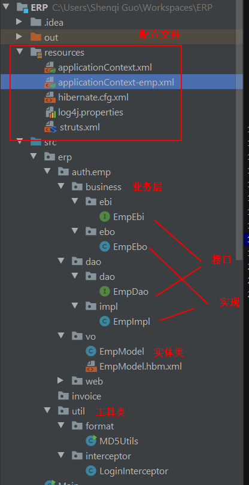
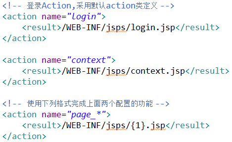
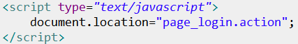
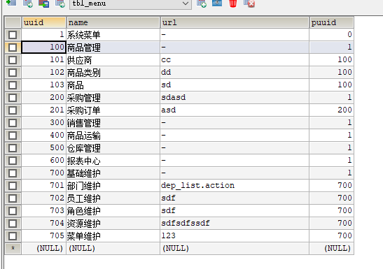

# erp

## day01

绘制 ULM 图确定各类之间的关系和方向


建表，数据长度如用户名密码，比指定长度多留 20%

### 包结构

实体模型类：模块名 Model
查询模型类：模块名 QueryModel(按需求定义)
数据层接口：模块名 Dao
数据层实现：模块名 Impl
业务层接口：模块名 Ebi
业务层实现：模块名 Ebo
表现层类：模块名 Action



A. 点击登录，将用户输入的用户名、密码、验证码信息传入后台 Action 类
B. Action 类将页面收集的数据传入业务层 Ebo
C. Ebo 类对密码进行 MD5 加密后，将数据传入数据层 Impl
D. Impl 类使用 Hibernate 模板查询，将数据库中的信息与传递的信息进行比对，将查询结果返回 Ebo 类
E. Ebo 类将查询结果返回 Action 类
F. Action 类对查询结果进行判定，如果不为 null，则将查询结果（登录人信息）放入 Session 范围内，以备后期使用，否则登录失败，返回登录界面，告知用户信息输入有误。

#### 各个类与接口初始化内容及定义规范

Ebi 中注入的是 Dao 接口 Action 中注入的是 Ebi 接口
事务注释在 Ebo 接口上

实体模型类：模块名 Model

- 主键字段命名为 uuid，Long 型，数据库端设计自增
- 所有属性名上方添加注释，标记该字段含义
- 所有属性封装方法 getter/setter(视图值不提供 setter 方法)

数据层接口：模块名 Dao

- 方法定义前添加 public 关键字
- 为方法添加文档注释(基础方法不添加，例如 save,update 等)

数据层实现：模块名 Impl

- 继承 HibernateDaoSupport
- 实现数据层接口，并实现所有抽象方法

业务层接口：模块名 Ebi

- 添加注解式事务管理@Transactional
- 方法定义前添加 public 关键字
- 为方法添加文档注释(所有方法全部添加)

业务层实现：模块名 Ebo

- 声明私有的数据层接口对象，并进行 setter 封装（注入）

表现层类：模块名 Action

- 继承 ActionSupport
- 声明公共的实体模型类对象，变量为模块名单词首字小写+m
- 声明私有的业务层接口对象，并进行 setter 封装（注入）

```markdown
<!-- Action -->
<bean id="empAction" class="cn.itcast.erp.auth.emp.web.EmpAction" scope="prototype">
    <property name="empEbi" ref="empEbi"/>
</bean>
<!-- Ebi -->
<bean id="empEbi" class="cn.itcast.erp.auth.emp.business.ebo.EmpEbo">
    <property name="empDao" ref="empDao"/>
</bean>
<!-- Dao -->
<bean id="empDao" class="cn.itcast.erp.auth.emp.dao.impl.EmpImpl">
    <property name="sessionFactory" ref="sessionFactory"/>
</bean>
```

### 映射配置文件

模块名 Model.hbm.xml 和实体类放在同一路径下

(1) 数据库表名定义规则：tbl*模块名
补：关系表名定义规则：tbl*主方模块名\_从方模块名
(2) 只对真实值字段进行定义，视图值字段不进行定义
(3) 关系定义时，使用注释描述关系对应方式
(4) 关系定义在使用时进行，不要全部定义

### spring 配置文件

对单独一个模块用单独一个 applicationContext-模块名首字母小写.xml 配置

在 web.xml 中用通配符加载配置文件

```markdown
<listener>
		<listener-class>org.springframework.web.context.ContextLoaderListener</listener-class>
</listener>

<context-param>
		<param-name>contextConfigLocation</param-name>
		<param-value>classpath:applicationContext*.xml</param-value>
</context-param>
	
<filter>
   		<filter-name>openSessionInView</filter-name>
   		<filter-class>org.springframework.orm.hibernate3.support.OpenSessionInViewFilter</filter-class>
</filter>
<filter-mapping>
		<filter-name>openSessionInView</filter-name>
		<url-pattern>/*</url-pattern>
</filter-mapping>
```

### 跳转方式访问页面

WEB-INF 目录下的 jsp 文件无法直接获取，需要经由 struts 访问方式跳转才可以完成页面访问。

当定义有关页面跳转的 Action 类时，因为没有实际业务功能，可以使用通配符的格式完成所有页面跳转的一次性定义。



页面调用格式使用 page_login.action 的格式完成



### 自定义登录拦截器

对除了登录操作以外的操作进行拦截。如何判定该操作为登录操作？

```java
public class LoginInterceptor extends AbstractInterceptor {
    @Override
    public String intercept(ActionInvocation actionInvocation) throws Exception {
        //对登录操作以外的操作进行登录校验

        String actionName = actionInvocation.getProxy().getAction().getClass().getName();
        String methodName = actionInvocation.getProxy().getMethod();
        String allName = actionName+"."+methodName;
        if ("erp.auth.emp.web.EmpAction.login".equals(allName)){
            return actionInvocation.invoke();
        }
        //登录校验
        //获取当前登录人信息
        //如果没有登录跳转登录页面

        EmpModel loginEm = (EmpModel) ActionContext.getContext().getSession().get(EmpModel.EMP_LOGIN_USER_OBJECT_NAME);
        //如果当前没有登录，跳转到登录页面
        if(loginEm == null){
            return "noLogin";

        }
        return actionInvocation.invoke();
    }
}
```

配置 global-results 结果页面，作为拦截跳转界面。

将自定义拦截器和 defaultStack 设置为新的拦截器栈，并配置使用。

## day02

public String list(){
//加载所有部门信息，放入到指定范围，页面从指定范围取出，进行展示
//指定范围 request(选定)，session，application
List<DepModel> depList = depEbi.getAll();
ActionContext.getContext().put("depList",depList );
return "list";
}

<s:iterator value="depList">

<tr align="center" bgcolor="#FFFFFF">
<td width="13%" height="30">${uuid}</td>
        <td>${name}</td>
<td>\${tele}</td>

    </tr>

</s:iterator>

<s:if test="#depList.size()==0"> 这里要加#号

超链接访问 action 如果是 href 要写后缀.action 如果是 action=“”则可以省略

<s:a action="dep\_\*delete" cssClass="xiu">
<s:param name="dm.uuid" value="uuid"/>
</s:a>

查询模型，继承原有模型，不需要配置映射，在 action 中定义 public DepQueryModel dqm = new DepQueryModel();

public class DepQueryModel extends DepModel{

}

多个查询条件

public List<DepModel> getAll(DepQueryModel dqm) {
//执行查询，动态链接 dqm 中的条件为查询条件，完成查询
DetachedCriteria dc = DetachedCriteria.forClass(DepModel.class);
if(dqm.getName()!=null && dqm.getName().trim().length()>0)
{
dc.add(Restrictions.like("name","%"+dqm.getName().trim()+"%"));
}
if(dqm.getTele()!= null && dqm.getTele().trim().length()>0)
{
dc.add(Restrictions.like("tele","%"+dqm.getTele().trim()+"%"));
}
return this.getHibernateTemplate().findByCriteria(dc);
}

<s:textfield size="18" name="dqm.name"/> 既可以用于提交数据，也可以同于回显数据

public Integer getCount(DepQueryModel dqm) {

        DetachedCriteria dc = DetachedCriteria.forClass(DepModel.class);

        dc.setProjection(Projections.rowCount());

        if(dqm.getName()!=null && dqm.getName().trim().length()>0)
        {
            dc.add(Restrictions.like("name","%"+dqm.getName().trim()+"%"));
        }
        if(dqm.getTele()!= null && dqm.getTele().trim().length()>0)
        {
            dc.add(Restrictions.like("tele","%"+dqm.getTele().trim()+"%"));
        }

        List<Long> count = this.getHibernateTemplate().findByCriteria(dc);

        return count.get(0).intValue();
    }


    分页功能 分页控制 看笔记

    通用抽取

    private Class<T> entityClass = null;

    //将entityClass初始化
    public BaseImpl(){
        Type genType = getClass().getGenericSuperclass();
        Type[] params = ((ParameterizedType) genType).getActualTypeArguments();
        entityClass =  (Class)params[0];
    }

注解式事务不具有传递性

struts 通用 result 配置\${actionName}

## day03

视图值：视图值是一种用于界面显示的变量值，该值不具体对应某个数据库字段，它服务于某个数据库字段
当数据库中的某个字段值不便于直接显示时，为该字段添加视图值，用于显示对应的信息

访问类的静态变量

<td>性&nbsp;&nbsp;&nbsp;&nbsp;别</td>
						<td>
							<s:select name="eqm.gender" list="@cn.itcast.erp.auth.emp.vo.EmpModel@genderMap" headerKey="-1" headerValue="----请-选-择----" cssClass="kuan"></s:select>
						</td>

//快照更新
//1.查询出数据
EmpModel temp = empDao.get(em.getUuid());
//2.将传递过来的需要修改的数据，覆盖 temp 中的相应的字段
//传递过来了 userName 值，但是不将 userName 设置到 temp，此值不参加更新
temp.setName(em.getName());
temp.setEmail(em.getEmail());
temp.setTele(em.getTele());
temp.setGender(em.getGender());
temp.setAddress(em.getAddress());
temp.setDm(em.getDm());
//temp.getDm().setUuid(em.getDm().getUuid()); 非法

public class EmpQueryModel extends EmpModel implements BaseQueryModel{
//追加生日作为查询条件的最大值字段
private Long birthday2;
private String birthday2View;

日期型数据查询，上限值别忘了考虑当前的 24 小时

    if(eqm.getBirthday()!=null){
    		dc.add(Restrictions.ge("birthday", eqm.getBirthday()));
    	}
    	//birthday2
    	if(eqm.getBirthday2()!=null){
    		dc.add(Restrictions.le("birthday", eqm.getBirthday2()+86400000-1));//加上24h的时间 查到某一天当天生日的
    	}

时区问题

获得 ip
HttpServletRequest request = getRequest();
String loginIp = request.getHeader("x-forwarded-for");
if(loginIp == null || loginIp.length() == 0 || "unknown".equalsIgnoreCase(loginIp)) {
loginIp = request.getHeader("Proxy-Client-IP");
}
if(loginIp == null || loginIp.length() == 0 || "unknown".equalsIgnoreCase(loginIp)) {
loginIp = request.getHeader("WL-Proxy-Client-IP");
}
if(loginIp == null || loginIp.length() == 0 || "unknown".equalsIgnoreCase(loginIp)) {
loginIp = request.getRemoteAddr();
}

    public String newPwd;
    //修改密码
    public String changePwd(){
    	//原始密码:em.pwd
    	//新密码:newPwd
    	//修改密码功能如何实现？
    	//1.从session中获取登录人信息，比对原始密码是否相同，如果相同，使用新密码更新原始密码(数据不同步)
    	//2.使用原始密码与用户名查找数据，得到数据后，使用快照更新新密码(数据并发不同步)
    	//A,13:01时间修改密码功能
    	//B,13:01时间修改密码功能
    	//3.执行update ...  set pwd = newPwd where userName = session[userName] and pwd = em.pwd
    	//调用业务层完成修改密码
    	boolean flag = empEbi.changePwd(getLogin().getUserName(),em.getPwd(),newPwd);
    	if(flag){
    		//修改成功
    		//重新登录
    		putSession(EmpModel.EMP_LOGIN_USER_OBJECT_NAME, null);
    		return "noLogin";
    	}else{
    		//提示用户当前信息输入有误
    		//信息：自己处理
    		return "toChangePwd";
    	}
    }

国际化
<constant name="struts.custom.i18n.resources" value="msg" />

## day04

<s:checkboxlist name="roleUuids" list="roleList" listKey="uuid" listValue="name">
</s:checkboxlist>

//如何接收页面传递多个参数使用同样的 name 值
//public String[] aa;
//public List<String> aa;
//页面数据如果存在多个值具有相同的 name，使用数组或者集合均可接收
//如果传递的数据不能直接使用，推荐数组，否则推荐集合
public String[] roleUuids;

        <set name="roles" table="tbl_emp_role">
            <key column="empUuid"/>
            <!-------------------->
            <many-to-many
                column="roleUuid"
                class="cn.itcast.erp.auth.role.vo.RoleModel"/>
        </set>

多对多配置。 横线之上写自己 横线之下写对方

全选反选

$(function(){
		//全选
		$("#all").click(function(){
//将下面所有组件全部选中
//$("[name=resUuids]")	是多个组件，整体是个对象数组
			//$("[name=resUuids]").attr("checked","checked");
//先获取当前组件的状态
//$(this).attr("checked")
			//将所有组件设置为对应状态
			//$("[name=resUuids]").attr("checked",$(this).attr("checked"));
			
			//$(this).attr("checked")获取的值究竟是什么
//alert($(this).attr("checked"));		//undefined
			//$("[name=resUuids]").attr("checked","undefined");
//js 语法规则，除了 false,FALSE,"false","FALSE",0 五个值之外的所有值，认定为 true
//$("[name=resUuids]").attr("checked",false);
			
			var flag = $(this).attr("checked");
$("[name=resUuids]").attr("checked",flag == "checked");
		});
		
		//反选
		$("#reverse").click(function(){
//将所有组件的状态切换成原始状态的反状态
//$("[name=resUuids]").attr("checked",!($("[name=resUuids]").attr("checked")=="checked"));
//当选择器选中的组件是多个时，获取组件的任何数据都是对第一个组件进行操作
//alert(!($("[name=resUuids]").attr("checked")=="checked"));
			
			//对每个组件进行迭代，让其操作状态为对应组件的原始状态的反状态
			$("[name=resUuids]").each(function(){
//使用 each 操作实现对每个组件的操作
var flag = $(this).attr("checked"); 
				$(this).attr("checked", !(flag =="checked"));
});
checkSelect();
});
//绑定组件
$("[name=resUuids]").click(function(){
			//将全选的状态设置为基于所有组件的综合状态值 有一个选中全选就掉了
			checkSelect();
		});
		
		function checkSelect(){
			var allFlag = true;
			$("[name=resUuids]").each(function(){
var flag = $(this).attr("checked") == "checked";
				//&:位运算与	 &&:逻辑与
				allFlag = allFlag && flag; 
			});
			$("#all").attr("checked",allFlag);
}
});

监听器和拦截器优化

## day05



## day06

使用strusts中json插件
设置struts返回result的类型的json
设置对应action所在的package继承自json-default
    <package name="default" namespace="/" extends="json-default">
将要返回的数据提供对应的get方法

<action name="goodsType_*" class="goodsTypeAction" method="{1}">
			<result name="ajaxGetBySm" type="json">
<!--				<param name="includeProperties">-->
<!--					abc,-->返回一个值
<!--					dm\.name,-->返回一个对象
<!--					dm\.uuid,-->
<!--					gtmList\[\d+\]\.uuid,-->返回一个集合
<!--					gtmList\[\d+\]\.name,-->
<!--				</param>-->
				<param name="excludeProperties">
					
					gtmList\[\d+\]\.sm
				</param>
			</result>
</action>
包含较为常用
