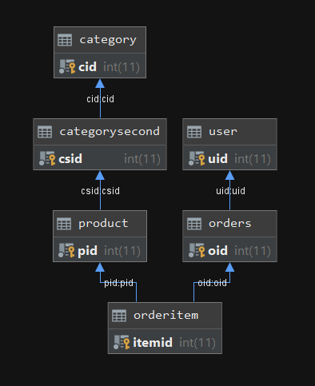

# SSH综合案例-4

## 建表和关联关系配置



* 订单Order实体类中有订单所属的用户User，订单的集合OrderItems，对应表为orders。与user表是多对一，与orderItem是一对多。
* 商品Product实体类中有订单的集合orders，对应表为product与orders是多对多关系。
* 多对多关系中的中间表订单项orderitem，与orders是多对一，与product是多对一。其实体类中包含商品信息和订单，还有商品数量和小计，也参与到业务操作中。所以独立配置映射文件，分别与另外两个表建立多对一的联系
* 设置cascad=“save-update” 级联保存，订单保存后，订单项也会保存
* lazy=“false” ，查询关联对象的时候不使用延迟检索

## 提交订单

* 订单中user的数据从session中的existUser获取
* orderItem需要遍历carItem集合赋值。
* 保存订单，并清空购物车
* Order模型注入，数据传递到订单页面，用model访问

```java
public String save(){

        order.setOrdertime(new Date());
        order.setState(1);//1未付款 2已付款 3已发货 4 已收获

        HttpServletRequest request =ServletActionContext.getRequest();

        //判断购物车是否为空
        Cart cart = (Cart) request.getSession().getAttribute("cart");
        if( cart == null){
            this.addActionMessage("请先去购物");
            return "msg";
        }
        //是否登录
        User existUser = (User) request.getSession().getAttribute("existUser");
        if(existUser ==null){
            this.addActionMessage("请先登录");
            return "msg";
        }

        order.setTotal(cart.getTotal());
        order.setUser(existUser);

        for(CartItem cartItem: cart.getCartItems()){
            OrderItem orderItem = new OrderItem();
            orderItem.setCount(cartItem.getCount());
            orderItem.setSubtotal(cartItem.getSubtotal());
            orderItem.setProduct(cartItem.getProduct());
            orderItem.setOrder(order);
            order.getOrderItems().add(orderItem);
        }

        Integer oid = orderService.save(order);
        cart.clearCart();

        //order = orderService.findByOid(oid);

        return "saveOrderSuccess";
    }
```

## 查询订单

* 从session中获得用户，根据uid查询订单离别，并压栈传递到页面
* 根据state判断，显示订单状态，付款链接到订单页面

```java
public List<Order> findByUid(User existUser) {
        List<Order> oList =this.getHibernateTemplate().find("from Order o where o.user.uid =?",existUser.getUid());
        return oList;
    }
```

```text
<s:iterator var="l" value="oList">
    <tr>
        <th colspan="5">订单号：<s:property value="#l.oid"/>金额：<s:property value="#l.total"/>状态 :
            <s:if test="#l.state == 1">
            <a href="${ pageContext.request.contextPath }/order_findByOid.action?oid=<s:property value='#l.oid'/>"><font color="red">付款</font></a>
            </s:if>
            <s:elseif test="#l.state == 2">
                已付款
            </s:elseif>
            <s:elseif test="#l.state == 3">
                <a href=""><font color="red">确认收货</font></a>
            </s:elseif>
            <s:elseif test="#l.state == 4">
                订单完成
            </s:elseif> </th>
    </tr>
    <tr>
        <th>图片</th>
        <th>商品</th>
        <th>价格</th>
        <th>数量</th>
        <th>小计</th>
    </tr>
    <s:iterator value="#l.orderItems" var="orderItem">
    <tr>
        <td>
            "/>
        </td>
        <td>
            <s:property value="#orderItem.product.pname"/>
        </td>
        <td>
            <s:property value="#orderItem.product.shop_price"/>
        </td>
        <td class="quantity" width="60">
            <s:property value="#orderItem.count"/>
        </td>
        <td width="140">
            <span class="subtotal">￥<s:property value="#orderItem.subtotal"/></span>
        </td>
    </tr>
    </s:iterator>
</s:iterator>
```

