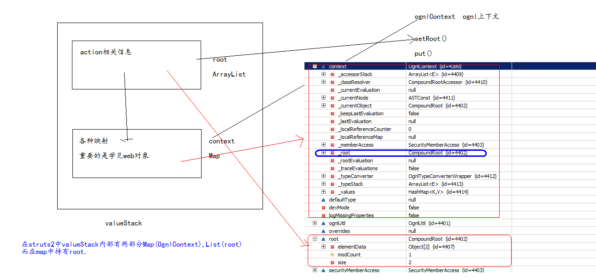
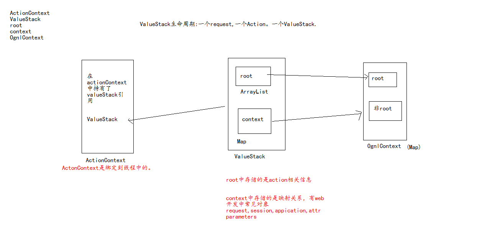
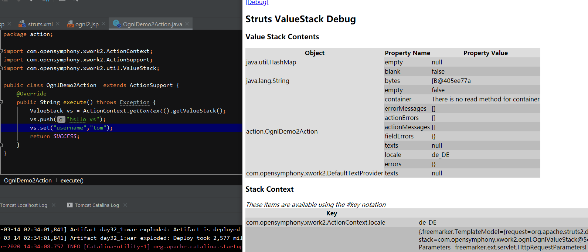
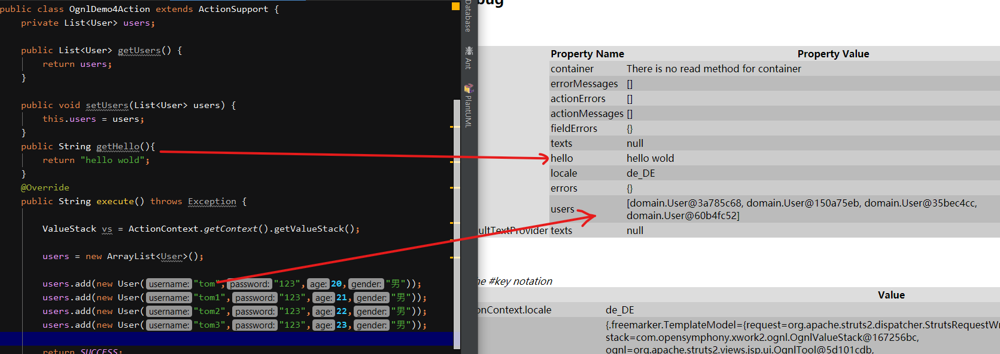
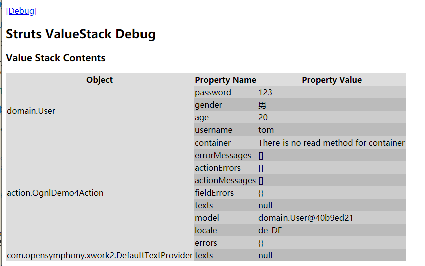
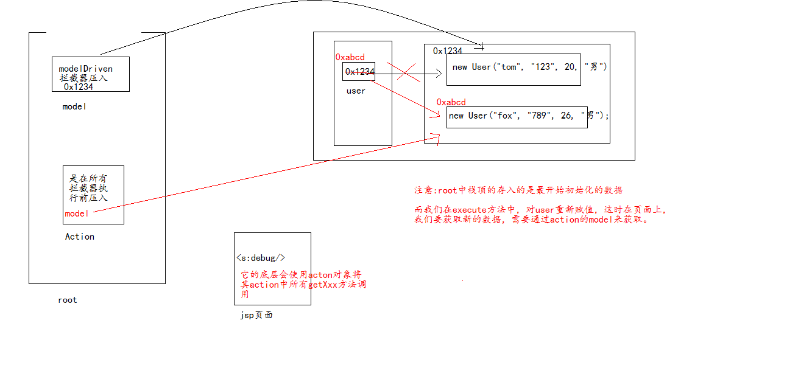

# Struts2框架-4

## ognl与valueStack

ognl中有一个OgnlContext,它可以设置root与非root。

root中数据获取时，不需要加#,而非root中数据在获取时，需要加上#。

## 1. ognl介绍

OGNL是Object Graphic Navigation Language（对象图导航语言）的缩写，它是一个开源项目。 Struts2框架使用OGNL作为默认的表达式语言。

* xwork 提供 OGNL表达式
* ognl-3.0.5.jar

OGNL 提供五大类功能

1. 支持对象方法调用，如xxx.doSomeSpecial()；
2. 支持类静态的方法调用和值访问
3. 访问OGNL上下文（OGNL context）和ActionContext； （重点 操作ValueStack值栈 ）
4. 支持赋值操作和表达式串联
5. 操作集合对象。

### 演示: 在struts2中使用ognl表达式

需要结合struts2的标签使用 &lt;s:property value="ognl表达式"&gt;

```markdown
<s:property value="'abc'.length()"/>  演示对象调用方法
<s:property value="@java.lang.Math@max(10,20)"/> 演示静态成员访问.
```

注意:在struts2中使用静态成员访问，必须设置一个常量, 开启静态访问：

```markdown
<constant name = "struts.ognl.allowStaticMethodAccess" value="true"/>
```

## 2. ValueStack

它是一个接口com.opensymphony.xwork2.util.ValueStack。

将其做为一个容器，用于携带action数据到页面，再在页面上通过ognl表达式获取数据。

### 2.1 什么是valueStack

valueStack主要是将action数据携带到页面上，通过ognl获取数据

1. ValueStack有一个实现类叫**OgnlValueStack**。
2. 每一个action都有一个ValueStack.(一个请求，一个request, 一个action，一个valueStack),valueStack**生命周期**就是request生命周期。
3. valueStack中存储了当前action对象以及其它常用web对象(request,session,application.parameters)。
4. struts2框架将valueStack以“struts.valueStack”为名存储到request域中。

### 2.2 valueStack结构



ValueStack中 存在root属性 (CompoundRoot) 、 context 属性 （OgnlContext）

* CompoundRoot 就是ArrayList
* OgnlContext 就是 Map

list集合中存储的是action相关信息

map集合中存储的是相关映射信息，包含  paramters,request,session,application attr等。

想要从list中获取数据，可以不使用#号.(它就是ognl的root)

如果从map中获取数据，需要使用#. (其实在struts2中的map--context其实就是ognlContext)



#### 结论

ValueStack它有两部分 List,Map。

在struts2中List就是root, Map就是ognlContext.

默认情况下，在struts2中从valueStack获取数据从root中获取。

### 2.3 值栈对象的创建 ，ValueStack 和 ActionContext 是什么关系

```java
ActionContext ctx = ActionContext.getContext();
if (ctx != null) {
    stack = ctx.getValueStack();
}
```

valueStack是每一次请求时，都会创建。
在ActionContext中持有了valueStack的引用。

### 2.4 如何获得valueStack对象

对于valueStack获取有两种方式:

```java
1.通过 request获取
ValueStack vs=(ValueStack) ServletActionContext.getRequest().getAttribute(ServletActionContext.STRUTS_VALUESTACK_KEY);

2.通过ActionContext获取.
ValueStack vs=ActionContext.getContext().getValueStack();
```

### 2.5  向valueStack保存数据 （主要针对 root）

主要有两个方法（在OgnlValueStack类中）

* push(Object obj)------->底层就是 root.add(0,obj) 将数据存储到栈顶。

* set(String name,Object obj);----->底层是将数据封装到HashMap中，在将这个HashMap通过push存储。

在jsp中 通过 &lt;s:debug /&gt; 查看值栈的内容



### 2.6 在JSP中获取值栈的数据

原则： root中数据不需要#，而context中数据需要#

#### 如果获取root中数据

1.如果栈顶是一个Map集合，获取时，可以直接通过Map集合的key来获取value.

```markdown
<s:property  value="username"/>自上而下自动查找
```

2.如果栈顶数据不是一个Map，没有key值，可以使用序号来获取。

```markdown
<s:property value="[0]"/>  从0的位置向下查找所有。

<s:property value="[0].top"/> 只查找0位置上数据。
```

#### 如果获取OgnlContext中数据

```markdown
request:<s:property value="#request.rname"/>  获取request中属性名为rname的数据

session:<s:property value="#session.sname"> 获取session中属性名为sname的数据

application:<s:property value="#application.aname"/>

attr:<s:property value="#attr.sname"/> 依次从request,session.application中查找

parameters:<s:property value="#parameters.username[0]"/> 获取请求参数
```

### 2.7 ValueStack携带数据类型

ValueStack主流应用: 就是解决将action数据携带到jsp页面。

问题: action向jsp携带数据,都是什么样的数据?

#### 1. 文本（字符串）

```text
1. fieldError   校验数据错误信息提示,针对某一个字段错误信息 （常用于表单校验）
2. actionError 关于逻辑操作时错误信息 (普通错误信息，不针对某一个字段，例如登陆失败)
3. message 通用消息

this.addFieldError("msg", "字段错误信息");
this.addActionError("Action全局错误信息");
this.addActionMessage("Action的消息信息");
```

在jsp中使用 struts2提供标签 显示消息信息

```markdown
<s:fielderror fieldName="msg"/>
<s:actionerror/>
<s:actionmessage/>
```

#### 2. 复杂数据

可以使用valueStack存储.

在action中存储数据:

```java
List<User> users = new ArrayList<User>();
users.add(new User("tom", "123", 20, "男"));
users.add(new User("james", "456", 21, "男"));
users.add(new User("fox", "789", 26, "男"));

vs.push(users);
```

在页面上获取数据:

使用&lt;s:iterator&gt;标签来迭代集合。

```markdown
<s:iterator value="[0].top" var="user">
这是将集合中迭代出来每一个元素起个引用名叫user, 而user是存储在context中，不在root中

    username:<s:property value="#user.username"/><br>
    password:<s:property value="#user.password"/>

</s:iterator>

注意: 如果我们在使用<s:iterator>进行迭代时，没有给迭代出的元素起名.
<s:iterator value="[0].top">
    username:<s:property value="username"/><br>
    password:<s:property value="password"/>
</s:iterator>
```

### 2.8 关于默认压入到valueStack中的数据

#### 1. 访问的action对象会被压入到valueStack中

DefaultActionInvocation 的 init方法 stack.push(action);

Action如果想传递数据给JSP，只要将数据保存到成员变量，并且提供get方法就可以了。然后通过Property Name就可以获取到值。



#### 2. 对于模型驱动，model对象默认被压入valuestack中



ModelDriveInterceptor会执行下面操作

```java
ModelDriven modelDriven = (ModelDriven) action;
ValueStack stack = invocation.getStack();
Object model = modelDriven.getModel();
if (model !=  null) {
    stack.push(model);
}
```

将实现了ModelDrive接口的action中getModel方法的返回值，也就是我们所说的model对象压入到了valueStack。



解释：值栈中默认先压入Action，Action中的成员user初始化赋值，再压入model对象，model对象指向初始化中的user对象。当执行到Action中excute方法，user引用重新赋值，而栈顶model对象仍指向最开始的数据。在jsp页面上获取数据时需要注意要想获得新的数据，需要通过action中的model来获取。

### 2.9 为什么el表达式可以访问valueStack中数据

struts2框架中所使用的request对象，是增强后的request对象。

${username}---->request.getAttribute("username");

StrutsPreparedAndExecuteFilter的doFilter代码中 request = prepare.wrapRequest(request);

* 对Request对象进行了包装 ，StrutsRequestWrapper
* 重写request的 getAttribute

```java
Object attribute = super.getAttribute(s);
if (attribute == null) {
    attribute = stack.findValue(s);
}
```

增强后的request,会首先在request域范围查找，如果数据找不到，去值栈中找。 request对象 具备访问值栈数据的能力 （查找root的数据）。

## 3 OGNL表达式常见使用($ % #)

### 1. #号

#### 用法一  # 代表 ActionContext.getContext() 上下文

```markdown
<s:property value="#request.name" />  -->  ActionContext().getContext().getRequest().get("name");

#request
#session
#application
#attr
#parameters
```

#### 用法二 ： 不写# 默认在 值栈中root中进行查找

```markdown
* 在root中查找name属性
<s:property value="name" />

* 查询元素时，从root的栈顶元素 开始查找，如果访问指定栈中元素  
<s:property value="[1].name" />  访问栈中第二个元素name属性

* 访问第二个元素对象
<s:property value="[1].top" />
```

#### 用法三 ：进行投影映射 （结合复杂对象遍历 ）

1）集合的投影(只输出部分属性)

```markdown
遍历集合只要name属性
<s:iterator value="products.{name}" var="pname">
<s:property value="#pname"/>
</s:iterator>
```

2）遍历时，对数据设置条件

```markdown
遍历集合只要price大于1500商品

<s:iterator value="products.{?#this.price>1500}" var="product">
<s:property value="#product.name"/> --- <s:property value="#product.price"/>
</s:iterator>
```

3）综合

```markdown
只显示价格大于1500 商品名称

<s:iterator value="products.{?#this.price>1500}.{name}" var="pname">
<s:property value="#pname"/>
</s:iterator>
```

#### 用法四： 使用#构造map集合

经常结合 struts2 标签用来生成 select、checkbox、radio

使用#构造map集合 遍历

```markdown
<s:iterator value="#{'name':'aaa','age':'20', 'hobby':'sport' }" var="entry">
key : <s:property value="#entry.key"/> , value:  <s:property value="#entry.value"/> <br/>
</s:iterator>
```

使用#构造List集合 遍历

```markdown
<s:iterator value="#{'aaa','bbb', 'ccc'}" var="v">
<s:property value="#v"/> <br/>
</s:iterator>
```

手动创建一个集合，在struts2结合表单标签

```markdown
<s:form>
    <s:radio list="{'男','女'}" name="sex"></s:radio>

    <s:radio list="#{'男':''male,'女':'female'}" name="sex"></s:radio>
    <!--'男'是value，'male'是选项文本-->

    <s:select list="{'a','b','c'}" name="aa"}"></s:select>

    <s:select list="#{'a':'aaa','b':'bbb','c':'ccc' name="aa"}"></s:select>
</s:form>
```

### 2. %号

%作用：就是用于设定当前是否要解析其为 ognl表达式.

* %{表达式}  当前表达式会被做为ognl解析.

* %{'表达式'} 当前表达式不会被做为ognl解析。

* &lt;s:property value="表达式"&gt; 对于s:property标签，它的value属性会被默认做为ognl.

以后，所有表达式如果想要让其是ognl  %｛表达式｝

### 3. $号

$作用:就是在配置文件中使用ognl表达式来获取valueStack中数据.

#### 1. struts.xml

```markdown
<result type="stream">
    <param name="contentType">${contentType}</param>
</result>
```

#### 2. 在校验文件中使用

```markdown
${min}  ${max}
${minLength} ${maxLength}
```

#### 3. 在国际化文件中使用

```markdown
在properties文件中

username=${#request.username}

在jsp页面

<s:text name="username">
```

**总结**: #就是用于获取数据  %就是用于设置是否是ognl表达式  $就是在配置文件中使用ognl.

## 3. 防止表单重复提交

### 3.1 什么是表单重复提交

regist.jsp----->RegistServlet

表单重复提交危害： 刷票、 重复注册、带来服务器访问压力（拒绝服务）

解决方案:

在页面上生成一个令牌(就是一个随机字符串),将其存储到session中，并在表单中携带.在服务器端，获取数据时，也将令牌获取，将它与session中存储的token对比，没问题，将session中令牌删除。

### 3.2 struts2中怎样解决表单重复提交

在struts2中解决表单重复提交，可以使用它定义的一个interceptor。

```markdown
<interceptor name="token" class="org.apache.struts2.interceptor.TokenInterceptor"/>
```

### 3.3 步骤

1.在页面上, 在表单中添加一个标签 &lt;s:token/&gt;,就会在页面上生成一个令牌，并存在于表单中。

2.需要在action中引入token拦截器

```markdown
<interceptor-ref name="token"/>
```

3.需要配置视图

```markdown
<result name="invalid.token">/token.jsp</result>
```

通过 &lt;s:actionError/&gt; 显示错误信息

国际化： 覆盖重复提交信息 struts.messages.invalid.token = 您已经重复提交表单，请刷新后重试

## 4. struts2中json插件使用

### 4.1 struts2中怎样处理异步提交(ajax)

异步提交参考[ajax](ajax/ajax1.md)

原始的处理方式:

```java
HttpServletResponse response = ServletActionContext.getResponse();
response.getWriter().write("hello " + msg);
response.getWriter().close();
```

还可以使用struts2中提供的json插件:

[json数据介绍](ajax/ajax1.md)

1. 导入json插件包 在struts2的lib包下  struts2-json-plugin-2.3.15.1.jar。
2. 在struts.xml文件中配置

```markdown
    1.<package extends="json-default">
    2.设置视图<result type="json">
```

这样设置后，默认会将valueStack栈顶数据变成json返回。

```markdown
<action name=...>
    <result type="jspn">
        <param name="root">p</param>
    </result>
</action>
```

* 如果没有设置param，可以理解成将整个action都转换成json的数据.在action中提供的getXxx方法，就是json中的一个属性。
* 如果设置了root,那么，只将指定数据作为根对象转换成json返回.

### 4.2 怎样设置转换成json的对象中不包含特定的属性

1. @JSON(serialize=false) 在getXxx方法上设置
2. 还可以通过json插件的interceptor完成.

```markdown
<param name="includeProperties">ps\[\d+\]\.name,ps\[\d+\]\.price,ps\[\d+\]\.count</param>

注意符号需要转义
```
