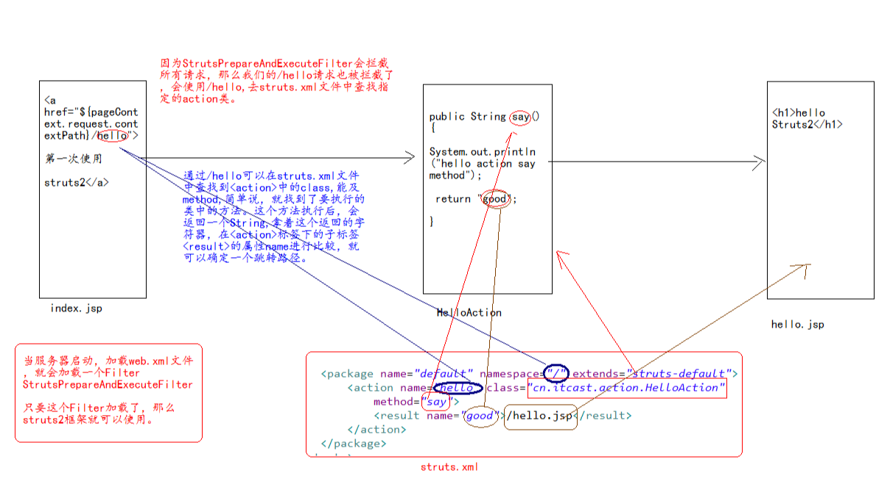
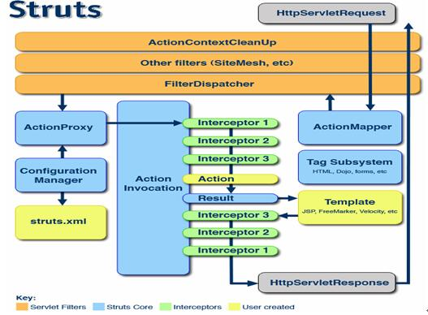

# struts2框架-1

## 1. 介绍

**框架** 是 实现部分功能的代码 （半成品)，使用框架简化企业级软件开发,提高开发效率。

struts2 = struts1 + webwork

struts2是一个标准的mvc框架。 javaweb中的model2模式就是一个mvc模式。  

model2 = servlet + jsp + javaBean

struts2框架是在javaweb开发中使用的。使用struts2框架，可以简化我们的web开发，并且降低程序的耦合度。

类似于struts2框架的产品 :
struts1,webwork,jsf,springmvc

ssh---struts2 spring hibernate

ssi---springmvc spring ibatis

XWork---它是webwork核心
Xwork提供了很多核心功能：前端拦截机（interceptor），运行时表单属性验证，类型转换，
强大的表达式语言（OGNL – the Object Graph Navigation Language），
IoC（Inversion of Control反转控制）容器等

## 2. 快速入门

* index.jsp------>HelloServlet-------->hello.jsp  **web开发流程**
* index.jsp------>HelloAction--------->hello.jsp  **struts2流程**

### 2.1 导入jar包

下载struts2的jar包  struts-2.3.15.1-all 版本.

```markdown

struts2的目录结构:
apps: 例子程序
docs:文档
lib:struts2框架所应用的jar以及插件包
src:源代码  
core  它是struts2的源代码
xwork-core struts2底层使用了xwork,xwork的源代码

注意:在struts2开发，一般情况下最少导入的jar包，去apps下的struts2-blank示例程序中copy
```

### 2.2 创建jsp页面

创建index.jsp页面

创建hello.jsp页面

### 2.3 对struts2框架进行配置

#### 1. web.xml文件中配置前端控制器(核心控制器)-----就是一个Filter

目的: 是为了让struts2框架可以运行。

```markdown
<filter>
    <filter-name>struts2</filter-name>
    <filter-class>org.apache.struts2.dispatcher.ng.filter.StrutsPrepareAndExecuteFilter</filter-class>
</filter>

<filter-mapping>
    <filter-name>struts2</filter-name>
    <url-pattern>/*</url-pattern>
</filter-mapping>
```

#### 2. 创建一个struts.xml配置文件 ,这个是struts2框架配置文件

目的:是为了struts2框架流程可以执行。

名称:struts.xml

位置:src下(classes下)

### 2.4 创建一个HelloAction类

要求，在HelloAction类中创建一个返回值是String类型的方法，注意，无参数。

```java
public String say(){
    return "good";
}
```

### 2.5 在struts.xml文件中配置HelloAction

```markdown
<package name="default" namespace="/" extends="struts-default">
    <action name="hello" class="cn.itcast.action.HelloAction" method="say">
        <result name="good">/hello.jsp</result>
    </action>
</package>
```

### 2.6 在index.jsp中添加连接，测试

```markdown
<a href="${pageContext.request.contextPath}/hello">第一次使用struts2</a>
```

访问连接，就可以看到HelloAction类中的say方法执行了，也跳转到了hello.jsp.

### 2.7. 对入门程序进行流程分析



### 2.8. 自建Filter模仿struts2的流程

1. 创建一个Filter----StrutsFilter
2. 在web.xml文件中配置StrutsFilter
3. 在StrutsFilter中完成拦截操作，并访问Action中的方法，跳转到hello.jsp页面操作.

```JAVA
// 1. 得到请求资源路径
String uri = request.getRequestURI();
String contextPath = request.getContextPath();
String path = uri.substring(contextPath.length() + 1);

// System.out.println(path); // path = hello

// 2. 使用path去struts.xml文件中查找某一个<action name=path>这个标签
SAXReader reader = new SAXReader();
Document document = reader.read(new File(this.getClass().getResource("/struts.xml").getPath()));
Element actionElement = (Element) document.selectSingleNode("//action[@name='" + path + "']");
// xpath 查找<action name='hello'>这样的标签

if (actionElement != null) {
    // 得到<action>标签上的class属性以及method属性
    String className = actionElement.attributeValue("class"); // 得到了action类的名称
    String methodName = actionElement.attributeValue("method");// 得到action类中的方法名称。

    //3. 通过反射，得到Class对象，得到Method对象
    Class actionClass = Class.forName(className);
    Method method = actionClass.getDeclaredMethod(methodName);

    //4. 让method执行.
    String returnValue = (String) method.invoke(actionClass.newInstance());
    //是让action类中的方法执行，并获取方法的返回值。

    // 5.使用returnValue去action下查找其子元素result的name属性值，与returnValue做对比。
    Element resultElement = actionElement.element("result");
    String nameValue = resultElement.attributeValue("name");

    if (returnValue.equals(nameValue)) {
        // 6. 得到了要跳转的路径。
        String skipPath = resultElement.getText();
        request.getRequestDispatcher(skipPath).forward(request,response);
        return;
    }
}
```

## 3. struts2的流程分析以及工具配置

### 3.1 运行流程分析

请求 ----> StrutsPrepareAndExecuteFilter 核心控制器 -----> Interceptors 拦截器（实现代码功能 ）
 -----> Action 的execute ---> 结果页面 Result



* 拦截器 在 struts-default.xml定义
* 执行拦截器 是 defaultStack 中引用拦截器

### 3.2 关于手动配置struts.xml文件中提示操作

struts.xml提示来自于DTD约束

```markdown
<!DOCTYPE struts PUBLIC
"-//Apache Software Foundation//DTD Struts Configuration 2.3//EN"
"http://struts.apache.org/dtds/struts-2.3.dtd">
```

### 3.3 关联struts2源文件

如果是 com.opensymphony.xxx   在xwork-core下
如果是org.apache.struts2     在core下
idea用maven下载

### 3.4 使用插件 struts2-config-browser-plugin-2.3.15.1

提供在浏览器中查看 struts2 配置加载情况

将struts2/lib/struts2-config-browser-plugin-2.3.7.jar 复制WEB-INF/lib下

访问 <http://localhost/struts2_day01/config-browser/index.action> 查看 struts2配置加载情况

## 4. struts2配置(重点)

### 4.1 struts2配置文件加载顺序

struts2框架要能执行，必须先加载StrutsPrepareAndExecuteFilter.

在StrutsPrepareAndExecuteFilter的init方法中对Dispatcher进行了初始化，
在Dispatcher类中定义的init方法内就描述了struts2配置文件加载的顺序

```java
init_DefaultProperties(); // [1]   ----------  org/apache/struts2/default.properties
init_TraditionalXmlConfigurations(); // [2]  --- struts-default.xml,struts-plugin.xml,struts.xml
init_LegacyStrutsProperties(); // [3] --- 自定义struts.properties
init_CustomConfigurationProviders(); // [5]  ----- 自定义配置提供
init_FilterInitParameters() ; // [6] ----- web.xml
init_AliasStandardObjects() ; // [7] ---- Bean加载
```

* default.properties文件

作用:定义了struts2框架中所有**常量**
位置: org/apache/struts2/default.properties

* struts-default.xml

作用:配置了bean,interceptor,result等。
位置:在struts的core核心jar包.

* struts-plugin.xml

它是struts2框架中所使用的插件的配置文件。

* struts.xml

我们使struts2所使用的配置文件。

* *自定义的struts.properties

就是可以自定义常量。

* web.xml


在开发中，后加载文件中的配置会将先加载文件中的配置覆盖。


```MARKDOWN
记住顺序：
default.properties
struts-default.xml
struts.xml
```

### 4.2 关于Action的配置

```MARKDOWN
 <package name="default" namespace="/" extends="struts-default">
        <action name="hello" class="test.HelloAction" method="say">
            <result name="good">/hello.jsp</result>
        </action>
</package>
```

#### 1. &lt;package&gt; 声明一个包, 用于管理action

1. name     它用于声明一个包名，包名不能重复，也就是它是唯一的。
2. namespace  它与action标签的name属性合并确定了一个唯一访问action的路径。
3. extends  它代表继承的包名。
4. abstrace 它可以取值为true/false,如果为true,代表这个包是用于被继承的。

#### 2. &lt;action&gt; 声明 一个action

1. name  就是action的一个名称，它是唯一的(在同包内) 它与package中的namespace确定了访问action的路径。
2. class Action类的全名
3. method 要访问的Action类中的方法的名称, 方法无参数 ，返回值为String.

#### 3. &lt;result&gt; 确定返回结果类型

1. name  它与action中的方法返回值做对比，确定跳转路径。

#### 关于action配置其它细节

##### 1. 关于默认值问题

```markdown
<package namespace="默认值"> namespace的默认值是""
    <action class="默认值"  method="默认值">
    class的默认值是  com.opensymphony.xwork2.ActionSupport
    method的默认值是  execute
        <result name="默认值"> name的默认值是 "success"
```

##### 2. 关于访问action的路径问题

现在的action的配置是:

```markdown
<package name="default" namespace="/" extends="struts-default">
    <action name="hello" class="cn.itcast.action.DefaultAction">
        <result>/hello.jsp</result>
    </action>
</package>
```

当我们输入:<http://localhost/struts2_day01_2/a/b/c/hello>也访问到了action。

```markdown
原因:struts2中的action被访问时，它会首先查找
1.namespace="/a/b/c"  action的name=hello  没有.
2.namespace="/a/b     action的name=hello  没有
3.namespace="/a"      action的name=hello  没有
4.namespace="/"        action的name=hello  查找到了.

如果最后也查找不到，会报404错误.
```

##### 3. 默认的action

在&lt;package&gt;下配置指定某个为该包的默认action，作用: 处理其它action处理不了的路径。

```MARKDOWN
<default-action-ref name="action的名称" />
```

配置了这个，当访问的路径，其它的action处理不了时，就会执行name指定的名称的action。

##### 4. action的默认处理类

在action配置时，如果class不写。默认情况下是 com.opensymphony.xwork2.ActionSupport。

也可以自己设置默认处理类

```MARKDOWN
<default-class-ref class="cn.itcast.action.DefaultAction"/>
```

如果设置了，那么在当前包下，默认处理action请求的处理类就为class指定的类。

### 4.3 关于常量配置

default.properties 它声明了struts中的常量。

#### 人为可以设置常量的位置

* struts.xml(应用最多)

```markdown
<constant name="常量名称" value="常量值"></constant>
```

* struts.properties（基本不使用）
* web.xml(了解)

配置常量，是使用StrutsPrepareAndExecuteFilter的初始化参数来配置的.

```markdown
<init-param>
<param-name>struts.action.extension</param-name>
<param-value>do,,</param-value>
</init-param>
```

#### 常用常量

```markdown
struts.action.extension = action,,
这个常量用于指定strus2框架默认拦截的后缀名.

<constant name="struts.i18n.encoding" value="UTF-8"/>  
相当于request.setCharacterEncoding("UTF-8"); 解决post请求乱码

<constant name="struts.serve.static.browserCache" value="false"/>
false不缓存，true浏览器会缓存静态内容，产品环境设置true、开发环境设置false

<constant name="struts.devMode" value="true" />  
提供详细报错页面，修改struts.xml后不需要重启服务器 （要求）
```

#### struts.xml文件的分离

目的: 就是为了阅读方便。可以让一个模块一个配置文件，在struts.xml文件中通过
&lt;include file="test.xml"/&gt;导入其它的配置文件。

## 5. Action

### 5.1 关于Action类的创建方式介绍

有三种方式。

#### 1. 创建一个POJO类

简单的Java对象(**Plain Old Java Objects**)，指的是没有实现任何接口，没有继承任何父类(除了Object)

优点: 无耦合。

缺点：所以工作都要自己实现。

在struts2框架底层是通过反射来操作:

* struts2框架 读取struts.xml 获得 完整Action类名
* obj = Class.forName("完整类名").newInstance();
* Method m = Class.forName("完整类名").getMethod("execute");  m.invoke(obj); 通过反射 执行 execute方法

#### 2. 创建一个类，实现Action接口  

com.opensymphony.xwork2.Action

优点:耦合低。提供了五种结果视图，定义了一个行为方法。

缺点:所以工作都要自己实现。

五种逻辑视图，解决Action处理数据后，跳转页面。

```JAVA
public static final String SUCCESS = "success";  // 数据处理成功 （成功页面）
public static final String NONE = "none";  // 页面不跳转  return null; 效果一样
public static final String ERROR = "error";  // 数据处理发送错误 (错误页面)
public static final String INPUT = "input"; // 用户输入数据有误，通常用于表单数据校验 （输入页面）
public static final String LOGIN = "login"; // 主要权限认证 (登陆页面)
```

#### 3. 创建一个类，继承自ActionSupport类

com.opensymphony.xwork2.ActionSupport

ActionSupport类实现了Action接口。

优点:**表单校验、错误信息设置、读取国际化信息** 三个功能都支持.

缺点:耦合度高。

在开发中，第三种会使用的比较多.

### 5.2 关于action的访问

#### 1. 通过设置method的值，来确定访问action类中的哪一个方法

```MARKDOWN
<action name="book_add" class="cn.itcast.action.BookAction" method="add"></action>
当访问的是book_add,这时就会调用BookAction类中的add方法。

<action name="book_update" class="cn.itcast.action.BookAction" method="update"></action>
当访问的是book_update,这时就会调用BookAction类中的update方法。
```

#### 2. 使用通配符来简化配置

在jsp页面上

book.jsp

```markdown
<a href="${pageContext.request.contextPath}/Book_add">book add</a><br>
<a href="${pageContext.request.contextPath}/Book_update">book update</a><br>
<a href="${pageContext.request.contextPath}/Book_delete">book delete</a><br>
<a href="${pageContext.request.contextPath}/Book_search">book search</a><br>
```

product.jsp

```markdown
<a href="${pageContext.request.contextPath}/Product_add">product add</a><br>
<a href="${pageContext.request.contextPath}/Product_update">product update</a><br>
<a href="${pageContext.request.contextPath}/Product_delete">product delete</a><br>
<a href="${pageContext.request.contextPath}/Product_search">product search</a><br>
```

在struts.xml文件中

```MARKDOWN
<action name="*_*" class="cn.itcast.action.{1}Action" method="{2}"></action>
```

当访问book add时，这时的路径是  Book_add, 那么对于struts.xml文件中.

* 第一个星就是   Book
* 第二个星就是   add
* 对于{1}Action---->BookAction
* 对于method={2}--->method=add

使用通配符来配置注意事项:

1. 必须定义一个统一的命名规范。
2. 不建议使用过多的通配符，阅读不方便。

#### 3. 动态方法调用(了解)

在struts.xml文件中没有指定method

```MARKDOWN
<action name="book" class="cn.itcast.action.BookAction"></action>
```

访问时路径: <http://localhost/struts2_day01_2/book!add>,就访问到了BookAction类中的add方法，对于book!add 这就是动态方法调用。

注意：struts2框架支持动态方法调用，是因为在default.properties配置文件中设置了
动态方法struts.enable.DynamicMethodInvocation调用为true. 也可以在struts.xml中配置覆盖。

```JAVA
struts.enable.DynamicMethodInvocation = true
```

## 6. 在struts2框架中获取servlet api


对于struts2框架，不建议直接使用servlet api


在struts2中获取servlet api有三种方式：

* 通过ActionContext获取
* 注入方式获取
* 通过ServletActionContext获取

### 6.1 通过ActionContext来获取

#### 1. 获取一个ActionContext对象

```JAVA
ActionContext context = ActionContext.getContext();
```

#### 2. 获取servlet api

注意:通过ActionContext获取的不是真正的Servlet api, 而是一个Map集合。

```JAVA
1. context.getApplication()
2. context.getSession()
3. context.getParameter();---得到的就相当于request.getParameterMap()
4. context.put(String,Object) 相当于request.setAttribute(String,String);
```

### 6.2 注入方式获取(这种方式是真正的获取到了servlet api)

#### 1. 要求action类必须实现指定接口

ServletContextAware ： 注入ServletContext对象
ServletRequestAware ：注入 request对象
ServletResponseAware ： 注入response对象

#### 2. 重定接口中的方法

#### 3. 声明一个web对象，使用接口中的方法的参数对声明的web对象赋值

```JAVA
public class DemoAction extends ActionSupport implements ServletRequestAware{

    private HttpServletRequest request;
    //重写接口中的方法
    public void setServletRequest(HttpServletRequest request) {
        this.request = request;//注入request对象
    }
    @Override
    public String execute() throws Exception{
       requst.getParameter(...)
        ...
    }
}
```

#### 扩展:分析其实现

是使用struts2中的一个interceptor完成的.在struts-default.xml中配置

```markdown
<interceptor name="servletConfig" class="org.apache.struts2.interceptor.ServletConfigInterceptor"/>
```

```java
if (action instanceof ServletRequestAware) { //判断action是否实现了ServletRequestAware接口
    HttpServletRequest request = (HttpServletRequest) context.get(HTTP_REQUEST); //得到request对象.
    ((ServletRequestAware) action).setServletRequest(request);//将request对象通过action中重写的方法注入。
}
```

### 6.3 通过ServletActionContext获取

在ServletActionContext中方法都是static。

```JAVA
getRequest();
getResposne();
getPageContext();
```

## 7. Result结果类型

&lt;result&gt;标签

1. name  与action中的method的返回值匹配，进行跳转.

2. type  作用:是用于定义跳转方式

对于type属性它的值有以下几种:
在**struts-default.xml**文件中定义了type可以取的值

```MARKDOWN
<result-type name="chain" class="com.opensymphony.xwork2.ActionChainResult"/>
<result-type name="dispatcher" class="org.apache.struts2.dispatcher.ServletDispatcherResult" default="true"/>
<result-type name="freemarker" class="org.apache.struts2.views.freemarker.FreemarkerResult"/>
<result-type name="httpheader" class="org.apache.struts2.dispatcher.HttpHeaderResult"/>
<result-type name="redirect" class="org.apache.struts2.dispatcher.ServletRedirectResult"/>
<result-type name="redirectAction" class="org.apache.struts2.dispatcher.ServletActionRedirectResult"/>
<result-type name="stream" class="org.apache.struts2.dispatcher.StreamResult"/>
<result-type name="velocity" class="org.apache.struts2.dispatcher.VelocityResult"/>
<result-type name="xslt" class="org.apache.struts2.views.xslt.XSLTResult"/>
<result-type name="plainText" class="org.apache.struts2.dispatcher.PlainTextResult" />
```

必会: **chain  dispatcher  redirect redirectAction  stream**

* dispatcher:它代表的是请求转发，也是默认值。它一般用于从action跳转到页面。
* chain:它也相当于请求转发。它一般情况下用于从一个action跳转到另一个action。

* redirect:它代表的是重定向  它一般用于从action跳转到页面
* redirectAction: 它代表的是重定向  它一般用于从action跳转另一个action。

* stream:代表的是服务器端返回的是一个流，一般用于下载。

了解: freemarker  velocity

## 8. 局部结果页面与全局结果页面

```markdown
<action name="result" class="cn.itcast.struts2.demo6.ResultAction">
<!-- 局部结果  当前Action使用 -->
<result name="success">/demo6/result.jsp</result> 
</action>

<global-results>
<!-- 全局结果 当前包中 所有Action都可以用-->
<result name="success">/demo6/result.jsp</result>
</global-results>
```
