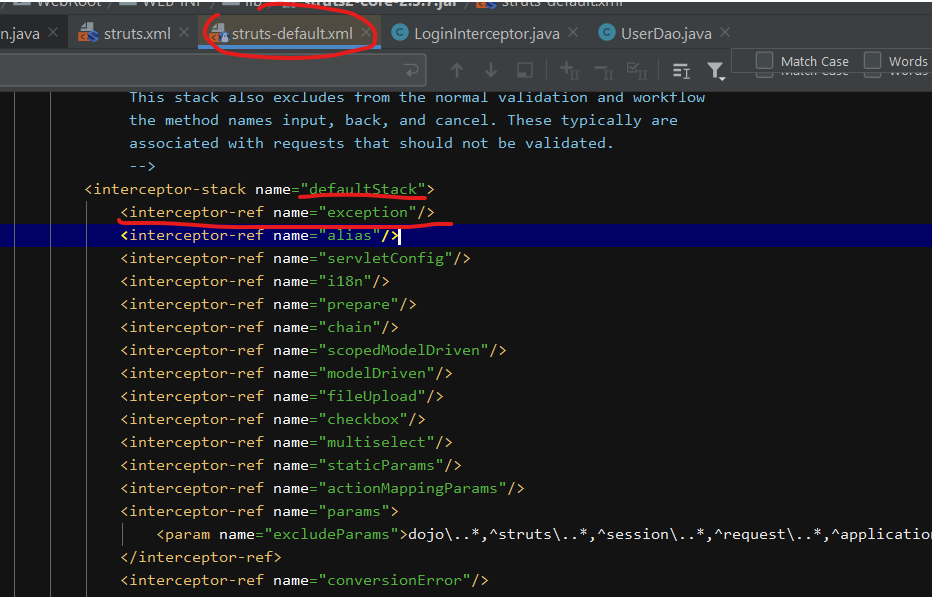
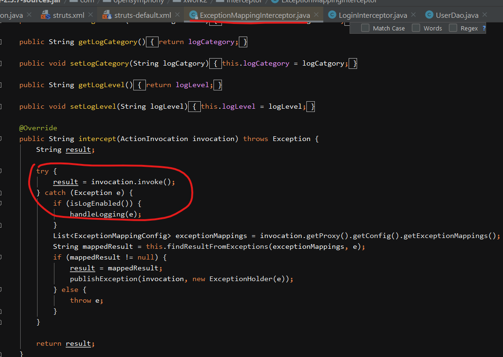

# Struts2框架练习笔记

## 1. 目标功能

1. 登陆
2. 添加用户 （简历上传）
3. 组合条件 员工信息列表查询
4. 员工信息详情查看（简历下载）
5. 员工信息删除
6. 员工信息编辑
7. 异常处理
8. 登录校验

## 2. 数据库设计

### Oracle和MySQL 作为应用数据库区别

mysql存在数据库概念，在企业开发中，针对一个项目创建一个单独数据库，创建单独用户， 为用户授予数据库权限 ， oracle 一个数据库就是一个服务，在这个库中可以存在很多用户，每个用户有单独表空间 ，针对一个项目，只需要创建一个用户

### 创建用户与授权

为项目数据库创建单独用户，并为用户授予数据库权限,在c3p0配置中使用这个用户的信息连接数据库。

[MySQL数据库操作-DCL](https://github.com/QiQixvs/JavaLearnNote/tree/1f7781d590e3144a26ef80b30f22b8a3f73854bc/mysql-ddl.md)

### 用户表

```text
CREATE TABLE S_User(
    userID INT  NOT NULL AUTO_INCREMENT, #主键ID
    userName VARCHAR(50)   NULL,  #用户姓名
    logonName VARCHAR(50)   NULL, #登录名
    logonPwd VARCHAR(50)  NULL,   #密码#
    sex VARCHAR(10)  NULL,        #性别（例如：男，女）
    birthday VARCHAR(50) NULL,    #出生日期
    education VARCHAR(20)  NULL,  #学历（例如：研究生、本科、专科、高中）
    telephone VARCHAR(50)  NULL,  #电话
    interest VARCHAR(20)  NULL,   #兴趣爱好（例如：体育、旅游、逛街）
    path VARCHAR(500)  NULL,      #上传路径（path路径）
    filename VARCHAR(100)  NULL,  #上传文件名称（文件名）
    remark VARCHAR(500)  NULL,    #备注
    PRIMARY KEY (userID)
);

初始化数据：默认用户名和密码是admin
INSERT INTO s_user (userID,userName,logonName,logonPwd) VALUES (1,'超级管理员','admin','admin');
```

## 3.  搭建开发环境

## 4. 功能实现

### 4.1 登录操作

#### 1. 使用struts2提供的表单标签来改造页面

```text
<form>-------------------<s:form>
<input type="text">------<s:textfield>
<input type="password">---<s:password>
<input type="submit">-----<s:submit>
<input type="reset">------<s:reset>
```

1.改造form

```text
<s:form id="loginAction_home" name="form1" action="user_login" namespace="/" target="_parent" method="post">
</s:form>
```

与form标签中action属性不同，这里的action写的是struts2.xml文件中对应的action的那么属性。

2.改造登录名

```text
<s:textfield name="logonName" value="" id="logonName" cssClass="text" cssStyle="width: 160px;"/>
```

3.改造登录密码

```text
<s:password  name="logonPwd" id="logonPwd" cssClass="text" cssStyle="width: 160px;"/>
```


密码框默认不回显示.需要设置属性showPassword="true"


4.提交

```text
<s:submit name="submit" value="登录" cssClass="buttoninput"/>
```

5.重置

```text
<s:reset name="reset" value="取消" cssClass="buttoninput"/>
```

注意: struts2中的表单标签，有默认的主题xhtml. 如果不想要添加任何修饰，只需要将主题修改为simple.

**怎样设置表单主题**

1.全局----在struts.xml文件中配置一个常量

```text
<constant name="struts.ui.theme" value="simple"></constant>
```

2.局部----针对于某一个form.

```text
<s:form theme="simple">
```

3.局部----可以给任意的表单组件去指定theme属性值。

#### 2. 需要使用xml配置方式对数据进行校验

要求： 用户名 非空，3-12位,密码 非空。

[Struts2框架-2-4.2 配置校验](https://github.com/QiQixvs/JavaLearnNote/tree/1f7781d590e3144a26ef80b30f22b8a3f73854bc/struts2/struts2_2.md)

1.在UserAction所在包下创建一个UserAction-validation.xml

2.在xml文件中添加dtd约束

```text
<!DOCTYPE validators PUBLIC
"-//Apache Struts//XWork Validator 1.0.3//EN"
"http://struts.apache.org/dtds/xwork-validator-1.0.3.dtd">
```

3.对属性进行校验

```text
<validator>
    <field name="logonName">
        <field-validator type="requiredstring">
            <message>用户名不能为空</message>
        </field-validator>

        <field-validator type="stringlength">
            <param name="maxLength">12</param>
            <param name="minLength">3</param>
            <message>用户名长度必须在${minLength}到${maxLength}之间</message>
        </field-validator>
    </field>
    <field name="logonPwd">
        <field-validator type="requiredstring">
        <message>密码不能为空</message>
        </field-validator>
    </field>
</validator>
```

在页面上显示通过

3.登录成功，将用户存储到session，在页面上显示用户。

### 4.2 查询功能--查询全部

要求： 登录成功后，点击用户管理时，访问UserAction中的list方法，查询出所有的List&lt;User&gt;再跳转到list.jsp页面，展示出所有用户。

实现:

1.修改left.jsp页面上的用户管理的连接

```text
d.add(3,2,'用户管理','${pageContext.request.contextPath}/user_list','','mainFrame');
```

UserAction采用通配符配置

2.在list方法中调用service,dao完成查询操作,得到一个List&lt;User&gt; users

3.将List&lt;User&gt;users 声明成成员变量，提供get/set方法，集合就会自动的压入到valueStack中。[Struts2框架-4 - 2.8 关于默认压入到valueStack中的数据](https://github.com/QiQixvs/JavaLearnNote/tree/1f7781d590e3144a26ef80b30f22b8a3f73854bc/struts2/struts2_4.md)

问题:

1. 由于使用通配符配置UserAction造成的返回SUCCESS问题  登录成功返回  login\_success   查询所有成功  list\_success.
2. 关于查询操作时，校验的配置文件会执行。将校验登录信息的配置文件名修改为   UserAction-user\_login-validation.xml 这就只会对user\_login进行校验。

4.查询成功跳转到了 list.jsp，在页面上展示信息.

```text
<s:iterator value="%{users}" var="u">
    <tr>
        <td>
            <s:property value="%{#u.logonName}"/>
        </td>
        <td>
            <s:property value="%{#u.userName}"/>
        </td>
        <td>
            <s:property value="%{#u.sex}"/>
        </td>
        <td>
            <s:property value="%{#u.telephone}"/>
        </td>
...
```

### 4.3 添加员工

#### 1. 对add.jsp页面上html标签修改----struts2的表单标签

**1. 性别**

原标签:

```text
<input type="radio" name="sex" id="sex男" value="男"/><label for="sex男">男</label>
<input type="radio" name="sex" id="sex女" value="女"/><label for="sex女">女</label>
```

struts2标签:

```text
<s:radio list="{'男','女'}" name="sex" id="sex" value="%{'男'}"/>
<!--'男'作为默认值-->
```

**2. 学历**

原标签:

```text
<select name="education" id="education">
    <option value="" selected="selected">--选择学历--</option>
    <option value="博士">博士</option>
    <option value="硕士">硕士</option>
    <option value="研究生">研究生</option>
    <option value="本科">本科</option>
    <option value="专科">专科</option>
    <option value="高中">高中</option>
</select>
```

struts2标签

```text
<s:select list="{'博士','硕士','研究生','本科','专科','高中'}" name="education"
 id="education" headerKey="" headerValue="--选择学历--"></s:select>
```

**3. 兴趣爱好**

```text
<s:checkboxlist list="{'看电影','旅游','健身','购物','睡觉'}" name="interest"/>
```

**4. 上传**

```text
<s:file name="upload" size="30" value="" id="userAction_save_do_upload"/>
```

**5. 文本域**

```text
<s:textarea name="remark" cols="30" rows="3" id="userAction_save_do_remark" cssStyle="WIDTH: 96%"/>
```

#### 2. 添加数据的校验

在UserAction类所在包下创建一个 UserAction-user\_add-validation.xml

#### 3.完成添加操作\(简历上传\)

在UserAction类中

```java
private User user=new User();

private File upload;
private String uploadContentType;
private String uploadFileName;
```

添加的用户信息，除了上传文件的信息，其它的都封装到了user对象中。 而上传文件信息在三个属性上封装。

添加用户还需要有下列信息:

* userID-----&gt;自动增长
* path-------&gt;人为指定

简历不允许被浏览器端直接访问,保存到本地磁盘位置

上传简历，保存时的重名问题，d:/upload/随机名，而filename=真实名，寻找对应简历时用ID搜索。

添加用户操作完成后应重新进行查询操作,重定向到UserAction中

```text
<result name="add_success" type="redirectAction">user_list</result>
```

因为多个action在同一个配置中\(使用了通配符\)，多个请求操作时校验失败时，可能都需要跳转到input视图。但是它们跳转的页面不一样，在UserAction类中相应方法上**通过 @InputConfig注解**，改为校验失败后 跳转视图.

```java
@InputConfig(resultName = "add_input")//对应配置文件中的result标签中的name属性
public String add() throws IOException {
    if (upload != null) {
        //获取随机文件名
        String uuidname = FileUploadUtils.getUUIDFileName(uploadFileName);
        File dest = new File("d:/upload", uuidname);
        FileUtils.copyFile(upload, dest);
        user.setPath("d:/upload/" + uuidname);
        user.setFilename(uploadFileName);
    }
    UserService service = new UserService();
    try {
        service.addUser(user);
    } catch (SQLException e) {
    e.printStackTrace();
        this.addActionError("添加失败");
        return "input";//这里写的还是INPUT
    }
    return "add_success";
}
```

struts2.xml中配置result：

```text
<result name="login_input">/login/login.jsp</result>
<result name="add_input">/user/add.jsp</result>
```

### 4.4 组合条件查询

#### 1. 在list.jsp页面修改查询组件

是否上传简历

```text
<s:select list="#{'1':'有','2':'无'}" name="isUpload" id="isUpload" headerKey="0" headerValue="--请选择--"></s:select>
```

#### 2. 完成条件查询操作

是否上传简历，在action中获取，需要在User中添加一个属性 String isUpload

在dao中根据条件查询，sql语句如何写？考虑到不一定每一项条件都给出了，有几个待填参数不确定。

解决方法： 创建一个List&lt;Object&gt;, 在每一次判断时，直接将参数添加到集合中，最后将集合转换成Object\[\]，做为参数传递到query方法中。

```java
String sql = "select * from s_user where 1=1 ";
List<Object> params=new ArrayList<Object>();
String username = user.getUserName();
if (username != null && username.trim().length() > 0) {
    sql += " and userName like ?";
    params.add("%"+username+"%");
}
String sex = user.getSex();
    if (sex != null && sex.trim().length() > 0) {
    sql += " and sex=?";
    params.add(sex);
}
String education = user.getEducation();
if (education != null && education.trim().length() > 0) {
    sql += " and education=?";
    params.add(education);
}

String isupload = user.getIsUpload();
    if ("1".equals(isupload)) {
    sql += " and filename is not null";
} else if ("2".equals(isupload)) {
    sql += " and filename is null";
}

QueryRunner runner = new QueryRunner(DataSourceUtils.getDataSource());

return runner.query(sql, new BeanListHandler<User>(User.class),params.toArray());
```

### 5. 员工删除

我们只需要将当前用户的id传递到服务器端，在服务器端根据id删除用户信息。删除完成，再查询一次。

#### 1. 修改list.jsp页面上删除图标所带链接

原标签:

```text
<a href="${pageContext.request.contextPath}/user/list.jsp?userID=15">

</a>
```

使用struts2标签修改

```text
第一种方式
<s:a href="路径">

第二种方式
<s:a action="user_del" namespace="/">
    <s:param name="id" value="%{#u.userID}">
</s:a>

第三种方式:
<s:url><!--标签来定义一个路径-->
<s:a href="url"><!--来导入url值-->
这种方式路径可以复用

例：
<s:url namespace="/" action="user_del" var="delUrl">
    <s:param name="userID" value="%{#u.userID}"/>
</s:url>

<s:a href="%{#delUrl}">
    
</s:a>
```

#### 2 完成删除操作

如果用户有简历，删除用户时，也要将简历删除。

1. 先查询出用户。
2. 判断是否有简历。

```java
public String del() {
    UserService service = new UserService();
    try {

        // 先查询用户，判断是否有简历，如果有简历，将简历删除。
        user = service.findById(user.getUserID());
        String path = user.getPath();

        if (path != null) {
            // 有简历，将简历删除
            new File(path).delete();
        }
        service.delById(user.getUserID());
    } catch (SQLException e) {
        e.printStackTrace();
    }
    return "del_success";
}
```

### 6.员工详细信息查看

查询出用户信息\(user\),需要在view.jsp页面展示,在页面上展示时，我们不能使用valueStack栈顶的user对象，而要使用压入的action的getModel方法，重新得到user对象去获取信息，%{model.logonName}，原因见： [Struts2框架-4 - 2.8 关于默认压入到valueStack中的数据](https://github.com/QiQixvs/JavaLearnNote/tree/1f7781d590e3144a26ef80b30f22b8a3f73854bc/struts2/struts2_4.md)

```text
<tr>
    <td>登录名：</td>
    <td><s:property value="%{model.logonName}" /></td>
    <td>用户姓名：</td>
    <td><s:property value="%{model.userName}" /></td>
</tr>
...
<tr>
    <td>简历资料：</td>
    <td><a href="javascript:void(0)" onclick="downloadFile('<s:property value="%{model.userID}"/>')">
        <s:property value="%{model.filename}" />
       </a>
    </td>
</tr>
...
```

### 7. 员工简历下载

在view.jsp页面上展示的员工信息包含了简历，它是一个链接，点击它，实现员工简历下载。

```java
<script type="text/javascript">
    function downloadFile(userID){
        location.href="${pageContext.request.contextPath}/user_download?userID="+userID;
    }
</script>
```

```text
<result name="download_success" type="stream">
    <param name="contentType">${contentType}</param>
    <param name="contentDisposition">attachment;filename=${downloadFilename}</param>
    <param name="inputStream">${inputStream}</param>
</result>
```

一个流 ，两个头信息

```java
public String download() {
    ...//根据id找到user
    return "download_success";
}

private  InputStream inputStream;
//get/set方法...

public String getContentType() {
    ...//文件类型
    return mimeType;
}

public String getDownloadFilename() {
    //调用编码工具，处理真实中文文件名
    return encodeDownloadFilename(user.getFilename(), ServletActionContext.getRequest().getHeader("user-agent"));
}

public String encodeDownloadFilename(String filename, String header) {
    //根据浏览器类型对文件名进行处理
    return filename;
}
```

参考 [Struts2框架-3 - 3.2 下载](https://github.com/QiQixvs/JavaLearnNote/tree/1f7781d590e3144a26ef80b30f22b8a3f73854bc/struts2/struts2_3.md)

### 8. 员工信息修改

#### 1.查询

```text
<s:url namespace="/" action="user_updateForFind" var="editUrl">
    <s:param name="userID" value="%{#u.userID}"/>
</s:url>

<s:a href="%{#editUrl}">
    
</s:a>
```

根据id查询出user对象，跳转到edit.jsp页面，展示用户信息。与添加用户界面类似，但是需要显示原有的用户信息。

```text
<s:form id="userAction_save_do" name="Form1" action="user_add" namespace="/" method="post" enctype="multipart/form-data"><!--有上传文件操作-->
<s:hidden name="userID" value="%{model.userID}"/><!--ID不能变-->
...
<!--密码需要设置参数才会回显-->
<s:password name="logonPwd" value="%{model.logonPwd}" id="logonPwd" showPassword="true"/>
...
<!--多选框如何显示-->
<s:checkboxlist list="{'看电影','旅游','健身','购物','睡觉'}" name="interest" value="%{model.interest.split(', ')}"/>
...
<!-- 上传文件 不进行回显 -->
<s:file name="upload" size="30" id="userAction_save_do_upload"/>
```

#### 2. 修改

修改就是一个上传操作，和user\_add功能相同

问题:在修改时，关于用户简历的处理?

1. 原来没有  修改也没有。---不管
2. 原来没有  修改有了    ----处理
3. 原来有    修改没有了 -----不管
4. 原来有    修改也有.  -----处理\(将旧的删除\)

所以修改前必须先查询出用户。service.edit\(User user, boolean isEditUpload\); 通过布尔值控制对用户的更新是否包括简历。

```java
public String edit(){
    UserService service = new UserService();
    if (upload == null) {// 员工没有上传 新简历

        // 修改简历之外其他字段
        service.edit(user, false);
    } else {
        // 员工修改了简历
        // 替换原有简历，数据表修改简历相关信息
        // 1、上传新简历
        String uuidname = UUID.randomUUID().toString();
        File dest = new File("c:/upload", uuidname + uploadFileName.substring(uploadFileName.lastIndexOf(".")));
        FileUtils.copyFile(upload, dest);

        // 接收员工数据
        // 在user 保存 uuid文件路径 和 真实文件名
        user.setPath(dest.getCanonicalPath());
        user.setFilename(uploadFileName);

        // 2、删除旧简历
        User oldUser = service.findById(user.getUserID());
        File oldFile = new File(oldUser.getPath());
        oldFile.delete();
        // 3、修改员工信息
        service.edit(user, true);
    }
    return "edit_success";
}
```

### 9. 登陆校验拦截器

功能:用户只有登录成功后，才可以进行操作.

做一个Interceptor.判断用户是否登录了。（登录标志session中有user）

自定义Interceptor步骤:

1. 创建一个类，实现Interceptor接口
2. 重写方法完成功能
3. 在struts.xml文件注册
4. 在action中引入

[Struts2框架-3 - 2.3 权限控制案例](https://github.com/QiQixvs/JavaLearnNote/tree/1f7781d590e3144a26ef80b30f22b8a3f73854bc/struts2/struts2_3.md)

### 10. struts2 提供的异常处理

对于action中的操作，出现问题，直接抛出自定义异常, 例如new FindByIdException\(\)。

在struts.xml文件中

```text
<global-exception-mappings>
    <exception-mapping result="login" exception="user.exception.FindByIdException">
    <!--一旦捕获这个指定的自定义异常跳到“login”页面-->
    </exception-mapping>
</global-exception-mappings>
```

这就可以让特定的异常，跳转到自定的页面。

原理: struts2,默认加载的18个拦截器的第一个是exception这个拦截器ExceptionMappingInterceptor.class，它没有做任何操作， 直接放行，只是它将 invocation.invoke\(\)操作使用try-catch进行了处理。

其它的拦截器，或是action只要向外抛出异常，exception拦截器就会将其捕获。





