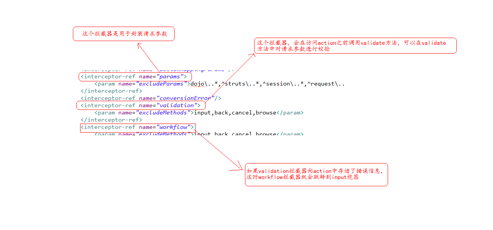

# Struts2框架-2

## 1. struts2中获取请求参数

### 1.1 struts2中的MVC

在struts2中action是什么?\(struts2是一个mvc框架\)

* V: jsp
* M: action
* C: action  StrutsPrepareAndExecuteFilter

在struts2中获取请求参数:

1. 属性驱动
2. 模型驱动

### 1.2 属性驱动

#### 1. 直接将action做一个model, 就可以得到请求参数

```java
页面：
用户名  <input type="text" name="username" /> <br/>

Action ：
public class RegistAction1 extends ActionSupport {
    private String username;
    public void setUsername(String username) {
        this.username = username;
    }
    ...
}
```

问题: action封装请求参数，会不会存在线程安全问题? 不会,因为每一次请求，都是一个新的action。struts2 Action 是多实例

缺点:在使用第一种数据封装方式，数据封装到Action属性中，不可能将Action对象传递给 业务层。需要单独定义javaBean,将action中属性copy到javaBean中。

优点:简单。

这种方式 ，底层是通过反射来实现的。

#### 2. 在action中声明一个model

private User user; 提供get/set方法

```java
Action：
public class RegistAction2 extends ActionSupport {
    private User user;
    public void setUser(User user) {
        this.user = user;
    }

    public User getUser() {
        return user;
    }
    ...
}
```

在页面上使用ognl来描述

```text
<input type="text" name="user.username"/>  ----- 基于OGNL表达式的写法
```

优点:简单，解决了第一种封装的问题

缺点:在页面上使用了ognl表达式，页面不通用了。

问题:这种方式，数据是怎样封装的? 是通过struts2中的interceptor进行了数据封装.

```text
<interceptor name="params" class="com.opensymphony.xwork2.interceptor.ParametersInterceptor"/>
```

### 1.3 模型驱动\(在开发中应用比较多\)

步骤：

1. 让action类实现ModelDriven接口
2. 重写getModel方法
3. 在action中实现化一个model对象，让getModel方法返回这个对象。

```text
<input type="text" name="username"/>
```

```java
public class Login3Action extends ActionSupport implements ModelDriven<User> {

    private User user = new User();//必须手动实例化

    public User getModel() {//重写方法
        return user;
    }
｝
```

优点: 解决了属性驱动存在的问题

缺点: 一次只能封装一个model对象

* struts2 有很多围绕模型驱动的特性
* &lt;interceptor name="modelDriven" class="com.opensymphony.xwork2.interceptor.ModelDrivenInterceptor"/&gt; 为模型驱动提供了更多特性

对比第二种、第三种 ： 第三种只能在Action中指定一个model对象，第二种可以在Action中定义多个model对象

```text
<input type="text" name="user.username" />
<input type="text" name="product.info" />
```

### 1.4  扩展

#### 1. 将数据封装到List集合

页面:

```text
username1:<input type="text" name="users[0].username"><br>
password1:<input type="password" name="users[0].password"><br>

username2:<input type="text" name="users[1].username"><br>
password2:<input type="password" name="users[1].password"><br>
```

action类:

```java
private List<User> users;
get/set方法
```

#### 2.将数据封装到Map集合

页面:

```text
username1:<input type="text" name="map['aaa'].username"><br>
password1:<input type="password" name="map['aaa'].password"><br>

username2:<input type="text" name="map['bbb'].username"><br>
password2:<input type="password" name="map['bbb'].password"><br>
```

action类:

```java
private Map<String, User> map;
提供get/set
```

## 2. struts2中提供的类型转换

struts2中action得到请求参数，也可以直接封装到javaBean.

struts2 内部提供大量类型转换器，用来完成数据类型转换问题.

```text
boolean 和 Boolean
char 和 Character
int 和 Integer
long 和 Long
float 和 Float
double 和 Double
Date 可以接收 yyyy-MM-dd格式字符串
数组  可以将多个同名参数，转换到数组中
集合  支持将数据保存到 List 或者 Map 集合
```


日期类型，我们传递 yyyy-MM-dd yyyy年MM月dd日格式都可以，但是如果是yyyy/MM/dd就会出现问题.


关于struts2中的类型转换器:

struts2中的类型转换器根接口是：**com.opensymphony.xwork2.conversion.TypeConverter**

## 3. 自定义类型转换器

步骤:

1. 创建一个类实现TypeConverter接口.
2. 重写接口中方法，实现类型转换操作.
3. 注册类型转换器.

### 3.1 创建一个自定义类型转换器

#### 1. 实现TypeConverter需要重写

```java
public Object convertValue(Map<String, Object> context, Object target, Member member, String propertyName, Object value, Class toType);
```

如果实现接口，这个方法参数太多\(6个\)

#### 2. 不推荐实现接口，可以继承 DefaultTypeConverter类

优点: 重写的方法参数没有那么多

```java
public Object convertValue(Map<String, Object> context, Object value, Class toType) {
return convertValue(value, toType);
}
```

#### 3. 推荐使用 继承DefaultTypeConverter类的一个子类StrutsTypeConverter

原因: 在这个类中将从页面传递的数据怎样封装，以及action中的数据怎样在页面上显示做了分离.

```java
public abstract Object convertFromString(Map context, String[] values, Class toClass);---请求封装
public abstract String convertToString(Map context, Object o);---数据回显
```

### 3.2 怎样注册一个自定义类型转换器

局部注册 ： 只对当前Action或model有效 （针对属性）

全局注册 ： 针对所有Action的日期类型有效 （针对类型 ）

#### 1. 局部--针对于action

配置文件所在位置以及名称: 在Action类所在包 创建 Action类名-conversion.properties

配置文件书写: 格式 ： 属性名称 = 类型转换器的全类名

#### 2.局部--针对于model

配置文件所在位置以及名称: 在model类所在包 创建 model类名-conversion.properties

配置文件书写: 格式 ： 属性名称=类型转换器的全类名

```text
配置文件名称： User-conversion.propertis

配置文件内容： birthday = utils.MyTypeConverter
```

#### 3. 全局

配置文件所在位置以及名称:在src下创建一个xwork-conversion.properties

配置文件书写: 格式: 要转换的类型全名 = 类型转换器的全类名

```text
配置文件名称： xwork-conversion.propertis

配置文件内容： java.util.Date = utils.MyTypeConverter
```

### 3.3 类型转换错误信息处理

对于struts2中类型转换器，如果表单数据提交时，将数据向model封装，出现了问题，会报错：

No result defined for action cn.itcast.action.RegistAction and result input

意思是说，在RegistAction的配置中没有配置**input结果视图**.

```text
<action name="regist" class="cn.itcast.action.RegistAction">
<result name="input">/success.jsp</result>
</action>
```

如果配置了，出现类型转换问题，就会跳转到input指定的视图。

问题: 为什么会向input视图跳转? 是因为struts2中的拦截器\(interceptor\).

```text
<interceptor name="conversionError" class="org.apache.struts2.interceptor.StrutsConversionErrorInterceptor"/>
当类型转换出问题时，向action中存储错误信息

<interceptor name="workflow" class="com.opensymphony.xwork2.interceptor.DefaultWorkflowInterceptor"/>
如果前面的拦截器发现了问题，向input视图跳转。
```

#### 错误信息展示

* 当类型转换出错时，自动跳转input视图 ，在input视图页面中 &lt;s:fieldError/&gt; 显示错误信息
* 在Action所在包中，创建 ActionName.properties，在局部资源文件中配置自定义提示信息 ：

```text
    invalid.fieldvalue.属性名= 错误信息
```


如果是自定义类型转换器，出现类型转换问题，要跳转到input视图，在类型转换器中，必须抛出异常才能被拦截器发现问题。


## 4. 关于struts2提供的数据校验

在开发中，请求参数是需要校验的。

* 客户端校验----&gt;js
* 服务器校验----&gt;java代码。

struts2中提供的校验-----服务器端校验。

分成两种:

1. 手动校验\(编码校验\)
2. 配置校验\(annotation,xml\) 我们讲的是xml。

### 4.1 手动校验\(了解\)

要求: action类必须继承自**ActionSupport**。需要重写一个方法 **validate**。

action中重写的validate是在请求处理方法\(execute\)之前执行的。

对于struts2提供的校验，它也是通过拦截器实现的。



#### 在validate方法中怎样存储校验错误信息

在validate方法中

```java
this.addFieldError(Sting name,String value);
```

#### 在页面上怎样获取错误信息?\(在input视图上\)

```text
jsp页面导入标签库
<%@ taglib prefix="s" uri="/struts-tags" %>
```

* &lt;s:fielderror&gt; 展示所有错误信息
* &lt;s:fielderror fieldName=""&gt; 展示特定名称的错误信息.

#### 在同一个Action中有多个请求处理方法\(login,regist\)

有些方法是需要校验的，有些是不需要的，怎样处理?

解决方案: 创建一个校验方法名称格式为 validate+请求处理方法名 （命名规范）

例如: 请求处理方法叫regist\(\)，则校验的方法名为 validateRegist\(\)。如果某个校验操作对于该action中的每个请求处理方法都应用，则写在validation\(\)方法中。

### 4.2 配置校验\(xml\)

struts2的校验框架

已经完成了校验操作\(做了很多校验方法\), 而我们在使用时，只需要将它们调用就可以\(通过配置文件\)

要求: action类必须继承自ActionSupport。

#### 配置文件怎样配置

位置: xml文件要与action类在同一个包下

名称: action类名-validation.xml

约束: xwork-core-2.3.7.jar 中 xwork-validator-1.0.3.dtd 下

```text
<!DOCTYPE validators PUBLIC
"-//Apache Struts//XWork Validator 1.0.3//EN"
"http://struts.apache.org/dtds/xwork-validator-1.0.3.dtd">
```

书写：

```text
1.根元素
<validators>

2.子元素
<field name="属性名称"></field>针对某一属性的校验

3.<field>子元素
<field-validator type="校验器"> 这个是指定校验器

4.<field-validator>子元素  
<message>错误信息</message>

5.<field-validator>子元素
<param name="">值</param>
用于指定校验器中的参数.
```


在页面上显示通过， 在struts2.xml中action标签下配置input视图，和目标页面。


#### 介绍: 关于配置校验中的校验器

校验器有哪些?

xwork-core-2.3.7.jar 中 /com/opensymphony/xwork2/validator/validators/default.xml下

```text
<validator name="required" class="com.opensymphony.xwork2.validator.validators.RequiredFieldValidator"/>
<validator name="requiredstring" class="com.opensymphony.xwork2.validator.validators.RequiredStringValidator"/>
<validator name="int" class="com.opensymphony.xwork2.validator.validators.IntRangeFieldValidator"/>
<validator name="long" class="com.opensymphony.xwork2.validator.validators.LongRangeFieldValidator"/>
<validator name="short" class="com.opensymphony.xwork2.validator.validators.ShortRangeFieldValidator"/>
<validator name="double" class="com.opensymphony.xwork2.validator.validators.DoubleRangeFieldValidator"/>
<validator name="date" class="com.opensymphony.xwork2.validator.validators.DateRangeFieldValidator"/>
<validator name="expression" class="com.opensymphony.xwork2.validator.validators.ExpressionValidator"/>
<validator name="fieldexpression" class="com.opensymphony.xwork2.validator.validators.FieldExpressionValidator"/>
<validator name="email" class="com.opensymphony.xwork2.validator.validators.EmailValidator"/>
<validator name="url" class="com.opensymphony.xwork2.validator.validators.URLValidator"/>
<validator name="visitor" class="com.opensymphony.xwork2.validator.validators.VisitorFieldValidator"/>
<validator name="conversion" class="com.opensymphony.xwork2.validator.validators.ConversionErrorFieldValidator"/>
<validator name="stringlength" class="com.opensymphony.xwork2.validator.validators.StringLengthFieldValidator"/>
<validator name="regex" class="com.opensymphony.xwork2.validator.validators.RegexFieldValidator"/>
<validator name="conditionalvisitor" class="com.opensymphony.xwork2.validator.validators.ConditionalVisitorFieldValidator"/>
```

* required \(**必填校验器**,要求被校验的属性值不能为null\)

```java
<field-validator type="required">
       <message>性别不能为空!</message>
</field-validator>
```

* requiredstring \(**必填字符串校验器**,要求被校验的属性值不能为null，并且长度大于0, 默认情况下会对字符串去前后空格\)

```java
<field-validator type="requiredstring">
       <param name="trim">true</param>
       <message>用户名不能为空!</message>
</field-validator>
```

* stringlength \(**字符串长度校验器**，要求被校验的属性值必须在指定的范围内，否则校验失败,minLength参数指定最小长度，maxLength参数指定最大长度，trim参数指定校验field之前是否去除字符串前后的空格\)

```java
<field-validator type="stringlength">
    <param name="maxLength">10</param>
    <param name="minLength">2</param>
    <param name="trim">true</param>
    <message><产品名称应在${minLength}-${maxLength}个字符之间]]></message>
</field-validator>
```

* regex \(**正则表达式校验器**，检查被校验的属性值是否匹配一个正则表达式，expression参数指定正则表达式，caseSensitive参数指定进行正则表达式匹配时，是否区分大小写,默认值为true\)

```java
<field-validator type="regex">
     <param name="regexExpression"><![CDATA[^13\d{9}$]]></param> CDATA区域的不会被解析，原样使用
     <message>手机号格式不正确!</message>
</field-validator>
```

* int\(**整数校验器**，要求field的整数值必须在指定范围内，min指定最小值，max指定最大值\)

```java
<field-validator type="int">
    <param name="min">1</param>
    <param name="max">150</param>
    <message>年龄必须在${mim}-${max}之间</message>
</field-validator>
```

* double\(双精度浮点数校验器,要求field的双精度浮点数必须在指定范围内,min指定最小值,max指定最大值\)
* fieldexpression \(**字段OGNL表达式校验器**,要求field满足一个ognl表达式，expression参数指定ognl表达式,该逻辑表达式基于ValueStack进行求值,返回true时校验通过，否则不通过\)

```java
<field-validator type="fieldexpression">
       <param name="expression"><![CDATA[(password==repassword)]]></param>
       <message>两次密码输入不一致</message>
</field-validator>
```

* email\(**邮件地址校验器**，要求如果被校验的属性值非空，则必须是合法的邮件地址\)

```java
<field-validator type="email">
    <message>电子邮件地址无效</message>
</field-validator>
```

* url\(**网址校验器**,要求如果被校验的属性值非空,则必须是合法的url地址\)

```java
<field-validator type="url">
    <message>主页地址必须是一个有效网址</message>
</field-validator>
```

* date\(**日期校验器**,要求field的日期值必须在指定范围内,min指定最小值,max指定最大值\)

```java
<field-validator type="date">
    <param name="min">1900-01-01</param>
        <param name="max">2050-02-21</param>
    <message>生日必须在${min}到${max}之间</message>
</field-validator>
```

#### 在同一个action中存在多个请求处理方法校验问题

只需要将校验xml文件名称修改就可以。

格式 Action类名-ActionName\(&lt;action&gt;元素name属性\)-validation.xml

UserAction-regist-validation.xml

## 5. 自定义校验规则\(了解\)

步骤一：自定义校验器必须实现 Validator 接口 通常自定义校验器 继承 ValidatorSupport 和 FieldValidatorSupport

* ValidatorSupport 针对不是一个输入字段 \(两个密码一致\)
* FieldValidatorSupport 针对是一个输入字段  \(用户名非空\)

步骤二： 注册校验器

在工程的src下新建validators.xml文件，引入 xwork-core-2.3.7.jar 中 xwork-validator-config-1.0.dtd

步骤三 ：使用校验器

在Action所有包内创建Action类名-validation.xml _\*\*_ 实际开发中很少用到自定义校验器

## 扩展：struts2中零配置介绍

struts2 引入了Convention插件来支持零配置，使用约定无需struts.xml或者Annotation配置

需要 struts2-convention-plugin-2.3.7.jar 、asm-\*.jar\(三个\)

插件会自动搜索action、actions、struts、struts2包下所有Java类，所有实现了com.opensymphony.xwork2.Action的Java类，所有类名以Action结尾的Java类

下面类名都符合Convention插件

```text
struts2.HelloAction
actions.books.BookSearchAction
struts.user.UserAction
estore.action.test.LoginAction
```

struts2-convention-plugin-2.3.7.jar 中struts-plugin.xml重要常量

```text
<constant name="struts.convention.package.locators" value="action,actions,struts,struts2"/>  默认扫描包
<constant name="struts.convention.exclude.packages" value="org.apache.struts.*,org.apache.struts2.*,org.springframework.web.struts.*,org.springframework.web.struts2.*,org.hibernate.*"/> 不扫描
<constant name="struts.convention.action.suffix" value="Action"/> 默认扫描以Action结尾的类
<constant name="struts.convention.result.path" value="/WEB-INF/content/"/> 结果result页面存放位置
<constant name="struts.convention.classes.reload" value="false" /> Action类文件重新自动加载
```

如果Action类名包含Action后缀，将Action后缀去掉

将Action类名的驼峰写法，转成中划线写法

例如： struts2.HelloAction 映射到 /hello.action actions.books.BookSearchAction 映射到 /books/book-search.action struts.user.UserAction 映射到 /user/user.action estore.action.test.LoginAction 映射到 /test/login.action

默认情况下，Convention 总会到Web应用的WEB-INF/content路径下定位结果资源 &lt;constant name="struts.convention.result.path" value="/WEB-INF/content/"/&gt;

约定： actionName + resultCode + suffix

例如： 访问struts.user.UserAction返回success Convention优先使用 WEB-INF/content/user/user-success.jsp, 如果user-success.jsp不存在，会使用user-success.html, 如果user-success.html不存在，会使用user.jsp.

