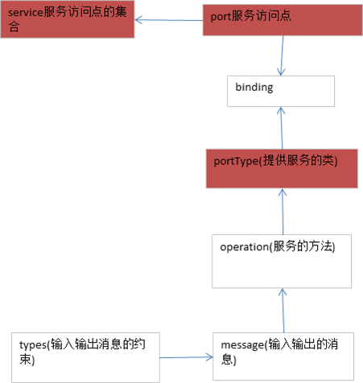
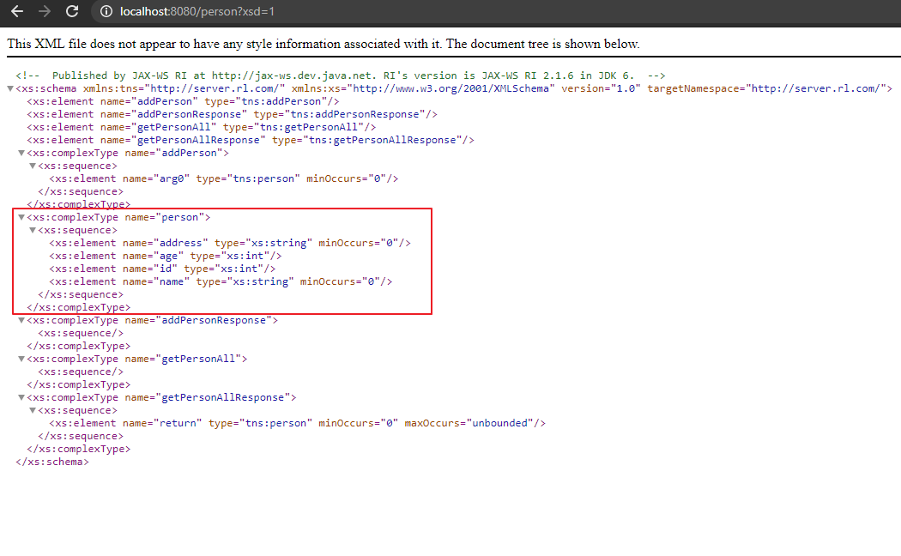

# WebService-1

WebService定义: 顾名思义就是基于Web的服务。它使用Web(HTTP)方式，接收和响应外部系统的某种请求。从而实现远程调用。

XML. Extensible Markup Language －扩展性标记语言 

WSDL – WebService Description Language – Web服务描述语言

SOAP-Simple Object Access Protocol(简单对象访问协议)

## WSDL解析

Webservice服务网站：http://www.webxml.com.cn

Wsdl文档从下往上读

* Types - 数据类型定义的容器，它使用某种类型系统(一般地使用XML Schema中的类型系统)。（入参和出参的数据类型） 
* Message - 通信消息的数据结构的抽象类型化定义。使用Types所定义的类型来定义整个消息的数据结构（入参和出参）。 
* Operation - 对服务中所支持的操作的抽象描述，一般单个Operation描述了一个访问入口的请求/响应消息对（方法）。 
* PortType - 对于某个访问入口点类型所支持的操作的抽象集合，这些操作可以由一个或多个服务访问点来支持（服务类）。 
* Binding - 特定服务访问点与具体服务类的绑定（不看内容，看关系）。 
* Port - 定义为webservice单个服务访问点。 



## 生成客户端代码

* wsimport是jdk自带的,可以根据wsdl文档生成客户端调用代码的工具.当然,无论
* 服务器端的WebService是用什么语言写的,都将在客户端生成Java代码.服务器端用什么写的并不重要.

wsimport.exe位于JAVA_HOME\bin目录下.
   
常用参数为:-d<目录>  - 将生成.class文件。默认参数。
•	-s<目录>  - 将生成.java文件和class文件。
•	-p<生成的新包名> -将生成的类，放于指定的包下。
•	(wsdlurl) - http://server:port/service?wsdl，必须的参数。

```text
C:/> wsimport –s . http://192.168.0.100/one?wsdl 
```

## 调用webservice步骤

1)	打开WSDL文档
2)	从下往上读WSDL文档，先找到Services（服务访问点集合），根据Services里面binding属性找到binding元素，再根据binding元素的type属性找到绑定的portType（服务类）
3)	根据WSDL的地址生成客户端代码wsimport -s . -p com.rl.trans d:/wsCode/EnglishChinese.wsdl
4)	把客户端代码拷贝到项目中
5)	创建服务访问点集合对象
6)	根据服务访问点获得服务类
7)	调用服务类的方法

测试代码调用一

```java
public class TestMobileClient {
    public static void main(String[] args) {
        //创建服务访问点集合
        MobileCodeWS mc = new MobileCodeWS();
        //根据服务访问点获得绑定的类
        MobileCodeWSSoap serviceClass = mc.getMobileCodeWSSoap();
        //调用具体的业务逻辑
        String result = serviceClass.getMobileCodeInfo("1837******",null);
        System.out.println(result);
    }
}
```

测试代码调用二

```java
public class TestTranslationClient {
    public static void main(String[] args) throws Exception {
        //创建服务访问点集合
        EnglishChinese ec = new EnglishChinese();
        //根据服务访问点获得绑定的类
        EnglishChineseSoap serviceClass = ec.getEnglishChineseSoap();
        //调用具体的业务逻辑
        ArrayOfString aos= serviceClass.translatorString("music");
        List<String> strList= aos.getString();
        for (String result:strList
             ) {
            System.out.println(result);
        }
        byte[] mp3 = serviceClass.getMp3("16324.mp3");
        OutputStream out = new FileOutputStream(new File("C:\\JlernDoc\\wsCode\\music.mp3"));
        out.write(mp3);
        out.flush();
        out.close();
    }
}
```

## jdk发布webservice服务

用Jdk1.6.0_21以后的版本发布一个WebService服务.在JDK1.6中JAX-WS规范定义了如何发布一个webService服务。JAX-WS是指Java Api for XML – WebService.

a)	@WebService － 它是一个注解，用在类上指定将此类发布成一个webservice服务.
b)	Endpoint – 此类为端点服务类，它的方法publish用于将一个已经添加了@WebService注解对象绑定到一个地址的端口上。Endpoint是jdk提供的一个专门用于发布服务的类，它的publish方法接收两个参数，一个是本地的服务地址，二是提供服务的类。它位于javax.xml.ws.*包中。
static Endpoint.publish(String address, Object implementor) 在给定地址处针对指定的实现者对象创建并发布端点。stop方法用于停止服务。

其他注意事项：
1)	给类添加上@WebService注解后，类中所有的非静态方法都将会对外公布。不支持静态方法，final方法。
2)	如果希望某个方法(非static,非final)不对外公开，可以在方法上添加@WebMethod(exclude=true)，阻止对外公开。
3)	如果一个类上，被添加了@WebService注解，则必须此类至少有一个可以公开的方法，否则将会启动失败。
4)	服务类中不能没有方法
5)	@WebMethod(exclude=true)屏蔽方法

```java
@WebService
public class HelloServer {
    public String sayHello(String name){
        return name +" hello";
    }

}

public class ServerPublish {
    public static void main(String[] args) {
        //jdk发布webservice服务，第一个参数服务地址，第二参数具体服务类
        Endpoint.publish("http://127.0.0.1:8080/hello",new HelloServer());
    }
}
```

启动ServerPublish，访问http://127.0.0.1:8080/hello?wsdl

## idea创建webservice客户端和服务器端

[idea创建过程](appendix\idea.md)

## 使用ajax调用webservice

```markdown
<script type="text/javascript">
        var xhr;

        function invoke(){
            //创建ajax对象
            if(window.ActiveXObject){
                xhr = new ActiveXObject("Microsoft.XMLHTTP");
            }else{
                xhr = new XMLHttpRequest();
            }
            //指定要访问的地址，就是wsdl地址，说明书
            var url = "http://127.0.0.1:8080/hello?wsdl";
            //定义请求类型和地址和异步
            xhr.open("POST", url, true);
            //设置Content-Type
            xhr.setRequestHeader("Content-Type", "text/xml;charset=UTF-8");
            //指定回调方法
            xhr.onreadystatechange = _back;

            var textVal = document.getElementById("mytext").value;
            //组装消息体的数据
            var data = '<soapenv:Envelope xmlns:soapenv="http://schemas.xmlsoap.org/soap/envelope/" xmlns:q0="http://server.hm.com/" xmlns:xsd="http://www.w3.org/2001/XMLSchema" xmlns:xsi="http://www.w3.org/2001/XMLSchema-instance">'
                +'<soapenv:Body>'
                +'<q0:sayHello>'
                +'<arg0>'+textVal+'</arg0>'
                +'</q0:sayHello>'
                +'</soapenv:Body>'
                +'</soapenv:Envelope>';
            xhr.send(data);

           function _back() {
                if (xhr.readyState == 4 && xhr.status == 200) {
                        var result = xhr.responseText;
                        var obj =xhr.responseXML;
                        var returns = obj.getElementsByTagName("return");
                        alert(returns[0].text);

                }
            }
        }
    </script>
</head>
<body>
    <input type="text" id="mytext"/>
    <input type="button" value="click" onclick="invoke();"/>
</body>1
```

## 使用URLConnection调用webservice

```java
//创建url地址
URL url = new URL("http://192.168.1.104:8080/hello");
//打开连接
URLConnection conn = url.openConnection();
//转换成HttpURL
HttpURLConnection httpConn = (HttpURLConnection) conn;
//打开输入输出的开关
httpConn.setDoInput(true);
httpConn.setDoOutput(true);
//设置请求方式
httpConn.setRequestMethod("POST");
//设置请求的头信息
httpConn.setRequestProperty("Content-type", "text/xml;charset=UTF-8");
//拼接请求消息
String data = "<soapenv:Envelope xmlns:soapenv=" +
    "\"http://schemas.xmlsoap.org/soap/envelope/\" " +
    "xmlns:q0=\"http://server.rl.com/\" " +
    "xmlns:xsd=\"http://www.w3.org/2001/XMLSchema\" " +
    "xmlns:xsi=\"http://www.w3.org/2001/XMLSchema-instance\">"
    +"<soapenv:Body>"
    +"<q0:sayHello>"
    +"<arg0>renliang</arg0> "
    +"</q0:sayHello>"
    +"</soapenv:Body>"
    +"</soapenv:Envelope>";
//获得输出流
OutputStream out = httpConn.getOutputStream();
//发送数据
out.write(data.getBytes());
//判断请求成功
if(httpConn.getResponseCode() == 200){
//获得输入流
InputStream in = httpConn.getInputStream();
//使用输入流的缓冲区
BufferedReader reader = new BufferedReader(new InputStreamReader(in));
StringBuffer sb = new StringBuffer();
String line = null;
//读取输入流
while((line = reader.readLine()) != null){
    sb.append(line);
}
//创建sax的读取器
SAXReader saxReader = new SAXReader();
//创建文档对象
Document doc = saxReader.read(new StringReader(sb.toString()));
//获得请求响应return元素
List<Element> eles = doc.selectNodes("//return");
for(Element ele : eles){
    System.out.println(ele.getText());
}
```

## 复杂数据类型传输




```java
@WebService
public class TestComplexServer {
	
	List<Person> pList = new ArrayList<Person>();
	
	
	public void addPerson(Person person){
		pList.add(person);
	}
	
	public List<Person> getPersonList(){
		return pList;
	}
	

	public static void main(String[] args) {
		Endpoint.publish("http://192.168.1.104:8888/person", new TestComplexServer());

```

## TCP/IP Monitor

## wsdl文档元素名称修改

```java
@WebService(
			portName="myHelloService"//修改端口名字
			serviceName="HelloServices"//修改服务访问点集合名字
			name="HelloService"//修改服务类的名字
			targetNamespace="hello.rl.com" //修改命名空间名字
		)
@WebResult(name="sirHello")//修改返回值的元素的父标签名字
@WebParam(name="sir")//修改传入参数的元素的父标签名字
```


