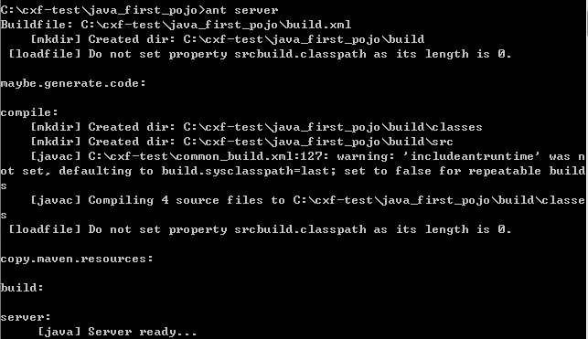
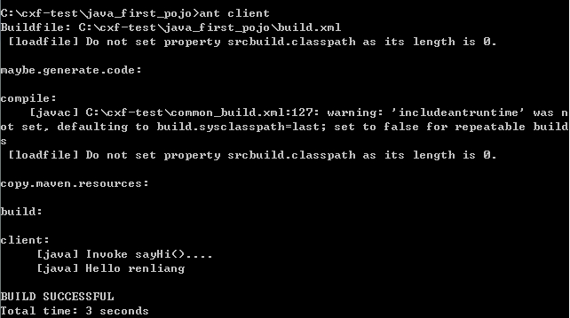
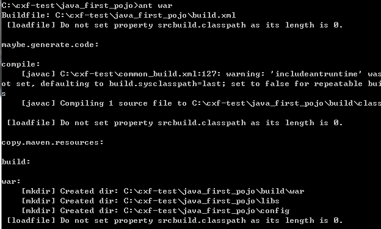
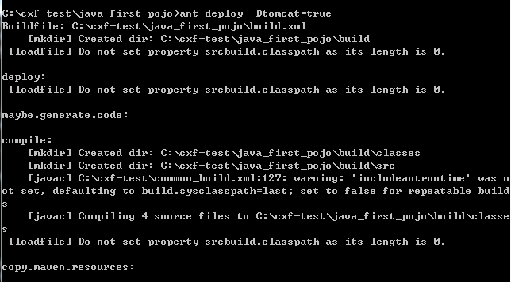

# WebService-2

## cxf

Apache CXF = Celtix + Xfire

支持多种协议：

a) SOAP1.1,1,2
b) HTTP
c) CORBA（Common Object Request Broker Architecture 公共对象请求代理体系结构,早期语言使用的 WS。C,c++,C#）
d) 并可以与 Spring 进行快速无缝的整合
e) 灵活的部署：可以运行有 Tomcat,Jboss,Jetty(内置),IBMWS,BeaWS 上面。

## 环境搭建

环境变量 CXF_HOME，CATALINA_HOME，ANT_HOME

## 用 ant 执行

带有 build.xml 的项目









ant clean 清理构建目录

## 第一个 cxf 项目

1. 创建 java 项目
2. 引入所有依赖包
3. 创建服务类

用两个不同的类发布应用：

- ServerFactoryBean(不需要使用@webservice) 生成的文档不规范，不建议使用
- JaxWsServerFactoryBean(建议使用此类，需要使用@webservice) 生成的文档不规范，可以发布 SOAP1.1，SOAP1.2 的协议，当 cxf 的服务类中没有方法时也可以发布成功，不报错。如果使用 SOAP1.2 需要用@bindType 注解指定
  当使用 SOAP1.2 时 wsimport 命令失效，需要使用 cxf 的 wsdl2java
- 建议：发布服务的时候使用 SOAP1.2，客户端调用的时候使用 SOAP1.1

```java
@WebService
@BindingType(value=javax.xml.ws.soap.SOAPBinding.SOAP11HTTP_BINDING)
public class HelloService {

	public static void main(String[] args) {
		//创建服务工厂对象
		//ServerFactoryBean sfb = new ServerFactoryBean();
        JaxWsServerFactoryBean sfb = new JaxWsServerFactoryBean ();
		//设置服务地址
		sfb.setAddress("http://127.0.0.1:7777/hello");
		//设置服务类
		sfb.setServiceClass(HelloService.class);
		//设置服务对象的实例
		sfb.setServiceBean(new HelloService());
		//发布服务
		sfb.create();
	}

	public String sayHello(String name){
		return name+ " hello";
	}

}
```

用 SOAP1.2 协议发布的服务标签是带有&lt;soap12&gt;

4. 通过 wsimport（SOAP1.1）生成客户端代码
5. 调用 webservice

## 使用 cxf 的 wsdl2java 从 wsdl 创建客户端类

cxf 的 wsdl2java 工具，可以生成一堆客户端调用的代码。既可以生成 SOAP1.1 也可以生成 SOAP1.2。此工具位于 cxf_home/bin 目录下。参数与 wsimport 有所不同。

它包含以下参数：

a) －d 参数，指定代码生成的目录。
b) －p 参数，指定生成的新的包结构。

在命令行执行：wsdl2java –d . http://127.0.0.1:6666/helloworld?wsdl

## 使用 JaxWsServerFactoryBean 调用接口服务类

- 创建服务接口

```java
@WebService//注意注解加在接口上
public interface HI {

	public String sayHi(String name);
}
```

- \*创建接口实现类

```java
public class HIImpl implements HI {

	@Override
	public String sayHi(String name) {
		// TODO Auto-generated method stub
		return name + " hello";
	}

}
```

- 创建发布服务类

```java
public static void main(String[] args) {
		JaxWsServerFactoryBean jf = new JaxWsServerFactoryBean();
		jf.setAddress("http://127.0.0.1:5555/hi");
		jf.setServiceClass(HI.class);
		jf.setServiceBean(new HIImpl());
		jf.create();
	}
```

- 生成客户端代码

* 调用客户端

```java
public class Client {

	public static void main(String[] args) {
		HIService hs = new HIService();
		HI serviceClass = hs.getHIPort();
		System.out.println(serviceClass.sayHi("张三"));
	}

}
```

- 拦截输入输出消息

LoggingInInterceptor – 信息输入时的拦截器 –请求
LoggingOutInterceptor –信息输出时的拦截器-响应

```java
public class InterServer {

	public static void main(String[] args) {
		JaxWsServerFactoryBean jf = new JaxWsServerFactoryBean();
		jf.getInInterceptors().add(new LoggingInInterceptor());
		jf.getOutInterceptors().add(new LoggingOutInterceptor());
		jf.setAddress("http://127.0.0.1:5555/hi");
		jf.setServiceClass(HI.class);
		jf.setServiceBean(new HIImpl());
		jf.create();
	}
}
```

## 在 web 项目中创建类的 cxf 服务

1. 创建 web 项目
2. 导入所有包
3. 创建服务类,必须指定注解@webService
4. 配置 web.xml

```markdown
<!DOCTYPE web-app PUBLIC "-//Sun Microsystems, Inc.//DTD Web Application 2.3//EN" "http://java.sun.com/dtd/web-app_2_3.dtd">
<web-app>
    <servlet>
        <servlet-name>cxf</servlet-name>
        <servlet-class>org.apache.cxf.transport.servlet.CXFServlet</servlet-class>
    </servlet>
    <servlet-mapping>
        <servlet-name>cxf</servlet-name>
        <url-pattern>/services/*</url-pattern>
    </servlet-mapping>
    <session-config>
        <session-timeout>60</session-timeout>
    </session-config>
</web-app>
```

5. 创建 cxf 的核心配置文件 cxf-servlet.xml

```markdown
<?xml version="1.0" encoding="UTF-8"?>

<beans xmlns="http://www.springframework.org/schema/beans"
	xmlns:xsi="http://www.w3.org/2001/XMLSchema-instance" xmlns:jaxws="http://cxf.apache.org/jaxws"
	xmlns:jaxrs="http://cxf.apache.org/jaxrs" xmlns:cxf="http://cxf.apache.org/core"
	xsi:schemaLocation="http://www.springframework.org/schema/beans 
          http://www.springframework.org/schema/beans/spring-beans.xsd
            http://cxf.apache.org/jaxrs http://cxf.apache.org/schemas/jaxrs.xsd
            http://cxf.apache.org/jaxws http://cxf.apache.org/schemas/jaxws.xsd
            http://cxf.apache.org/core http://cxf.apache.org/schemas/core.xsd">
<!-- 引入CXF Bean定义如下,早期的版本中使用 -->
<import resource="classpath:META-INF/cxf/cxf.xml" />
<import resource="classpath:META-INF/cxf/cxf-extension-soap.xml" />
<import resource="classpath:META-INF/cxf/cxf-servlet.xml" />
<!--访问地址为http://ip地址:端口/项目名/service/hello-->
<jaxws:endpoint id="hello" address="/hello" implementor="com.rl.cxf.web.server.HelloService">
<!--输出输出拦截器-->
<jaxws:outInterceptors>
<bean class="org.apache.cxf.interceptor.LoggingInInterceptor"></bean>
</jaxws:outInterceptors>
<jaxws:inInterceptors>
<bean class="org.apache.cxf.interceptor.LoggingOutInterceptor"></bean>
</jaxws:inInterceptors>
</jaxws:endpoint>
</beans>
```

## 修改 cxf-servlet.xml 的位置和文件名

- 第一种方式：用 servlet 初始化参数指定 cxf.xml 位置和文件名

```markdown
<!DOCTYPE web-app PUBLIC "-//Sun Microsystems, Inc.//DTD Web Application 2.3//EN" "http://java.sun.com/dtd/web-app_2_3.dtd">
<web-app>
    <servlet>
        <servlet-name>cxf</servlet-name>
        <servlet-class>org.apache.cxf.transport.servlet.CXFServlet</servlet-class>
        
        <init-param>
			<param-name>config-location</param-name>
			<param-value>classpath:cxf.xml</param-value>
		</init-param>
        <load-on-startup>1</load-on-startup>
    </servlet>
    <servlet-mapping>
        <servlet-name>cxf</servlet-name>
        <url-pattern>/services/*</url-pattern>
    </servlet-mapping>
   
</web-app>
```

- 第二种方式 用 spring 的监听器

```markdown
<!DOCTYPE web-app PUBLIC "-//Sun Microsystems, Inc.//DTD Web Application 2.3//EN" "http://java.sun.com/dtd/web-app_2_3.dtd">
<web-app>
	<listener>
    	<listener-class>org.springframework.web.context.ContextLoaderListener</listener-class>
    </listener>
    <context-param>
    	<param-name>contextConfigLocation</param-name>
    	<param-value>classpath:cxf.xml</param-value>
    </context-param>
     <servlet>
        <servlet-name>cxf</servlet-name>
        <servlet-class>org.apache.cxf.transport.servlet.CXFServlet</servlet-class>
    </servlet>
    <servlet-mapping>
        <servlet-name>cxf</servlet-name>
        <url-pattern>/services/*</url-pattern>
    </servlet-mapping>
</web-app>
```

## 在 web 项目中创建接口的 cxf 服务

1. 创建服务接口在接口上加@webservice
2. 创建服务接口的实现类
3. 在 web.xml 中配置 CXFServlet
4. 配置 cxf-servlet.xml

```markdown
<!--服务类接口-->

<jaxws:server id="bye" address="/bye" serviceClass="com.rl.cxf.web.inter.ByeInter">
<jaxws:serviceBean>
<!--服务类接口的实现类-->
<bean class="com.rl.cxf.web.inter.ByeInterImpl"></bean>
</jaxws:serviceBean>
<jaxws:outInterceptors>
<bean class="org.apache.cxf.interceptor.LoggingInInterceptor"></bean>
</jaxws:outInterceptors>
<jaxws:inInterceptors>
<bean class="org.apache.cxf.interceptor.LoggingOutInterceptor"></bean>
</jaxws:inInterceptors>
</jaxws:server>
```

5. 使用 wsdl2java 生成客户端代码
6. 调用 webservice

## 使用 jquery 调用 cxf

```markdown
$(function(){
    $("#mybutton").click(function(){
var data = '<soapenv:Envelope xmlns:soapenv="http://schemas.xmlsoap.org/soap/envelope/" xmlns:q0="http://server.web.cxf.rl.com/" xmlns:xsd="http://www.w3.org/2001/XMLSchema" xmlns:xsi="http://www.w3.org/2001/XMLSchema-instance">'
+'<soapenv:Body>'
+'<q0:sayHello>'
+' <arg0>sss</arg0>'
+' </q0:sayHello>'
+'</soapenv:Body>'
+'</soapenv:Envelope>';  
 $.ajax({
            url:'http://localhost:8080/cxf-web-server/services/hello',
            type:'post',
            dataType:'xml',
            contentType:'text/xml;charset=UTF-8',
            data:data,
            success:function(responseText){
                alert($(responseText).find('return').text());
},
error:function(){
alert("error");
}
})
})
})
```

发送的请求消息可以通过访问一次服务地址，在服务器的请求消息拦截器中获取，将动态部分修改。

## 整合 spring

发布的服务使用 spring 的注解, 在 dao，service 接口实现类上分别添加注释@Service@Repository，在 Service 接口中注入 dao 接口添加@WebService 注释，Service 实现类中调用 dao。

- beans.xml

```markdown
<?xml version="1.0" encoding="UTF-8"?>

<beans xmlns="http://www.springframework.org/schema/beans"
	xmlns:xsi="http://www.w3.org/2001/XMLSchema-instance"
	xmlns:mvc="http://www.springframework.org/schema/mvc"
	xmlns:context="http://www.springframework.org/schema/context"
	xmlns:aop="http://www.springframework.org/schema/aop"
	xmlns:tx="http://www.springframework.org/schema/tx"
	xsi:schemaLocation="http://www.springframework.org/schema/beans 
		http://www.springframework.org/schema/beans/spring-beans-3.0.xsd 
		http://www.springframework.org/schema/mvc 
		http://www.springframework.org/schema/mvc/spring-mvc-3.0.xsd 
		http://www.springframework.org/schema/context 
		http://www.springframework.org/schema/context/spring-context-3.0.xsd 
		http://www.springframework.org/schema/aop 
		http://www.springframework.org/schema/aop/spring-aop-3.0.xsd 
		http://www.springframework.org/schema/tx 
		http://www.springframework.org/schema/tx/spring-tx-3.0.xsd ">

    <context:component-scan base-package="com.ss.person"></context:component-scan>

</beans>
```

- cxf.xml

```markdown
<?xml version="1.0" encoding="UTF-8"?>

<beans xmlns="http://www.springframework.org/schema/beans"
	xmlns:xsi="http://www.w3.org/2001/XMLSchema-instance" xmlns:jaxws="http://cxf.apache.org/jaxws"
	xmlns:jaxrs="http://cxf.apache.org/jaxrs" xmlns:cxf="http://cxf.apache.org/core"
	xsi:schemaLocation="http://www.springframework.org/schema/beans 
          http://www.springframework.org/schema/beans/spring-beans.xsd
            http://cxf.apache.org/jaxrs http://cxf.apache.org/schemas/jaxrs.xsd
            http://cxf.apache.org/jaxws http://cxf.apache.org/schemas/jaxws.xsd
            http://cxf.apache.org/core http://cxf.apache.org/schemas/core.xsd">
<!-- 引入CXF Bean定义如下,早期的版本中使用 -->
<import resource="classpath:META-INF/cxf/cxf.xml" />
<import resource="classpath:META-INF/cxf/cxf-extension-soap.xml" />
<import resource="classpath:META-INF/cxf/cxf-servlet.xml" />
<jaxws:server address="/person" serviceClass="com.ss.person.ws.service.PersonServiceWS">
<!-- 服务接口的实现类 -->
<jaxws:serviceBean>
<bean class="com.ss.person.ws.service.impl.PersonServiceWSImpl"></bean>
</jaxws:serviceBean>
<jaxws:inInterceptors>
<bean class="org.apache.cxf.interceptor.LoggingInInterceptor"></bean>
</jaxws:inInterceptors>
<jaxws:outInterceptors>
<bean class="org.apache.cxf.interceptor.LoggingOutInterceptor"></bean>
</jaxws:outInterceptors>
</jaxws:server>
</beans>
```

- web.xml

```markdown
<?xml version="1.0" encoding="UTF-8"?>

<web-app xmlns:xsi="http://www.w3.org/2001/XMLSchema-instance"
    xmlns="http://java.sun.com/xml/ns/javaee" xmlns:web="http://java.sun.com/xml/ns/javaee/web-app_2_5.xsd"
    xsi:schemaLocation="http://java.sun.com/xml/ns/javaee http://java.sun.com/xml/ns/javaee/web-app_2_5.xsd"
    id="WebApp_ID" version="2.5">
<listener>
<listener-class>org.springframework.web.context.ContextLoaderListener</listener-class>
</listener>

<!--配置多个xml文件位置-->
<context-param>
    <param-name>contextConfigLocation</param-name>
    <param-value>classpath*:cxf.xml,classpath*:beans.xml</param-value>
</context-param>

<servlet>
    <servlet-name>cxf</servlet-name>
    <servlet-class>org.apache.cxf.transport.servlet.CXFServlet</servlet-class>
    <!-- <init-param>
        <param-name>config-location</param-name>
        <param-value>classpath:cxf.xml</param-value>
    </init-param>
    <load-on-startup>1</load-on-startup> -->
</servlet>
<servlet-mapping>
    <servlet-name>cxf</servlet-name>
    <url-pattern>/service/*</url-pattern>
</servlet-mapping>
</web-app>
```

## 在发布的服务方法中添加密码

```java
@Service
public class PersonServiceWSImpl implements PersonServiceWS{
	@Autowired
	PersonDao personDao;

	@Override
	public String add(Person person, String password) {
		String flag ="success";
		if(password==Constants.ws_pass) {
			personDao.add(person);

		}else{
			flag = "pass_error";
		}
		return flag;

	}
}

```
