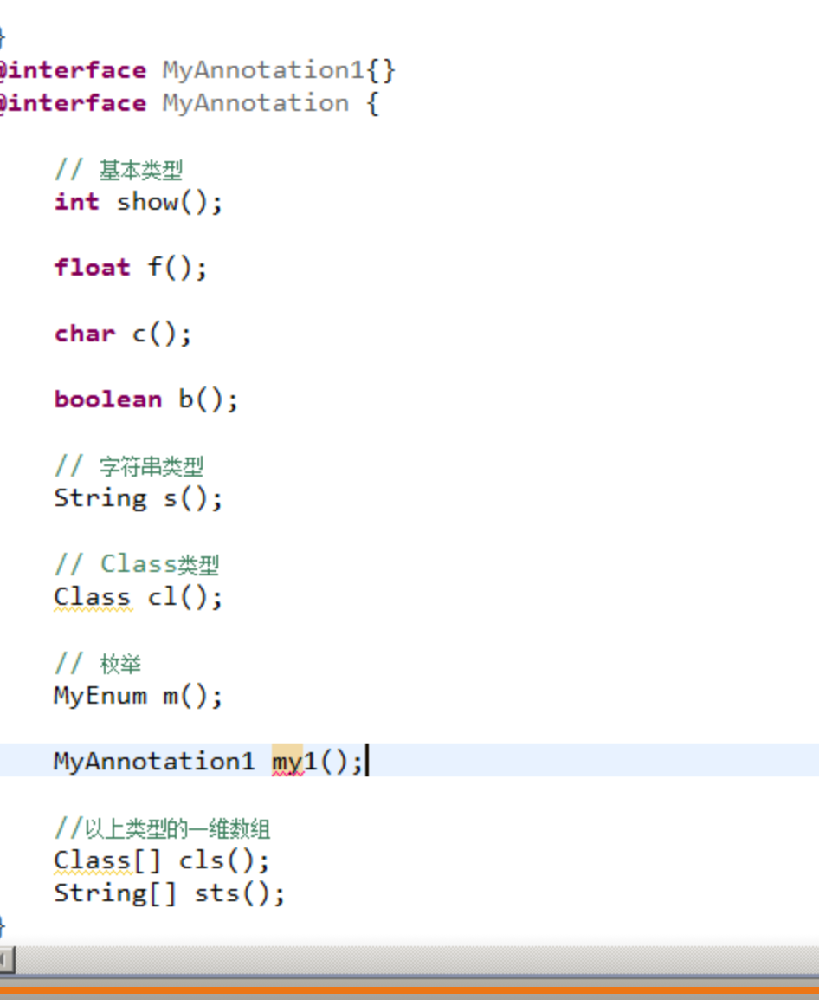

# 注解

## 1. 概念

@xxx就是一个注解。

* 注释: 它是用于描述当前代码功能，是给程序员使用的。
* 注解：它是描述程序如果运行，是给编译器，解释器，jvm使用。

jdk中自带三个注解:

1. @Override
2. @Deprecated
3. @SuppressWarnings

### 1.1 @Override

是给编译器使用，用于描述当前的方法是一个重写的方法。


jdk1.5中@Override它只能描述继承中的重写. jdk1.6中@Override它不仅能描述继承中的重写，还可以描述实现中的重写.


### 1.2 @Deprecated

它是用于描述方法过时。

方法什么时候过时?

1. 有新的版本的方法替换旧版本方法。
2. 在旧的版本中存在安全隐患的方法

### 1.3 @SuppressWarnings

去除程序中的警告信息

例：@SuppressWarning\("all"\)

* unused 变量未使用
* deprecation 使用了不赞成使用的类或方法时的警告
* unchecked 执行了未检查的转换时的警告，例如当使用集合时没有用泛型 \(Generics\) 来指定集合保存的类型。
* fallthrough 当 Switch 程序块直接通往下一种情况而没有 Break 时的警告。
* path 在类路径、源文件路径等中有不存在的路径时的警告。
* serial 当在可序列化的类上缺少 serialVersionUID 定义时的警告 。
* finally 任何 finally 子句不能正常完成时的警告。
* all 关于以上所有情况的警告。

## 2. 定义注解

```text
@interface 名称 {}
```

就定义了一个注解，要想使用 在类，方法，属性上直接 @名称.

@interface MyAnnotation{} 它的本质是一个接口,继承了Annotation接口,所的的注解都实现了这个接口，但是，不能手动实现。

```java
import java.lang.annotation.Annotation;

interface MyAnnotation extends Annotation
{
}
```

注解是jdk1.5的新特性.

## 3. 注解中的成员

接口中的成员:

属性: public static final 方法: public abstract

注解成员:

1. 注解中可以有属性，但是基本不使用。
2. 可以有方法

一般使用注解时，只研究它的方法，我们一般管它叫做注解中的属性.

### 3.1 属性的类型问题

类型只能是以下几种:

1. 基本类型 整型,浮点,字符,逻辑
2. String
3. Class
4. enum
5. Annotation
6. 以上类型的一维数组。



### 3.2 属性的使用问题

如果一个注解中有属性，并且属性没有默认值，那么我们在使用注解时，必须给注解的属性赋值.

**属性赋值方式**

* 默认值问题 String st\(\) default "abc";
* 如果是单值 注解\(属性名称=值\) 例如:@MyAnnotation3\(i=1\)
* 如果是数组

```text
    1. 如果只赋一个值 注解(属性名称=值)
       例如:@MyAnnotation3(i=1)
    2. 如果要赋多个值 注解(属性名称={值1,值2,...})
       例如:@MyAnnotation3(i={1,2,3})
```

* 当属性名称是value

```text
    可以省略属性名称
    例如 @MyAnnotation3("hello");

    如果value属性是一个数组:
    @MyAnnotation3({"a","b"})

    如果注解中有value属性，还有其它属性:
    那么value属性名称不能再省略.
```

## 4. 元注解

修饰注解的注解

* @Retention   作用:是指定注解给谁使用.

```text
    它的属性值只能是以下三个:
    RetentionPolicy.SOURCE  给编译器使用,使用后抛弃
    RetentionPolicy.CLASS   给解析器使用。当jvm加载完成后，就抛弃
    RetentionPolicy.RUNTIME  jvm加载完成后，还存在。开发人员可以通过反射来获取注解相关信息.
```

* @Target    作用:就是定义注解在什么位置使用

```java
@MyAnnotation3
public class AnnotationDemo3 {

  @MyAnnotation3
  public void show(){}
}

@Target({ElementType.TYPE,ElementType.METHOD})
@interface MyAnnotation3{

String value() default "hello";
}
```

* @Documented    作用: 是通过javadoc生成的文档中是否抽取注解描述.
* @Inherited    作用: 是描述当前注解是否具有继承性

想要开发有功能的注解，对于程序员，一定会使用的元注解是: @Retention @Target

## 5. 注解案例1---银行最大转账金额

代码实现:

1. 将银行最大转账金额，定义在配置文件properties中，使用时直接从配置文件中读取
2. 使用注解来**替换**配置文件

### 5.1 定义一个注解

```java
@Retention(RetentionPolicy.RUNTIME)
@Target(ElementType.METHOD)
public @interface BankInfo {

int maxMoney();
}
```

### 5.2 通过反射来获取注解信息

#### 1. 获取当前方法的Method对象

```text
1.得到Class对象 三种方式：
    (a) 类名.class
    (b) 对象.getClass()
    (c) Class.forName(String className);
2.得到Method对象
Class.getDeclaredMethod(String methodName,Class...paramClass);
```

#### 2. 获取注解Annotation对象

在Method类中有一个 getAnnotation\(Class annotationClass\)，可以获取一个注解对象

#### 3. 通过注解对象来调用其属性

```java
public class Bank {

    @BankInfo(maxMoney = 100000)
    public void account(String name1, String name2, int money)throws Exception {

        Class clazz = this.getClass();

        Method method = clazz.getDeclaredMethod("account", String.class,
        String.class, int.class);

        boolean flag = method.isAnnotationPresent(BankInfo.class); // 判断当前方法上是否有BankInfo这个注解.
        if (flag) {
            BankInfo bif = method.getAnnotation(BankInfo.class);
            //通过注解对象来调用其属性
            int maxMoney = bif.maxMoney();

            if (money > maxMoney) {
                throw new RuntimeException("最大转账金额为:" + maxMoney + "元");
            }
            ...转账操作
        }
    }
}
```

配置文件可以解耦合。但是配置文件内容越来越庞大，就不利于我们开发与阅读。这时就出现了注解，因为注解可以直接写在代码上，并且，通过注解也可以解耦合。

## 6. 注解示例2--jdbc连接获取

使用注解来**替换**jsbc连接配置文件

```java
@Retention(RetentionPolicy.RUNTIME)
@Target(ElementType.METHOD)
public @interface JdbcInfo {

    String driverClassName();
    String url();
    String username();
    String password();
}
```

```java
@JdbcInfo(driverClassName = "com.mysql.jdbc.Driver", url = "jdbc:mysql:///day24", username = "root", password = "abc")
public static Connection getConnectionByAnnotation() throws Exception {

    // 得到当前方法上的注解JdbcInfo
    Method method = JdbcUtils.class.getDeclaredMethod("getConnectionByAnnotation"）;
    JdbcInfo jif = method.getAnnotation(JdbcInfo.class);
    //获取注释中的属性值
    String driverClassName = jif.driverClassName();
    String url = jif.url();
    String username = jif.username();
    String password = jif.password();

    // 1.加载驱动
    Class.forName(driverClassName);
    // 2.获取连接
    Connection con = DriverManager.getConnection(url, username, password);

return con;
}
```

