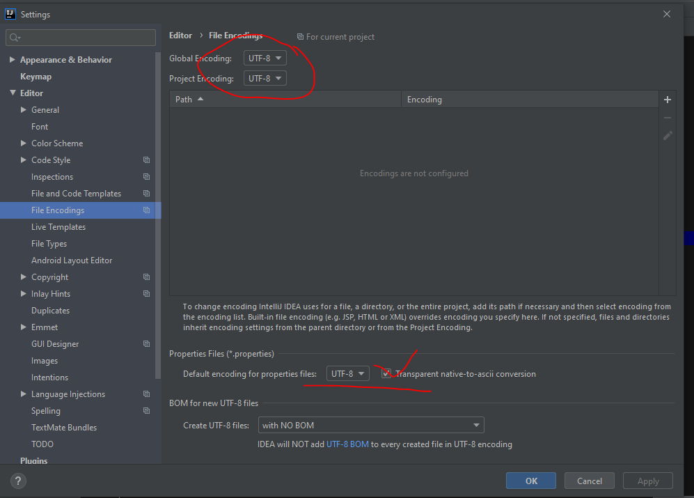
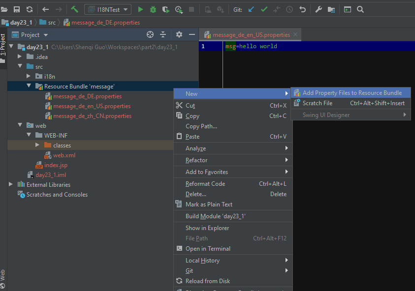
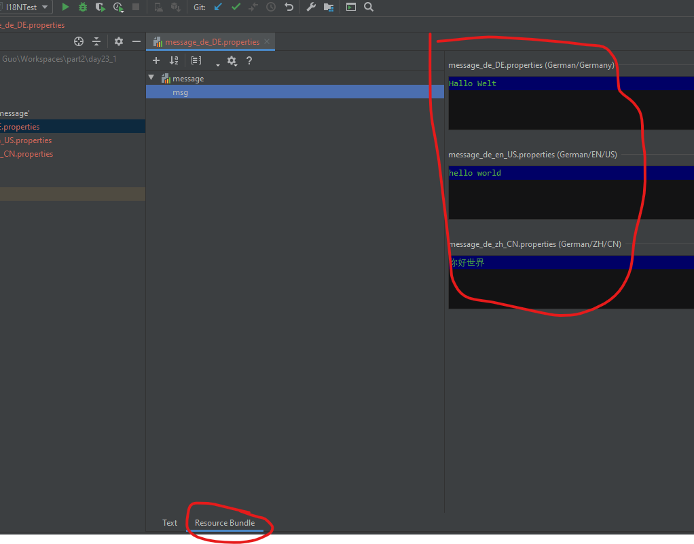
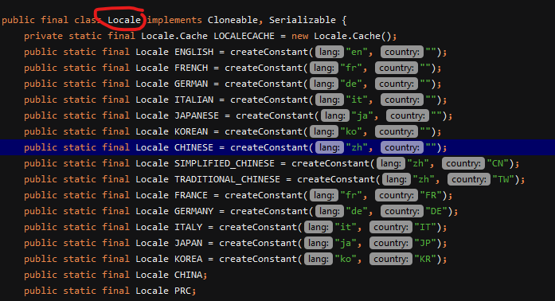

# 国际化

## 概念

**i18n**：internationalization

* 对于程序中**固定使用**的文本元素，例如菜单栏、导航条等中使用的文本元素、或错误提示信息，状态信息等，需要根据来访者的地区和国家，选择不同语言的文本为之服务。
* 对于程序**动态产生**的数据，例如\(日期，货币等\)，软件应能根据当前所在的国家或地区的文化习惯进行显示。

## 配置文件

针对于不同的国家与地区要显示的信息，都配置到配置文件中， 根据当前访问者的国家或语言来从不同的配置文件中获取信息， 展示在页面上。

### 相关的概念

对于软件中的菜单栏、导航条、错误提示信息，状态信息等这些固定不变的文本信息，可以把它们写在一个properties文件中， 并根据不同的国家编写不同的properties文件。这一组properties文件称之为一个资源包。

* ResourceBundler，它是用于从资源包中获取数据的。
* 关于资源文件\(properties\)命名: 基名_语言_国家.properties

```text
message_zh_CN.properties
message_en_US.properteis
```

* [国际化资源命名规范](https://blog.csdn.net/qq_34419607/article/details/100114102)

## 编码演示

### properties文件相关操作

IntelliJ IDEA 中修改properties的默认编码，统一为UTF-8。

* 中文乱码问题

Setting -&gt; File Encodings 把 IDE Encoding 和 Project Encoding 都设置成 UTF-8 ，然后再把底部的 Transparent native-to-ascii conversion 打上勾



中文生效的messages\_zh\_CN.properties中输入中文msg=你好世界，显示中文，不出现乱码。当使用记事本打开时，显示内容为msg=\u4F60\u597D\u4E16\u754C。



* 在src新建一个名叫“i18n”的包，用来存放国际化配置

默认生效的messages.properties **当需要的语言对应的配置，就会选这个**

中文生效的messages\_zh\_CN.properties；

英文生效的messages\_en\_US.properties；

德语生效的messages\_de\_DE.properties；

* 点击下边如图所示的Resource Bundle的按钮，切换编辑模式



### ResourceBundle使用

```java
//创建:
ResourceBundle bundle = ResourceBundle.getBundle("message");
ResourceBundle bundle = ResourceBundle.getBundle("message",Locale.US);
//获取:
bundle.getString(String name);
```



### 扩展:关于properties文件中中文问题处理

在jdk中有一个命令native2ascii.exe

```text
cmd中
1.进行一次翻译
native2ascii 回车
中文  回车

2.批量翻译
native2ascii  源文件路径   目录文件路径
例如: native2ascii d:/a.txt  d:/a.properties
```

## 国际化的登录页面

### jsp脚本语言

1. 创建登录页面
2. 创建配置文件
3. 在登录页面上根据不同的国家获取ResourceBundle
4. 在页面上需要国际化的位置，通过ResourceBundle.getString\(\)来获取信息

```java
<!--将语言选项提交到本页面-->
<script type="text/javascript">
    function sendForm() {
        document.getElementById("f").submit();
    }
</script>
<form id="f" action="${pageContext.request.contextPath}/login.jsp"
method="post">
<select name="locale" onchange="sendForm()">
    <option>--请选择国家--</option>
    <option value="china">中国</option>
    <option value="us">US</option>
    </select>
</form>
```

```java
<!--根据语言获得bundle-->
<%
    String country = request.getParameter("locale");
    ResourceBundle bundle = null;
    if("us".equals(country)){
        bundle=ResourceBundle.getBundle("message",Locale.US);
    }else{
        bundle=ResourceBundle.getBundle("message",Locale.CHINA);
    }
%>
```

```java
<!--在页面上需要国际化的位置，通过ResourceBundle.getString()来获取信息.-->
<form>
    <%=bundle.getString("username") %>:<input type="text" name="username"><br>
    <%=bundle.getString("password") %>:<input type="password" name="password"><br>
    <input type="submit" value="<%=bundle.getString("submit")%>">
</form>
```

### jstl标签库中的国际化标签

* 导入标签库

```java
<%@ taglib prefix="fmt" uri="http://java.sun.com/jsp/jstl/fmt"%>
```

```java
<fmt:setLocale value="${param.locale}" />
<!-- 相当于new Local() 生成了locale对象-->

<fmt:setBundle basename="message" var="bundle" scope="page" />
<!-- 相当于ResourceBundle bundle=ResourceBundle.getBundle("message",local) -->

<fmt:message bundle="${bundle }" key="title" />
<!-- 相当于bundle.getString(title) -->

<fmt:message bundle="${bundle }" key="username" />
<input type="text" name="username"><br>

<fmt:message bundle="${bundle }" key="password" />
<input type="text" name="password"><br>

<input type="submit" value="<fmt:message bundle="${bundle }" key="submit" />">
```

## 关于日期国际化

**DateFormat类**

作用:

1. 可以将一个Date对象格式化成指定效果的String-----&gt;format方法
2. 可以将一个String解析成Date对象-----&gt;parse方法
3. 无参构造

```java
DateFormat df1 = DateFormat.getDateInstance(); // 只有年月日
DateFormat df2 = DateFormat.getTimeInstance(); // 只有小时分钟秒
DateFormat df3 = DateFormat.getDateTimeInstance();// 两个都有
```

* 有参数构造，指定样式

```java
DateFormat df1 = DateFormat.getDateInstance(DateFormat.FULL);
// 只有年月日
DateFormat df2 = DateFormat.getTimeInstance(DateFormat.MEDIUM);
// 只有小时分钟秒
DateFormat df3 = DateFormat.getDateTimeInstance(DateFormat.LONG,DateFormat.SHORT);// 两个都有
```

* 国际化的格式

```java
DateFormat df1 = DateFormat.getDateInstance(DateFormat.FULL,Locale.US); // 只有年月日
DateFormat df2 = DateFormat.getTimeInstance(DateFormat.MEDIUM,Locale.US); // 只有小时分钟秒
DateFormat df3 = DateFormat.getDateTimeInstance(DateFormat.LONG,DateFormat.SHORT,Locale.US);// 两个都有
```

* 将一个Date对象格式化成指定效果的String

```java
Date date =new Date();
df1.formate(date);
```

* 将一个String解析成Date对象

```java
String st ="2020-02-02 20:02:02";//要和指定样式匹配
Date d = df3.parse(st);
```

### 日期转换练习

```java
String st = "09-11-28 上午10时25分39秒 CST";
DateFormat df = new SimpleDateFormat("yy-MM-dd ah时m分s秒 z",Locale.CHINA);
df.parse(st); // Sat Nov 28 17:25:39 CET 2009
```

## 关于货币国际化

**NumberFormat类**

方法：format和parse

* 对数值进行格式化

```java
NumberFormat nf = NumberFormat.getIntegerInstance();
String s = nf.format(19.98765);//20
```

* 对数值进行百分比

```java
NumberFormat nf = NumberFormat.getPercentInstance(Locale.FRANCE);
String s = nf.format(0.98);//98 %

nf.setMinimumFractionDigits(2);//保留两位小数
```

* 对数值进行以货币显示

```java
NumberFormat nf = NumberFormat.getCurrencyInstance(Locale.US);
String s = nf.format(1090);//¥1,090.00
```

## 动态文件格式化

**MessageFormat**

MessageForamt可以对一个**模板**中的信息进行动态赋值.

* 例子：

配置文件 message\_en\_US.properties中：

login.error={0} is required {1}

```java
ResourceBundle bundle = ResourceBundle.getBundle("message",Locale.US);
String pattern = bundle.getString("login.error");
MassageFormate.formate(pattern,"username","ok")
//username is required ok
```

* MessageFormat使用

MessageForamt.format\(String pattern,Object... params\);

* 说明一下动态文本中的占位符

例如:{0} is required

1. 注意占位符只能使用{0}---{9}之间的数值.
2. 关于占们符的格式

{argumentIndex}: 0-9 之间的数字，表示要格式化对象数据在参数数组中的索引号 {argumentIndex,formatType}: 参数的格式化类型 {argumentIndex,formatType,FormatStyle}: 格式化的样式，它的值必须是与格式化类型相匹配的合法模式、或表示合法模式的字符串。

formatType可以取的值有:number date time

* number类型可以取:integer currency  percent
* date类型可以取的:short medium  full long
* time类型可以取的:short medium  full long

### 案例

```java
//At 12:30 pm on jul 3,1998, a hurricance destroyed 99 houses and caused $1000000 of damage

String msg = "At {0,time,short} on {0,date,long}, a hurricance destroyed {1,number,integer} houses and caused {2,number,currency} of damage";

Calendar c = Calendar.getInstance();
c.set(1998, 6, 3, 12, 30,0);

Date date = c.getTime();

MessageFormat mf = new MessageFormat(msg, Locale.US);

String value = mf.format(new Object[] { date, 99, 1000000 });
```

