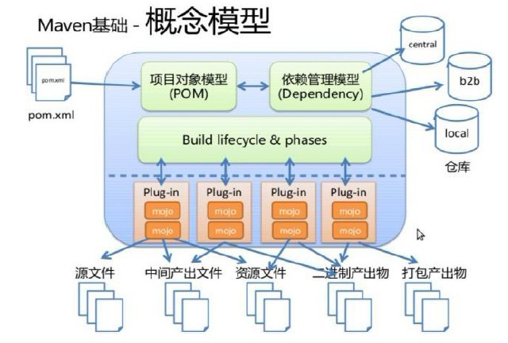
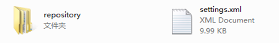
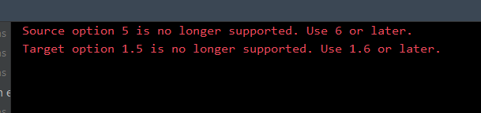
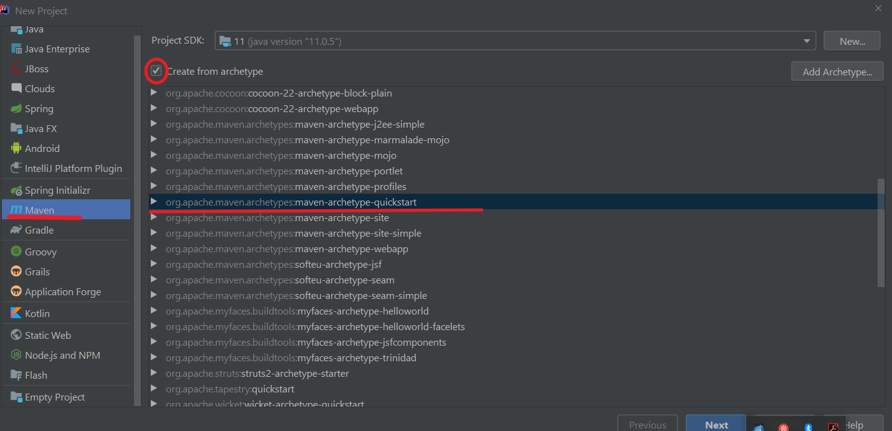
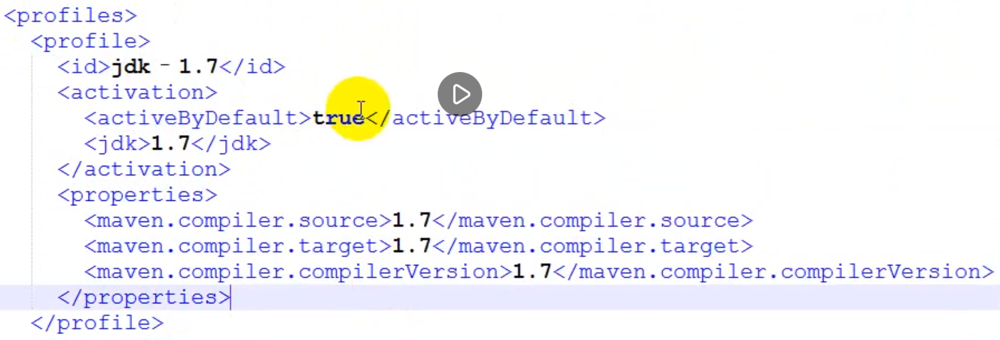
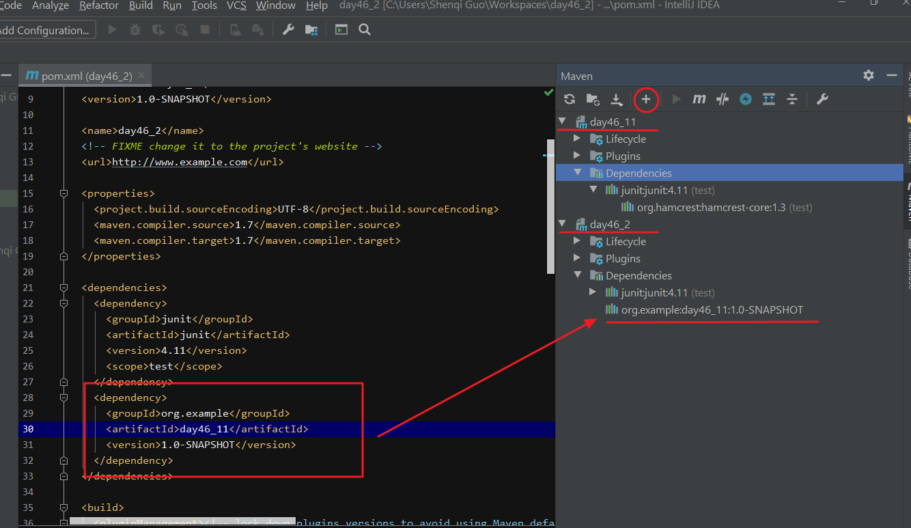
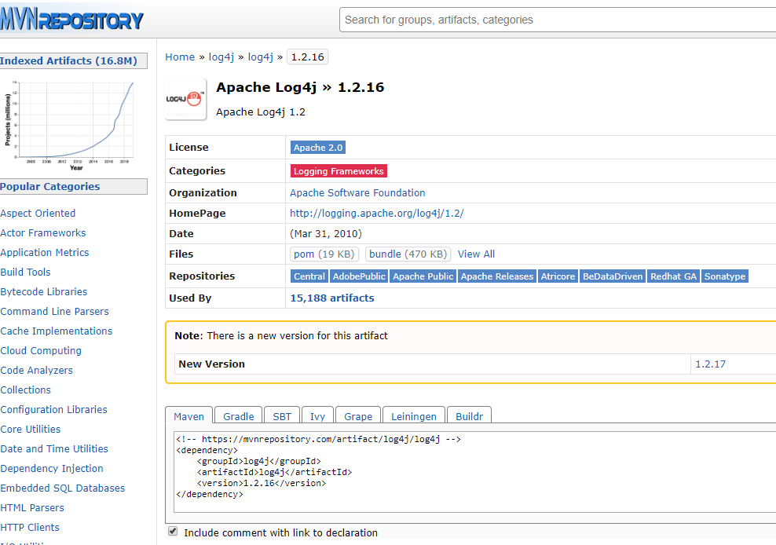
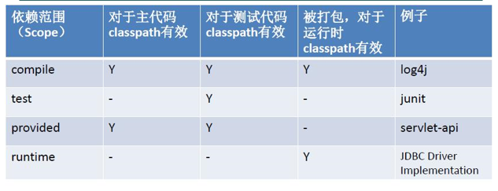
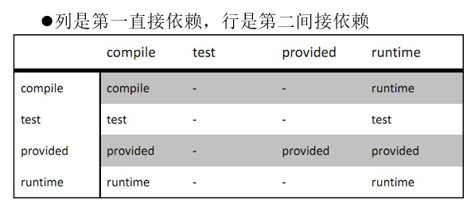

# Maven

Maven 是跨平台的项目管理工具。主要服务于基于 Java 平台的项目构建，依赖管理和项目信息管理。



## 安装文件夹结构

bin：含有 mvn 运行的脚本

boot：含有 plexus-classworlds 类加载器框架

conf：含有 settings.xml 配置文件

lib：含有 Maven 运行时所需要的 java 类库 LICENSE.txt, NOTICE.txt, README.txt 针对 Maven 版本，第三方软件等简要介绍

## 配置

- 设置 MAVEN_HOME 环境变量
- maven 安装目录下 config 文件夹内 settings.xml 全局
- localRepository：用户仓库，用于检索依赖包路径
- 配置用户范围的 settings.xml， 必须与 maven 安装路径下的内容保持一致



## Maven 项目结构

```text
|-项目名称
    |- src //程序代码
        |- main //程序主代码
            |- java
                |- 存放源代码 相当于传统项目的src
            |- resources
                |- 存放项目资源文件，如 spring, hibernate 配置文件
        |- test //测试代码
            |- java
                |- 存放所有测试.java 文件，如 JUnit 测试类
            |- resources
                |- 测试资源文件
    |- target —— 项目输出位置
    |- pom.xml——maven 项目核心配置文件
```

## cmd 命令行操作步骤

a\) 打开 cmd 命令行，进入 Hello 项目根目录\(包含有 pom.xml 文件的目录\) b\) 执行 mvn compile 命令 执行完毕后，生成了 maven 工程编译完成后字节码文件的生成目录 target c\) cmd 中继续录入 mvn clean 命令 执行完毕后，字节码生成目录被删除 d\) cmd 中录入 mvn clean test 命令 执行完毕后，字节码生成目录中生成了被测试类与测试类的编译字节码和测试执行过程日志与详细报告 e\) cmd 中录入 mvn clean compile 命令 组合指令，先执行 clean，再执行 compile，通常应用于上线前执行，清除测试类 f\) cmd 中录入 mvn clean test 命令 组合指令，先执行 clean，再执行 test，通常应用于测试环节 g\) cmd 中录入 mvn clean package 命令 组合指令，先执行 clean，再执行 package，将项目打包，通常应用于发布前 执行过程： 清理————清空环境 编译————编译源码 测试————测试源码 打包————将编译的非测试类打包 h\) cmd 中录入 mvn clean install 查看仓库，当前项目被发布到仓库中 组合指令，先执行 clean，再执行 install，将项目打包，通常应用于发布前 执行过程： 清理————清空环境 编译————编译源码 测试————测试源码 打包————将编译的非测试类打包 部署————将打好的包发布到资源仓库中

## pom.xml 文件

```text
<?xml version="1.0" encoding="UTF-8"?>
<project xmlns="http://maven.apache.org/POM/4.0.0"
         xmlns:xsi="http://www.w3.org/2001/XMLSchema-instance"
         xsi:schemaLocation="http://maven.apache.org/POM/4.0.0 http://maven.apache.org/xsd/maven-4.0.0.xsd">
    <!--模型版本号-->
    <modelVersion>4.0.0</modelVersion>
    <!--群组ID:单位域名反写-->
    <groupId>org.mavendemo</groupId>
    <!--项目ID：一个单位只有一个域名，但是一个单位可以做多个项目-->
    <artifactId>day46_1</artifactId>
    <!--版本号：用于描述开发过程的阶段性标识-->
    <version>1.0-SNAPSHOT</version>
    <properties>
        <project.build.sourceEncoding>UTF-8</project.build.sourceEncoding>
    </properties>
    <!--依赖管理-->
    <dependencies>
        <!--具体的依赖-->
        <dependency>
            <groupId>junit</groupId>
            <artifactId>junit</artifactId>
            <version>4.9</version>
            <scope>test</scope>
        </dependency>
    </dependencies>
</project>
```

## IDEA 编译版本报错解决办法



- 方法一： 在 pom.xml 中设置编译版本，根标签下

```text
<build>

    <plugins>

        <plugin>

            <groupId>org.apache.maven.plugins</groupId>

            <artifactId>maven-compiler-plugin</artifactId>

            <version>3.1</version>

            <configuration>

                <source>1.8</source>

                <target>1.8</target>

            </configuration>

        </plugin>

    </plugins>

</build>
```

一般情况下，在 pom.xml 指定版本之后，Maven 会自动更改之前设置编译版本。如果不自动更改，可通过重新导入 Maven 或者手动修改设置编译版本的地方。

重新导入 Maven 的方法，在项目或 pom.xml 文件上右键，点击 Maven–&gt;reimport

- 方法二：按照模板快速创建项目



- 方法三:修改 maven 默认使用的 jdk 版本,在 conf/settings.xml 中配置&lt;profiles&gt;



## 导入另一个项目为本项目的依赖



被依赖的项目需要安装（install）到本地 m2，才能依赖

## Maven 坐标

Maven 世界拥有大量构建，我们需要找一个用来唯一标识一个构建的统一规范，拥有了统一规范，就可以把查找工作交给机器。

Maven 坐标主要组成

- groupId：定义当前 Maven 项目隶属项目
- artifactId：定义实际项目中的一个模块
- version：定义当前项目的当前版本
- packaging：定义该项目的打包方式

## 依赖 dependency

### 查询依赖配置

[https://mvnrepository.com/](https://mvnrepository.com/)



### 依赖范围

dependency 标签下 scope 标签值，依赖范围用来控制依赖和编译，测试，运行的 classpath 的关系



1. compile： 默认编译依赖范围。对于编译，测试，运行三种 classpath 都有效
2. test：测试依赖范围。只对于测试 classpath 有效
3. provided：已提供依赖范围。对于编译，测试的 classpath 都有效，但对于运行无效。因为由容器已经提供，例如 servlet-api
4. runtime:运行时提供。例如:jdbc 驱动

### 传递依赖



### 可选依赖

&lt;dependency&gt;标签下&lt;optional&gt; true/false 控制自己的当前依赖是否向下传递

### 排除依赖

设置当前依赖中是否使用其对应的间接依赖，传递下来的依赖是否使用

&lt;dependency&gt;标签下&lt;exclusions&gt; &lt;exclusion&gt; 所包含坐标 排除依赖包中所包含的依赖关系，不需要添加版本，直接类别排除

optional 和 exclusion： 首先该间接依赖需要在直接依赖中被设置为可以向下传递，才能在本项目中设置不使用该直接依赖的这个间接依赖。

### 依赖冲突

- 如果直接与间接依赖中包含有同一个坐标不同版本的资源依赖，以直接依赖的版本为准（就近原则）
- 如果直接依赖中包含有同一个坐标不同版本的资源依赖，以配置顺序下方的版本为准（就近原则）

## 生命周期

包括项目清理，初始化，编译，打包，测试，部署等几乎所有构建步骤

生命周期 Maven 有**三套相互独立**的生命周期

- Clean Lifecycle 在进行真正的构建之前进行一些清理工作。
- Default Lifecycle 构建的核心部分，编译，测试，打包，部署等等。
- Site Lifecycle 生成项目报告，站点，发布站点。

## 插件

执行位置 execution

插件目标 goal

## 继承

继承为了消除重复，我们把很多相同的配置提取出来，例如：grouptId，version 等

子工程的 pom.xml

```text
<project xmlns="http://maven.apache.org/POM/4.0.0" xmlns:xsi="http://www.w3.org/2001/XMLSchema-instance"
    xsi:schemaLocation="http://maven.apache.org/POM/4.0.0 http://maven.apache.org/xsd/maven-4.0.0.xsd">
<!-- 模型版本号 -->
<modelVersion>4.0.0</modelVersion>
<!-- 群组ID：单位域名反写 -->
<!-- <groupId>demo.example</groupId> -->
<!-- 项目ID：一个单位只有一个域名，但是一个单位可以做多个项目 -->
<artifactId>One</artifactId>
<!-- 版本号：用于描述开发过程的阶段性标识 -->
<version>1.0.15-RELEASE</version>

<!-- 继承 -->
<parent>
        <groupId>demo.example</groupId>
        <artifactId>ZParent</artifactId>
        <version>0.0.1-SNAPSHOT</version>
        <!--父工程所在相对路径-->
        <relativePath>../ZParent</relativePath>
</parent>

    <properties>
        <project.build.sourceEncoding>UTF-8</project.build.sourceEncoding>
    </properties>
    <!-- 依賴管理 -->
    <dependencies>
        <!-- 具体的依赖 -->
    </dependencies>
</project>
```

子工程的 groupId，默认与父工程相同，版本号也可以省略不写，默认跟随父工程。继承写法，可以省去子工程中重复的配置内容

父工程统一管理子工程依赖版本

```text
<dependencyManagement>
    <dependencies>
        <!--添加公共依赖包-->
    </dependencies>
</dependencyManagement>
```

在父工程中配置 dependencyManagement，并不会像 dependencies 下配置的依赖一样直接被子工程继承，只有当子工程添加了该依赖，才会有。但是当子工程添加该依赖包时无需添加版本，版本由父工程继承而来。

配置 dependencyManagement 为了进一步便于管理，将所有的版本管理设置在一起，设置为系统属性值。引用使用${junit.version}格式进行

```text
<properties>
        <project.build.sourceEncoding>UTF-8</project.build.sourceEncoding>
        <log4j.version>1.2.17</log4j.version>
        <junit.version>4.9</junit.version>
        <system.version>0.0.1-SNAPSHOT</system.version>
</properties>

<dependencyManagement>
    <dependencies>
        <dependency>
            <groupId>log4j</groupId>
            <artifactId>log4j</artifactId>
            <version>${log4j.version}</version>
        </dependency>
    </dependencies>
</dependencyManagement>
```

## 聚合

聚合主要为了快速构建项目,继承主要为了消除重复

写在 pom.xml 文件根节点下，会按照子项目之间的依赖关系进行编译

```text
<modules>
    <module>../子项目名称1</module>
    <module>../子项目名称2</module>
    <module>../子项目名称3</module>
</modules>
```

## Maven 仓库

用来统一存储所有 Maven 共享构建的位置就是仓库

仓库的分类

- 本地仓库 ~/.m2/repository/ 每个用户只有一个本地仓库,从中央仓库下载 jar 包的存放位置
- 远程仓库 中央仓库：Maven 默认的远程仓库，不包含版权资源
  https://repo1.maven.org/maven2/

* 镜像仓库
  在 setting.xml 中配置阿里云镜像地址

```text
<!-- 阿里云中央仓库镜像地址 -->
	<mirror>
		<id>alimaven</id>
		<name>aliyun maven</name>
		<url>http://maven.aliyun.com/nexus/content/groups/public/</url>
		<mirrorOf>central</mirrorOf>
  </mirror>
```

- 私服：是一种特殊的远程仓库，它是架设在局域网内的仓库
